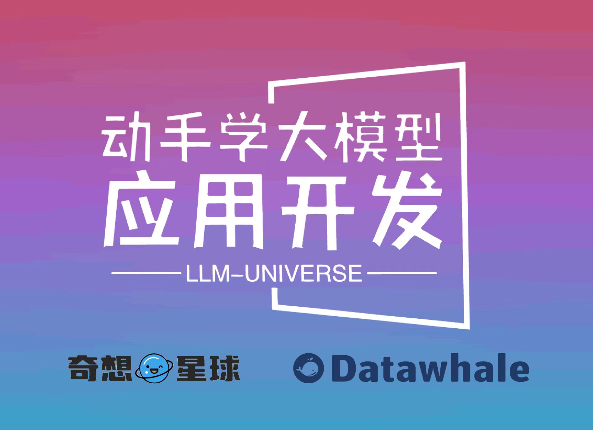

# 动手学大模型应用开发

## 项目简介

本项目是一个面向小白开发者的大模型应用开发教程，旨在结合个人知识库助手项目，通过一个课程完成大模型开发的重点入门，主要内容包括：

1. 大模型简介，何为大模型、大模型特点是什么、LangChain 是什么，针对小白开发者的简单介绍；
2. 如何调用大模型 API，本节介绍了国内外知名大模型产品 API 的多种调用方式，包括调用原生 API、封装为 LangChain LLM、封装为 Fastapi 等调用方式，同时将包括百度文心、讯飞星火、智谱AI等多种大模型 API 进行了统一形式封装；
3. 大模型开发流程及架构，大模型应用开发的基本流程、一般思想和本项目的架构分析；
4. 数据库搭建，不同类型知识库文档的加载、处理，向量数据库的搭建；
5. Prompt 设计，如何设计 Prompt 来让大模型完成特定任务，Prompt Engineering 的原则和技巧有哪些；
6. 验证迭代，大模型开发如何实现验证迭代，一般的评估方法有什么；
7. 前后端开发，如何使用 Gradio、FastAPI 等框架快速开发大模型 Demo，展示应用能力。

**目录结构说明：**

    notebook：教程源码，可运行的 Notebook，更新频率最高，更新速度最快。
    docs：在线阅读版本，基于 notebook 源码订正。
    figures：图片文件。
    data_base：知识库文件和持久化向量数据库的地址。
    project：个人知识库助手项目代码。
    requirements.txt：环境依赖，请务必使用一致的版本号，避免版本更新带来的影响。

## 项目意义

LLM 正逐步成为信息世界的新革命力量，其通过强大的自然语言理解、自然语言生成能力，为开发者提供了新的、更强大的应用开发选择。随着国内外井喷式的 LLM API 服务开放，如何基于 LLM API 快速、便捷地开发具备更强能力、集成 LLM 的应用，开始成为开发者的一项重要技能。

目前，关于 LLM 的介绍以及零散的 LLM 开发技能课程已有不少，但质量参差不齐，且没有很好地整合，开发者需要搜索大量教程并阅读大量相关性不强、必要性较低的内容，才能初步掌握大模型开发的必备技能，学习效率低，学习门槛也较高。

本项目从实践出发，结合最常见、通用的个人知识库助手项目，深入浅出逐步拆解 LLM 开发的一般流程、步骤，旨在帮助没有算法基础的小白通过一个课程完成大模型开发的基础入门。同时，我们也对项目本身做了清晰、全面的逐层规划及封装，实现了不同 LLM API 到项目的统一整合，帮助开发者能够自由、统一调用不同 LLM，充分降低学习门槛。

## 项目受众

所有具备基础 Python 能力，想要掌握 LLM 应用开发技能的开发者。

**本项目对学习者的人工智能基础、算法基础没有任何要求，仅需要掌握基本 Python 语法、掌握初级 Python 开发技能即可。**

本项目对本地硬件基本没有要求，不需要 GPU 环境，个人电脑及服务器均可用于学习。

## 项目亮点

1. 充分面向实践，动手学习大模型开发。相较于其他从理论入手、与实践代差较大的类似教程，本教程基于具有通用性的个人知识库助手项目打造，将普适的大模型开发理念融合在项目实践中，帮助学习者通过动手搭建个人项目来掌握大模型开发技能。

2. 从零开始，全面又简短的大模型教程。本项目针对个人知识库助手项目，对相关大模型开发理论、概念和基本技能进行了项目主导的重构，删去不需要理解的底层原理和算法细节，涵盖所有大模型开发的核心技能。教程整体时长在数小时之内，但学习完本教程，可以掌握基础大模型开发的所有核心技能。

3. 兼具统一性与拓展性。本项目对 GPT、百度文心、讯飞星火、智谱GLM 等国内外主要 LLM API 进行了统一封装，支持一键调用不同的 LLM，帮助开发者将更多的精力放在学习应用与模型本身的优化上，而不需要花时间在繁琐的调用细节上；同时，本教程拟上线 [奇想星球 | AIGC共创社区平台](https://1aigc.cn/)，支持学习者自定义项目为本教程增加拓展内容，具备充分的拓展性。

## 在线阅读地址

在线阅读地址：[动手学大模型应用开发](https://datawhalechina.github.io/llm-universe/#/)

## 内容大纲

**思维导图：**

**目录：**

第一章 大模型简介 @徐虎
    
1. 什么是大模型
2. 大模型的能力、特点
3. 常见大模型
4. 什么是 LangChain

第二章 调用大模型 API @邹雨衡

1. 基本概念
2. 调用 ChatGPT
3. 调用百度文心
4. 调用讯飞星火
5. 调用智谱GLM
6. 总结

第三章 大模型开发流程及架构 @邹雨衡

1. 大模型一般开发流程简介
2. 个人知识库助手项目流程简析

第四章 数据库搭建 @高立业

1. 知识库文档处理
2. 向量数据库简介及使用
3. 构建项目数据库

第五章 Prompt 设计 @徐虎

1. Prompt 设计的原则及技巧
2. 基于问答助手的 Prompt 构建
3. 添加历史对话功能

第六章 验证迭代 @邹雨衡

1. 验证迭代的一般思路
2. 解决 Bad Case
3. 大模型评估方法

第七章 前后端搭建 @高立业

1. Gradio 简介与页面搭建
2. FastAPI 进行前后端分离

第八章 总结及拓展 @邹雨衡

## 致谢

**核心贡献者**

- [邹雨衡-项目负责人](https://github.com/logan-zou)（Datawhale成员-对外经济贸易大学研究生）
- [徐虎-内容创作者](https://github.com/xuhu0115)（Datawhale成员）
- [高立业-内容创作者](https://github.com/0-yy-0)（DataWhale成员-算法工程师）
- [崔腾松-项目支持者](https://github.com/2951121599)（Datawhale成员-奇想星球联合发起人）
- [June-项目支持者](https://github.com/JuneYaooo)（Datawhale成员-奇想星球联合发起人）

**其他**

1. 特别感谢 [@Sm1les](https://github.com/Sm1les)、[@LSGOMYP](https://github.com/LSGOMYP) 对本项目的帮助与支持；
2. 特别感谢[奇想星球 | AIGC共创社区平台](https://1aigc.cn/)提供的支持，欢迎大家关注；
3. 如果有任何想法可以联系我们 DataWhale 也欢迎大家多多提出 issue；
4. 特别感谢以下为教程做出贡献的同学！

Made with [contrib.rocks](https://contrib.rocks).

## Star History

