# 国内大模型API申请教程

感谢两位队长（@小朋，@Alvin）提供的大模型API申请教程。

## 智谱AI @小朋
1. 打开[智谱AI开放平台|Datawhale 专属链接](https://open.bigmodel.cn/launch?spreadparam=datawhale&utm_source=datawhale&utm_campaign=%E6%88%98%E7%95%A5%E7%94%9F%E6%80%81%E9%83%A8-%E6%B8%A0%E9%81%93%E5%90%88%E4%BD%9C&_channel_track_key=GRfyviFi)
注：使用 Datawhale 专属链接可以免费领取 ChatGLM_Turbo 1000万 tokens 推理资源；同时可以享受充一赠二的付费优惠，充值100元，可以附赠200元 tokens 数。

2. 使用“手机号+验证码”登录注册

    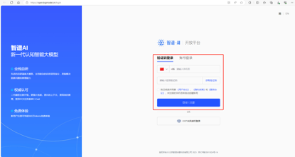

3. 登录后，回到首页，点击“开始使用”，或者右上角“开发工作台”

    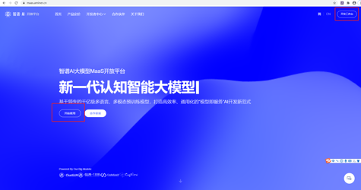

4. 在右上角账号信息下方，即可看到“查看API key”，点击进入即可进行复制

    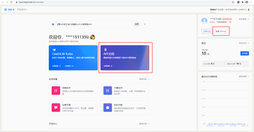

5. 下方是“查看API key”页面‘
    
    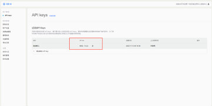

## 通义千问 @Alvin
1. 注册并登录[灵积模型服务](https://dashscope.console.aliyun.com/overview)->按照用户引导进行申请-点击【去开通】

    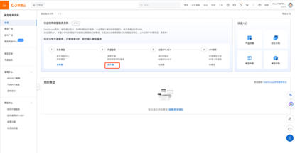

2. (勾选个协议，申请开通就好) 然后就开通成功了

    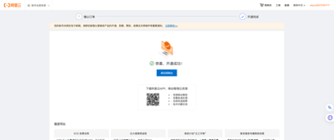

3. 点击【去管理】创建获取API key

    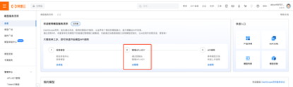

    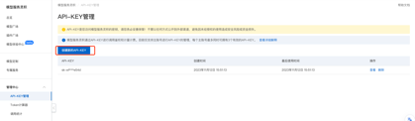

## 科大讯飞 @Alvin

1. 打开[星火认知大模型](https://xinghuo.xfyun.cn/sparkapi)

    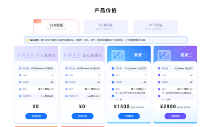

2. 滑动后，选择个人免费包-免费试用，进入以下界面

    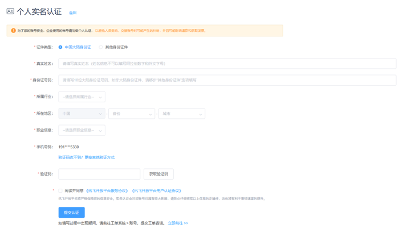

3. 填写以上个人实名认证信息后，提交申请

   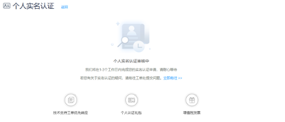

4. 认证通过或者已经认证的同学，打开[星火认知大模型](https://xinghuo.xfyun.cn/sparkapi?scr=price)

   

5. 创建应用后即可完成申请

   

## 千帆 @Alvin

1. 打开 [千帆大模型](https://cloud.baidu.com/doc/index.html)，然后登录->产品->搜索千帆大模型平台

    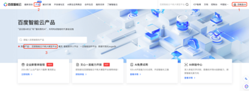

2. 点击【立即使用】跳转到模型选择，目前千帆集成了很多开源大模型。

    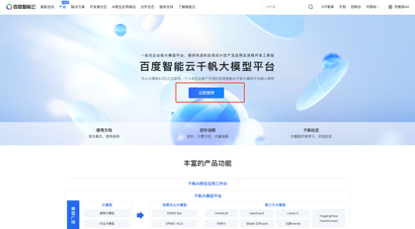

    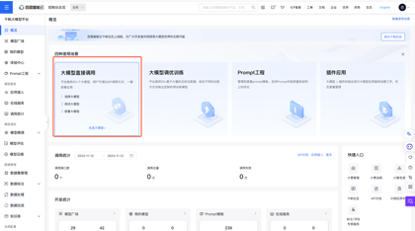

    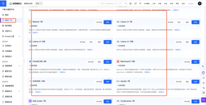

3. API key申请：应用接入->创建应用。创建完成后即可获得AK 和SK。

    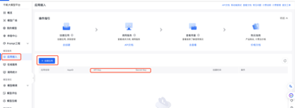
    
    
延伸：
1. 查看开发者社区，了解目前千帆集成的多种模型。

    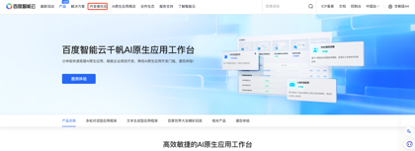

    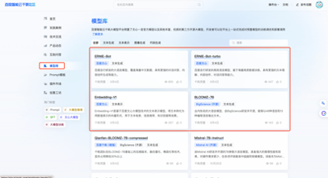

2. [API调用文档](https://cloud.baidu.com/doc/WENXINWORKSHOP/s/2lki2us1e)描述了如何通过API调用模型，并有代码示例.

    

    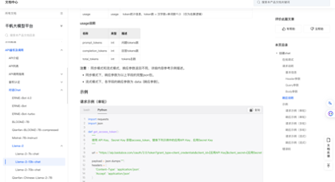
