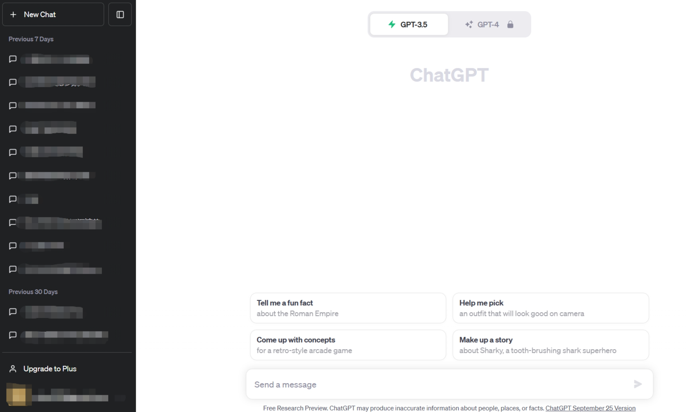

# 常见大模型

大语言模型的发展历程虽然只有短短不到五年的时间，但是发展速度相当惊人，截止 2023 年
6 月，国内外有超过百种大模型相继发布。按照时间线给出了 2019 年至 2023 年 6 月比较有影响力并且模型参数量超过 100 亿的大语言模型，如下图所示：

（该图来源于参考内容 [1] ）

接下来我们主要介绍几个国内外常见的大模型（包括开源和闭源的LLM）

## 一. 闭源 LLM (未公开源代码)

### 1. GPT系列

OpenAI 公司在 2018 年提出的 GPT（Generative Pre-Training）[9] 模型是典型的生成式预训练
语言模型之一。

GPT模型的基本原则是**通过语言建模将世界知识压缩到仅解码器的Transformer模型中**，这样它就可以恢复(或记忆)世界知识的语义，并充当通用任务求解器。成功的两个关键点是:

- 训练能够准确预测下一个单词的仅解码器的Transformer语言模型
- 扩展语言模型的大小。
  
总体而言，OpenAI 在 LLM 上的研究大致可以分为以下几个阶段：

接下来，我们将从模型规模、特点等方面，介绍大家熟悉的ChatGPT 与 GPT4：

#### ChatGPT

2022 年 11 月，OpenAI 发布了基于 GPT模型（GPT-3.5 和 GPT-4） 的**会话应用 ChatGPT**。由于与人类交流的出色能力，ChatGPT自发布以来就引发了人工智能社区的兴奋。ChatGPT是基于强大的GPT模型开发的，具有特别优化的会话能力。

ChatGPT 从本质上来说是一个 LLM 应用，它是基于 GPT-3.5 和 GPT-4 开发出来的，与 GPT-4 有本质的区别，正如当前应用界面所显示的，支持 GPT-3.5 和 GPT-4 两个版本。

现在的 ChatGPT 支持最长达 32,000 个字符，知识截止日期是 2021 年 9 月，它可以执行各种任务，包括**代码编写、数学问题求解、写作建议**等。ChatGPT 在与人类交流方面表现出了卓越的能力：拥有丰富的知识储备，对数学问题进行推理的技能，在多回合对话中准确追踪上下文，并且与人类安全使用的价值观非常一致。后来，ChatGPT 支持插件机制，这进一步扩展了 ChatGPT 与现有工具或应用程序的能力。到目前为止，它似乎是人工智能历史上最强大的聊天机器人。ChatGPT 的推出对未来的人工智能研究具有重大影响，它为探索类人人工智能系统提供了启示。

#### GPT-4

 2023 年 3 月发布的GPT-4，它将**文本输入扩展到多模态信号**。总体而言，GPT3.5 拥有 1750亿 个参数，而 GPT4 的参数量官方并没有公布，但有相关人员猜测，GPT-4 在 120 层中总共包含了 1.8 万亿参数，也就是说，GPT-4 的规模是 GPT-3 的 10 倍以上。因此，GPT-4 比 GPT-3.5 **解决复杂任务的能力更强，在许多评估任务上表现出较大的性能提升**。
 
 最近的一项研究通过对人为生成的问题进行定性测试来研究 GPT-4 的能力，这些问题包含了各种各样的困难任务，并表明 GPT-4 可以比之前的 GPT 模型(如 GPT3.5 )实现更优越的性能。此外，由于六个月的迭代校准(在 RLHF 训练中有额外的安全奖励信号)，GPT-4 对恶意或挑衅性查询的响应更安全。在技术报告中，OpenAI 强调了如何安全地开发 GPT-4 ，并应用了一些干预策略来缓解 LLM 可能出现的问题，如幻觉、隐私和过度依赖。例如，他们引入了称为**红队评估**（red teaming）的机制，以减少危害或有毒物质的产生。作为另一个重要方面，GPT4 是在一个完善的深度学习基础设施上开发的，并使用改进的优化方法。他们引入了一种称为**可预测扩展**（predictable scaling）的新机制，可以在模型训练期间使用一小部分计算准确预测最终性能。

[使用地址](https://chat.openai.com)

### 2. Claude系列

Claude 系列模型是由 OpenAI 离职人员创建的 **Anthropic 公司**开发的闭源语言大模型，可以完成摘要总结、搜索、协助创作、问答、编码等任务。目前包含 Claude 和 Claude-Instant 两种模型可供选择，其中 Claude Instant 的延迟更低，性能略差，价格比完全体的 Claude-v1 要便宜，两个模型的上下文窗口都是 9000 个token（约 5000 个单词，或 15 页）它的目标是“更安全”、“危害更小”的人工智能。最早的 Claude 于 2023 年 3 月 15 日发布，并在 2023 年 7 月 11 日，更新至 **Claude-2**。Claude 2 的训练参数官方并未公开，但是相关的猜测大概是 860.1 亿个参数。

该系列模型通过无监督预训练、基于人类反馈的强化学习和 Constitutional AI 技术（包含监督训练和强化学习）进行训练，旨在改进模型的有用性、诚实性和无害性。值得一提的是，Claude 最高支持 100K 词元的上下文，而 Claude-2 更是拓展到了 200K 词元的上下文。相比于Claude 1.3， Claude 2 拥有更强的综合能力，同时能够生成更长的相应。

总的来说，Claude 2 注重提高以下能力：

1. Anthropic 致力于提高 Claude 作为编码助理的能力，Claude 2 在编码基准和人类反馈评估方面性能显著提升。
2. 长上下文（long-context）模型对于处理长文档、少量 prompt 以及使用复杂指令和规范进行控制特别有用。Claude 的上下文窗口从 9K token 扩展到了 100K token（Claude 2 已经扩展到 200K token，但目前发布版本仅支持 100K token）。
3. 以前的模型经过训练可以编写相当短的回答，但许多用户要求更长的输出。Claude 2 经过训练，可以生成最多 4000 个 token 的连贯文档，相当于大约 3000 个单词。
4. Claude 通常用于将长而复杂的自然语言文档转换为结构化数据格式。Claude 2 经过训练，可以更好地生成 JSON、XML、YAML、代码和 Markdown 格式的正确输出。
虽然 Claude 的训练数据仍然主要是英语，但 Claude 2 的训练数据中非英语数据比例已经明显增加。
5. Claude 2 的训练数据包括 2022 年和 2023 年初更新的数据。这意味着它知道最近发生的事件，但它仍然可能会产生混淆。

[使用地址](https://claude.ai/chats)

### 3. PaLM 系列

**PaLM 系列**语言大模型由 **Google** 开发。其初始版本于 2022 年 4 月发布，并在 2023 年 3 月公开了 API。PaLM 基于 Google 提出的 Pathways 机器学习系统搭建，训练数据总量达 780B 个字符，内容涵盖网页、书籍、新闻、开源代码等多种形式的语料。前 PaLM 共有 8B、62B、540B 三个不同参数量的模型版本。Google 还开发了多种 PaLM 的改进版本。**Med-PaLM 是 PaLM 540B 在医疗数据上进行了微调后的版本**，在 MedQA 等医疗问答数据集上取得了最好成绩。**PaLM-E 是 PaLM 的多模态版本**，能够在现实场景中控制机器人完成简单任务。

2023 年 5 月，Google 发布了 **PaLM 2**，但并未公开其技术细节。Google 内部文件显示其参数量为 340B，训练数据为 PaLM 的 5 倍左右。它是 PaLM(540B) 的升级版，能够处理“多语言任务”。它使用了一个覆盖100多种语言的语料库进行训练。而PaLM2实际上是一系列模型，可以根据规模分为：Gecko、Otter、Bison和Unicorn，可以根据不同的领域和需求进行微调，最小模型可以部署在移动端，最大的参数量也只有14.7B。现已部署在Google的25个产品和功能中，包括Bard和Google Worksapce应用，针对不同的领域又可以变成专有模型，比如Med-PaLM 2，是第一个在美国医疗执照考试类问题上表现出“专家”水平的大型语言模型。

PaLM2的几大突破：

1. 最优的缩放比例（训练数据大小/模型参数量），通过compute-optimal scaling 的研究，可以得知数据大小与模型大小同样重要。根据谷歌的研究，数据和模型大小大致按照 1：1 的比例缩放，可以达到最佳性能。（过去常认为，模型参数量的大小大致为数据集 3 倍更佳）
2. 训练数据集非纯英文语料，混合了百种语言，包括了网络文档、书籍、代码、数学和对话数据，比用于训练PaLM的语料库大得多。并在研究中发现，越大的模型越是能处理更多的非英文数据集，而且包含更高比例的非英语数据，对多语言任务（如翻译和多语言问题回答）是有利的，因为模型会接触到更多的语言和文化。这使得该模型能够学习每种语言的细微差别。

以下窗口是 Google 基于 PaLM2 开发的对话应用Bard:
 

[使用地址](https://ai.google/discover/palm2/)

### 4. 文心一言

**文心一言是基于百度文心大模型的知识增强语言大模型**，于2023年 3 月在国内率先开启邀测。文心一言的基础模型文心大模型于 2019年发布。更进一步划分，文心大模型包括NLP大模型、CV大模型、跨模态大模型、生物计算大模型、行业大模型，其中 NLP 大模型主要为 ERNIE 系列模型，是打造文心一言的关键。文心大模型参数量非常大，达到了 2600 亿。

2023 年 8 月 31 日，文心一言率先向全社会全面开放，提供 APP、网页版、API 接口等多种形式的开放服务。文心一言一方面采用有监督精调、人类反馈的强化学习、提示等技术，还具备知识增强、检索增强和对话增强等关键技术。当前，以文心一言为代表的大模型已经逐步赶超国外最优水平。文心一言基于飞桨深度学习框架进行训练，算法与框架的协同优化后效果和效率都得到提升，模型训练速度达到优化前的 3 倍，推理速度达到优化前的 30 多倍。文心一言还建设了插件机制，通过外部工具、服务的调用，拓展大模型的能力的边界。

[使用地址](https://yiyan.baidu.com)

### 5. 星火大模型

**讯飞星火认知大模型**是科大讯飞于 2023 年 5 月 6 日发布的语言大模型，提供了基于自然语言处理的多元能力，支持多种自然语言处理任务，同时联合中科院人工智能产学研创新联盟和长三角人工智能产业链联盟在业内提出了覆盖 7 大类 481 项任务的《通用人工智能评测体系》；6 月 9 日星火大模型升级到 `V1.5 版`，实现了开放式知识问答、多轮对话、逻辑和数学能力的提升；8 月 15 日星火大模型升级到 V2.0 版，对于代码和多模态能力进行了提升。`讯飞星火 V2.0 `升级发布的多模态能力，已实现**图像描述、图像理解、图像推理、识图创作、文图生成、虚拟人合成**。星火大模型包含超过**1700 亿个参数**，来源于数十亿的语言数据集。尽管比 ChatGPT 3.5模型 1.5 万亿个差着数量级，但 ChatGPT 覆盖了全球主要语言，汉语不到其中 10% 的数据量。所以在现有数据基础上，星火大模型比ChatGPT更懂中文。

基于代码和多模态能力的发布，**智能编程助手iFlyCode1.0** 和 **讯飞智作2.0** 两款应用产品也在发布会上发布，进一步解放编程和内容生产力。同时，讯飞和华为还联合重磅发布了国内首款支持大模型训练私有化的全国产化产品“**星火一体机**”，可支持企业快速实现讯飞星火大模型的私有化部署、场景赋能和专属大模型训练优化。

[使用地址](https://xinghuo.xfyun.cn)

## 二. 开源 LLM

### 1. LLaMA 系列

**LLaMA 系列模型**是 Meta 开源的一组参数规模 **从 7B 到 70B** 的基础语言模型，它们都是在数万亿个字符上训练的，展示了如何**仅使用公开可用的数据集来训练最先进的模型**，而不需要依赖专有或不可访问的数据集。这些数据集包括 Common Crawl、Wikipedia、OpenWebText2、RealNews、Books 等。LLaMA 模型使用了**大规模的数据过滤和清洗技术**，以提高数据质量和多样性，减少噪声和偏见。LLaMA 模型还使用了高效的**数据并行**和**流水线并行**技术，以加速模型的训练和扩展。特别地，LLaMA 13B 在 CommonsenseQA 等 9 个基准测试中超过了 GPT-3 (175B)，而 **LLaMA 65B 与最优秀的模型 Chinchilla-70B 和 PaLM-540B 相媲美**。LLaMA通过使用更少的字符来达到最佳性能，从而在各种推理预算下具有优势。

与 GPT 系列相同，LLaMA 模型也采用了 **decoder-only** 架构，但同时结合了一些前人工作的改进，例如：
- `Pre-normalization`，为了提高训练稳定性，LLaMA 对每个 Transformer子层的输入进行了 RMSNorm 归一化，这种归一化方法可以避免梯度爆炸和消失的问题，提高模型的收敛速度和性能；
- `SwiGLU 激活函数`，将 ReLU 非线性替换为 SwiGLU 激活函数，增加网络的表达能力和非线性，同时减少参数量和计算量；
- `RoPE 位置编码`，模型的输入不再使用位置编码，而是在网络的每一层添加了位置编码，RoPE 位置编码可以有效地捕捉输入序列中的相对位置信息，并且具有更好的泛化能力。

这些改进使得 LLaMA 模型在自然语言理解、生成、对话等任务上都取得了较好的结果。

[LLaMA 开源地址](https://github.com/facebookresearch/llama)

### 2. GLM 系列

**GLM系列模型是清华大学和智谱 AI 等合作研发的开源语言大模型**。GLM 采用了**自回归填空**作为预训练任务，并且使用**多任务预训练的方式提升模型生成长文本的能力和序列到序列任务的能力**。为了能够更好地进行预训练，GLM 采用了**二维位置编码**，第一维表示当前位置的原文本中的位置信息，第二维表示对应的掩码的位置信息。此外，为了能够尽量推理和训练所占用的显存，`GLM-130B` 可以使用 INT4 进行量化并且不会明显影响模型效果。通过优化，GLM-130B 可以在 4 张 RTX 3090 Ti（24G）显卡或 8 张 RTX 2080 Ti（11G）的显卡上进行推理。

`ChatGLM` 是基于 GLM 结构开发的具有 **62 亿参数量**的语言大模型，**支持 2048 的上下文长度**。其使用了包含 1 万亿字符的中英文语料进行训练，能够**支持中文和英文两种语言的任务**。通过监督微调、反馈自助、人类反馈强化学习等多种训练技术，ChatGLM 拥有强大的生成能力，能够生成更符合人类偏好的内容。与 GLM 相似，通过 **INT4 量化** 和 **P-Tuning v2** 等高效微调的算法，**ChatGLM 能够在 7G 显存的条件下进行微调**。

在 ChatGLM 的基础上，`ChatGLM 2`` 使用了包含 **1.4 万亿字符的中英预料进行预训练，并使用人类偏好的数据对模型进行对齐训练**，拥有比前一版本更加强大的能力，在多个任务上取得提升。
- 通过 **FlashAttention 技术，ChatGLM 2 能够处理更长的长下文，支持的长下文长度达到了 3.2 万字符**
- 通过 **Multi-Query Attention 技术，ChatGLM 2 能够进一步地提升推理速度，减小对显卡的显存占用**。

[ChatGLM开源地址](https://github.com/THUDM)
[使用地址](https://chatglm.cn/)

### 3. 通义千问

**通义千问由阿里巴巴基于“通义”大模型研发**，于 2023 年 4 月正式发布。2023 年 8 月，阿里云开源了Qwen（通义千问）系列工作，当前**开源模型的参数规模为70亿（7B）和140亿（14B）**。本次开源包括基础模型Qwen，即 `Qwen-7B` 和 `Qwen-14B` ，以及对话模型  `Qwen-Chat` ，即 Qwen-7B-Chat 和 Qwen-14B-Chat。

它能够以自然语言方式响应人类的各种指令，拥有强大的能力，如回答问题、创作文字、编写代码、提供各类语言的翻译服务、文本润色、文本摘要以及角色扮演对话等。借助于阿里云丰富的算力资源和平台服务，通义千问能够实现快速迭代和创新功能。此外，阿里巴巴完善的产品体系以及广泛的应用场景使得通义千问更具可落地性和市场可接受程度。

[通义千问开源地址](https://github.com/QwenLM/Qwen/tree/main)
[使用地址](https://tongyi.aliyun.com)

### 4. Baichuan 系列

**Baichuan** 是由**百川智能**开发的**开源可商用**的语言大模型，在权威的中文和英文 benchmark 上均取得同尺寸最好的效果，其基于**Transformer 解码器架构**。

`Baichuan-7B` 是在大约 1.2 万亿字符上训练的 **70 亿参数**模型，支持**中英双语，最大 4096 的上下文窗口长度**。

`Baichuan-13B` 在 Baichuan-7B 的基础上进一步扩大参数量到 **130 亿**，并且在高质量的语料上训练了 1.4 万亿 字符，超过 LLaMA-13B 40%，是当前开源 13B 尺寸下训练数据量最多的模型。其支持中英双语，使用 ALiBi 位置编码，最大 4096 的上下文窗口长度，使用 rotary-embedding，是现阶段被大多数模型采用的位置编码方案，具有很好的外推性。百川同时开源了`预训练`和`对齐`模型，**预训练模型是面向开发者的“基座”，而对齐模型则面向广大需要对话功能的普通用户**。除了原始权重，为实现更高效的推理，百川开源了 INT8 和 INT4 的量化版本，相对非量化版本在几乎没有效果损失的情况下大大降低了部署的机器资源需求。

Baichuan 2 是百川智能推出的新一代开源大语言模型，`Baichuan2-7B` 和 `Baichuan2-13B`，均基于 2.6 万亿 Tokens 的高质量语料训练,在保留了上一代开源模型良好的生成与创作能力，流畅的多轮对话能力以及部署门槛较低等众多特性的基础上，两个模型在数学、代码、安全、逻辑推理、语义理解等能力有显著提升。。Baichuan 2 在多个权威的中文、英文和多语言的通用、领域 benchmark 上取得同尺寸最佳的效果。本次发布包含有 7B、13B 的 Base 和 Chat 版本，并提供了 Chat 版本的 4bits 量化。 

[百川开源地址](https://github.com/baichuan-inc)

---

参考内容：
[1] arXiv:2303.18223 [cs.CL]https://doi.org/10.48550/arXiv.2303.18223
[2] 张奇、桂韬、郑锐、黄萱菁，大语言模型理论与实践，https://intro-llm.github.io/, 2023.
[3] https://mp.weixin.qq.com/s/J6IHMf7THKJ9QTxsjG87lg

