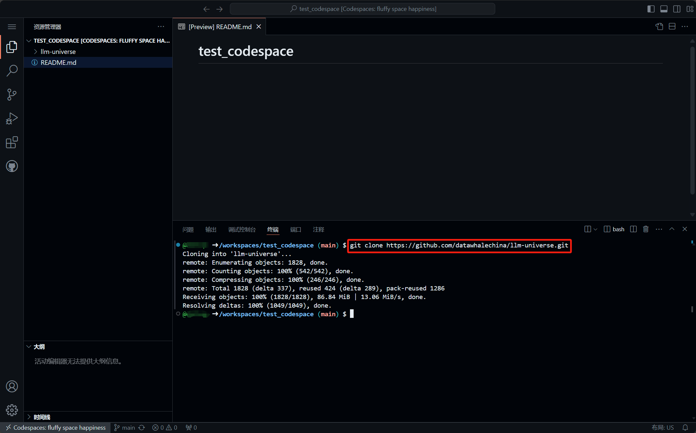
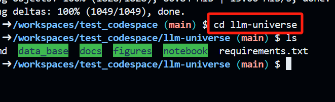
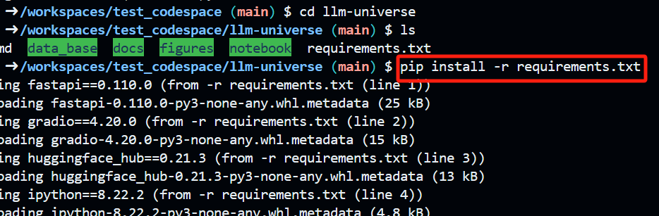
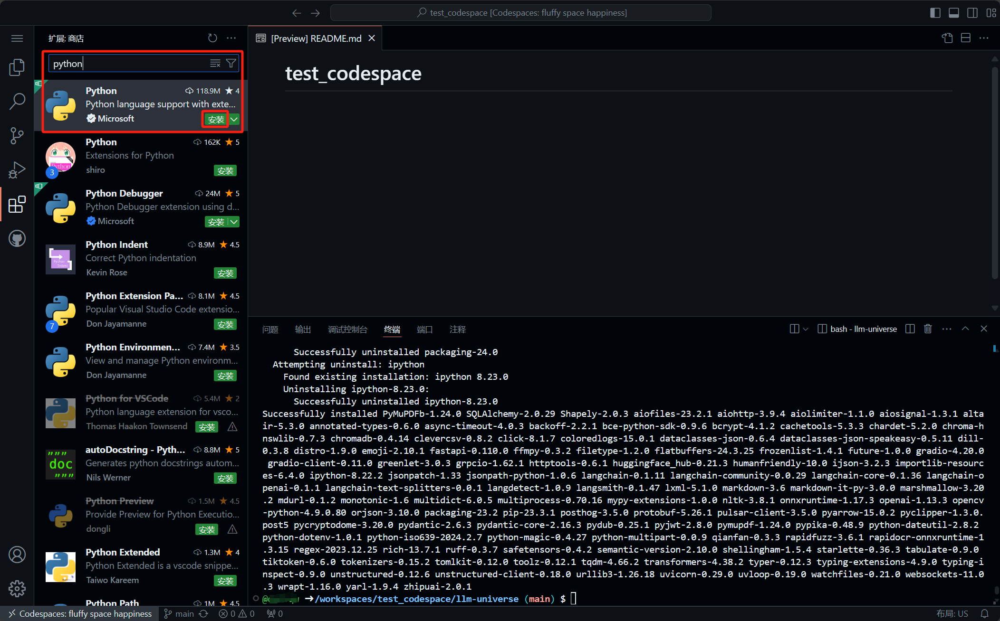
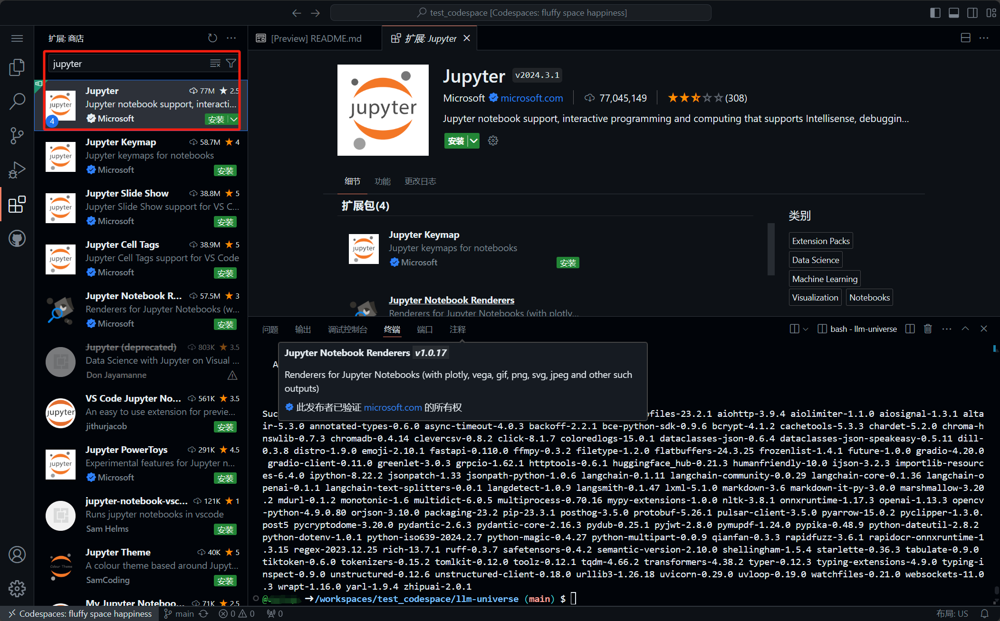
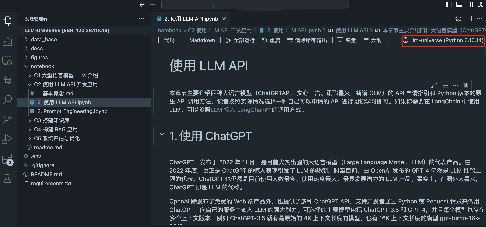
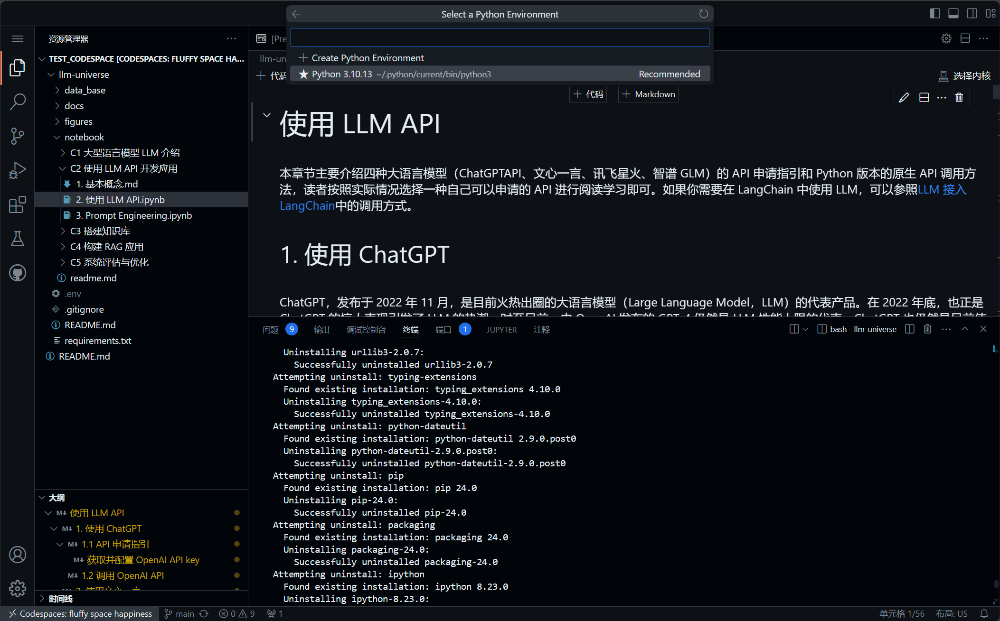

# 环境配置

本章主要提供一些必要的环境配置指南，包括代码环境配置、VSCODE 代码编辑器的 Python 环境配置，以及一些使用到的其他资源配置。

## 一、代码环境配置指南

这里我们详细介绍了代码环境配置的每一步骤，分为基础环境配置和通用环境配置两部分，以满足不同用户和环境的需求。

- **基础环境配置**部分：适用于环境配置**初学者**或**新的服务器环境（如阿里云）**。这部分介绍了如何生成 SSH key 并添加到 GitHub，以及在安装和初始化 conda 环境。

- **通用环境配置**部分：适用于**有一定经验的用户**、**已有环境基础**的本地安装或**完全独立的环境（如 GitHub Codespace）**。这部分介绍了如何新建和激活 conda 虚拟环境，克隆项目仓库，切换到项目目录，以及安装所需的 Python 包。为了加速 Python 包的安装，我们还提供了一些国内镜像源。*对于完全独立的环境，可以跳过前两步关于虚拟环境（conda）配置的步骤*。

### 1.1 基础环境配置(配置 git 和 conda)

1. 生成 ssh key
   `ssh-keygen -t rsa -C "youremail@example.com"`
2. 将公钥添加到 github
   `cat ~/.ssh/id_rsa.pub`
   复制输出内容，打开 github，点击右上角头像，选择 `settings` -> `SSH and GPG keys` -> `New SSH key`，将复制的内容粘贴到 key 中，点击 `Add SSH key`。
   

3. 安装 conda 环境

   1. linux 环境（通常采用 linux 环境）

      1. 安装：

         ```shell
         mkdir -p ~/miniconda3
         wget https://repo.anaconda.com/miniconda/Miniconda3-latest-Linux-x86_64.sh -O ~/miniconda3/miniconda.sh
         bash ~/miniconda3/miniconda.sh -b -u -p ~/miniconda3
         rm -rf ~/miniconda3/miniconda.sh
         ```

      2. 初始化：

         ```shell
         ~/miniconda3/bin/conda init bash
         ~/miniconda3/bin/conda init zsh
         ```

      3. 新建终端，检查 conda 是否安装成功 `conda --version`

   2. macOS 环境

      1. 安装

         ```shell
         mkdir -p ~/miniconda3
         curl https://repo.anaconda.com/miniconda/Miniconda3-latest-MacOSX-arm64.sh -o ~/miniconda3/miniconda.sh
         bash ~/miniconda3/miniconda.sh -b -u -p ~/miniconda3
         rm -rf ~/miniconda3/miniconda.sh
         ```

      2. 初始化：

         ```shell
         ~/miniconda3/bin/conda init bash
         ~/miniconda3/bin/conda init zsh
         ```

      3. 新建终端，检查 conda 是否安装成功 `conda --version`

   3. windows 环境
      1. 下载：`curl https://repo.anaconda.com/miniconda/Miniconda3-latest-Windows-x86_64.exe -o miniconda.exe`
      2. 安装：点击下载好的`miniconda.exe`，安装指引进行安装
      3. 打开菜单中的 Anaconda Prompt，检查 conda 是否安装成功`conda --version`
      4. 删除安装包：`del miniconda.exe`
   4. 之后请参照下面的`通用环境配置`部分进行后续配置

### 1.2 通用环境配置

1. 新建虚拟环境
   `conda create -n llm-universe python=3.10`
2. 激活虚拟环境
   `conda activate llm-universe`
3. 在希望存储项目的路径下克隆当前仓库
   `git clone git@github.com:datawhalechina/llm-universe.git`
   
4. 将目录切换到 llm-universe
   `cd llm-universe`
   
5. 安装所需的包
   `pip install -r requirements.txt`
   
   通常可以通过清华源加速安装
   `pip install -r requirements.txt -i https://pypi.tuna.tsinghua.edu.cn/simple`

> 这里列出了常用的国内镜像源，镜像源不太稳定时，大家可以按需切换：
> 清华：https://pypi.tuna.tsinghua.edu.cn/simple/
> 阿里云：http://mirrors.aliyun.com/pypi/simple/
> 中国科技大学：https://pypi.mirrors.ustc.edu.cn/simple/
> 华中科技大学：http://pypi.hustunique.com/simple/
> 上海交通大学：https://mirror.sjtu.edu.cn/pypi/web/simple/
> 豆瓣：http://pypi.douban.com/simple

## 二、VSCode 配置 Python 环境

1. 安装 Python 插件

   本教程基于 Python 语言开发， 为了更好的开发体验，我们需要安装 Python 插件。

   在插件市场中搜索`Python`，找到`Python`插件并安装。
   
   这时当我们执行 Python 代码时，就会自动识别我们的 Python 环境，并提供代码补全等功能，方便我们进行开发。

2. 安装 Jupyter 插件
   本教程中，我们使用 Jupyter Notebook 进行开发，所以需要安装 Jupyter 插件。
   在插件市场中搜索`Jupyter`，找到`Jupyter`插件并安装。
   

3. 为 Jupyter Notebook 配置 Python 环境

   1. 打开一个 Jupyter Notebook
   2. 点击右上角的 `选择 Python 解释器（显示内容会根据选择环境的名称变化）`，进行当前 Jupyter Notebook 的 Python 环境的选择。
      
   3. 点击`选择 Python` 后进入环境列表，并选择我们配置好的环境 `llm-universe`。
      

   之后我们就可以在 Jupyter Notebook 中使用我们的 Python 环境进行开发了。

## 三、其他资源下载

### 3.1 下载 NLTK 相关资源

我们在使用开源词向量模型构建开源词向量的时候，需要用到第三方库 nltk 的一些资源。正常情况下，其会自动从互联网上下载，但可能由于网络原因会导致下载中断。当我们使用 nltk 时就会报错。此处我们从国内仓库镜像地址下载相关资源。

我们用以下命令下载 nltk 资源并解压：

```shell
cd /root
git clone https://gitee.com/yzy0612/nltk_data.git  --branch gh-pages
cd nltk_data
mv packages/*  ./
cd tokenizers
unzip punkt.zip
cd ../taggers
unzip averaged_perceptron_tagger.zip
```
