# 第一章 大型语言模型 LLM 介绍

> **内容核查至 2026 年 07 月。** 型号和 API 更新很快，实际接入前仍应查看厂商的 Models 与定价页。

## 1.1 大型语言模型（LLM）简介

**大语言模型（LLM，Large Language Model）是能够理解和生成自然语言的神经网络模型。**

LLM 通常指包含**数百亿（或更多）参数的语言模型**，它们在海量的文本数据上进行训练，从而获得对语言深层次的理解。目前，国外的知名 LLM 有 GPT、LLaMA、Gemini、Claude 和 Grok 等，国内的有 DeepSeek、通义千问、豆包、Kimi、文心一言、GLM 等。

为了探索性能的极限，许多研究人员开始训练越来越庞大的语言模型，例如拥有 `175B (1750 亿)`参数的 `GPT-3` 和 `540B（5400 亿）`参数的 `PaLM` 。尽管这些大型语言模型与小型语言模型（例如 `3.3 亿`参数的 `BERT` 和 `15 亿`参数的 `GPT-2`）使用相似的架构和预训练任务，但它们展现出截然不同的能力，尤其在解决复杂任务时表现出了惊人的潜力，这被称为“**涌现能力**”。以 GPT-3 和 GPT-2 为例，GPT-3 可以通过学习上下文来解决少样本任务，而 GPT-2 在这方面表现较差。因此，科研界给这些庞大的语言模型起了个名字，称之为“大语言模型（LLM）”。LLM 的一个杰出应用就是 **ChatGPT** ，它是 GPT 系列 LLM 用于与人类对话式应用的大胆尝试，展现出了非常流畅和自然的表现。

语言建模的研究可以追溯到`20 世纪 90 年代`，当时的研究主要集中在采用**统计学习方法**来预测词汇，通过分析前面的词汇来预测下一个词汇。但在理解复杂语言规则方面存在一定局限性。

随后，研究人员不断尝试改进，`2003 年`深度学习先驱 **Bengio** 在他的经典论文 `《A Neural Probabilistic Language Model》`中，首次将深度学习的思想融入到语言模型中。强大的**神经网络模型**，相当于为计算机提供了强大的"大脑"来理解语言，让模型可以更好地捕捉和理解语言中的复杂关系。

`2018 年`左右，**Transformer 架构的神经网络模型**开始崭露头角。通过大量文本数据训练这些模型，使它们能够通过阅读大量文本来深入理解语言规则和模式，就像让计算机阅读整个互联网一样，对语言有了更深刻的理解，极大地提升了模型在各种自然语言处理任务上的表现。

与此同时，研究人员发现，随着**语言模型规模的扩大（增加模型大小或使用更多数据）**，模型展现出了一些惊人的能力，在各种任务中的表现均显著提升（Scaling Law）。这一发现标志着大型语言模型（LLM）时代的开启。

通常大模型由预训练、后训练和在线推理三个阶段构成。预训练 Scaling Law 长期是模型扩展的主线。OpenAI 在 o1 中进一步展示：模型表现会随强化学习训练计算量和测试时思考计算量增加而提升，因此 RL Scaling 和 **Test-time Scaling（测试时扩展）** 开始受到广泛关注。

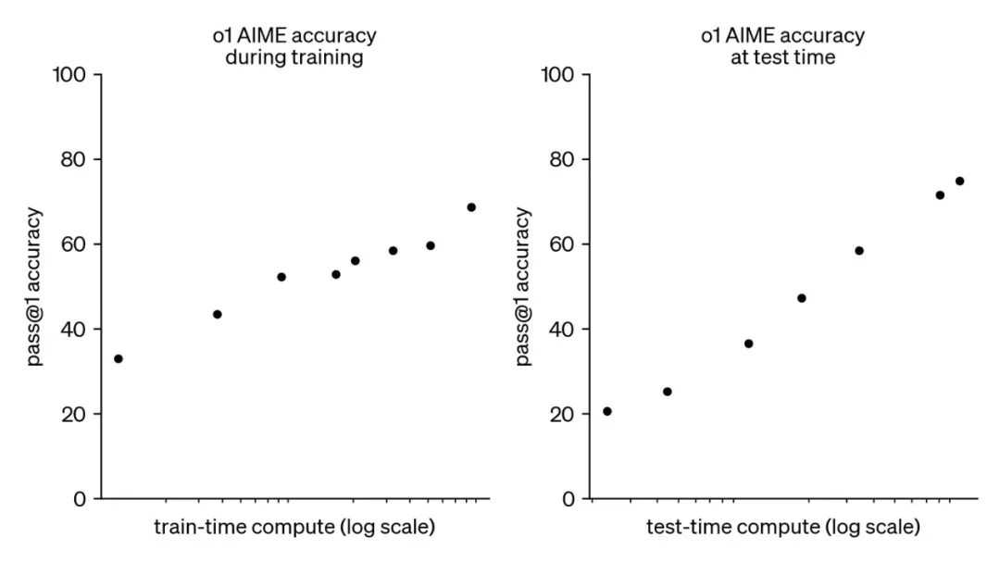

### 1.1.1 常见的 LLM 模型

大语言模型的发展历程虽然只有短短不到五年的时间，但是发展速度相当惊人，国内外有超过百种大模型相继发布。下图按照时间线给出了 2019 年至今比较有影响力的大语言模型：
<div align=center>
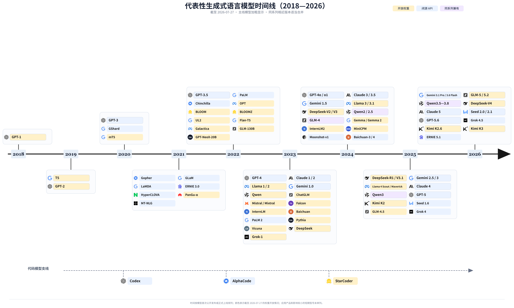
</div>

接下来我们主要介绍几个国内外常见的大模型（包括开源和闭源）。

#### GPT（OpenAI，闭源）

GPT 是 OpenAI 的闭源模型系列，也是 ChatGPT 背后的模型，主要通过 ChatGPT 和 OpenAI API 提供。

2022 年 11 月，OpenAI 基于 GPT-3.5 推出对话产品 ChatGPT。对话体验相当惊艳，很快让大模型进入普通用户视野。ChatGPT 上线 5 天用户破百万；两个月后月活约 1 亿，成为当时史上用户增长最快的消费级应用程序。目前其全球月活跃用户已超过 10 亿。

**版本演进**

- **GPT-3 系列（2020—2022）** 把 decoder-only Transformer 扩展到 1750 亿参数，并让 **In-context Learning（上下文学习）** 进入主流视野。只给任务说明或少量示例，模型就能在上下文中模仿新任务，不必更新参数。GPT-3.5 随后沿用 InstructGPT 的 **RLHF（Reinforcement Learning from Human Feedback，人类反馈强化学习）** 路线：先用人工示范做监督微调，再根据人类对回答的排序训练奖励模型，最后用强化学习调整模型。GPT-3.5 和 ChatGPT 把这套后训练方法带入了大规模消费产品，模型也从偏向续写转向按要求完成任务。
- **GPT-4 系列（2023—2024）** 将图像输入带入 GPT 主线，并改进复杂指令、代码和推理能力。后续 GPT-4o 中的“o”代表 omni。它用同一个神经网络端到端处理文本、视觉和音频，不再像早期语音模式那样串联语音识别、文本模型和语音合成三个系统，因此语音延迟更低，语气、节奏和背景声音也能保留下来。
- **o1（2024）** 把 **Test-time Scaling（测试时扩展，也称推理时扩展）** 带入主流模型产品。它先用大规模强化学习训练模型形成内部推理过程，再让模型在回答难题时投入更多计算。OpenAI 的实验显示，o1 的表现会随训练计算量和思考时间增加而提升，说明模型训练结束后，仍可用更多推理时计算换取更好的数学、代码和多步推理能力。
- **GPT-5 系列（2025—2026）** 把快速回答、深度推理和实时路由合成统一系统：简单问题直接回答，复杂问题再投入更多推理。GPT-5.6 沿用统一路由，并加入 **Programmatic Tool Calling（程序化工具调用）**：模型可以编写并执行小段程序来组织多次工具调用、筛选中间结果，从而减少模型往返次数。API 还以 beta 形式增加了多 Agent 并行执行。

**当前型号**

| 型号 | 上下文长度 | 知识截止日期 | 主要用途 |
| --- | ---: | --- | --- |
| GPT-5.6 Sol | 1.05M | 2026-02-16 | 高难度推理、复杂编码和长工具链 |
| GPT-5.6 Terra | 1.05M | 2026-02-16 | 能力、延迟和成本较均衡的生产任务 |
| GPT-5.6 Luna | 1.05M | 2026-02-16 | 成本敏感的批量处理和高吞吐调用 |

资料：[ChatGPT 早期用户增长](https://arstechnica.com/information-technology/2023/02/chatgpt-sets-record-for-fastest-growing-user-base-in-history-report-says/)｜[ChatGPT 10 亿月活估算](https://sensortower.com/blog/state-of-ai-2026)｜[InstructGPT 与 RLHF](https://openai.com/index/instruction-following/)｜[GPT-4](https://openai.com/index/gpt-4/)｜[GPT-4o](https://openai.com/index/hello-gpt-4o/)｜[o1 与 Test-time Scaling](https://openai.com/index/learning-to-reason-with-llms/)｜[GPT-5](https://openai.com/index/introducing-gpt-5/)｜[GPT-5.6](https://openai.com/index/gpt-5-6/)｜[GPT-5.6 使用指南](https://developers.openai.com/api/docs/guides/latest-model)｜[当前模型](https://developers.openai.com/api/docs/models)

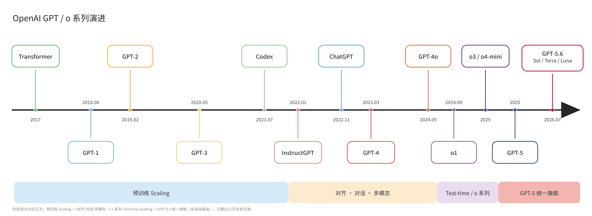

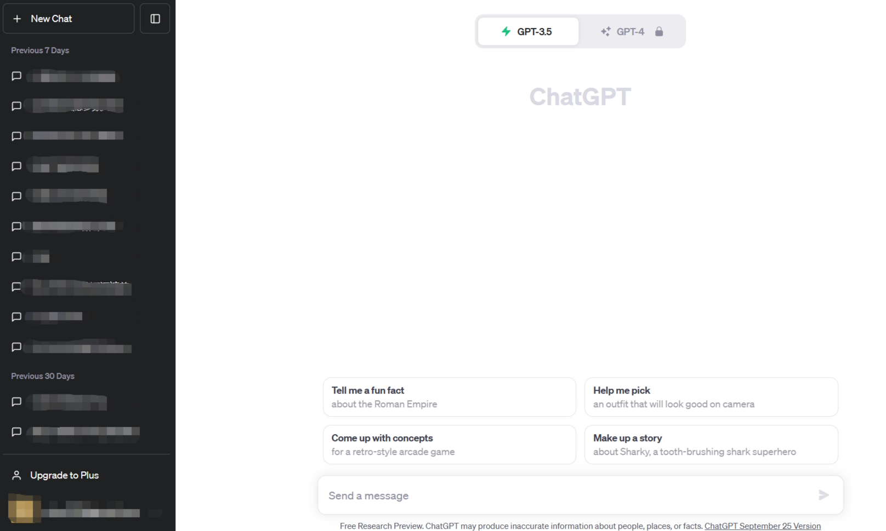

#### Claude（Anthropic，闭源）

Claude 由 Anthropic 开发，长期重视安全对齐和长文档处理，近几代又把重点扩展到代码与 Agent。

**版本演进**

- **Claude 1 / 2（2023）** 采用 **Constitutional AI**：先让模型按照一组预先写好的原则批评并修改自己的回答，再让模型比较不同回答，为强化学习提供偏好信号。后一个阶段也称 **RLAIF（Reinforcement Learning from AI Feedback，AI 反馈强化学习）**，可以减少安全对齐所需的人工标注。Claude 2 又把上下文扩展到 100K，并改进代码、数学和长文档分析。
- **Claude 3 系列（2024—2025）** 加入图像理解，并形成 Haiku、Sonnet、Opus 三档。Claude 3.5 Sonnet 随后加入 **Computer Use（计算机操作）**：模型读取屏幕截图，再输出移动鼠标、点击和输入等操作指令，因此也能操作没有专用 API 的图形界面。**Claude 3.7 Sonnet（2025）** 首次加入 **Hybrid Reasoning（混合推理）**：同一个模型既能直接回答，也能进入 Extended Thinking（扩展思考）模式；开发者可以用 token budget 控制思考长度。
- **Claude 4 系列（2025—2026）** 将工具调用接入扩展思考，模型可以在“思考—调用工具—读取结果”之间来回切换，并支持并行工具调用。Opus 4.6 首次加入 **Adaptive Thinking（自适应思考）**：模型按任务难度和 effort 档位决定是否思考、思考多久，不再要求开发者为每次请求预先指定固定 token 预算。
- **Claude 5 系列（2026）** 沿用 Adaptive Thinking，把 1M 上下文设为默认配置，并默认开启思考。Opus 5 还以 beta 形式支持在多轮对话中增删工具而不破坏已有 Prompt Cache。

**当前型号**

| 型号 | 上下文长度 | 知识截止日期 | 主要用途 |
| --- | ---: | --- | --- |
| Claude Haiku 4.5 | 200K | 2025-02 | 实时交互、高并发和成本敏感任务 |
| Claude Sonnet 5 | 1M | 2026-01 | 日常开发、代码生成和一般 Agent 任务 |
| Claude Opus 5 | 1M | 2026-05 | 复杂 Agent 编码和企业知识工作 |
| Claude Fable 5 | 1M | 2026-01 | 面向一般用户的最高档；高难度推理和长时程 Agent |
| Claude Mythos 5（限邀） | 1M | 2026-01 | 防御性网络安全工作；不带 Fable 的安全分类器 |

资料：[Constitutional AI](https://www.anthropic.com/research/constitutional-ai-harmlessness-from-ai-feedback)｜[Claude 3.5 与 Computer Use](https://www.anthropic.com/news/3-5-models-and-computer-use)｜[Claude 3.7 扩展思考](https://www.anthropic.com/news/visible-extended-thinking)｜[Claude 4](https://www.anthropic.com/news/claude-4)｜[Adaptive Thinking](https://platform.claude.com/docs/en/build-with-claude/adaptive-thinking)｜[当前型号对比](https://platform.claude.com/docs/en/about-claude/models/overview)｜[Fable 5 与 Mythos 5](https://platform.claude.com/docs/en/about-claude/models/introducing-claude-fable-5-and-claude-mythos-5)｜[Claude Opus 5](https://platform.claude.com/docs/en/about-claude/models/whats-new-opus-5)

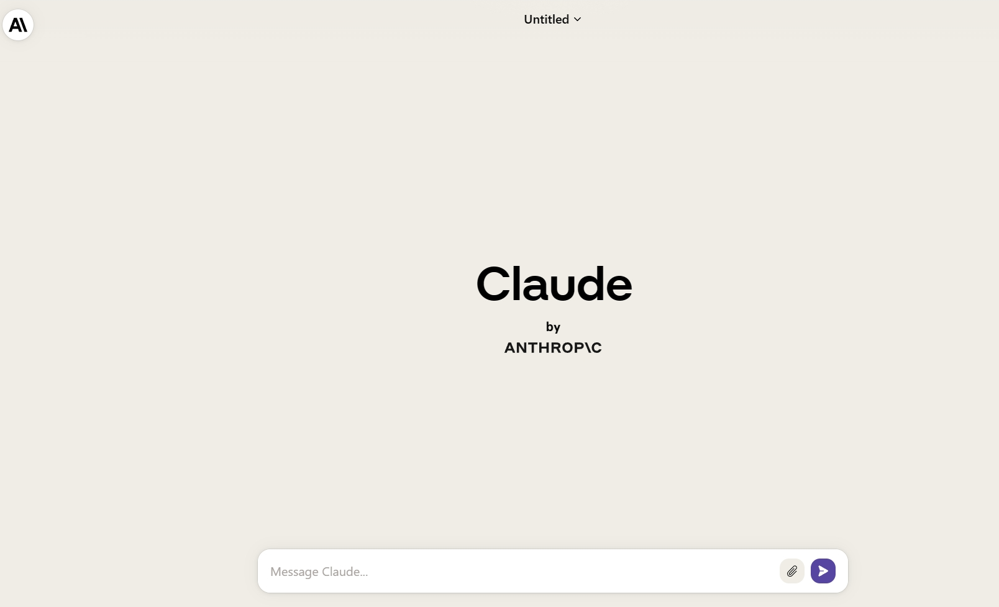

#### Gemini（Google DeepMind，闭源）

Gemini 是 Google DeepMind 的模型系列，原生多模态和长上下文是它较早形成的特点。它通过 Gemini API 和 Vertex AI 提供，并与 Google Search 等服务集成。

**版本演进**

- **Gemini 1 系列（2023—2024）** 从 PaLM 的文本主线转向原生多模态训练。这里的“原生多模态”指模型家族在训练阶段联合使用文本、图像、音频和视频。**Gemini 1.5** 改用 **MoE（Mixture of Experts，混合专家）**：路由器为每个 token 选择少数专家，在扩大模型容量的同时控制计算量；这一代也把上下文扩展到百万 token。
- **Gemini 2 系列（2024—2025）** 把原生工具调用、图像和音频输出带入主线，并推出 Multimodal Live API。模型可以持续接收音频和视频流、实时返回语音，还能在一次交互中组合 Google Search、代码执行和用户自定义函数。**Gemini 2.5** 将“思考”纳入主力模型，并开放 **Thinking Budget（思考预算）**。开发者可以限制模型用于内部推理的 token 数，在答案质量、延迟和费用之间做取舍。
- **Gemini 3.x（2025—2026）** 将精确的 token 预算改为 low、medium、high 等 **Thinking Level（思考等级）**，由模型在每个等级内自行分配推理计算。

**当前型号**

| 型号 | 上下文长度 | 知识截止日期 | 主要用途 |
| --- | ---: | --- | --- |
| Gemini 3.1 Pro Preview | 1M | 2025-01 | 复杂多模态推理、编码和 Agent |
| Gemini 3.1 Deep Think（应用模式） | — | 2025-01 | 数学、科学和工程难题 |
| Gemini 3.6 Flash | 1M | 2025-01 | 兼顾速度的多模态、编码和多步 Agent 任务 |
| Gemini 3.5 Flash-Lite | 1M | 2025-01 | 文档抽取、结构化处理和高吞吐调用 |

资料：[Gemini 1.0 技术报告](https://deepmind.google/gemini/gemini_1_report.pdf)｜[Gemini 1.5](https://blog.google/innovation-and-ai/products/google-gemini-next-generation-model-february-2024/)｜[Gemini 2.0](https://blog.google/innovation-and-ai/models-and-research/google-deepmind/google-gemini-ai-update-december-2024/)｜[Gemini Thinking](https://ai.google.dev/gemini-api/docs/generate-content/thinking)｜[Gemini 3 开发指南](https://ai.google.dev/gemini-api/docs/gemini-3)｜[Gemini 3.1 Deep Think](https://deepmind.google/models/gemini/deep-think/)｜[Gemini 3.6 Flash 与 3.5 Flash-Lite](https://ai.google.dev/gemini-api/docs/latest-model)｜[Gemini 模型](https://ai.google.dev/gemini-api/docs/models)

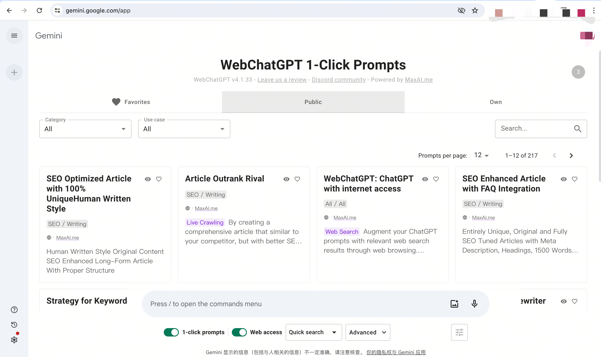

#### Llama（Meta，开源）

Llama 是 Meta 发布的开放权重模型系列，也是 2023 年开源大模型浪潮的重要起点。围绕它形成了成熟的微调、量化和本地推理生态，许多后来的开放模型沿用了这套路径。

**版本演进**

- **Llama 1 / 2（2023）** 表明较小的模型只要使用更多数据充分训练，也能取得不错的效果。Llama 2 又增加对话版本并放宽商业使用，随后出现大量微调和量化模型。
- **Llama 3 系列（2024）** 更换为 128K 词表的 tokenizer，同一段文本通常能用更少 token 表示；8B 和 70B 均采用 **GQA（Grouped Query Attention，分组查询注意力）**，让多个查询头共享键和值，从而减少生成时需要保存的 KV Cache。**Llama 3.1** 随后发布 405B 模型，并把多语言和长上下文纳入主线。405B 既可直接使用，也能作为较小模型的蒸馏教师。
- **Llama 4 Scout / Maverick（2025）** 改用 MoE，并以 **Early Fusion（早期融合）** 将文本和视觉 token 放进同一模型主干训练，而不是后接独立的视觉模块。与 Llama 3 相比，这一代加入了图像理解和超长上下文。

**当前型号**

| 型号 | 上下文长度 | 知识截止日期 | 主要用途 |
| --- | ---: | --- | --- |
| Llama 4 Scout（开源） | 10M | 2024-08 | 超长文档、私有化部署和资源受限的多模态任务 |
| Llama 4 Maverick（开源） | 1M | 2024-08 | 质量优先的通用文本与图像理解 |

资料：[Llama 论文](https://arxiv.org/abs/2302.13971)｜[Llama 3](https://ai.meta.com/blog/meta-llama-3/)｜[Llama 4](https://ai.meta.com/blog/llama-4-multimodal-intelligence/)｜[下载与文档](https://ai.meta.com/llama/get-started/)

#### Grok（xAI，部分开源）

Grok 由 xAI 开发，最鲜明的产品特点是可以通过 Web Search 和 X Search 获取实时信息。搜索结果来自外部工具，并不是模型训练数据会自动更新。Grok-1 发布过权重，后续主力型号则通过闭源 API 提供。

**版本演进**

- **Grok-1（2023；2024 年开放权重）** 在 2023 年随 Grok 产品公开，xAI 于次年公布了 314B 基础模型的权重和推理代码。
- **Grok 4 系列（2026，闭源）** Grok 4.3 把上下文扩展到 1M，并支持调节推理强度。Grok 4.5 由 xAI 与 Cursor 联合训练，使用了数万亿 token 的 Cursor 数据，其中包含真实的开发者与 Agent 交互；xAI 还针对多步软件工程任务进行了强化学习训练。

**当前型号**

| 型号 | 上下文长度 | 知识截止日期 | 主要用途 |
| --- | ---: | --- | --- |
| Grok 4.5（闭源） | 500K | 2026-02-01 | 编码、Agent、工程与知识工作 |

资料：[xAI Models](https://docs.x.ai/developers/models)｜[xAI：Grok 4.5](https://x.ai/news/grok-4-5)｜[Cursor：联合训练 Grok 4.5](https://cursor.com/grok-4-5)｜[Grok-1](https://github.com/xai-org/grok-1)

#### DeepSeek（深度求索，开源）

DeepSeek 以开放权重和较低的训练、推理成本受到关注，长上下文效率也是它持续投入的方向。它既提供可自行部署的模型，也提供价格较低的 API。

**版本演进**

- **DeepSeek-V2（2024，开源）** 把 **DeepSeekMoE** 和 **MLA（Multi-head Latent Attention，多头潜在注意力）** 用到主力模型中。DeepSeekMoE 把专家划分得更细，并结合共享专家和按需路由的专家；MLA 则把键和值联合压缩成维度更低的表示，减少长文本生成时的 KV Cache。
- **DeepSeek-V3 系列（2024—2025，开源）** 沿用 V2 的架构，并加入无辅助损失的负载均衡和 **MTP（Multi-Token Prediction，多 token 预测）**。前者通过动态调整专家的路由偏置来均衡负载，避免额外损失干扰主任务；后者让模型在一个位置预测多个后续 token，既增加训练信号，也可用于推测解码。V3 还在超大规模模型上验证了 FP8 混合精度训练，并用 DualPipe 尽量重叠计算与跨节点通信，这是其降低训练成本的重要部分。V3.1 把思考与非思考模式合到同一模型。V3.2 又提出 **DSA（DeepSeek Sparse Attention，DeepSeek 稀疏注意力）**，在 MLA 的压缩表示上用轻量索引器打分，只让得分最高的一小部分历史位置参与注意力计算。
- **DeepSeek-R1（2025，开源）** 用 **GRPO（Group Relative Policy Optimization，组相对策略优化）** 训练推理能力：对同一道题生成一组答案，再根据组内奖励的相对高低更新模型，不必额外训练一个价值模型。R1-Zero 证明模型不经过监督微调也能通过强化学习出现自我验证和反思；R1 再加入冷启动数据改善可读性，并把推理能力蒸馏到较小的开放模型。
- **DeepSeek-V4 系列（2026，开源）** 沿用 DSA，并在计算注意力前压缩相邻 token。较细的 **CSA（Compressed Sparse Attention，压缩稀疏注意力）** 负责筛选相关位置，压缩比例更高的 **HCA（Heavily Compressed Attention，高度压缩注意力）** 负责保留全文信息，两者交替使用，以降低百万 token 上下文的计算和显存开销。V4 还加入 **mHC（Manifold-Constrained Hyper-Connections，流形约束超连接）**，约束多条残差路径之间的混合，减少深层网络中的信号放大或衰减。

**当前型号**

| 型号 | 上下文长度 | 知识截止日期 | 主要用途 |
| --- | ---: | --- | --- |
| DeepSeek-V4-Pro（开源） | 1M | — | 1.6T 总参数、49B 激活；质量优先的推理、编码和 Agent 任务 |
| DeepSeek-V4-Flash（开源） | 1M | — | 284B 总参数、13B 激活；成本和吞吐优先的通用调用 |

资料：[DeepSeek-V2](https://github.com/deepseek-ai/DeepSeek-V2)｜[DeepSeek-V3](https://github.com/deepseek-ai/DeepSeek-V3)｜[DeepSeek-R1 论文](https://arxiv.org/abs/2501.12948)｜[DeepSeek-R1 代码与模型](https://github.com/deepseek-ai/DeepSeek-R1)｜[DeepSeek-V3.1](https://api-docs.deepseek.com/news/news250821/)｜[DeepSeek-V3.2](https://api-docs.deepseek.com/news/news251201/)｜[V4 技术说明](https://huggingface.co/deepseek-ai/DeepSeek-V4-Pro)｜[V4 发布说明](https://api-docs.deepseek.com/news/news260424/)｜[当前 API 模型](https://api-docs.deepseek.com/quick_start/pricing/)


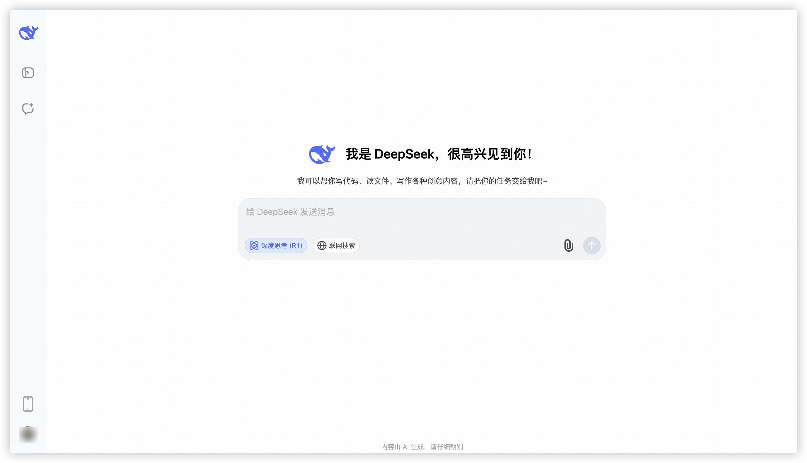

#### 通义千问 Qwen（阿里巴巴，部分开源）

Qwen 是阿里巴巴的大模型系列，既有开放权重，也有通过阿里云提供的闭源型号。型号覆盖小型本地模型、大型 MoE，以及代码、视觉和音频模型，并支持中文和多种其他语言。

**版本演进**

- **Qwen1（2023，部分开源）** 以中文、英文能力和开放权重起步，并逐步发布不同参数规模以及视觉、音频等专用模型，形成了千问早期的模型生态。
- **Qwen2（2024，部分开源）** 将 GQA 扩展到全部参数规模，并增加多语言、代码、数学和长文本能力。Qwen2.5 沿用这一架构，重点补强训练数据、结构化输出和指令遵循。
- **Qwen3（2025—2026，部分开源）** Qwen3 把 thinking 与 non-thinking 放进同一模型，后训练依次经过长推理冷启动、推理强化学习、两种模式融合和通用强化学习。Qwen3-Next 随后大规模采用 **Gated DeltaNet（门控 Delta 网络）**：它把历史信息写入固定大小的记忆状态，并与少量标准注意力层配合，在降低长文本开销的同时保留精确召回能力；Qwen3.5 又在这套架构上加入原生多模态。最新的 Qwen3.8-Max-Preview 延续多模态 Agent 路线，改为始终使用思考模式，并允许调节推理强度。

**当前型号**

| 型号 | 上下文长度 | 知识截止日期 | 主要用途 |
| --- | ---: | --- | --- |
| Qwen3.8-Max-Preview（闭源） | — | — | 当前云端最高档；推理、视觉理解和文本生成 |
| Qwen3.7-Max（闭源） | 1M | — | 长时程推理和复杂 Agent |
| Qwen3.7-Plus（闭源） | 1M | — | 通用多模态和生产调用 |
| Qwen3.6-35B-A3B（开源） | 262K | — | 本地部署、代码和网页 Agent |


资料：[Qwen 技术路线](https://qwenlm.github.io/blog/qwen/)｜[Qwen2](https://qwenlm.github.io/blog/qwen2/)｜[Qwen2.5](https://qwenlm.github.io/blog/qwen2.5/)｜[Qwen3](https://qwenlm.github.io/blog/qwen3/)｜[Qwen3.5](https://qwen.ai/blog?id=qwen3.5)｜[Qwen3.6-35B-A3B](https://qwen.ai/blog?id=qwen3.6-35b-a3b)｜[Qwen3.7 更新记录](https://help.aliyun.com/zh/model-studio/newly-released-models)｜[Qwen3.8 思考模式](https://help.aliyun.com/zh/model-studio/deep-thinking)｜[阿里云当前模型](https://help.aliyun.com/en/model-studio/models)

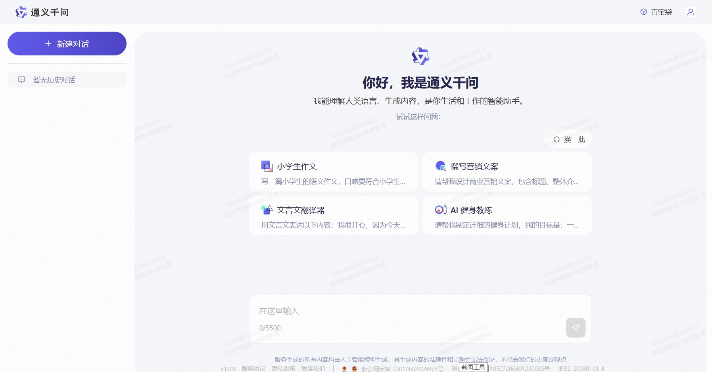

#### Kimi（月之暗面，部分开源）

Kimi 最初因长上下文产品受到关注，用户可以直接上传论文、合同和代码库。后续版本把重点转向代码和 Agent。

**版本演进**

- **Kimi K2 系列（2025—2026，开源）** K2 是万亿参数 MoE，并提出 **MuonClip**：当某个注意力头的分数超过阈值时，重新缩放对应的 Q/K 投影权重，避免注意力分数持续增大造成训练发散。K2 Thinking 将测试时扩展从增加思考 token 延伸到增加工具调用步数。K2.5 加入原生多模态和 **PARL（Parallel-Agent Reinforcement Learning，并行 Agent 强化学习）**，让主 Agent 学会拆分任务并调度多个子 Agent；K2.6 沿用 Agent Swarm，把并行规模从最多 100 个子 Agent、1500 个步骤扩展到 300 个子 Agent、4000 个步骤，并改善长时间编码任务中的稳定性。
- **Kimi K3（2026，开源）** 模型规模扩展到 2.8T 参数，并加入原生视觉和百万 token 上下文。它使用 **KDA（Kimi Delta Attention）**：在 KDA 层中，历史信息被更新到固定大小的循环记忆中，再由细粒度门控决定保留或覆盖哪些内容，不必让当前 token 与全部历史 token 逐一计算注意力。**AttnRes（Attention Residuals）** 则不再把各层输出按固定方式累加，而是让当前层根据输入选择需要读取的早期表示，减少深层网络中的信息稀释。K3 还使用 **Stable LatentMoE**，每个 token 从 896 个专家中激活 16 个，共激活 104B 参数；官方称其整体扩展效率约为 K2 的 2.5 倍。

**当前型号**

| 型号 | 上下文长度 | 知识截止日期 | 主要用途 |
| --- | ---: | --- | --- |
| Kimi K3（开源） | 1M | — | 长文档、代码库和长时程知识工作 |
| Kimi K2.6（开源） | 256K | — | 可切换思考模式的对话、视觉和 Agent 任务 |

资料：[Kimi K2](https://github.com/MoonshotAI/Kimi-K2)｜[Kimi K2 Thinking](https://www.kimi.com/blog/kimi-k2-thinking)｜[Kimi K2.5](https://www.kimi.com/blog/kimi-k2-5)｜[Kimi K2.6](https://www.kimi.com/blog/kimi-k2-6)｜[Kimi K3 开放权重与技术报告](https://github.com/MoonshotAI/Kimi-K3)｜[Kimi API](https://platform.moonshot.ai/)

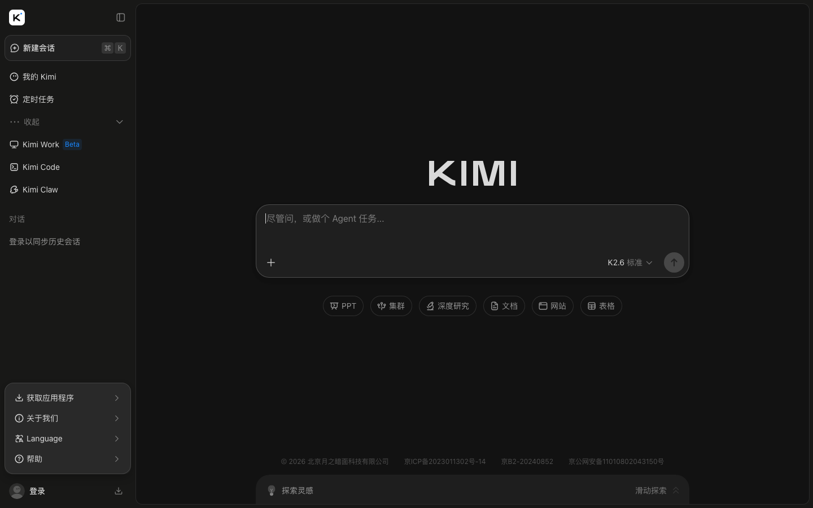

#### GLM / ChatGLM（智谱 AI，部分开源）

GLM 由智谱 AI 开发，特点是中文能力、开放权重和本地部署支持。当前版本的重点已经转向代码和长时程 Agent。

**版本演进**

- **ChatGLM-6B（2023，开源）** 沿用 GLM 的空白填充式预训练：先遮住文本中的连续片段，再让模型根据前后文逐段补全。它只有 60 亿参数，并通过量化降低显存需求，可以在消费级显卡上运行。
- **GLM-4 系列（2024—2025，部分开源）** GLM-4 增加工具调用、长上下文和多模态型号，GLM-4.5 随后改用 MoE，并把推理、代码和 Agent 放进同一套后训练流程。GLM-4.7 加入 **Preserved Thinking（保留思考）** 和 **Turn-level Thinking（轮次级思考）**，分别用于复用多轮推理和逐轮控制是否思考。
- **GLM-5 系列（2026，开源）** 扩大了 MoE 规模，并沿用 DeepSeek 的 DSA 降低长上下文开销。GLM-5.1 改善了长任务中的错误恢复。GLM-5.2 将上下文扩展到 1M，并提出 **IndexShare**：每四层稀疏注意力共享一个索引器，在 1M 上下文下将单 token 的 FLOPs 降至原来的约 1/2.9。它还改进了用于推测解码的 **MTP（Multi-Token Prediction，多 token 预测）** 层，使平均接受长度最高提高 20%。

**当前型号**

| 型号 | 上下文长度 | 知识截止日期 | 主要用途 |
| --- | ---: | --- | --- |
| GLM-5.2（开源） | 1M | — | 744B 总参数、40B 激活；长时程编码、复杂调试和 Agent 任务 |

资料：[GLM 论文](https://arxiv.org/abs/2103.10360)｜[GLM-4.5 / 4.7](https://github.com/zai-org/GLM-4.5)｜[GLM-5 / 5.2 开放权重](https://github.com/zai-org/GLM-5)｜[GLM-5.2 技术说明](https://z.ai/blog/glm-5.2)｜[智谱开放平台](https://open.bigmodel.cn/)

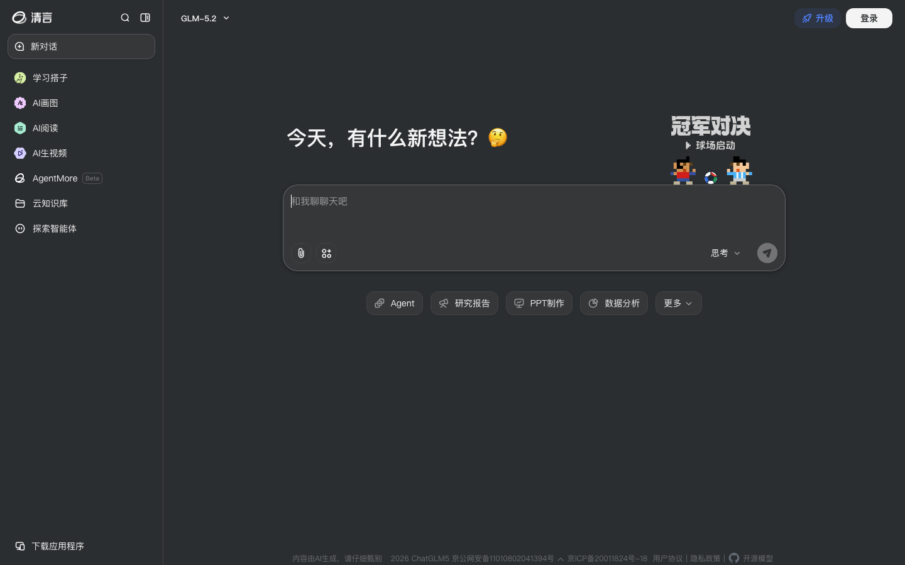

#### 豆包 / Seed（字节跳动，闭源）

豆包是面向用户的应用，Seed 是字节跳动的模型系列，开发者主要通过火山方舟调用。

**版本演进**

- **Seed 1.6（2025）** 提出 **AdaCoT（Adaptive Chain of Thought，自适应思维链）**：训练模型按题目难度决定直接回答还是展开推理，以减少不必要的思考 token。
- **Seed 2 系列（2026）** Seed 2.0 相对 Seed 1.8 改进了复杂指令、多模态理解和长时程 Agent。Seed 2.1 又把训练重点放到端到端代码交付和跨工具操作。

**当前型号**

| 型号 | 上下文长度 | 知识截止日期 | 主要用途 |
| --- | ---: | --- | --- |
| Seed 2.1 Pro | — | — | 复杂推理、通用 Agent 和端到端代码任务 |
| Seed 2.1 Turbo | — | — | 延迟敏感的通用任务和工具调用 |

资料：[Seed 1.6 与 AdaCoT](https://seed.bytedance.com/blog/seed1-6-%E7%B3%BB%E5%88%97%E6%A8%A1%E5%9E%8B%E6%8A%80%E6%9C%AF%E4%BB%8B%E7%BB%8D)｜[Seed 2.0](https://seed.bytedance.com/en/seed2)｜[Seed 2.1](https://seed.bytedance.com/en/seed2_1)｜[火山方舟](https://www.volcengine.com/product/ark)

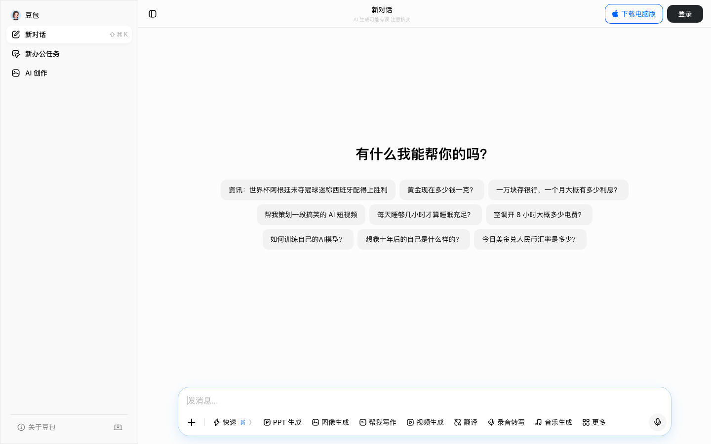

#### 文心 ERNIE（百度，部分开源）

文心（ERNIE）是百度的大模型系列，面向用户的产品早期叫文心一言，现在主要通过百度文心网站和文心 APP 提供服务。该系列早期主打知识增强，后来转向多模态；当前主力是文心 5.1（ERNIE 5.1），ERNIE 4.5 提供开放权重。

资料：[ERNIE 4.5](https://ernie.baidu.com/blog/zh/posts/ernie4.5/)｜[ERNIE 5.1](https://ernie.baidu.com/blog/posts/ernie-5.1-0508-release/)

#### 讯飞星火（科大讯飞，闭源）

讯飞星火和科大讯飞原有的语音、翻译、教育业务结合得比较紧。现在的 Spark X2 系列增加了深度推理和 Function Calling，其中 X2 Agent 偏向代码与工具调用。

资料：[星火通用 API](https://www.xfyun.cn/doc/spark/Web.html)｜[Spark X2](https://www.xfyun.cn/doc/spark/X1ws.html)｜[Spark X2 Agent](https://www.xfyun.cn/doc/spark/CodingPlan.html)

#### Baichuan（百川智能，部分开源）

百川早期做通用中英模型，后来把重心转到医疗。现在主要是开放权重的 Baichuan-M3 和通过 API 提供的 M3-Plus；这类模型只能作为医疗辅助，不能代替专业判断。

资料：[百川模型](https://www.baichuan-ai.com/)｜[开放平台](https://platform.baichuan-ai.com/)｜[GitHub](https://github.com/baichuan-inc)

这些模型没有一个能在所有任务上占优。选型时先明确是否需要本地部署、联网、多模态、长上下文或工具调用，再用真实样本比较回答质量、延迟和成本。公开榜单适合了解大致位置，不能替代业务测试。

### 1.1.2 LLM 的特点与能力

LLM 有几项常见特点：

1. **规模大：** 参数量常达数百亿或数千亿，但参数规模并不能单独决定模型能力。
2. **预训练 + 后训练：** 先在大规模数据上预训练，再通过指令微调、偏好优化或强化学习调整行为。
3. **依赖上下文：** 模型会根据前文生成后续内容，因此提示写法和对话历史会直接影响回答。
4. **支持多语言：** 许多模型可以处理英语以外的语言。
5. **支持多模态：** 部分模型还可以处理图像、音频和视频。
6. **存在使用风险：** 模型可能生成有害或带有偏见的内容，也可能泄露输入中的敏感信息。
7. **计算成本高：** 训练和推理通常依赖 GPU 或 TPU。

#### 1.1.2.1 涌现能力（emergent abilities）

模型规模增加后，有些能力会在特定评测中突然出现明显提升，这类现象通常称为**涌现能力**。不过，“突然出现”是否代表模型内部发生了类似物理相变的变化，目前仍有争议。评测指标如果只有“答对或答错”两种结果，原本平滑的能力增长也可能看起来像一次跳变。

下面三项能力经常和大模型的涌现现象一起讨论，但它们的来源并不完全相同，不能都简单归因于参数规模：

1. **上下文学习**：GPT-3 让这种用法受到广泛关注。用户在 Prompt 中给出任务说明或少量示例，模型便可以照着完成新输入，不需要更新模型参数。

2. **指令遵循**：模型能够按照自然语言要求完成任务。这项能力主要来自指令微调、偏好优化等后训练方法，并不是模型变大后自然获得的全部结果。

3. **逐步推理**：对于数学题等多步骤任务，可以在 Prompt 中给出推理示例，引导模型先写出中间步骤再回答，这就是**思维链（CoT，Chain of Thought）**。较新的推理模型还会通过强化学习等方法专门训练这项能力。

因此，“涌现”更适合描述某项能力在特定规模和评测下的表现，不宜用来笼统解释大模型的所有进步。

#### 1.1.2.2 作为基座模型支持多元应用的能力

2021 年，斯坦福大学的研究人员提出了**基座模型（Foundation Model）**这一概念，指在大规模数据上训练、随后可以适配多种下游任务的模型。大语言模型是其中一种，此外也有面向视觉或多模态任务的基座模型。

同一个基座模型可以通过 Prompt、RAG、工具调用或微调服务多个应用，开发者不必为每项任务都从头训练模型。不过，通用模型并不能替代所有专用模型；是否复用同一底座，仍要看效果、成本、延迟和数据安全要求。

#### 1.1.2.3 支持对话作为统一入口的能力

ChatGPT 让大量用户开始通过对话使用大模型。自然语言交互并不是新概念，Siri、Echo 等产品早已采用这种形式；LLM 提高了对复杂指令的理解和生成能力。此后，对话界面又延伸到 **`智能体（Agent）`**：模型可以规划步骤、调用工具、读取结果并继续执行。

LLM 已经用于写作、问答、翻译、搜索和多模态处理。它也让 **AGI（通用人工智能）** 再次成为讨论焦点，但目前没有公认标准可以证明 LLM 是 AGI 的早期形态。

### 1.1.3 Agent 与工具调用

LLM 如果只做「读入 Prompt → 生成文本」，多半只能完成单轮或有限轮对话。查资料、计算、调用 API 和修改文件等操作，需要借助**工具调用（Tool Calling）**。Function Calling 是常见的实现方式：开发者声明函数名称、参数格式和用途，模型生成结构化调用请求，再由应用执行函数并把结果返回给模型。

**Agent 循环**大致是：理解目标 → 选择工具和参数 → 执行工具 → 读取执行结果 → 决定继续操作还是回答用户。实际开发时通常要设置步数上限、超时和成本预算，并记录每一步的输入与输出，方便排查错误。

RAG 和 Agent 是两种不同的应用模式。普通 RAG 可以按固定流程完成“检索一次，再生成一次”，不需要模型规划下一步；在 Agent 系统中，检索也可以注册成工具，由模型决定何时查、查几次。后一种做法通常称为 Agentic RAG。

> 下一节介绍 RAG。

【**参考内容**】：

1. [A Survey of Large Language Models](https://arxiv.org/abs/2303.18223)
2. [Are Emergent Abilities of Large Language Models a Mirage?](https://arxiv.org/abs/2304.15004)
3. [周枫：当我们谈论大模型时，应该关注哪些新能力？](https://xueqiu.com/1389978604/248392718)
4. [S 型智能增长曲线：从 Deepseek R1 看 Scaling Law 的未来](https://zhuanlan.zhihu.com/p/22658624635)
5. [一文详尽之 Scaling Law！](https://mp.weixin.qq.com/s?__biz=MzIyNjM2MzQyNg==&mid=2247700024&idx=1&sn=7933ecfaa8d0e127d70d671aff418545&chksm=e9ec360d1ae201b6f875055fe0f83d808076dcadc38144be050297213ff6d8085b241fdb4319&scene=0&xtrack=1)
6. [QwQ: 思忖未知之界](https://qwenlm.github.io/zh/blog/qwq-32b-preview/)
7. [QwQ-32B: 领略强化学习之力](https://qwenlm.github.io/zh/blog/qwq-32b/)

## 1.2 什么是 RAG

LLM 虽然掌握了大量知识，但仍会答错、编造内容，参数中的知识也会逐渐过时。**检索增强生成（RAG，Retrieval-Augmented Generation）** 在生成答案前，先从知识库、搜索引擎或其他外部数据源检索相关材料，再把这些材料作为上下文交给模型。它把模型参数中记住的知识与可更新的外部知识结合起来。

RAG 不保证答案一定正确。只有检索结果相关、材料本身可靠，并且模型确实依据材料作答时，它才可能提高事实准确性和来源可追溯性。如果召回了错误片段，模型也可能围绕错误材料生成一个看似合理的答案。

常见问题和 RAG 的对应关系：

- **幻觉：** LLM 可能生成看似合理但并不真实的内容。RAG 用外部材料约束回答，能够减少一部分无依据生成，但不能彻底消除幻觉。
- **知识过时：** 权重里的知识停在训练截止日之前。RAG 可以查更新后的库或网页。
- **内容不可追溯：** 纯生成往往说不清出处。RAG 可以保留检索片段与原始文档的对应关系，再由应用展示引用；引用能力需要额外实现，并非模型自动具备。
- **垂直知识不够：** 通用模型未必掌握具体行业的细节。RAG 可以检索领域文档，并将相关片段放入上下文。
- **复杂题缺材料：** 参数记忆不够时，检索可以补充事实和背景，但后续推理是否正确仍取决于模型能力与材料质量。
- **业务知识发生变化：** 很多情况下不必重新训练模型，可以更新知识库和索引。业务边界变化较大时，还要重新检查文档分块、检索策略、权限和评测集。
- **长文成本较高：** 将整篇长文放入上下文会增加延迟和费用。RAG 只取相关片段，可以减少输入量；代价是增加索引和检索开销，也可能遗漏分散在不同位置的信息。

### 1.2.1 RAG 的工作流程

工程中的 RAG 通常包含离线建库和在线问答两条流程，可以概括成四步：**数据处理 → 检索 → 增强 → 生成**。数据处理主要离线完成，后面三步在收到用户问题后运行。

<div align=center>
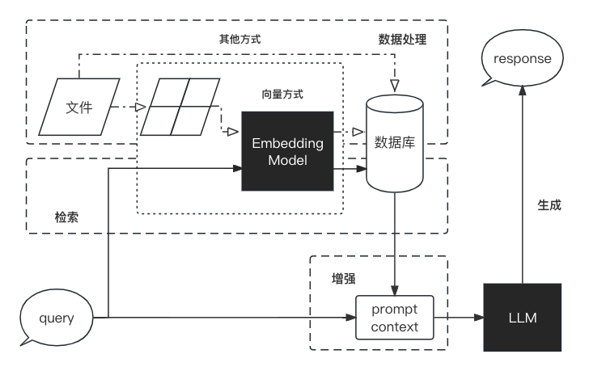
</div>

1. **数据处理阶段**
   1. 对原始数据进行清洗和处理。
   2. 将处理后的数据转化为检索模型可以使用的格式。
   3. 将处理后的数据存储在对应的数据库中。
2. **检索阶段**
   1. 将用户的问题输入到检索系统中，从数据库中检索相关信息。
3. **增强阶段**
   1. 对检索到的信息进行处理和增强，以便生成模型可以更好地理解和使用。
4. **生成阶段**
   1. 将增强后的信息输入到生成模型中，生成模型根据这些信息生成答案。

### 1.2.2 RAG 与微调

开发 LLM 应用时，RAG 和微调（Fine-tuning）解决的问题不同。

**RAG** 主要解决“回答时需要哪些外部知识”；**微调**是在特定数据上继续训练，主要调整模型的行为、风格、格式或专项任务能力。两者并不冲突，实际项目可以先用 RAG 提供知识，再用微调让模型更符合业务要求。

主要区别见下表（参考 [RAG 综述](https://arxiv.org/abs/2312.10997)、[LoRA](https://arxiv.org/abs/2106.09685) 和 [QLoRA](https://arxiv.org/abs/2305.14314)）：

| 对比维度 | RAG | 微调 |
| -------- | --- | ---- |
| 主要目标 | 在回答时引入外部知识 | 调整模型行为、风格、格式或专项能力 |
| 知识更新 | 更新知识库和索引即可，适合经常变化的内容 | 更新事实通常需要准备数据并重新训练，不适合频繁变化的知识 |
| 外部知识 | 回答时从文档、数据库或网页中检索 | 训练样本会影响模型参数，但不适合充当经常更新的事实库 |
| 数据工程 | 依赖文档解析、分块、元数据、索引和检索评估 | 依赖高质量训练样本、数据清洗和训练集设计 |
| 来源追溯 | 可以把回答关联到检索片段，但需要应用实现引用 | 很难指出某句话来自哪条训练数据 |
| 行为定制 | 仅靠检索不容易稳定改变语气、格式和行为 | 更适合学习固定格式、专业表达和特定任务模式 |
| 系统成本 | 需要维护 Embedding、索引、检索服务和知识更新流程 | 需要训练资源；LoRA、QLoRA 等方法可以降低成本 |
| 在线延迟 | 比直接生成多出一次检索 | 通常不需要额外检索，但速度仍受模型大小和部署方式影响 |
| 降低幻觉 | 正确材料可能减少无依据生成；错误检索也会误导模型 | 专项训练可能改善特定任务，但不能消除幻觉 |
| 隐私风险 | 需要控制文档、索引和检索结果的访问权限 | 训练数据可能被模型记忆或泄漏 |
| 其他风险 | 检索不到、召回错误或不同材料相互冲突 | 过拟合、能力遗忘和事实更新困难 |

### 1.2.3 RAG 示例项目

RAG 已经在多个领域取得了成功，包括问答系统、对话系统、文档摘要、文档生成等。

我们将在第三部分对 RAG 的应用进行详细介绍。将现有成熟的 RAG 案例进行拆解，和大家一起深入了解 RAG。

1. [Datawhale 知识库助手](https://github.com/logan-zou/Chat_with_Datawhale_langchain) 是结合本课程内容、在由[散步](https://github.com/sanbuphy)打造的 [ChatWithDatawhale](https://github.com/sanbuphy/ChatWithDatawhale)—— Datawhale 内容学习助手的基础上，将架构调整为初学者容易学习的 LangChain 架构，并参考第二章内容对不同源大模型 API 进行封装的 LLM 应用，能够帮助用户与 DataWhale 现有仓库和学习内容流畅对话，从而帮助用户快速找到想学习的内容和可以贡献的内容。
2. [天机](https://github.com/SocialAI-tianji/Tianji)是 **SocialAI**（来事儿 AI）制作的一款免费使用、非商业用途的人工智能系统。您可以利用它进行涉及传统人情世故的任务，如如何敬酒、如何说好话、如何会来事儿等，以提升您的情商和核心竞争能力。我们坚信，只有人情世故才是未来 AI 的核心技术，只有会来事儿的 AI 才有机会走向 AGI，让我们携手见证通用人工智能的来临。 —— "天机不可泄漏。"

---

> 对 RAG 有个大致印象后，下一章我们将介绍一个常用的 RAG 开发框架 LangChain。

【**参考内容**】：

1. [Retrieval-Augmented Generation for Knowledge-Intensive NLP Tasks](https://arxiv.org/abs/2005.11401)
2. [Retrieval-Augmented Generation for Large Language Models: A Survey](https://arxiv.org/abs/2312.10997)
3. [面向大语言模型的检索增强生成技术：综述 [译]](https://baoyu.io/translations/ai-paper/2312.10997-retrieval-augmented-generation-for-large-language-models-a-survey)

## 1.3 LangChain

ChatGPT 的巨大成功激发了越来越多的开发者兴趣，他们希望利用 OpenAI 提供的 API 或者私有化模型，来开发基于大型语言模型的应用程序。尽管大型语言模型的调用相对简单，但要创建完整的应用程序，仍然需要大量的定制开发工作，包括 API 集成、互动逻辑、数据存储等等。

为了解决这个问题，从 2022 年开始，许多机构和个人相继推出了多个开源项目，旨在**帮助开发者们快速构建基于大型语言模型的端到端应用程序或工作流程**。其中一个备受关注的项目就是 LangChain 框架。

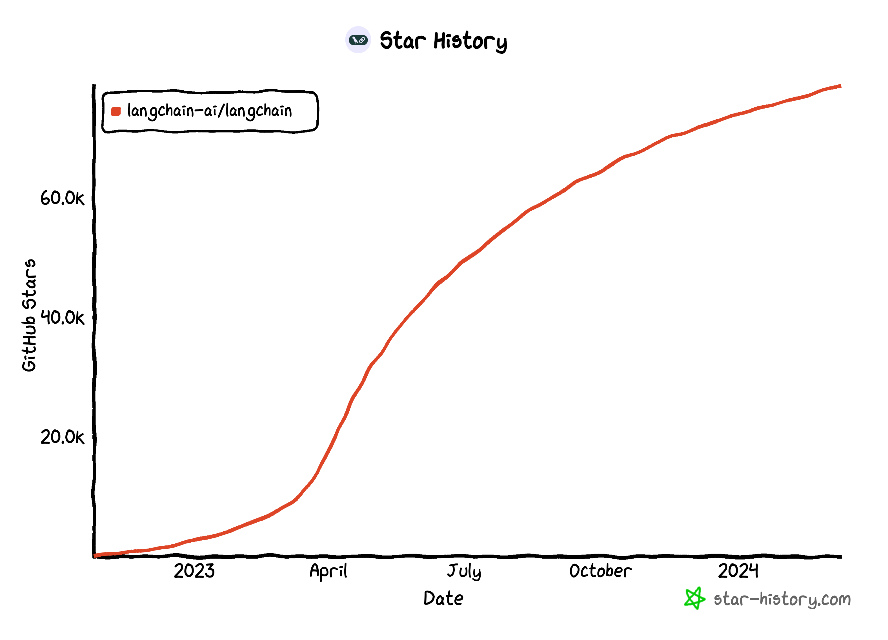

**LangChain 框架是一个开源工具，充分利用了大型语言模型的强大能力，以便开发各种下游应用。它的目标是为各种大型语言模型应用提供通用接口，从而简化应用程序的开发流程**。具体来说，LangChain 框架可以实现数据感知和环境互动，也就是说，它能够让语言模型与其他数据来源连接，并且允许语言模型与其所处的环境进行互动。

利用 LangChain 框架，我们可以轻松地构建如下所示的 RAG 应用（[图片来源](https://github.com/chatchat-space/Langchain-Chatchat/blob/master/img/langchain+chatglm.png)）。在下图中，`每个椭圆形代表了 LangChain 的一个模块`，例如数据收集模块或预处理模块。`每个矩形代表了一个数据状态`，例如原始数据或预处理后的数据。箭头表示数据流的方向，从一个模块流向另一个模块。在每一步中，LangChain 都可以提供对应的解决方案，帮助我们处理各种任务。

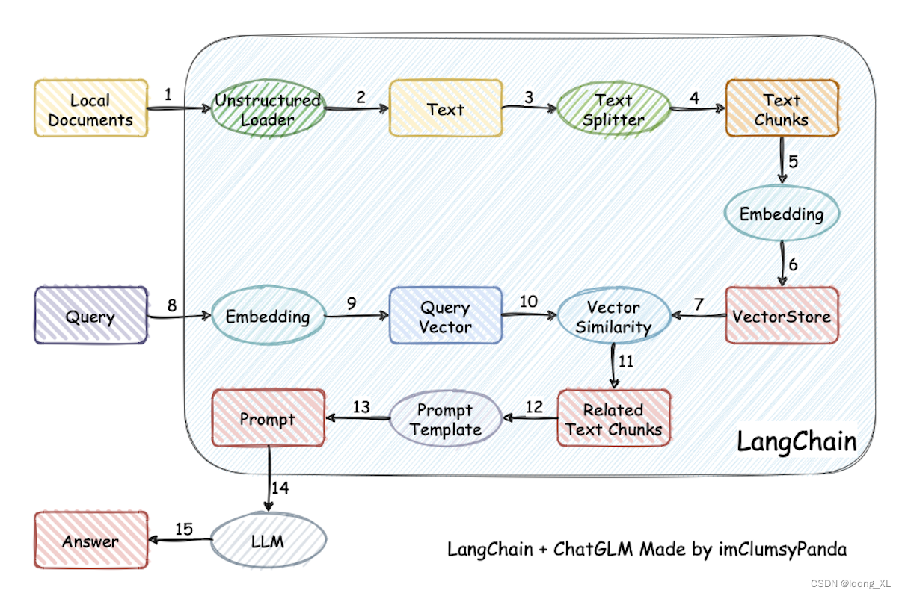

### 1.3.1 LangChain 的核心组件

本课程固定使用 LangChain 0.3.0，后续主要会用到以下模块：

- **模型与 Prompt**：统一不同模型的调用方式，组织输入消息，并解析模型输出。
- **文档与检索**：加载文档、切分文本、生成 Embedding，并连接向量库和 Retriever。
- **链（Chains）与 LCEL**：把 Prompt、模型、Retriever 等组件串成一条流程；后面会用它搭建检索问答链。
- **消息历史与 Memory**：保存对话消息或应用状态，让多轮调用能够延续上下文。
- **工具与智能体（Agents）**：把函数封装成工具，让模型根据任务决定是否调用，并通过 `AgentExecutor` 执行多步循环。
- **回调（Callbacks）**：获取运行过程中的事件，用于流式输出、日志记录和调试。

这些模块按需组合，不是每个应用都要全部使用。

### 1.3.2 版本说明：本课程使用 0.3.0

LangChain 更新很快，官网目前以 **LangChain 1.x** 为主。1.x 将 `create_agent` 作为创建 Agent 的标准入口，其底层运行在 LangGraph 上；旧版的 Chains、Retrievers 和索引接口则移入 `langchain-classic`，详见[官方迁移说明](https://docs.langchain.com/oss/python/migrate/langchain-v1)。本仓库的 `requirements.txt` 固定为 **`langchain==0.3.0`**，示例仍按 0.3 的 API 和包结构编写。

| 用途 | 本课程（0.3.0） | LangChain 1.x |
| :-- | :-- | :-- |
| 编排固定流程 | LCEL / Runnable | LCEL / Runnable 仍在 `langchain-core` 中 |
| 创建 Agent | `AgentExecutor` 等旧版接口 | `create_agent`，底层使用 LangGraph |
| 旧版 Chains 和 Retrievers | 位于 `langchain` 包中 | 多数移至 `langchain-classic` |

在运行本教程时，请在 **`llm-universe` 环境**中使用课程固定的 0.3.0，不要直接照搬 1.x 文档中的代码。想试 1.x，可以另建一个 conda 或 venv 环境，并查看 [官方文档](https://docs.langchain.com/oss/python/langchain/overview)。

学习 0.3 时，重点是用 **LCEL** 组织 Chain，以及流式输出、检索链、对话历史和基础工具调用。升级到 1.x 后，这些思路仍可沿用，但部分导入路径和 API 已经改变。

### 1.3.3 LangChain 的生态

- **LangChain Core**：提供消息、Prompt、Runnable、工具等基础接口，以及 LCEL。
- **LangChain Community 与各厂商集成包**：连接模型、文档加载器、向量数据库和其他外部服务。例如，OpenAI 的集成位于 `langchain-openai`。
- **LangGraph**：面向有状态、长时间运行的 Agent，提供更底层的流程控制和持久化能力。LangChain 1.x 的 `create_agent` 就构建在它之上。
- **LangSmith**：用于跟踪运行过程、评测和调试 LLM 应用，也提供 Agent 部署服务。

旧项目中还可能见到 **LangServe** 和 **LangChain CLI**。LangServe 曾用于把 Runnable 发布为 REST API，但[已经停止维护](https://github.com/langchain-ai/langserve)，不建议新项目继续采用。

---

> 本章我们简单介绍了开发框架 LangChain，下一章我们将介绍开发 LLM 应用的整体流程。

## 1.4 大模型开发

我们将开发**以大语言模型为功能核心、通过大语言模型的强大理解能力和生成能力、结合特殊的数据或业务逻辑来提供独特功能的应用**称为**大模型开发**。开发大模型相关应用，其技术核心点虽然在大语言模型上，但一般通过调用 API 或开源模型来实现核心的理解与生成，通过 Prompt Enginnering 来实现大语言模型的控制，因此，虽然大模型是深度学习领域的集大成之作，大模型开发却更多是一个**工程问题**。

在大模型开发中，我们一般不会去大幅度改动模型，而是**将大模型作为一个调用工具，通过 Prompt Engineering、数据工程、业务逻辑分解等手段来充分发挥大模型能力，适配应用任务**，而不会将精力聚焦在优化模型本身上。因此，作为大模型开发的初学者，我们并不需要深研大模型内部原理，而更需要掌握使用大模型的实践技巧。

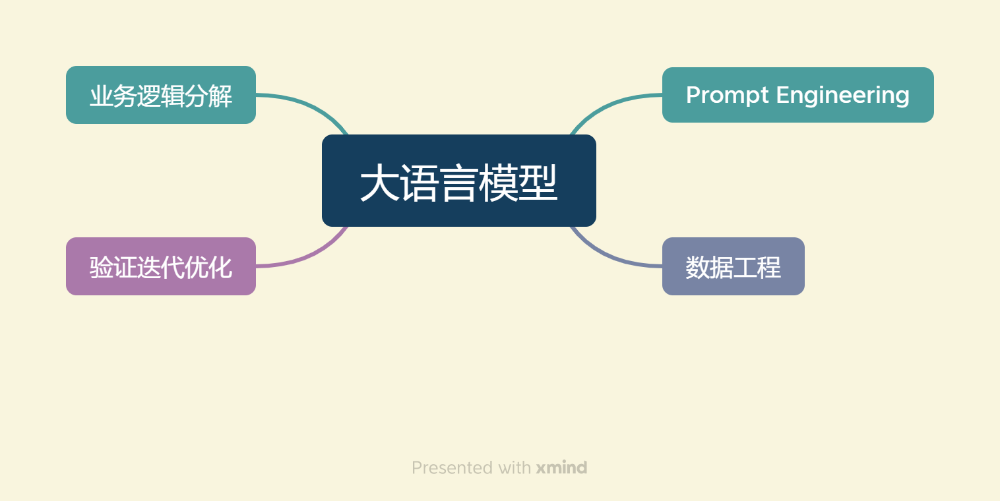

<div align='center'>大模型开发要素</div>

同时，以调用、发挥大模型为核心的大模型开发与传统的 AI 开发在**整体思路**上有着较大的不同。大语言模型的两个核心能力：`指令遵循`与`文本生成`提供了复杂业务逻辑的简单平替方案。

- `传统的 AI 开发`：首先需要将非常复杂的业务逻辑依次拆解，对于每一个子业务构造训练数据与验证数据，对于每一个子业务训练优化模型，最后形成完整的模型链路来解决整个业务逻辑。
- `大模型开发`：用 Prompt Engineering 来替代子模型的训练调优，通过 Prompt 链路组合来实现业务逻辑，用一个通用大模型 + 若干业务 Prompt 来解决任务，从而将传统的模型训练调优转变成了更简单、轻松、低成本的 Prompt 设计调优。

同时，在**评估思路**上，大模型开发与传统 AI 开发也有质的差异。

- `传统 AI 开发`：需要首先构造训练集、测试集、验证集，通过在训练集上训练模型、在测试集上调优模型、在验证集上最终验证模型效果来实现性能的评估。
- `大模型开发`：流程更为灵活和敏捷。从实际业务需求出发构造小批量验证集，设计合理 Prompt 来满足验证集效果。然后，将不断从业务逻辑中收集当下 Prompt 的 Bad Case，并将 Bad Case 加入到验证集中，针对性优化 Prompt，最后实现较好的泛化效果。


<div align = 'center'>传统 AI 评估</div>
<p>


<div align = 'center'>LLM 评估</div>
<p>

在本章中，我们将简述大模型开发的一般流程，并结合项目实际需求，逐步分析完成项目开发的工作和步骤。

### 1.4.1 大模型开发的一般流程

大模型开发大致可以拆成下面几步：

1. **确定目标**。先想清楚应用场景、目标用户和核心价值。个人或小团队宜先定最小目标，从 MVP（最小可行性产品）做起，再迭代。

2. **设计功能**。列出应用要提供的功能，以及每项功能的大致实现方法。业务边界越清楚，Prompt 越容易设计。个人或小团队可以先实现核心功能，再补充上下游流程。例如，个人知识库助手的核心是根据知识库回答问题；上传文档和纠正回答属于配套功能。

3. **搭建整体架构**。按功能把用户输入、模型、外部数据和输出接起来；是否需要数据库、检索或工具，取决于具体任务。本课程使用 LangChain 的 Chain、Tool 等抽象来组织这条链路。

4. **准备数据与索引**。如果应用需要私有知识，再收集和清洗数据。做向量检索时，可以使用 Chroma 这类向量库；常见流程是解析文档、分块、生成向量，并保存文本和元数据。不是所有大模型应用都需要向量数据库。

5. **Prompt Engineering**。Prompt 用来说明任务、提供上下文并约束输出格式。可以先准备一小批真实业务样例，再编写和调整初版 Prompt。

6. **验证迭代**。用真实业务样例测试边界情况，记录 Bad Case，再据此修改 Prompt、检索或工具链，直到效果基本稳定。

7. **前后端搭建**。核心功能稳定后，再开发页面和接口。本课程不展开前后端技术；个人开发者可以用 Gradio 或 Streamlit 搭建 Demo。

8. **体验优化**。上线后继续收集用户反馈和 Bad Case，据此调整系统。

### 1.4.2 知识库助手示例

下面以本课程的[知识库助手项目](https://github.com/logan-zou/Chat_with_Datawhale_langchain)为例，把前面的通用流程落到一个具体应用中。

#### 1.4.2.1 项目规划与需求分析

**项目目标**：构建一个基于个人知识库的问答助手。

**核心功能**：

- 导入 Markdown、PDF、TXT 等文档，建立知识库索引；
- 根据用户问题检索相关片段，再交给大模型生成回答；
- 支持流式显示、知识库选择和历史对话。

**技术选型**：

- **编排框架**：LangChain 0.3；
- **Embedding 模型**：OpenAI、智谱提供的 Embedding 模型或 [M3E](https://huggingface.co/moka-ai/m3e-base)；
- **向量库**：Chroma；
- **大模型**：通过课程封装的模型接口调用；
- **界面**：Gradio 或 Streamlit。

#### 1.4.2.2 实现流程

项目的数据流如下图所示（参考 [Langchain-Chatchat](https://github.com/chatchat-space/Langchain-Chatchat)）：

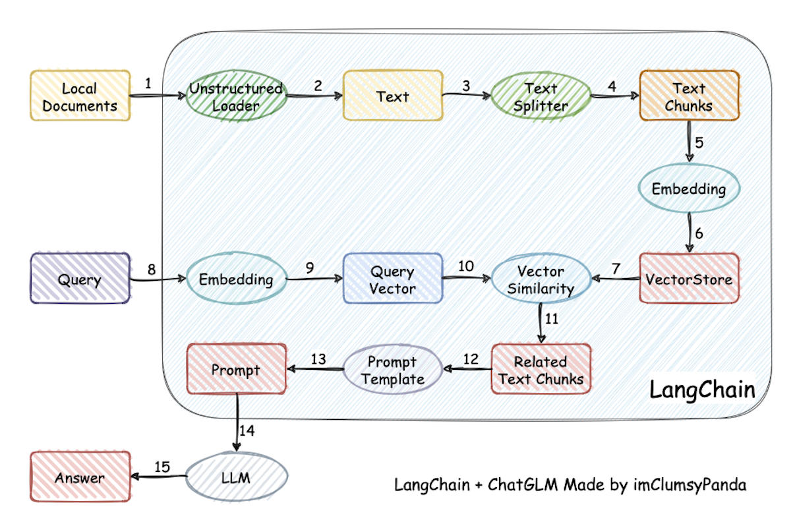

1. **建立知识库**

   读取用户提供的文档，完成解析、清洗和分块。每个文本块生成 Embedding 后写入 Chroma，同时保存来源、标题等元数据。Chroma 既可以只在内存中运行，也可以把数据保存到本地目录；本项目需要重复使用知识库时，应采用持久化存储。

2. **检索并生成回答**

   收到问题后，先生成问题向量，再从 Chroma 中取回最相关的若干文本块。应用把这些片段和问题一起放入 Prompt，交给大模型生成回答。这正是 §1.2 介绍的“检索—增强—生成”流程。

3. **处理对话与界面**

   流式输出负责让文字逐步显示；历史消息则用于多轮对话，两者是不同功能。界面还需要处理文档上传、知识库选择和历史记录展示。

4. **验证和迭代**

   准备一组有标准答案或参考材料的问题，分别检查检索结果和最终回答。出现 Bad Case 时，要先判断问题出在文档解析、分块、检索、Prompt 还是模型，再修改对应环节。

5. **部署和维护**

   上线前配置 API 密钥、访问权限和日志，测试异常输入与服务中断时的处理。上线后继续更新知识库，并关注回答质量、延迟和调用成本。

---

现在我们已经对大模型开发的一般流程有了初步了解，接下来我们将针对整个开发环境进行介绍，确保大家可以顺利的进行项目开发。
>
> - 如果大家是老手可以直接跳过本章后续内容，直接进入第二部分学习。
> - 后续两章主要针对没有合适开发环境的同学介绍两种开发环境的搭建，大家可以按需阅读。
>   - 第五章主要介绍`阿里云服务器的基本使用`、`通过 SSH 远程连接服务器`、`jupyter notebook 的使用`。
>   - 第六章节主要介绍了`GitHub CodeSpace`的使用，以及如何在`GitHub CodeSpace`中搭建开发环境。（首先确定是否具有可以流畅访问 GitHub 的网络环境，否则建议使用阿里云）
> - 如果大家手中已经有合适的开发机，可以直接跳到`7.环境配置`章节，开始配置开发环境。

## 1.5 阿里云服务器的基本使用

阿里云是全球领先的云计算服务提供商，为全球 200 多个国家和地区的数百万客户提供云计算、大数据、人工智能、安全、企业应用、数字娱乐等服务。阿里云的服务器性能稳定，价格低廉，是很多初学者的首选。尤其是阿里云的高校计划，可以免费领取云服务器，非常适合学生使用。对于新用户，阿里云也提供了免费试用的机会，可以免费使用云服务器一年。

### 1.5.1 高校计划

高校学生通用权益面向所有中国高校学生开放，具体包括中国大陆及港澳台地区专科、本科、硕士、博士、在职研究生等高等教育学籍在内的在校学生人群，在此基础上，阿里云合作高校学生可再享受 3 折专属权益。

申请链接：https://university.aliyun.com/mobile?clubTaskBiz=subTask..11337012..10212..&userCode=1h9ofupt

1.权益一：通过学生认证的中国高校学生，可领取 300 元无门槛优惠券。

2.权益二：通过学生认证的中国高校学生，且所在高校为阿里云合作高校，可在领取 300 元无门槛优惠券的基础上，再领取阿里云公共云产品（特殊商品除外）三折优惠，订单原价不超过 5000 元。

目前合作高校有：清华大学、北京大学、浙江大学、上海交通大学、中国科学技术大学、华南理工大学和香港科技大学（广州）。更多高校洽谈中，敬请期待！


点击图片中的立即领取，用自己实名认证的支付宝扫码登录校验即可。


用户是合作高校的教师（含博士后），且按照活动要求完成身份认证。

目前合作高校有：清华大学、北京大学、浙江大学、上海交通大学、中国科学技术大学、华南理工大学和香港科技大学（广州）。更多高校洽谈中，敬请期待！

- 阿里云全量公共云产品（特殊商品除外）5 折专属优惠，设置专属服务通道，为科研及教学加速。


注：最好在确认优惠券到账的情况下再去购买产品；优惠券信息在`用户中心-卡券管理-优惠券管理`查看。

https://developer.aliyun.com/plan/student

申请链接：https://free.aliyun.com/?crowd=personal
这里推荐大家申请`云服务器 ECS`，每月免费额度 280 元，3 个月有效期。大概配置如下：

- e 系列 2 核 2GB 或者 2 核 4GB（每月 200 元免费额度）；
- 公网流量每月 80 元免费额度（可用于抵扣 100GB 国内地域流量）
  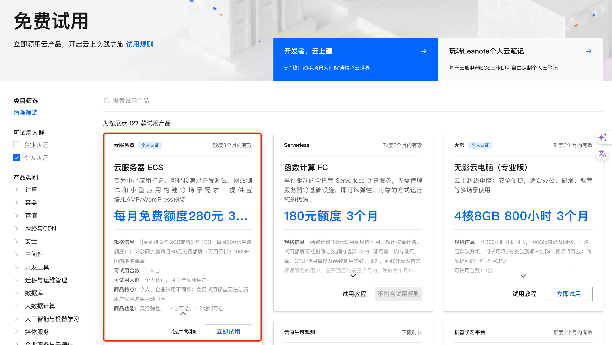

### 1.5.2 创建云服务器指引

这里以选择`云服务器 ECS`为例进行配置，选择最小配置就系统选择`Ubuntu`，
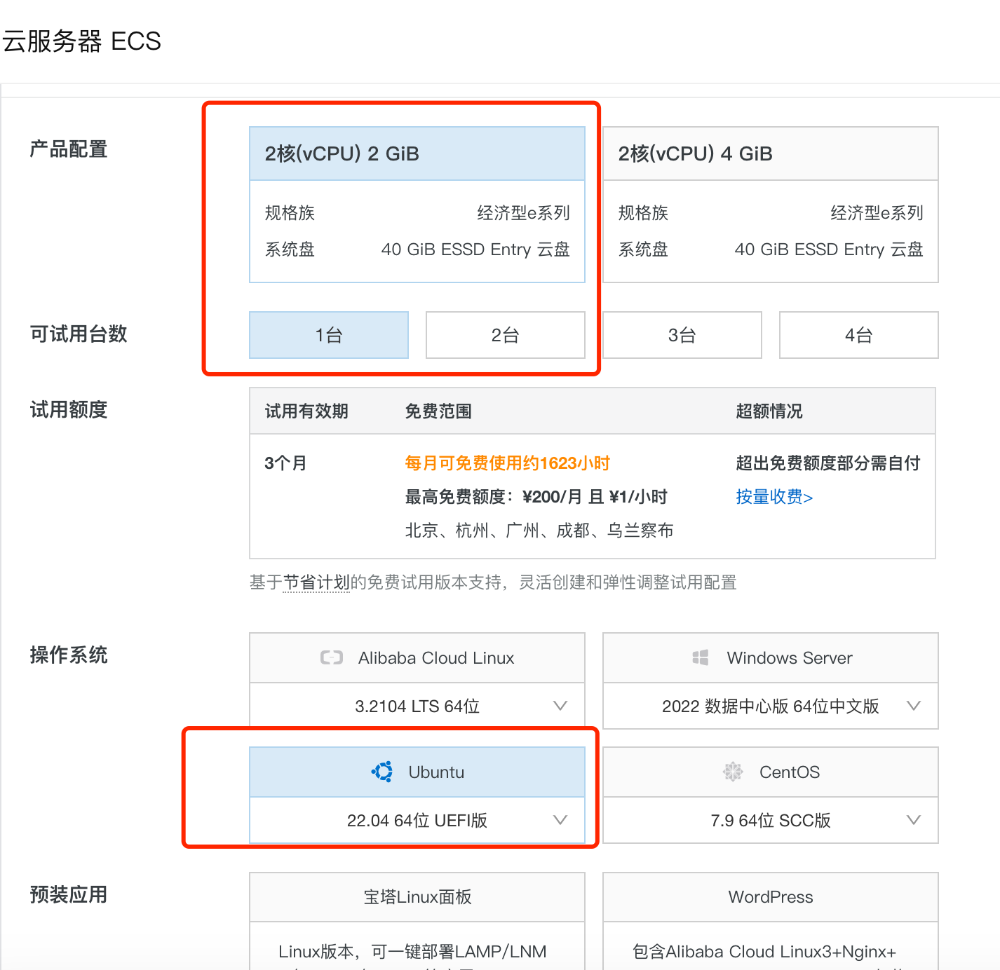
试用时，到期释放设置填写『自动释放实例』，这样到期后就不会产生费用。
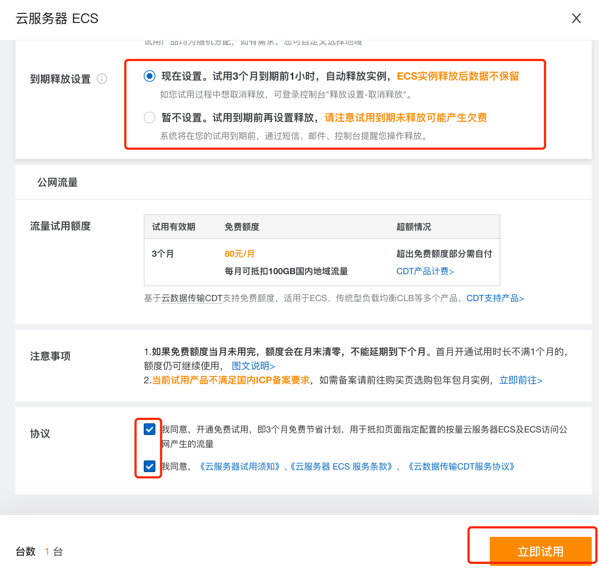

创建完成后点击已试用或者[链接](https://ecs.console.aliyun.com/home#)就可以看到我们刚刚创建的实例。
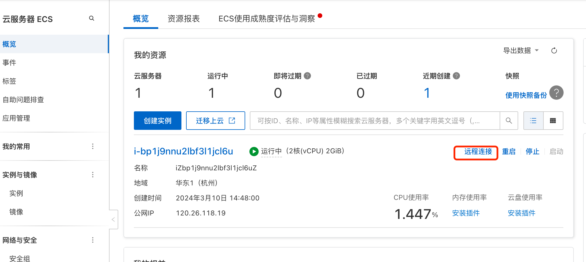
点击远程连接，点击立即登录。
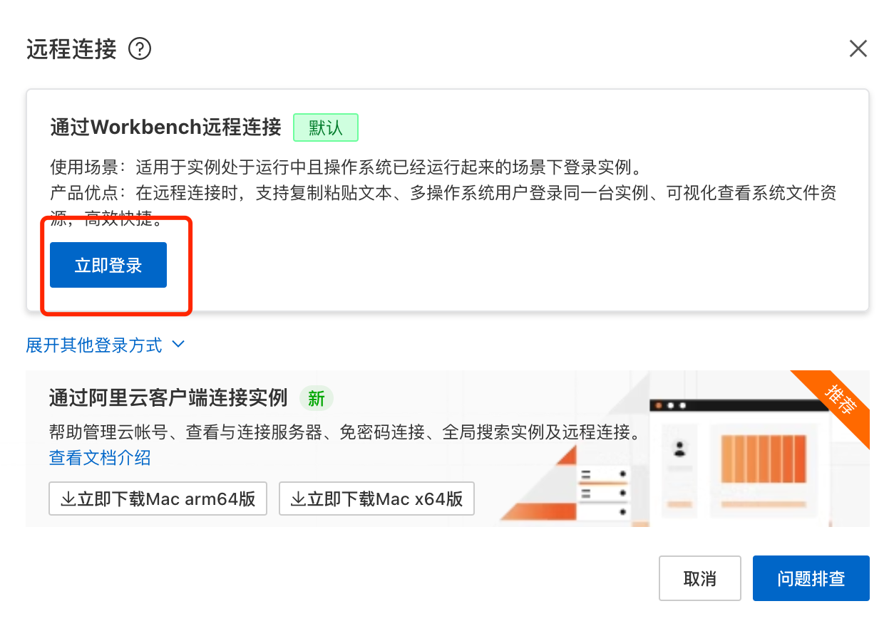
默认密码是 root；
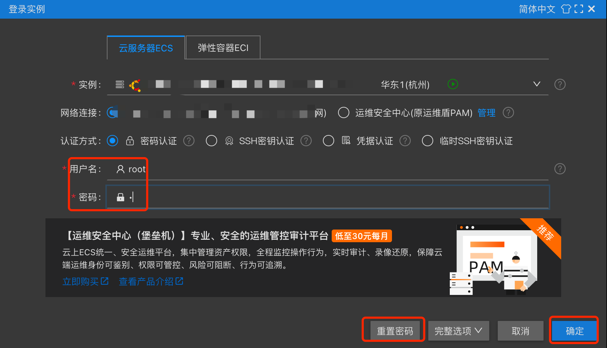
如果不允许登录请按照[链接](https://help.aliyun.com/zh/ecs/user-guide/use-the-password-can-t-login-the-linux-cloud-server-ecs-what-should-i-do)修改服务器配置。  
【简单处理方式：在云服务器管理控制台页面，点击‘远程连接’附近三点，选择重置实例密码。再次登录就可以啦。】
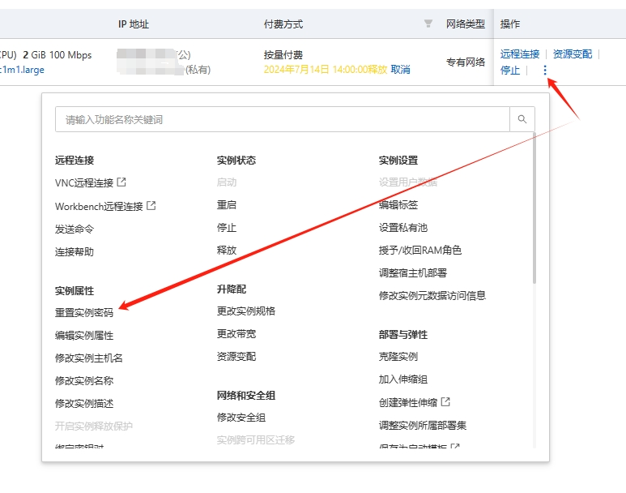

之后就可以进入环境进行学习啦！！！

### 1.5.3 VSCode 连接远程服务器

`Visual Studio Code（VSCode）`是微软提供的免费代码编辑器，支持 Windows、macOS 和 Linux，自带 Git、调试、补全和集成终端，也可以安装扩展。本课程用它连接远程服务器，在本地窗口中编辑远端文件、运行命令。

1. 安装 SSH 插件
   打开 VSCODE 的插件市场，搜索 SSH，找到`Remote - SSH` 插件并安装
   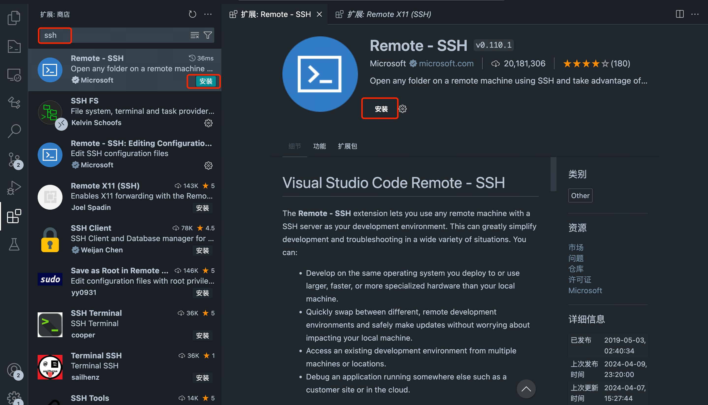

2. 获取服务器 IP
   打开阿里云服务器的[实例列表](https://ecs.console.aliyun.com/server/region/)
   找到我们需要连接的服务器的公网 IP 地址，并复制。
   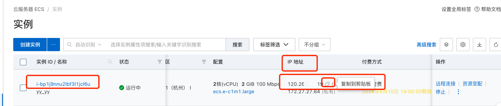
   打开可以连接的远程服务器的编辑器，这里以 VSCODE 为例。
3. 配置 SSH
   打开刚刚下好的`远程资源管理器`插件，添加服务器的 SSH，
   `ssh -p port username@ip`
   port 一般配置为 22,
   username 可以用 root 或者自定义的用户名
   IP 替换成服务器的 IP
   选择本地的 SSH 配置文件
   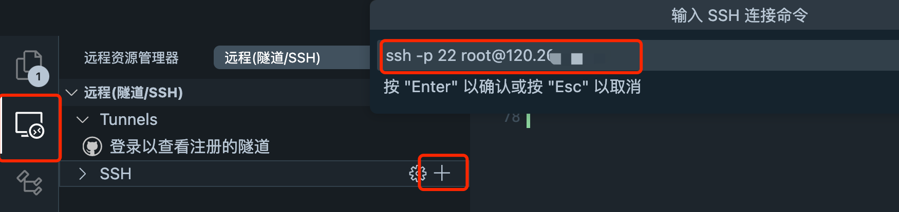
   点击右下角的链接，就可进入服务器
   
4. 连接
   之后我们连接时，可以继续点击左侧的`远程资源管理器`找到我们的服务器，右边有两个选项。

- 箭头是本窗口打开
- 左上角有加号的是新窗口打开
    <p align="center">
        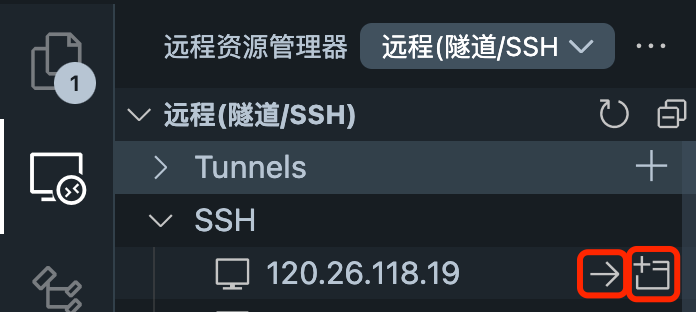
    </p>

5. 打开目录
   之后点击打开文件夹，输入需要的目录即可打开

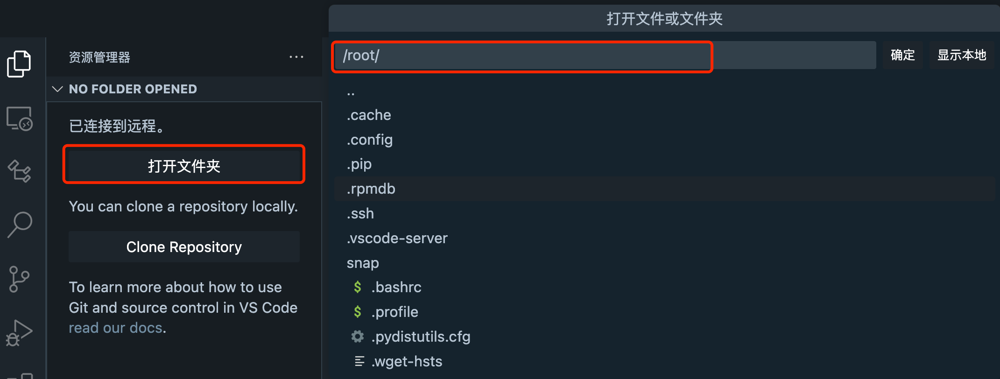

之后就可以进行愉快的编程啦！！！

### 1.5.4 Jupyter Notebook 使用

**Jupyter Notebook** 是一个开源的`交互式计算环境`，它允许用户创建和共享包含实时代码、方程、可视化和文本的文档。它的名字来源于它支持的三种核心编程语言：Julia、Python 和 R，这也是 "Ju-pyt-er" 的名称由来。Jupyter Notebook 编写的文件后缀为 `.ipynb`

Jupyter Notebook 的主要特点包括：

1. **交互式编程**：用户可以在单独的单元格中编写代码并执行，`立即看到代码运行结果`，这对于数据分析、机器学习、科学计算等领域非常有用。

2. **多语言支持**：虽然最初是为 Julia、Python 和 R 设计的，但 Jupyter 现在支持超过 40 种编程语言，通过使用相应的内核。

3. **丰富的展示功能**：Jupyter Notebook 支持 Markdown，允许用户添加格式化文本、图像、视频、HTML、LaTeX 等丰富的媒体内容，使得文档更加生动和信息丰富。

4. **数据可视化**：Jupyter Notebook 与众多数据可视化库（如 Matplotlib、Plotly、Bokeh 等）无缝集成，可以直接在 Notebook 中生成图表和可视化数据。

5. **易于共享**：Notebook 文件可以通过电子邮件、云服务或 Jupyter Notebook Viewer 等方式轻松共享，他人可以查看内容和运行代码，甚至可以留下评论。

6. **扩展性**：Jupyter 有大量的扩展插件，可以增强其功能，如交互式小部件、代码自动完成、主题更换等。

7. **科学计算工具集成**：Jupyter Notebook 可以与许多科学计算和数据分析工具集成，如 NumPy、Pandas、SciPy 等 Python 库，使得数据处理和分析变得更加方便。

Jupyter Notebook 是数据科学家、研究人员、教育工作者和学生等广泛使用的工具，它促进了开放科学和教育的发展，使得人们可以更容易地分享和复现研究结果。

本教程使用 Jupyter Notebook 来进行代码编写和运行，方便我们进行代码的编写和调试。

在 `VSCode` 中编辑和运行 `.ipynb`，需要安装微软的 Jupyter 扩展；Python 代码还需要选择可用的 Python 内核。

Notebook 文档由一系列的单元格组成，主要由以下两种形式。

- **代码单元格**：在代码单元格中输入代码并按 `Shift + Enter` 可以运行该单元格中的代码，并在下方显示输出结果。
- **Markdown 单元格**：使用 `Markdown` 语法在单元格中编写文本。可以创建标题、列表、链接、格式化文本等，并使用 `Ctrl + Enter` 来渲染当前 Markdown 单元格。

通常我们使用代码单元格来进行代码编写，并及时运行查看结果。并使用以下是用的快捷键来提升效率：

**单元格编辑**

- `Enter`: 进入编辑模式。
- `Esc`: 退出编辑模式。

**单元格操作**

- `A`: 在当前单元格上方插入一个新的单元格。
- `B`: 在当前单元格下方插入一个新的单元格。
- `D` (两次按下): 删除当前单元格。
- `Z`: 撤销删除操作。
- `C`: 复制当前单元格。
- `V`: 粘贴之前复制的单元格。
- `X`: 剪切当前单元格。
- `Y`: 将当前单元格转换为代码单元格。
- `M`: 将当前单元格转换为 Markdown 单元格。
- `Shift + M`: 切换单元格的 Markdown 渲染状态。

**代码执行和调试**

- `Shift + Enter`: 运行当前单元格，并跳转到下一个单元格。
- `Ctrl + Enter`: 运行当前单元格，但不跳转到下一个单元格。
- `Alt + Enter`: 运行当前单元格，并在下方插入一个新的单元格。
- `Esc`: 进入命令模式。
- `Enter`: 进入编辑模式。
- `Ctrl + Shift + -`: 分割当前单元格为两个单元格。
- `Ctrl + Shift + P`: 打开命令面板，可以搜索和执行各种命令。

**导航和窗口管理**

- `Up` / `Down` 或 `K` / `J`: 在单元格之间上下移动。
- `Home` / `End`: 跳转到 Notebook 的开始或结束。
- `Ctrl + Home` / `Ctrl + End`: 跳转到当前 Notebook 的第一个或最后一个单元格。
- `Tab`: 在 Notebook 视图中切换到下一个面板（例如，从编辑器到输出或元数据面板）。
- `Shift + Tab`: 在 Notebook 视图中切换到上一个面板。

**其他有用的快捷键**

- `H`: 显示或隐藏 Notebook 的侧边栏。
- `M`: 将当前单元格转换为 Markdown 单元格。
- `Y`: 将当前单元格转换为代码单元格。

---

> 目前我们已经拥有了开发的必备基础，接下来可以直接去`7.环境配置`进行环境配置。

## 1.6 GitHub Codespaces 概述&环境配置（选修）

> **首先确定是否具有可以流畅访问 GitHub 的网络环境** > **否则仍建议使用阿里云**

### 1.6.1 创建第一个 codespace

代码空间是托管在云中的开发环境。 可通过将配置文件提交到存储库（通常称为“配置即代码”）来为 GitHub Codespaces 自定义项目，这将为项目的所有用户创建可重复的 codespace 配置。 有关详细信息，请参阅“[开发容器简介](https://docs.github.com/zh/codespaces/setting-up-your-project-for-codespaces/adding-a-dev-container-configuration/introduction-to-dev-containers)”。
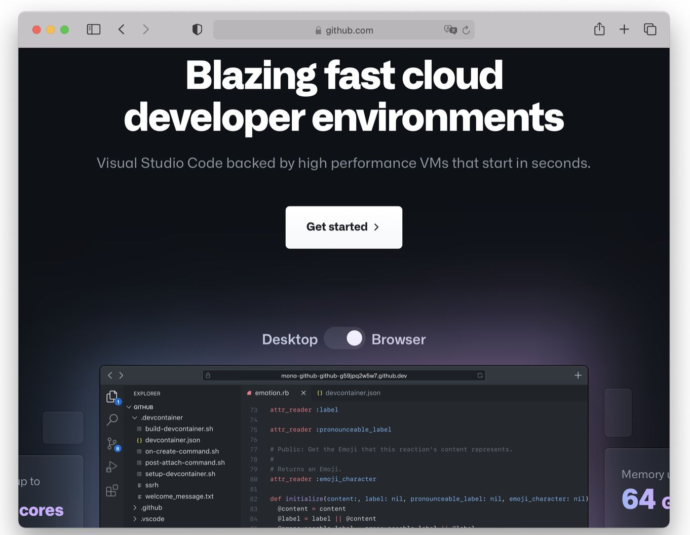

[官方文档](https://docs.github.com/en/codespaces/overview)

1. 打开网址链接：https://github.com/features/codespaces
2. 登录你的 GitHub 账户
3. 点击图示 **Your repositories**
   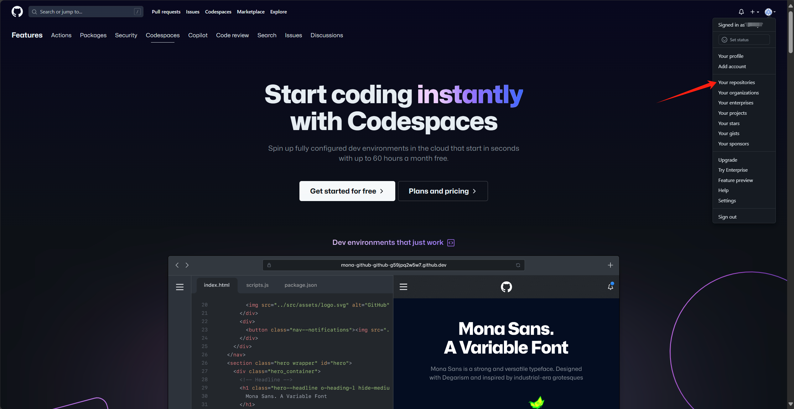
4. 进入自己的存储库列表后，点击图示 **New**，新建一个存储库
   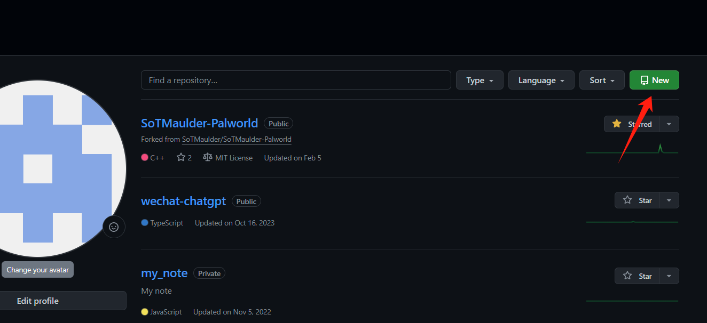
5. 这里根据自己需要设置即可，为方便和安全起见 **Add a README file** 建议勾上，同时选择 **Private**（因为课程中用到 API key，注意保护隐私），设置完成后点击 **Create repository**
   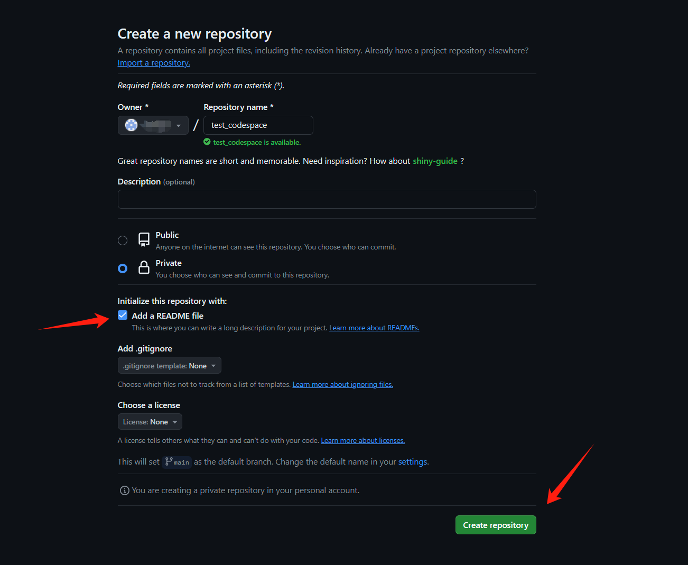
6. 创建好存储库后，点击 **code** 选择 **Codespaces**, 点击图示 **Create codespace on main**
   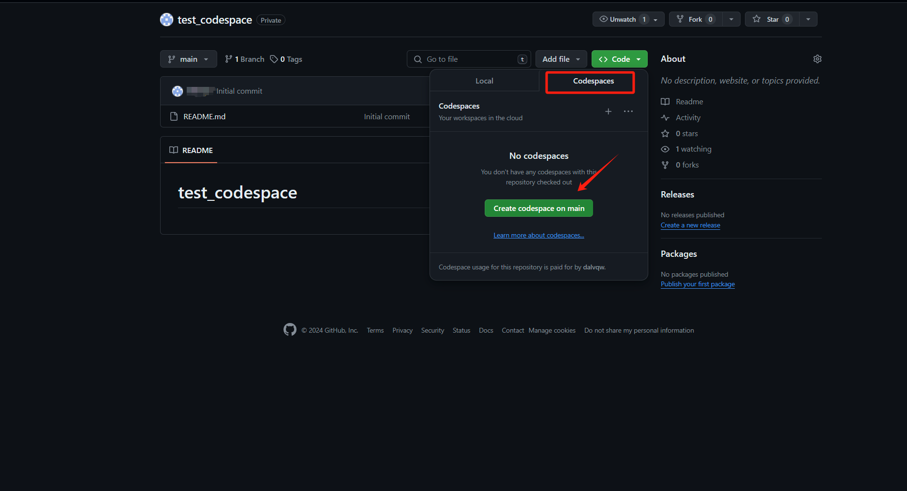
7. 等待一段时间后会出现如下界面，接下来操作与 VSCode 相同，可根据需要安装插件调整设置
   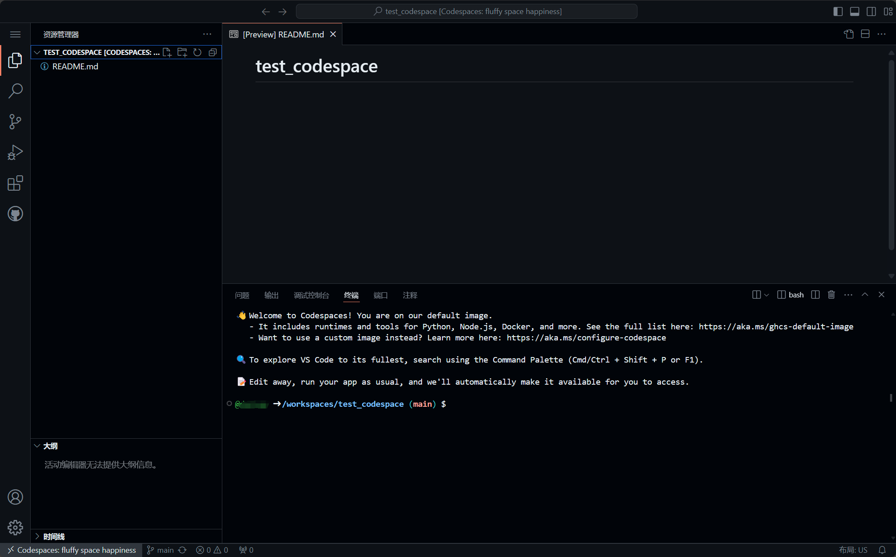

参照`7.环境配置`中`1.2 通用环境配置`配置环境即可，可以跳过前两步。

> 由于每个存储库都可以设置一个独立的 codespace，所以这里我们不需要安装 conda 环境。且因为 GitHub 服务器在国外，无需配置国内镜像源。

参照`7.环境配置`中`二、VSCode 配置 Python 环境
`配置环境即可

> 注意：第一次安装完所有配置后，需要重启一下 codespace

### 1.6.2 本地 VSCode 连接 Codespace（非必需）

1. 打开 VSCode，搜索 codespace 安装插件
   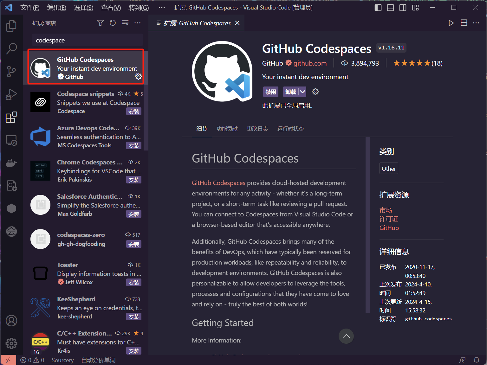
2. 在 VSCode 的活动栏中，单击**远程资源管理器**图标
   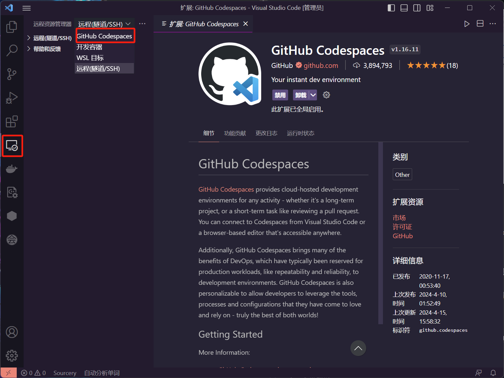
3. 登录 GitHub，根据提示登录即可
   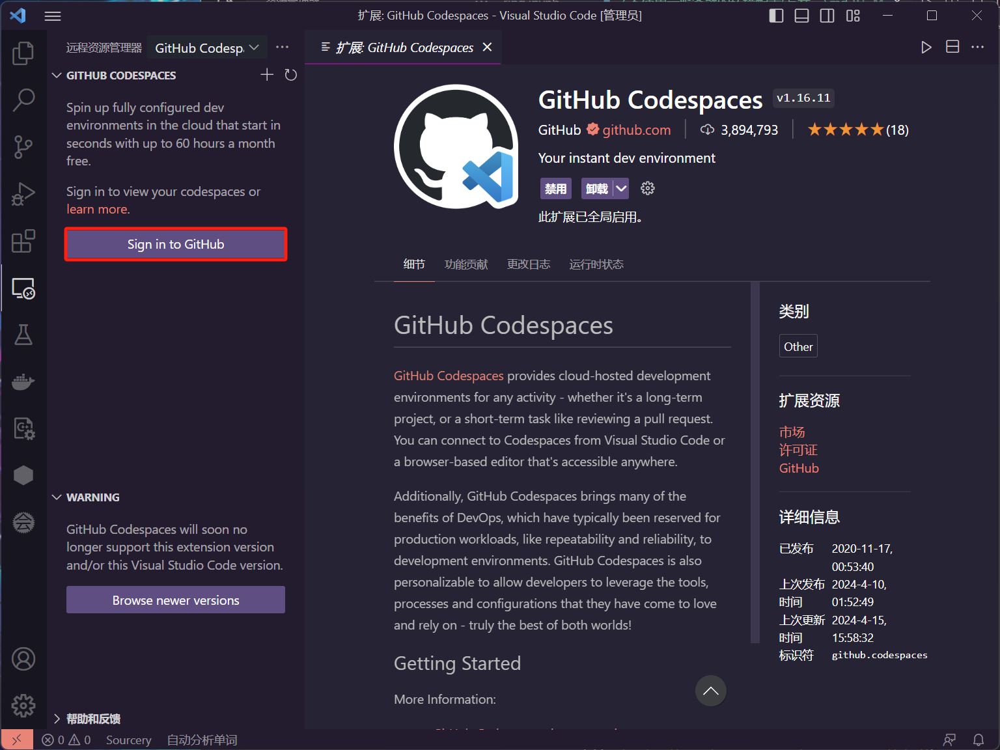
4. 可以看到这里有我们刚才创建的 codespace，单击红框连接图标
   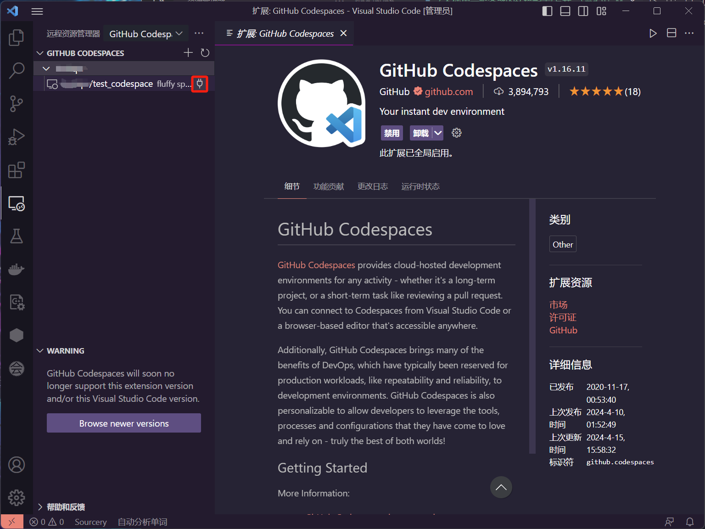
5. 成功连接到了 codespace
   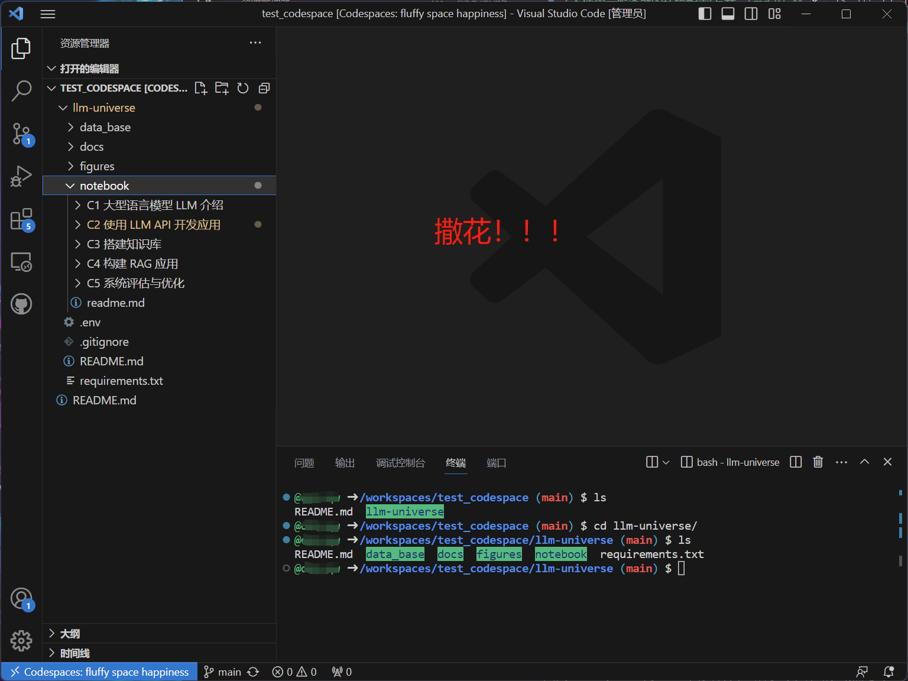
6. [VSCode 官方配置文档](https://docs.github.com/en/codespaces/developing-in-a-codespace/using-github-codespaces-in-visual-studio-code)

> 注意

1. 网页关闭后，找到刚才新建的存储库，点击红框框选内容即可重新进入 codespace
   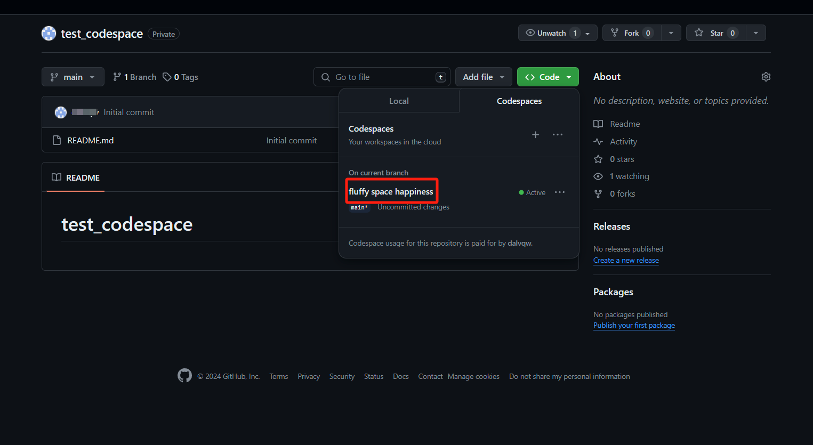
2. 免费额度
   找到 GitHub 的账户设置后，可以在**Plans and usage**中看到剩余的免费额度
   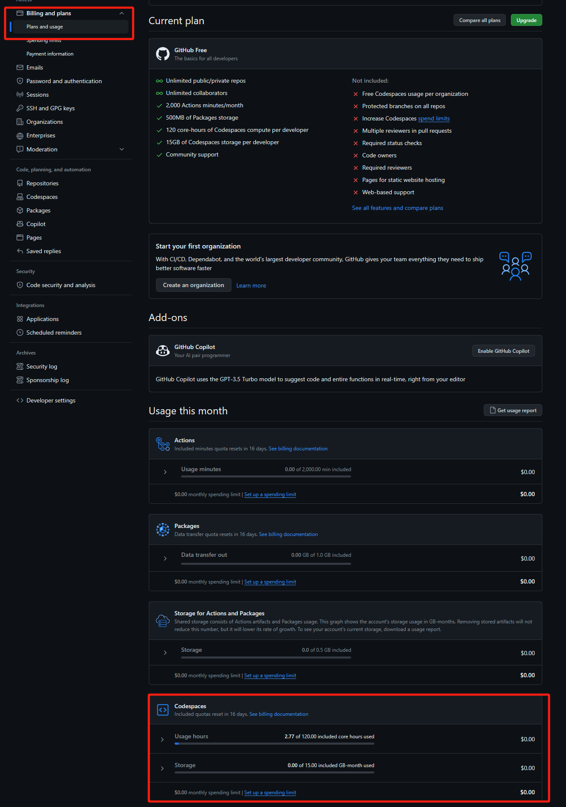
3. codespace 设置，挂起时间建议调整（时间过长会浪费额度）
   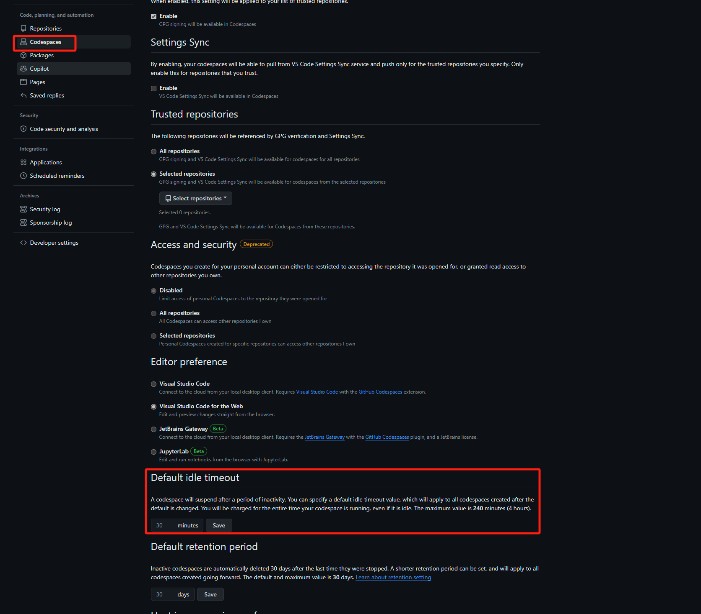
4. 因为 codespace 可以通过网页访问，所以最关键的当然是可以**随身携带平板访问网页进行编程学习**

---

> 目前我们已经拥有了开发的必备基础，下一章我们将对所需要进行环境配置进行详细介绍。

## 1.7 环境配置

本章主要提供一些必要的环境配置指南，包括代码环境配置、VSCODE 代码编辑器的 Python 环境配置，以及一些使用到的其他资源配置。

这里我们详细介绍了代码环境配置的每一步骤，分为基础环境配置和通用环境配置两部分，以满足不同用户和环境的需求。

- **基础环境配置**部分：适用于环境配置**初学者**或**新的服务器环境（如阿里云）**。这部分介绍了如何生成 SSH key 并添加到 GitHub，以及在安装和初始化 conda 环境。

- **通用环境配置**部分：适用于**有一定经验的用户**、**已有环境基础**的本地安装或**完全独立的环境（如 GitHub Codespace）**。这部分介绍了如何新建和激活 conda 虚拟环境，克隆项目仓库，切换到项目目录，以及安装所需的 Python 包。为了加速 Python 包的安装，我们还提供了一些国内镜像源。_对于完全独立的环境，可以跳过前两步关于虚拟环境（conda）配置的步骤_。

### 1.7.1 基础环境配置(配置 git 和 conda)

1. 生成 ssh key
   `ssh-keygen -t rsa -C "youremail@example.com"`
2. 将公钥添加到 github
   `cat ~/.ssh/id_rsa.pub`
   复制输出内容，打开 github，点击右上角头像，选择 `settings` -> `SSH and GPG keys` -> `New SSH key`，将复制的内容粘贴到 key 中，点击 `Add SSH key`。
   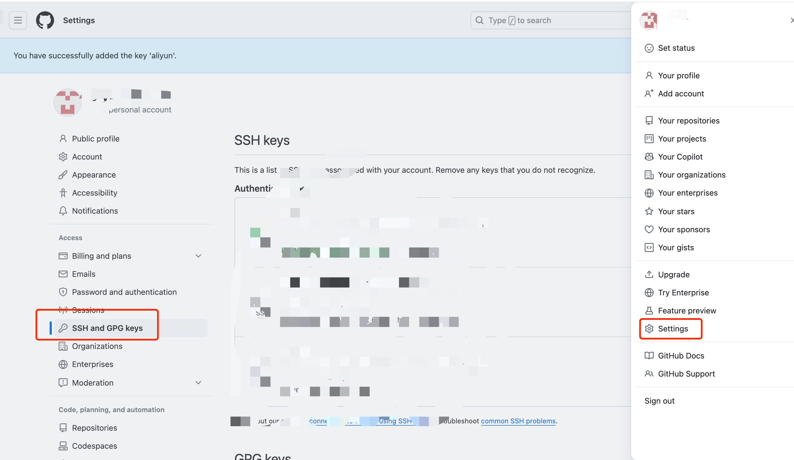

3. 安装 conda 环境

   1. linux 环境（通常采用 linux 环境）

      1. 安装：

         ```shell
         mkdir -p ~/miniconda3
         wget https://repo.anaconda.com/miniconda/Miniconda3-latest-Linux-x86_64.sh -O ~/miniconda3/miniconda.sh
         bash ~/miniconda3/miniconda.sh -b -u -p ~/miniconda3
         rm -rf ~/miniconda3/miniconda.sh
         ```

      2. 初始化：

         ```shell
         ~/miniconda3/bin/conda init bash
         ~/miniconda3/bin/conda init zsh
         ```

      3. 新建终端，检查 conda 是否安装成功 `conda --version`

   2. macOS 环境

      1. 安装

         ```shell
         mkdir -p ~/miniconda3
         curl https://repo.anaconda.com/miniconda/Miniconda3-latest-MacOSX-arm64.sh -o ~/miniconda3/miniconda.sh
         # intel 芯片
         # curl https://repo.anaconda.com/miniconda/Miniconda3-latest-MacOSX-x86_64.sh -o ~/miniconda3/miniconda.sh
         bash ~/miniconda3/miniconda.sh -b -u -p ~/miniconda3
         rm -rf ~/miniconda3/miniconda.sh
         ```

      2. 初始化：

         ```shell
         ~/miniconda3/bin/conda init bash
         ~/miniconda3/bin/conda init zsh
         ```

      3. 新建终端，检查 conda 是否安装成功 `conda --version`

   3. windows 环境
      1. 下载：`curl https://repo.anaconda.com/miniconda/Miniconda3-latest-Windows-x86_64.exe -o miniconda.exe`
      2. 安装：点击下载好的`miniconda.exe`，安装指引进行安装
      3. 打开菜单中的 Anaconda Prompt，检查 conda 是否安装成功`conda --version`
      4. 删除安装包：`del miniconda.exe`
   4. 之后请参照下面的`通用环境配置`部分进行后续配置

### 1.7.2 通用环境配置

1. 新建虚拟环境
   `conda create -n llm-universe python=3.10`
2. 激活虚拟环境
   `conda activate llm-universe`
3. 在希望存储项目的路径下克隆当前仓库
   `git clone git@github.com:datawhalechina/llm-universe.git`
   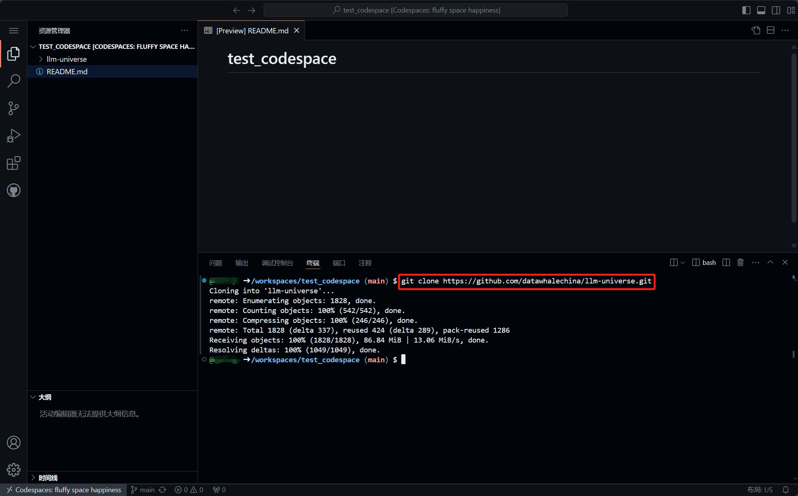
4. 将目录切换到 llm-universe
   `cd llm-universe`
   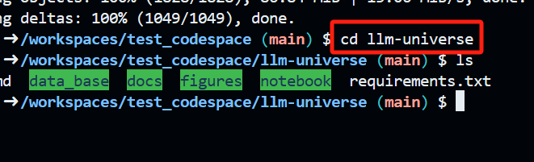
5. 安装所需的包
   `pip install -r requirements.txt`
   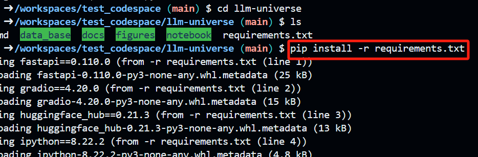
   通常可以通过清华源加速安装
   `pip install -r requirements.txt -i https://pypi.tuna.tsinghua.edu.cn/simple`

> 这里列出了常用的国内镜像源，镜像源不太稳定时，大家可以按需切换：
> 清华：https://pypi.tuna.tsinghua.edu.cn/simple/
> 阿里云：http://mirrors.aliyun.com/pypi/simple/
> 中国科技大学：https://pypi.mirrors.ustc.edu.cn/simple/
> 华中科技大学：http://pypi.hustunique.com/simple/
> 上海交通大学：https://mirror.sjtu.edu.cn/pypi/web/simple/
> 豆瓣：http://pypi.douban.com/simple

### 1.7.3 VSCode 配置 Python 环境

1. 安装 Python 插件

   本教程基于 Python 语言开发， 为了更好的开发体验，我们需要安装 Python 插件。

   在插件市场中搜索`Python`，找到`Python`插件并安装。
   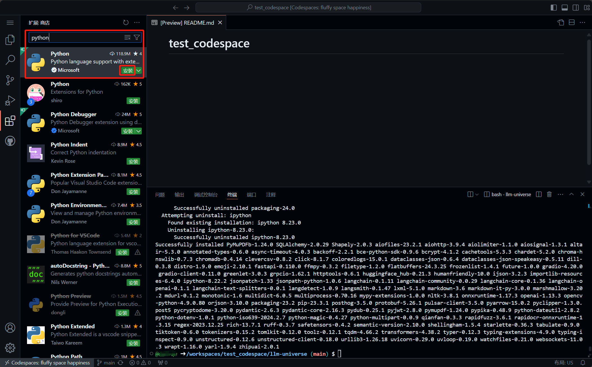
   这时当我们执行 Python 代码时，就会自动识别我们的 Python 环境，并提供代码补全等功能，方便我们进行开发。

2. 安装 Jupyter 插件
   本教程中，我们使用 Jupyter Notebook 进行开发，所以需要安装 Jupyter 插件。
   在插件市场中搜索`Jupyter`，找到`Jupyter`插件并安装。
   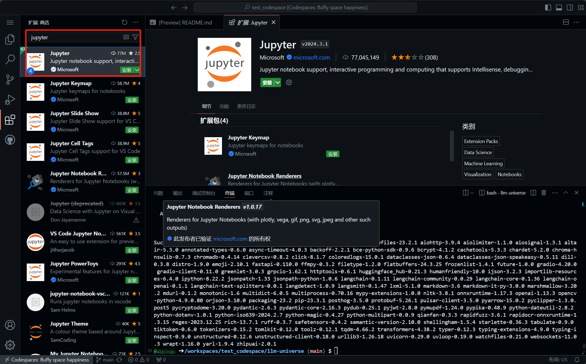

3. 为 Jupyter Notebook 配置 Python 环境

   1. 打开一个 Jupyter Notebook
   2. 点击右上角的 `选择 Python 解释器（显示内容会根据选择环境的名称变化）`，进行当前 Jupyter Notebook 的 Python 环境的选择。
      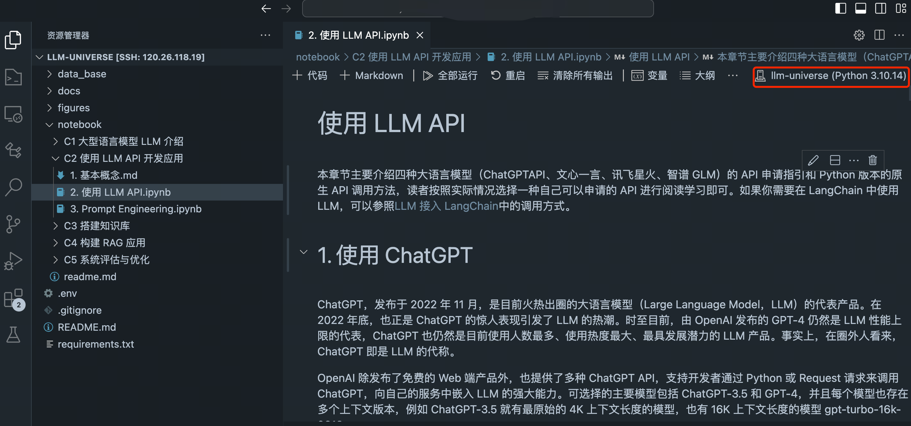
   3. 点击`选择 Python` 后进入环境列表，并选择我们配置好的环境 `llm-universe`。
      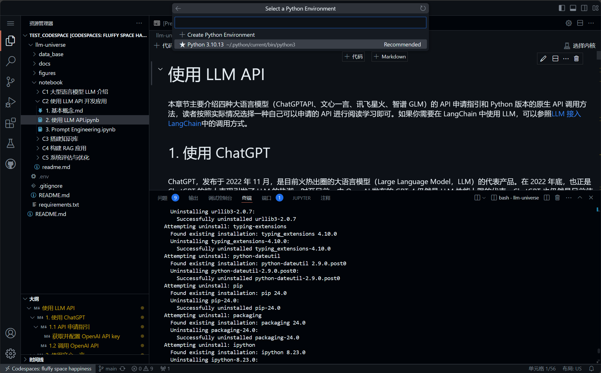

   之后我们就可以在 Jupyter Notebook 中使用我们的 Python 环境进行开发了。
