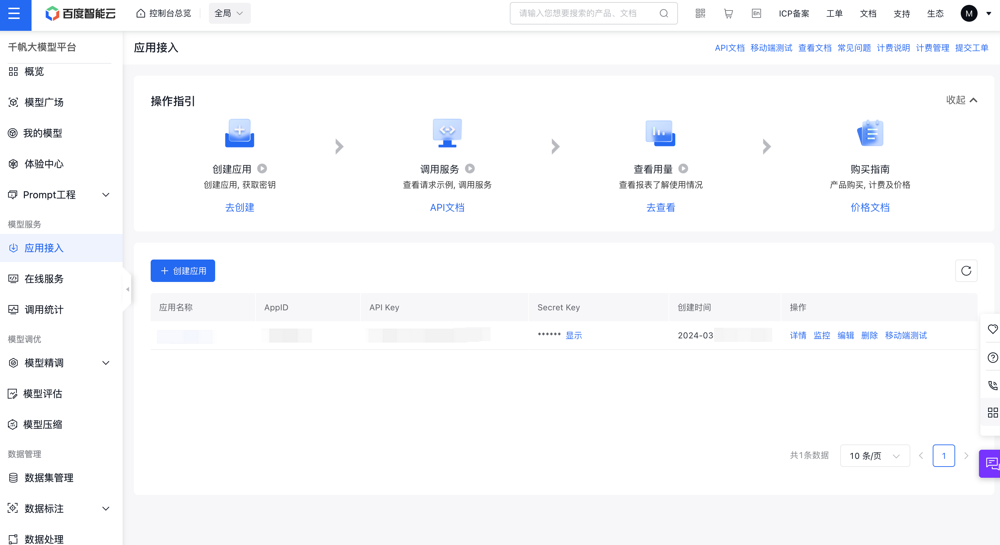
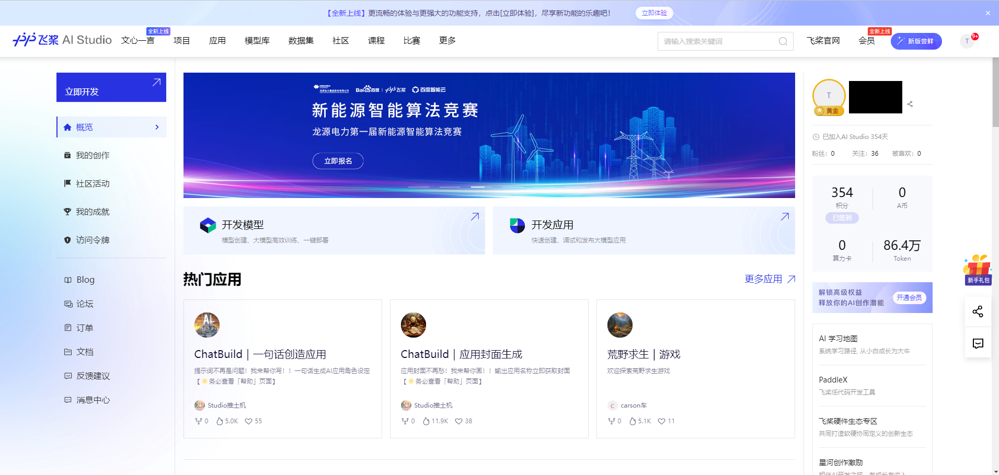
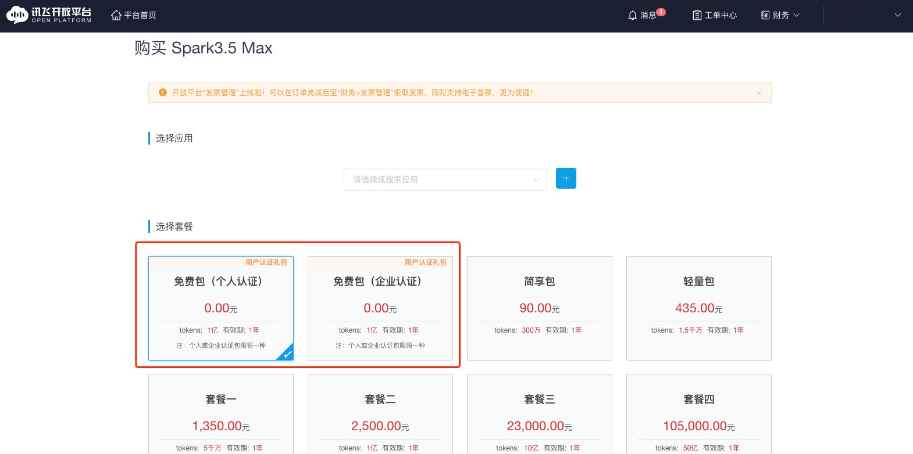
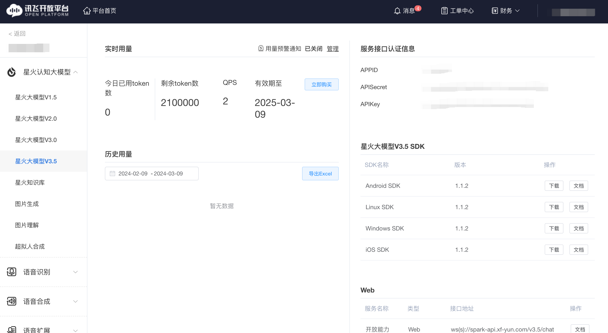

# 使用 LLM API

**注：本文对应源代码在[2. 使用 LLM API.ipynb](https://github.com/datawhalechina/llm-universe/blob/main/notebook/C2%20%E4%BD%BF%E7%94%A8%20LLM%20API%20%E5%BC%80%E5%8F%91%E5%BA%94%E7%94%A8/2.%20%E4%BD%BF%E7%94%A8%20LLM%20API.ipynb)，如需复现可下载运行源代码。**

本章节主要介绍四种大语言模型（ChatGPTAPI、文心一言、讯飞星火、智谱 GLM）的 API 申请指引和 Python 版本的原生 API 调用方法，读者按照实际情况选择一种自己可以申请的 API 进行阅读学习即可。如果你需要在 LangChain 中使用 LLM，可以参照[LLM 接入 LangChain](C4/1.LLM接入LangChain.md)中的调用方式。

* ChatGPT：推荐可科学上网的读者使用；
* 文心一言：当前无赠送新用户 tokens 的活动，推荐已有文心 tokens 额度用户和付费用户使用；
* 讯飞星火：新用户赠送 tokens，推荐免费用户使用；
* 智谱 GLM：新用户赠送 tokens，推荐免费用户使用。


## 1. 使用 ChatGPT

ChatGPT，发布于 2022 年 11 月，是目前火热出圈的大语言模型（Large Language Model，LLM）的代表产品。在 2022 年底，也正是 ChatGPT 的惊人表现引发了 LLM 的热潮。时至目前，由 OpenAI 发布的 GPT-4 仍然是 LLM 性能上限的代表，ChatGPT 也仍然是目前使用人数最多、使用热度最大、最具发展潜力的 LLM 产品。事实上，在圈外人看来，ChatGPT 即是 LLM 的代称。

OpenAI 除发布了免费的 Web 端产品外，也提供了多种 ChatGPT API，支持开发者通过 Python 或 Request 请求来调用 ChatGPT，向自己的服务中嵌入 LLM 的强大能力。可选择的主要模型包括 ChatGPT-3.5 和 GPT-4，并且每个模型也存在多个上下文版本，例如 ChatGPT-3.5 就有最原始的 4K 上下文长度的模型，也有 16K 上下文长度的模型 gpt-turbo-16k-0613。

### 1.1 API 申请指引

#### 获取并配置 OpenAI API key

OpenAI API 调用服务是付费的，每一个开发者都需要首先获取并配置 OpenAI API key，才能在自己构建的应用中访问 ChatGPT。我们将在这部分简述如何获取并配置 OpenAI API key。

在获取 OpenAI API key 之前我们需要在[OpenAI 官网](https://openai.com/)注册一个账号。这里假设我们已经有了 OpenAI 账号，在[OpenAI 官网](https://openai.com/)登录，登录后如下图所示：


我们选择 `API`，然后点击左侧边栏的 `API keys`，如下图所示：


点击 `Create new secret key` 按钮创建 OpenAI API key ，我们将创建好的 OpenAI API key 复制以此形式 `OPENAI_API_KEY="sk-..."` 保存到 `.env` 文件中，并将 `.env` 文件保存在项目根目录下。

下面是读取 `.env` 文件的代码：


```python
import os
from dotenv import load_dotenv, find_dotenv

# 读取本地/项目的环境变量。

# find_dotenv() 寻找并定位 .env 文件的路径
# load_dotenv() 读取该 .env 文件，并将其中的环境变量加载到当前的运行环境中  
# 如果你设置的是全局的环境变量，这行代码则没有任何作用。
_ = load_dotenv(find_dotenv())

# 如果你需要通过代理端口访问，还需要做如下配置
os.environ['HTTPS_PROXY'] = 'http://127.0.0.1:7890'
os.environ["HTTP_PROXY"] = 'http://127.0.0.1:7890'
```

### 1.2 调用 OpenAI API

调用 ChatGPT 需要使用 [ChatCompletion API](https://platform.openai.com/docs/api-reference/chat)，该 API 提供了 ChatGPT 系列模型的调用，包括 ChatGPT-3.5，GPT-4 等。

ChatCompletion API 调用方法如下：


```python
from openai import OpenAI

client = OpenAI(
    # This is the default and can be omitted
    api_key=os.environ.get("OPENAI_API_KEY"),
)

# 导入所需库
# 注意，此处我们假设你已根据上文配置了 OpenAI API Key，如没有将访问失败
completion = client.chat.completions.create(
    # 调用模型：ChatGPT-3.5
    model="gpt-3.5-turbo",
    # messages 是对话列表
    messages=[
        {"role": "system", "content": "You are a helpful assistant."},
        {"role": "user", "content": "Hello!"}
    ]
)
```

调用该 API 会返回一个 ChatCompletion 对象，其中包括了回答文本、创建时间、id 等属性。我们一般需要的是回答文本，也就是回答对象中的 content 信息。


```python
completion
```


    ChatCompletion(id='chatcmpl-9FA5aO72SD9X0XTpc1HCNZkSFCf7C', choices=[Choice(finish_reason='stop', index=0, logprobs=None, message=ChatCompletionMessage(content='Hello! How can I assist you today?', role='assistant', function_call=None, tool_calls=None))], created=1713400730, model='gpt-3.5-turbo-0125', object='chat.completion', system_fingerprint='fp_c2295e73ad', usage=CompletionUsage(completion_tokens=9, prompt_tokens=19, total_tokens=28))


```python
print(completion.choices[0].message.content)
```

    Hello! How can I assist you today?


此处我们详细介绍调用 API 常会用到的几个参数：

    · model，即调用的模型，一般取值包括“gpt-3.5-turbo”（ChatGPT-3.5）、“gpt-3.5-turbo-16k-0613”（ChatGPT-3.5 16K 版本）、“gpt-4”（ChatGPT-4）。注意，不同模型的成本是不一样的。

    · messages，即我们的 prompt。ChatCompletion 的 messages 需要传入一个列表，列表中包括多个不同角色的 prompt。我们可以选择的角色一般包括 system：即前文中提到的 system prompt；user：用户输入的 prompt；assistant：助手，一般是模型历史回复，作为提供给模型的参考内容。

    · temperature，温度。即前文中提到的 Temperature 系数。

    · max_tokens，最大 token 数，即模型输出的最大 token 数。OpenAI 计算 token 数是合并计算 Prompt 和 Completion 的总 token 数，要求总 token 数不能超过模型上限（如默认模型 token 上限为 4096）。因此，如果输入的 prompt 较长，需要设置较大的 max_token 值，否则会报错超出限制长度。

OpenAI 提供了充分的自定义空间，支持我们通过自定义 prompt 来提升模型回答效果，如下是一个简单的封装 OpenAI 接口的函数，支持我们直接传入 prompt 并获得模型的输出：


```python
from openai import OpenAI

client = OpenAI(
    # This is the default and can be omitted
    api_key=os.environ.get("OPENAI_API_KEY"),
)


def gen_gpt_messages(prompt):
    '''
    构造 GPT 模型请求参数 messages
    
    请求参数：
        prompt: 对应的用户提示词
    '''
    messages = [{"role": "user", "content": prompt}]
    return messages


def get_completion(prompt, model="gpt-3.5-turbo", temperature = 0):
    '''
    获取 GPT 模型调用结果

    请求参数：
        prompt: 对应的提示词
        model: 调用的模型，默认为 gpt-3.5-turbo，也可以按需选择 gpt-4 等其他模型
        temperature: 模型输出的温度系数，控制输出的随机程度，取值范围是 0~2。温度系数越低，输出内容越一致。
    '''
    response = client.chat.completions.create(
        model=model,
        messages=gen_gpt_messages(prompt),
        temperature=temperature,
    )
    if len(response.choices) > 0:
        return response.choices[0].message.content
    return "generate answer error"
```


```python
get_completion("你好")
```


    '你好！有什么可以帮助你的吗？'


在上述函数中，我们封装了 messages 的细节，仅使用 user prompt 来实现调用。在简单场景中，该函数足够满足使用需求。

## 2. 使用文心一言

`文心一言`，由百度于 2023 年 3 月 27 日推出的中文大模型，是目前国内大语言模型的代表产品。受限于中文语料质量差异及国内计算资源、计算技术瓶颈，文心一言在整体性能上距离 ChatGPT 仍有一定差异，但在中文语境下已展现出了较为优越的性能。文心一言所考虑的落地场景包括多模态生成、文学创作等多种商业场景，其目标是在中文语境下赶超 ChatGPT。当然，要真正战胜 ChatGPT，百度还有很长的路要走；但在生成式 AI 监管较为严格的国内，作为第一批被允许向公众开放的生成式 AI 应用，文心一言相对无法被公开使用的 ChatGPT 还是具备一定商业上的优势。

百度同样提供了文心一言的 API 接口，其在推出大模型的同时，也推出了 `文心千帆` 企业级大语言模型服务平台，包括了百度整套大语言模型开发工作链。对于不具备大模型实际落地能力的中小企业或传统企业，考虑文心千帆是一个可行的选择。当然，本教程仅包括通过文心千帆平台调用文心一言 API，对于其他企业级服务不予讨论。

### 2.1 千帆 SDK

#### 2.1.1 API 申请指引

#### 获取密钥

百度智能云千帆大模型平台提供了多种语言的[千帆 SDK](https://cloud.baidu.com/doc/WENXINWORKSHOP/s/wlmhm7vuo)，开发者可使用 SDK，快捷地开发功能，提升开发效率。

在使用千帆 SDK 之前，需要先获取文心一言调用密钥，在代码中需要配置自己的密钥才能实现对模型的调用，下面我们以 [Python SDK](https://cloud.baidu.com/doc/WENXINWORKSHOP/s/7lq3ft3pb)为例，介绍通过千帆 SDK 调用文心模型的流程。

首先需要有一个经过实名认证的百度账号，每一个账户可以创建若干个应用，每个应用会对应一个 API_Key 和 Secret_Key。


进入[文心千帆服务平台](https://console.bce.baidu.com/qianfan/overview)，点击上述`应用接入`按钮，创建一个调用文心大模型的应用。


接着点击`去创建`按钮，进入应用创建界面：


简单输入基本信息，选择默认配置，创建应用即可。



创建完成后，我们可以在控制台看到创建的应用的 `API Key`、`Secret Key`。

**需要注意的是，千帆目前只有 [Prompt模板](https://cloud.baidu.com/doc/WENXINWORKSHOP/s/Alisj3ard)、[Yi-34B-Chat](https://cloud.baidu.com/doc/WENXINWORKSHOP/s/vlpteyv3c) 和 [Fuyu-8B公有云在线调用体验服务](https://cloud.baidu.com/doc/WENXINWORKSHOP/s/Qlq4l7uw6)这三个服务是免费调用的，如果你想体验其他的模型服务，需要在[计费管理](https://console.bce.baidu.com/qianfan/chargemanage/list)处开通相应模型的付费服务才能体验。**

我们将这里获取到的 `API Key`、`Secret Key` 填写至 `.env` 文件的 `QIANFAN_AK` 和 `QIANFAN_SK` 参数。如果你使用的是安全认证的参数校验，需要在[百度智能云控制台-用户账户-安全认证](https://console.bce.baidu.com/iam/#/iam/accesslist)页，查看 `Access Key`、`Secret Key`，并将获取到的参数相应的填写到 `.env` 文件的 `QIANFAN_ACCESS_KEY`、`QIANFAN_SECRET_KEY`。


然后执行以下代码，将密钥加载到环境变量中。


```python
from dotenv import load_dotenv, find_dotenv

# 读取本地/项目的环境变量。

# find_dotenv() 寻找并定位 .env 文件的路径
# load_dotenv() 读取该 .env 文件，并将其中的环境变量加载到当前的运行环境中  
# 如果你设置的是全局的环境变量，这行代码则没有任何作用。
_ = load_dotenv(find_dotenv())
```

#### 2.1.2 调用文心千帆 API

百度文心同样支持在传入参数的 messages 字段中配置 user、assistant 两个成员角色的 prompt，但与 OpenAI 的 prompt 格式不同的是，模型人设是通过另一个参数 system 字段传入的，而不是在 messages 字段中。

下面我们使用 SDK，封装一个 `get_completion` 函数供后续使用。

**再次提醒读者：如果账户中没有免费的或者购买的额度，在执行下述代码调用文心 `ERNIE-Bot` 时，会有如下报错：`error code: 17, err msg: Open api daily request limit reached`。**

点击[模型服务](https://console.bce.baidu.com/qianfan/ais/console/onlineService)可以查看千帆支持的全部模型列表。


```python
import qianfan

def gen_wenxin_messages(prompt):
    '''
    构造文心模型请求参数 messages

    请求参数：
        prompt: 对应的用户提示词
    '''
    messages = [{"role": "user", "content": prompt}]
    return messages


def get_completion(prompt, model="ERNIE-Bot", temperature=0.01):
    '''
    获取文心模型调用结果

    请求参数：
        prompt: 对应的提示词
        model: 调用的模型，默认为 ERNIE-Bot，也可以按需选择 ERNIE-Bot-4 等其他模型
        temperature: 模型输出的温度系数，控制输出的随机程度，取值范围是 0~1.0，且不能设置为 0。温度系数越低，输出内容越一致。
    '''

    chat_comp = qianfan.ChatCompletion()
    message = gen_wenxin_messages(prompt)

    resp = chat_comp.do(messages=message, 
                        model=model,
                        temperature = temperature,
                        system="你是一名个人助理-小鲸鱼")

    return resp["result"]
```


如果你是免费用户，在使用上述函数时，可以在入参中指定一个免费的模型（例如 `Yi-34B-Chat`）再运行：


```python
get_completion("你好，介绍一下你自己", model="Yi-34B-Chat")
```

    [WARNING] [04-18 08:39:59] base.py:516 [t:8597525056]: This key `system` does not seem to be a parameter that the model `Yi-34B-Chat` will accept
    [INFO] [04-18 08:39:59] openapi_requestor.py:316 [t:8597525056]: requesting llm api endpoint: /chat/yi_34b_chat


    '你好！我叫 Yi，我是零一万物开发的一个智能助手，由零一万物的研究团队通过大量的文本数据进行训练，学习了语言的各种模式和关联，从而能够生成文本、回答问题、翻译语言的。我可以帮助你解答问题、提供信息，或者进行其他与语言处理相关的任务。如果你有任何问题或需要帮助的地方，请随时告诉我！'


如果你有文心系列模型 `ERNIE-Bot` 的使用额度，则可直接运行如下函数：


```python
get_completion("你好，介绍一下你自己")
```

    [INFO] [04-18 08:40:05] openapi_requestor.py:316 [t:8597525056]: requesting llm api endpoint: /chat/completions


    '你好！我是小鲸鱼，你的个人助理。我致力于为你提供准确、及时的信息和帮助，解答你的问题，并尽力满足你的需求。无论你需要什么帮助，我都会尽力提供帮助和支持。'


百度千帆提供了多种模型接口供调用，其中，上述我们使用的 `ERNIE-Bot` 模型的对话 chat 接口，也就是常说的百度文心大模型。此处简要介绍文心大模型接口的常用参数：

    · messages，即调用的 prompt。文心的 messages 配置与 ChatGPT 有一定区别，其不支持 max_token 参数，由模型自行控制最大 token 数，messages 中的 content 总长度、functions 和 system 字段总内容不能超过 20480 个字符，且不能超过 5120 tokens，否则模型就会自行对前文依次遗忘。文心的 messages 有以下几点要求：① 一个成员为单轮对话，多个成员为多轮对话；② 最后一个 message 为当前对话，前面的 message 为历史对话；③ 成员数目必须为奇数，message 中的 role 必须依次是 user、assistant。注：这里介绍的是 ERNIE-Bot 模型的字符数和 tokens 限制，而参数限制因模型而异，请在文心千帆官网查看对应模型的参数说明。

    · stream，是否使用流式传输。

    · temperature，温度系数，默认 0.8，文心的 temperature 参数要求范围为 (0, 1.0]，不能设置为 0。

### 2.2 ERNIE SDK

#### 2.2.1 API 申请指引

这里将使用 `ERNIE SDK` 中的 `ERNIE Bot` 来调用文心一言。ERNIE Bot 为开发者提供了便捷易用的接口，使其能够轻松调用文心大模型的强大功能，涵盖了文本创作、通用对话、语义向量以及AI作图等多个基础功能。`ERNIE SDK` 并不像 `千帆 SDK` 那样支持各种大语言模型， 而是只支持百度自家的文心大模型。目前 ERNIE Bot 支持的模型有：

```
ernie-3.5               文心大模型（ernie-3.5）
ernie-lite              文心大模型（ernie-lite）
ernie-4.0               文心大模型（ernie-4.0）
ernie-longtext          文心大模型（ernie-longtext）
ernie-speed             文心大模型（ernie-speed）
ernie-speed-128k        文心大模型（ernie-speed-128k）
ernie-tiny-8k           文心大模型（ernie-tiny-8k）
ernie-char-8k           文心大模型（ernie-char-8k）
ernie-text-embedding    文心百中语义模型
ernie-vilg-v2           文心一格模型
```

在使用 ERNIE SDK 之前，需要先获取 AI Studio 后端的认证鉴权（access token），在代码中需要配置自己的密钥才能实现对模型的调用，下面我们以 [Ernie Bot](https://ernie-bot-agent.readthedocs.io/zh-cn/latest/sdk/)为例，介绍通过 ERNIE Bot 调用文心模型的流程。

首先需要在[AI Studio星河社区](https://aistudio.baidu.com/index)注册并登录账号（新用户会送100万token的免费额度，为期3个月）。



点击 `访问令牌` 获取账户的 access token，复制 access token 并且以此形式 `EB_ACCESS_TOKEN="..."` 保存到 `.env` 文件中。


然后执行以下代码，将密钥加载到环境变量中。
```python
from dotenv import load_dotenv, find_dotenv

# 读取本地/项目的环境变量。

# find_dotenv() 寻找并定位 .env 文件的路径
# load_dotenv() 读取该 .env 文件，并将其中的环境变量加载到当前的运行环境中  
# 如果你设置的是全局的环境变量，这行代码则没有任何作用。
_ = load_dotenv(find_dotenv())
```

#### 2.2.2 调用 Ernie Bot API

```python
import erniebot
import os

erniebot.api_type = "aistudio"
erniebot.access_token = os.environ.get("EB_ACCESS_TOKEN")

def gen_wenxin_messages(prompt):
    '''
    构造文心模型请求参数 messages

    请求参数：
        prompt: 对应的用户提示词
    '''
    messages = [{"role": "user", "content": prompt}]
    return messages


def get_completion(prompt, model="ernie-3.5", temperature=0.01):
    '''
    获取文心模型调用结果

    请求参数：
        prompt: 对应的提示词
        model: 调用的模型
        temperature: 模型输出的温度系数，控制输出的随机程度，取值范围是 0~1.0，且不能设置为 0。温度系数越低，输出内容越一致。
    '''

    chat_comp = erniebot.ChatCompletion()
    message = gen_wenxin_messages(prompt)

    resp = chat_comp.create(messages=message, 
                        model=model,
                        temperature = temperature,
                        system="你是一名个人助理")

    return resp["result"]
```

```python
get_completion("你好，介绍一下你自己")
```
    '你好！我是一名个人助理，我的主要任务是帮助你完成日常任务、提供信息、解答问题，并尽力提升你的工作效率和生活质量。无论你需要什么帮助，我都会尽力提供支持。'

## 3. 使用讯飞星火

讯飞星火认知大模型，由科大讯飞于 2023 年 5 月推出的中文大模型，也是国内大模型的代表产品之一。同样，受限于中文语境与算力资源，星火在使用体验上与 ChatGPT 还存在差异，但是，作为与文心不分伯仲的国内中文大模型，仍然值得期待与尝试。相较于存在显著资源、技术优势的百度，科大讯飞想要杀出重围，成为国内大模型的佼佼者，需要充分利用相对优势，至少目前来看，星火并未掉队。

### 3.1 API 申请指引

讯飞星火平台提供了 Spark3.5 Max、Spark4.0 Ultra 等多种模型的免费额度，我们可以在平台领取免费 tokens 额度，点击`免费领取`：




领取免费试用包后，点击进入控制台并创建应用，创建完成后，就可以看到我们获取到的 `APPID`、`APISecret` 和 `APIKey` 了：



星火提供了两种调用模型的方式，一种是 SDK 方式调用，上手难度小，推荐初学者使用；另一种是 WebSocket 方式调用，对企业友好，但对初学者、新手开发者来说调用难度较大。下面会具体介绍这两种调用方式。

### 3.2 通过 SDK 方式调用（推荐使用）

首先执行以下代码，将密钥加载到环境变量中。


```python
import os

from dotenv import load_dotenv, find_dotenv

# 读取本地/项目的环境变量。

# find_dotenv() 寻找并定位 .env 文件的路径
# load_dotenv() 读取该 .env 文件，并将其中的环境变量加载到当前的运行环境中  
# 如果你设置的是全局的环境变量，这行代码则没有任何作用。
_ = load_dotenv(find_dotenv())
```

然后我们使用 SDK，封装一个 `get_completion` 函数供后续使用。


```python
from sparkai.llm.llm import ChatSparkLLM, ChunkPrintHandler
from sparkai.core.messages import ChatMessage

def gen_spark_params(model):
    '''
    构造星火模型请求参数
    '''

    spark_url_tpl = "wss://spark-api.xf-yun.com/{}/chat"
    model_params_dict = {
        # v1.5 版本
        "v1.5": {
            "domain": "general", # 用于配置大模型版本
            "spark_url": spark_url_tpl.format("v1.1") # 云端环境的服务地址
        },
        # v2.0 版本
        "v2.0": {
            "domain": "generalv2", # 用于配置大模型版本
            "spark_url": spark_url_tpl.format("v2.1") # 云端环境的服务地址
        },
        # v3.0 版本
        "v3.0": {
            "domain": "generalv3", # 用于配置大模型版本
            "spark_url": spark_url_tpl.format("v3.1") # 云端环境的服务地址
        },
        # v3.5 版本
        "v3.5": {
            "domain": "generalv3.5", # 用于配置大模型版本
            "spark_url": spark_url_tpl.format("v3.5") # 云端环境的服务地址
        }
    }
    return model_params_dict[model]

def gen_spark_messages(prompt):
    '''
    构造星火模型请求参数 messages

    请求参数：
        prompt: 对应的用户提示词
    '''

    messages = [ChatMessage(role="user", content=prompt)]
    return messages


def get_completion(prompt, model="v3.5", temperature = 0.1):
    '''
    获取星火模型调用结果

    请求参数：
        prompt: 对应的提示词
        model: 调用的模型，默认为 v3.5，也可以按需选择 v3.0 等其他模型
        temperature: 模型输出的温度系数，控制输出的随机程度，取值范围是 0~1.0，且不能设置为 0。温度系数越低，输出内容越一致。
    '''

    spark_llm = ChatSparkLLM(
        spark_api_url=gen_spark_params(model)["spark_url"],
        spark_app_id=os.environ["SPARK_APPID"],
        spark_api_key=os.environ["SPARK_API_KEY"],
        spark_api_secret=os.environ["SPARK_API_SECRET"],
        spark_llm_domain=gen_spark_params(model)["domain"],
        temperature=temperature,
        streaming=False,
    )
    messages = gen_spark_messages(prompt)
    handler = ChunkPrintHandler()
    # 当 streaming设置为 False的时候, callbacks 并不起作用
    resp = spark_llm.generate([messages], callbacks=[handler])
    return resp
```


```python
# 这里直接打印输出了正常响应内容，在生产环境中，需要兼容处理响应异常的情况
get_completion("你好").generations[0][0].text
```


    '你好！有什么我能帮忙的吗？'


### 3.3 通过 WebSocket 调用

通过 WebSocket 进行连接的方式相对来说配置较为复杂，讯飞给出了[调用示例](https://www.xfyun.cn/doc/spark/Web.html#_3-%E8%B0%83%E7%94%A8%E7%A4%BA%E4%BE%8B) ，点击对应的语言调用示例下载即可。这里我们以 [Python 调用示例](https://xfyun-doc.xfyun.cn/lc-sp-sparkAPI-1709535448185.zip)为例进行讲解，下载后我们可以得到一个 `sparkAPI.py` 文件，文件中包含了服务端封装和客户端调用的实现。

需要注意的是，直接运行官方示例的 `sparkAPI.py` 文件会有报错，需要做如下修改：

（1）注释掉如下行：`import openpyxl`（代码中并未使用到这个包，如未安装，则会提示 ModuleNotFoundError）；

（2）修改 `on_close` 函数（该函数接收 3 个入参），修改后的函数如下：


```python
# 收到 websocket 关闭的处理
def on_close(ws, close_status_code, close_msg):  
    print("### closed ###")
```

然后我们运行一下修改后的官方示例代码。注意：在运行之前，还需要把在上一节中获取到的 API 的密钥赋值给 `main` 函数的入参 `appid`、`api_secret`、`api_key`。

执行 `python sparkAPI.py`，可以得到如下的输出结果：


可以注意到，官方示例的输出结果中除了 LLM 的回答内容外，还包含标识回答结束（“#### 关闭会话”、“### close ###”）的打印日志，如果只想保留原始输出内容，可以通过修改源代码来进行优化。

我们基于 `sparkAPI.py` 文件，同样封装一个 `get_completion` 函数，用于后续章节的调用。

首先执行如下代码，读取 `.env` 文件的密钥配置。


```python
import os
import sparkAPI

from dotenv import load_dotenv, find_dotenv

# 读取本地/项目的环境变量。

# find_dotenv() 寻找并定位 .env 文件的路径
# load_dotenv() 读取该 .env 文件，并将其中的环境变量加载到当前的运行环境中  
# 如果你设置的是全局的环境变量，这行代码则没有任何作用。
_ = load_dotenv(find_dotenv())
```

星火大模型 API 当前有 V1.5、V2.0、V3.0 和 V3.5 四个版本，四个版本独立计量 tokens。`get_completion` 函数封装如下：


```python
def gen_spark_params(model):
    '''
    构造星火模型请求参数
    '''

    spark_url_tpl = "wss://spark-api.xf-yun.com/{}/chat"
    model_params_dict = {
        # v1.5 版本
        "v1.5": {
            "domain": "general", # 用于配置大模型版本
            "spark_url": spark_url_tpl.format("v1.1") # 云端环境的服务地址
        },
        # v2.0 版本
        "v2.0": {
            "domain": "generalv2", # 用于配置大模型版本
            "spark_url": spark_url_tpl.format("v2.1") # 云端环境的服务地址
        },
        # v3.0 版本
        "v3.0": {
            "domain": "generalv3", # 用于配置大模型版本
            "spark_url": spark_url_tpl.format("v3.1") # 云端环境的服务地址
        },
        # v3.5 版本
        "v3.5": {
            "domain": "generalv3.5", # 用于配置大模型版本
            "spark_url": spark_url_tpl.format("v3.5") # 云端环境的服务地址
        }
    }
    return model_params_dict[model]


def get_completion(prompt, model="v3.5", temperature = 0.1):
    '''
    获取星火模型调用结果

    请求参数：
        prompt: 对应的提示词
        model: 调用的模型，默认为 v3.5，也可以按需选择 v3.0 等其他模型
        temperature: 模型输出的温度系数，控制输出的随机程度，取值范围是 0~1.0，且不能设置为 0。温度系数越低，输出内容越一致。
    '''

    response = sparkAPI.main(
        appid=os.environ["SPARK_APPID"],
        api_secret=os.environ["SPARK_API_SECRET"],
        api_key=os.environ["SPARK_API_KEY"],
        gpt_url=gen_spark_params(model)["spark_url"],
        domain=gen_spark_params(model)["domain"],
        query=prompt
    )
    return response
```


```python
get_completion("你好")
```

    你好！有什么我能帮忙的吗？


需要注意的是，在官方示例 `sparkAPI.py` 文件中，`temperature` 参数并不支持外部传入，而是固定值为 0.5，如果不想使用默认值，可以通过修改源代码实现支持外部参数传入，这里就不额外讲解了。

## 4. 使用智谱 GLM

智谱 AI 是由清华大学计算机系技术成果转化而来的公司，致力于打造新一代认知智能通用模型。公司合作研发了双语千亿级超大规模预训练模型 GLM-130B，并构建了高精度通用知识图谱，形成数据与知识双轮驱动的认知引擎，基于此模型打造了 ChatGLM（chatglm.cn）。

ChatGLM 系列模型，包括 ChatGLM-130B、ChatGLM-6B 和 ChatGLM2-6B（ChatGLM-6B 的升级版本）模型，支持相对复杂的自然语言指令，并且能够解决困难的推理类问题。其中，ChatGLM-6B 模型来自 Huggingface 上的下载量已经超过 300w（截至 2023 年 6 月 24 日统计数据），该模型在 Hugging Face (HF) 全球大模型下载榜中连续 12 天位居第一名，在国内外的开源社区中产生了较大的影响。

### 4.1 API 申请指引

首先进入到 [智谱AI开放平台](https://open.bigmodel.cn/overview)，点击`开始使用`或者`开发工作台`进行注册：


新注册的用户可以免费领取有效期 1 个月的 100w token 的体验包，进行个人实名认证后，还可以额外领取 400w token 体验包。智谱 AI 提供了 GLM-4 和 GLM-3-Turbo 这两种不同模型的体验入口，可以点击`立即体验`按钮直接体验。


对于需要使用 API key 来搭建应用的话，需要点击右侧的`查看 API key`按钮，就会进入到我们个人的 API 管理列表中。在该界面，就可以看到我们获取到的 API 所对应的应用名字和 `API key` 了。


我们可以点击 `添加新的 API key` 并输入对应的名字即可生成新的 API key。

### 4.2 调用智谱 GLM API

智谱 AI 提供了 SDK 和原生 HTTP 来实现模型 API 的调用，建议使用 SDK 进行调用以获得更好的编程体验。

首先我们需要配置密钥信息，将前面获取到的 `API key` 设置到 `.env` 文件中的 `ZHIPUAI_API_KEY` 参数，然后运行以下代码加载配置信息。


```python
import os

from dotenv import load_dotenv, find_dotenv

# 读取本地/项目的环境变量。

# find_dotenv() 寻找并定位 .env 文件的路径
# load_dotenv() 读取该 .env 文件，并将其中的环境变量加载到当前的运行环境中  
# 如果你设置的是全局的环境变量，这行代码则没有任何作用。
_ = load_dotenv(find_dotenv())
```

智谱的调用传参和其他类似，也需要传入一个 messages 列表，列表中包括 role 和 prompt。我们封装如下的 `get_completion` 函数，供后续使用。


```python
from zhipuai import ZhipuAI

client = ZhipuAI(
    api_key=os.environ["ZHIPUAI_API_KEY"]
)

def gen_glm_params(prompt):
    '''
    构造 GLM 模型请求参数 messages

    请求参数：
        prompt: 对应的用户提示词
    '''
    messages = [{"role": "user", "content": prompt}]
    return messages


def get_completion(prompt, model="glm-4", temperature=0.95):
    '''
    获取 GLM 模型调用结果

    请求参数：
        prompt: 对应的提示词
        model: 调用的模型，默认为 glm-4，也可以按需选择 glm-3-turbo 等其他模型
        temperature: 模型输出的温度系数，控制输出的随机程度，取值范围是 0~1.0，且不能设置为 0。温度系数越低，输出内容越一致。
    '''

    messages = gen_glm_params(prompt)
    response = client.chat.completions.create(
        model=model,
        messages=messages,
        temperature=temperature
    )
    if len(response.choices) > 0:
        return response.choices[0].message.content
    return "generate answer error"
```


```python
get_completion("你好")
```


    '你好！有什么可以帮助你的吗？如果有任何问题或需要咨询的事情，请随时告诉我。'


这里对传入 zhipuai 的参数进行简单介绍：

- `messages (list)`，调用对话模型时，将当前对话信息列表作为提示输入给模型；按照 {"role": "user", "content": "你好"} 的键值对形式进行传参；总长度超过模型最长输入限制后会自动截断，需按时间由旧到新排序

- `temperature (float)`，采样温度，控制输出的随机性，必须为正数取值范围是：(0.0, 1.0)，不能等于 0，默认值为 0.95。值越大，会使输出更随机，更具创造性；值越小，输出会更加稳定或确定
  
- `top_p (float)`，用温度取样的另一种方法，称为核取样。取值范围是：(0.0, 1.0) 开区间，不能等于 0 或 1，默认值为 0.7。模型考虑具有 top_p 概率质量 tokens 的结果。例如：0.1 意味着模型解码器只考虑从前 10% 的概率的候选集中取 tokens

- `request_id (string)`，由用户端传参，需保证唯一性；用于区分每次请求的唯一标识，用户端不传时平台会默认生成

- **建议您根据应用场景调整 top_p 或 temperature 参数，但不要同时调整两个参数**

**注：本文对应源代码在[2. 使用 LLM API.ipynb](https://github.com/datawhalechina/llm-universe/blob/main/notebook/C2%20%E4%BD%BF%E7%94%A8%20LLM%20API%20%E5%BC%80%E5%8F%91%E5%BA%94%E7%94%A8/2.%20%E4%BD%BF%E7%94%A8%20LLM%20API.ipynb)，如需复现可下载运行源代码。**
