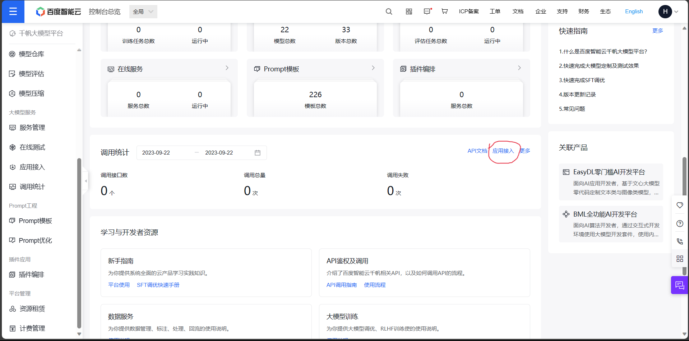
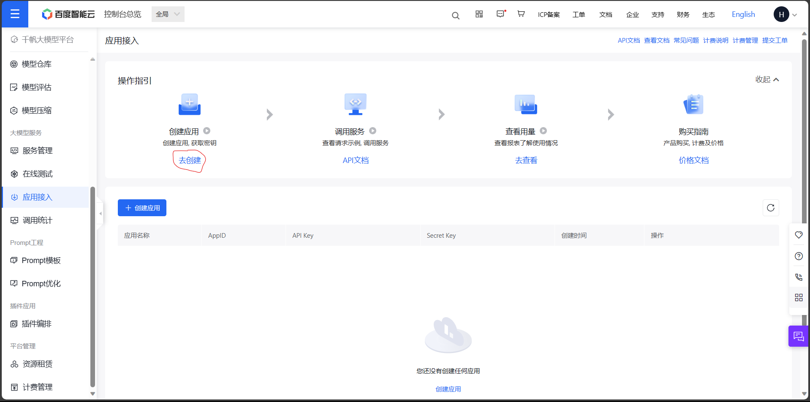
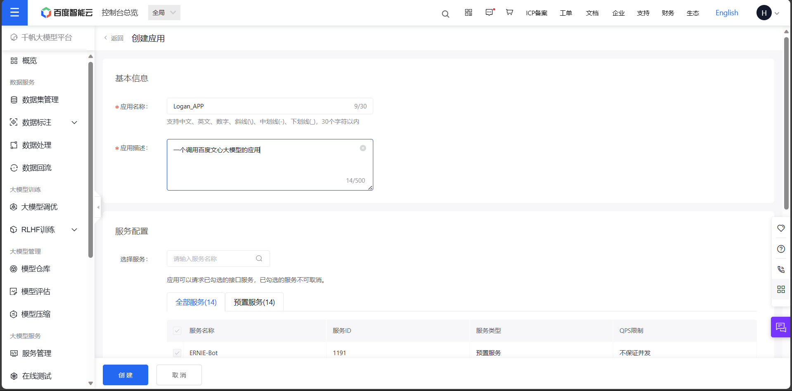

# 三、调用百度文心

## 1. 文心一言

文心一言，由百度于2023年3月27日推出的中文大模型，是目前国内大语言模型的代表产品。受限于中文语料质量差异及国内计算资源、计算技术瓶颈，文心一言在整体性能上距离 ChatGPT 仍有一定差异，但在中文语境下已展现出了较为优越的性能。文心一言所考虑的落地场景包括多模态生成、文学创作等多种商业场景，其目标是在中文语境下赶超 ChatGPT。当然，要真正战胜 ChatGPT，百度还有很长的路要走；但在生成式 AI 监管较为严格的国内，作为第一批被允许向公众开放的生成式 AI 应用，文心一言相对无法被公开使用的 ChatGPT 还是具备一定商业上的优势。

百度同样提供了文心一言的 API 接口，其于推出大模型的同时推出了文心千帆企业级大语言模型服务平台，包括了百度整套大语言模型开发工作链。对于不具备大模型实际落地能力的中小企业或传统企业，考虑文心千帆是一个可行的选择。当然，本教程仅包括通过文心千帆平台调用文心一言 API，对于其他企业级服务不予讨论。不过，值得额外注意的事，国内大模型厂商对于 API 的服务相对疏忽，文心一言 API 的实际性能与其 Web 应用所展现出来的能力还存在一定差异。

在本章节中，我们同样将讲述两种通过 Python 代码调用百度文心一言大模型的方法：直接调用百度文心原生接口；使用 LangChain 调用百度文心接口。

## 2. 获取文心一言调用秘钥

同样，要调用文心一言 API，需要先获取文心一言调用秘钥，在代码中需要配置自己的秘钥才能实现对模型的调用。

百度文心有两层秘钥认证，第一层是拥有调用权限的账户可以从账户中获取的 API_Key 和 Secret_Key，每一个账户可以创建若干个应用，每个应用会对应一个 API_Key 和 Secret_Key。

在获取完成 API_Key 和 Secret_Key 后，还需要基于这两个 Key 去获取 access_token 值。access_token 是第二层认证，基于 access_token 即可调用百度文心大模型，而 access_token 是可以控制基于时间或流量过期的。通过上述两层秘钥认证，可以进一步提高企业服务的安全性。

当然，在本教程中，我们并不需要将两层秘钥分离。我们将在该部分简述如何获取 API_Key、Secret_Key 以及如何基于 Key 获取 access_token 值，后续我们将直接通过 access_token 来调用文心大模型。



首先我们需要进入[文心千帆服务平台](https://console.bce.baidu.com/qianfan/overview)，点击上述应用接入按钮，创建一个调用文心大模型的应用。注意，你需要首先有一个经过实名认证的百度账号。



接着点击“去创建”按钮，进入应用创建界面：



简单输入基本信息，选择默认配置，创建应用即可。


创建完成后，我们可以在控制台看到创建的应用的 `AppID`、`API Key`、`Secret Key`。使用这里的 `API Key` 和 `Secret Key` 即可进行 access_token 的获取。

access_token 需要通过代码 post 访问指定网址得到：


```python
import requests
import json

def get_access_token():
    """
    使用 API Key，Secret Key 获取access_token，替换下列示例中的应用API Key、应用Secret Key
    """
    # 指定网址
    url = "https://aip.baidubce.com/oauth/2.0/token?grant_type=client_credentials&client_id={api_key}&client_secret={secret_key}"
    # 设置 POST 访问
    payload = json.dumps("")
    headers = {
        'Content-Type': 'application/json',
        'Accept': 'application/json'
    }
    # 通过 POST 访问获取账户对应的 access_token
    response = requests.request("POST", url, headers=headers, data=payload)
    return response.json().get("access_token")
```

通过上述代码，即可获取到账户对应的 access_token，后续使用 access_token 即可调用百度文心大模型。

## 3. 调用百度文心原生接口

在完成 access_token 的获取后，可以同样通过 POST 访问来调用百度文心原生接口：


```python
def get_wenxin(prompt):
    # 调用接口
    url = "https://aip.baidubce.com/rpc/2.0/ai_custom/v1/wenxinworkshop/chat/eb-instant?access_token={access_token}"
    # 配置 POST 参数
    payload = json.dumps({
        "messages": [
            {
                "role": "user",# user prompt
                "content": "{}".format(prompt)# 输入的 prompt
            }
        ]
    })
    headers = {
        'Content-Type': 'application/json'
    }
    # 发起请求
    response = requests.request("POST", url, headers=headers, data=payload)
    # 返回的是一个 Json 字符串
    js = json.loads(response.text)
    print(js["result"])

```

百度文心的 Prompt 格式同 OpenAI 的 Prompt 格式相似，但文心并没有提供 system prompt 级别的配置，仅支持 user、assistant 两个级别，可以在传入参数的 message 中配置。我们此处仅使用 user prompt 来实现调用。

同时，百度文心返回的数据也是一个 Json 字符串，我们可以调用其中的 result 属性来获取返回数据。


```python
get_wenxin("你好")
```

    您好！我是百度研发的知识增强大语言模型，中文名是文心一言，英文名是ERNIE Bot。我能够与人对话互动，回答问题，协助创作，高效便捷地帮助人们获取信息、知识和灵感。


百度千帆提供了多种模型接口供调用，此处我们主要使用 `ERNIE-Bot-turbo` 模型的 chat 接口，也就是常说的百度文心大模型。此处简要介绍文心大模型接口的常用参数：

    · messages，即调用的 Prompt。文心的 messages 配置与 ChatGPT 有一定区别，其不支持 max_token 参数，由模型自行控制最大 token 数，content 总长度不能超过11200字符，否则模型就会自行对前文依次遗忘。文心的 messages 有以下几点要求：① 一个成员为单轮对话，多个成员为多轮对话；② 最后一个 message 为当前对话，前面的 message 为历史对话；③ 必须为奇数个对象，message 中的 role 必须依次是 user、assistant。

    · stream，是否使用流式传输。

    · temperature：温度系数，默认0.95，文心的 temperature 参数要求范围在0~1之间，不能设置为0。

我们同样封装一个调用百度文心大模型的函数供之后使用：


```python
# 一个封装 Wenxin 接口的函数，参数为 Prompt，返回对应结果
def get_completion_weixin(prompt, temperature = 0.1, access_token = ""):
    '''
    prompt: 对应的提示词
    temperature：温度系数
    access_token：已获取到的秘钥
    '''
    url = f"https://aip.baidubce.com/rpc/2.0/ai_custom/v1/wenxinworkshop/chat/eb-instant?access_token={access_token}"
    # 配置 POST 参数
    payload = json.dumps({
        "messages": [
            {
                "role": "user",# user prompt
                "content": "{}".format(prompt)# 输入的 prompt
            }
        ],
        "temperature" : temperature
    })
    headers = {
        'Content-Type': 'application/json'
    }
    # 发起请求
    response = requests.request("POST", url, headers=headers, data=payload)
    # 返回的是一个 Json 字符串
    js = json.loads(response.text)
    # print(js)
    return js["result"]

```


```python
prompt = "你好"
access_token = "xxx"
get_completion_weixin(prompt, access_token=access_token)
```


    '您好！我是百度研发的知识增强大语言模型，中文名是文心一言，英文名是ERNIE Bot。我能够与人对话互动，回答问题，协助创作，高效便捷地帮助人们获取信息、知识和灵感。'


## 4. 使用 LangChain 调用百度文心

我们同样可以通过 LangChain 框架来调用百度文心大模型，以将文心模型接入到我们的应用框架中。

但是，原生的 LangChain 是不支持文心调用的，我们需要自定义一个支持文心模型调用的 LLM。在《附一 LangChain自定义LLM》中，我们简述了如何自定义 LLM。

此处，我们可以直接调用已自定义好的 Wenxin_LLM。


```python
from wenxin_llm import Wenxin_LLM
```

我们希望像调用 ChatGPT 那样直接将秘钥存储在 .env 文件中，并将其加载到环境变量，从而隐藏秘钥的具体细节，保证安全性。因此，我们需要在 .env 文件中配置 `wenxin_api_key` 和 `wenxin_secret_key`，并使用以下代码加载：


```python
from dotenv import find_dotenv, load_dotenv
import os

# 读取本地/项目的环境变量。

# find_dotenv()寻找并定位.env文件的路径
# load_dotenv()读取该.env文件，并将其中的环境变量加载到当前的运行环境中
# 如果你设置的是全局的环境变量，这行代码则没有任何作用。
_ = load_dotenv(find_dotenv())

# 获取环境变量 OPENAI_API_KEY
wenxin_api_key = os.environ["wenxin_api_key"]
wenxin_secret_key = os.environ["wenxin_secret_key"]
```


```python
llm = Wenxin_LLM(api_key=wenxin_api_key, secret_key=wenxin_secret_key)
```


```python
llm("你好")
```


    '您好！我是百度研发的知识增强大语言模型，中文名是文心一言，英文名是ERNIE Bot。我能够与人对话互动，回答问题，协助创作，高效便捷地帮助人们获取信息、知识和灵感。'


从而我们可以将文心大模型加入到 LangChain 架构中，实现在应用中对文心大模型的调用。
