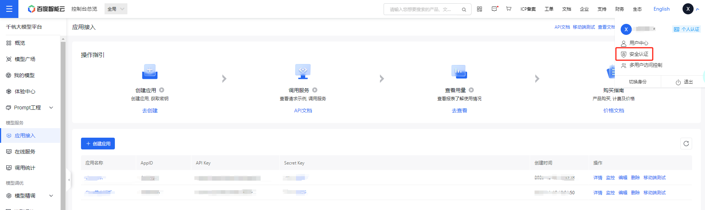

# 三、调用百度文心

## 1. 文心一言

`文心一言` ，由百度于 2023 年 3 月 27 日推出的中文大模型，是目前国内大语言模型的代表产品。受限于中文语料质量差异及国内计算资源、计算技术瓶颈，文心一言在整体性能上距离 ChatGPT 仍有一定差异，但在中文语境下已展现出了较为优越的性能。文心一言所考虑的落地场景包括多模态生成、文学创作等多种商业场景，其目标是在中文语境下赶超 ChatGPT。当然，要真正战胜 ChatGPT，百度还有很长的路要走；但在生成式 AI 监管较为严格的国内，作为第一批被允许向公众开放的生成式 AI 应用，文心一言相对无法被公开使用的 ChatGPT 还是具备一定商业上的优势。

百度同样提供了文心一言的 API 接口，其在推出大模型的同时，也推出了 `文心千帆` 企业级大语言模型服务平台，包括了百度整套大语言模型开发工作链。对于不具备大模型实际落地能力的中小企业或传统企业，考虑文心千帆是一个可行的选择。当然，本教程仅包括通过文心千帆平台调用文心一言 API，对于其他企业级服务不予讨论。不过，值得额外注意的事，国内大模型厂商对于 API 的服务相对疏忽，文心一言 API 的实际性能与其 Web 应用所展现出来的能力还存在一定差异。

`百度智能云千帆大模型平台`提供了千帆 SDK，开发者可使用 SDK，快捷地开发功能，提升开发效率。SDK 支持对话Chat、续写Completions、向量Embeddings、模型管理、模型服务、模型调优等调用。千帆SDK目前只提供了 Python 语言的SDK，支持 Python >= 3.7版本。可通过以下命令安装SDK：

`pip install qianfan`

在本章节中，我们同样将讲述两种通过 Python 代码调用百度文心一言大模型的方法：直接调用百度文心原生接口；使用 LangChain 调用百度文心接口。

## 2. 获取文心一言调用秘钥

### 2.1 【推荐】使用安全认证AK/SK鉴权调用流程

通过以下步骤获取Access Key(AK)/Secret Key(SK)：

1. 登录管理控制台，点击“用户账号->安全认证”进入Access Key管理界面。



2. 查看安全认证的 Access Key/Secret Key

在安全认证/Access Key 页面，查看Access Key、Secret Key。注意：

- 初始化鉴权时，使用“安全认证/Access Key”中的Access Key和 Secret Key进行鉴权，更多鉴权认证机制请参考[鉴权认证机制](https://cloud.baidu.com/doc/Reference/s/Njwvz1wot)。
- 安全认证 Access Key(AK)/Secret Key(SK)，和通过创建应用获取的 API Key(AK) 和 Secret Key(SK)不同。
- 一个用户最多创建 20 对 Access Key

3. 初始化鉴权  

支持通过参数、内置函数初始化、环境变量三种初始化方式，优先级由低到高为：环境变量初始化<内置函数初始化<参数初始化。

#### 方式一：【推荐】通过环境变量初始化

```python
# 通过环境变量传递（作用于全局，优先级最低）
import os
from dotenv import load_dotenv, find_dotenv

qianfan_ak = os.environ["QIANFAN_ACCESS_KEY"] 
qianfan_sk = os.environ["QIANFAN_SECRET_KEY"] 
```

#### 方式二：通过参数初始化  

通过调用相关接口时设置参数初始化。

```python
# 调用相关接口时传递（仅作用于该请求，优先级最高）
import qianfan
task = qianfan.FineTune.create_task(ak="...", sk="...")
```

注意：大模型能力相关类型无法通过此方式初始化，包括对话Chat、续写Completions、向量Embeddings、插件应用。

#### 方式三：[不推荐]通过内置函数初始化  

```python
# 通过内置函数传递（作用于全局，优先级大于环境变量）
import qianfan
qianfan.AccessKey("...")
qianfan.SecretKey("...")
```

注意：不推荐使用此方式，后续功能更新可能出现不兼容问题，建议通过方式一环境变量初始化。

### 2.2【不推荐】使用应用AK/SK鉴权调用流程

1. 获取应用的 AK 和 SK


首先我们需要进入[文心千帆服务平台](https://console.bce.baidu.com/qianfan/overview)，点击上述应用接入按钮，创建一个调用文心大模型的应用。注意，你需要首先有一个经过实名认证的百度账号。


接着点击“去创建”按钮，进入应用创建界面：


简单输入基本信息，选择默认配置，创建应用即可。


创建完成后，我们可以在控制台看到创建的应用的 `AppID`、`API Key`、`Secret Key`。

2. 初始化 AK 和 SK

这部分同 2.1 部分的第三点`初始化鉴权`的三种方式一样，请参考该部分内容

## 3. 调用百度文心API

百度智能云千帆大模型平台提供了对话Chat相关模型API SDK，支持单轮对话、多轮对话、流式等调用。默认模型是 ERNIE-Bot-turbo，关于更多详细信息请参照[官方文档](https://cloud.baidu.com/doc/WENXINWORKSHOP/s/xlmokikxe)

```python
import os
import json
import qianfan
from dotenv import load_dotenv, find_dotenv

# 读取本地/项目的环境变量。

# find_dotenv()寻找并定位.env文件的路径
# load_dotenv()读取该.env文件，并将其中的环境变量加载到当前的运行环境中  
# 如果你设置的是全局的环境变量，这行代码则没有任何作用。
_ = load_dotenv(find_dotenv())


# 使用安全认证AK/SK鉴权，通过环境变量方式初始化；替换下列示例中参数，安全认证Access Key替换your_iam_ak，Secret Key替换your_iam_sk
QIANFAN_ACCESS_KEY = "ALTAKPxsroOKAAn8sqMj77T6PS"
QIANFAN_SECRET_KEY = "aad701472a98444bbc8b67ccf3d53628" 


# 通过AppID设置使用的应用，该参数可选；如果不设置该参数，SDK默认使用最新创建的应用AppID；如果设置，使用如下代码，替换示例中参数，应用AppID替换your_AppID
#os.environ["QIANFAN_APPID"]="your_AppID"

chat_comp = qianfan.ChatCompletion()

# 调用默认模型，即 ERNIE-Bot-turbo
resp = chat_comp.do(messages=[{
    "role": "user",
    "content": "你好"
}]
)

print(resp)

```

上述返回参数具体意义如下：  


接下来让我们单独将对话结果提取出来：

```python
resp["result"]
```

百度文心的 Prompt 格式同 OpenAI 的 Prompt 格式相似，但文心并没有提供 system prompt 级别的配置，当前支持以下：

- user: 表示用户
- assistant: 表示对话助手
- function: 表示函数可以在传入参数的 message 中配置。（涉及到 funcation 的使用，感兴趣的可以自行了解）

我们此处仅使用 user prompt 来实现调用。

百度千帆提供了多种模型接口供调用，此处我们主要使用 `ERNIE-Bot-turbo` 模型的 chat 接口，也就是常说的百度文心大模型。此处简要介绍文心大模型接口的常用参数：
    · messages，即调用的 Prompt。文心的 messages 配置与 ChatGPT 有一定区别，其不支持 max_token 参数，由模型自行控制最大 token 数，content 总长度不能超过11200字符，否则模型就会自行对前文依次遗忘。文心的 messages 有以下几点要求：① 一个成员为单轮对话，多个成员为多轮对话；② 最后一个 message 为当前对话，前面的 message 为历史对话；③ 必须为奇数个对象，message 中的 role 必须依次是 user、assistant。
    · stream，是否使用流式传输。
    · temperature：温度系数，默认0.95，文心的 temperature 参数要求范围在0~1之间，不能设置为0。

我们同样封装一个调用百度文心大模型的函数供之后使用：

```python
# 一个封装 Wenxin 接口的函数，参数为 Prompt，返回对应结果
def get_completion_weixin(prompt, temperature = 0.2):
    '''
    prompt: 对应的提示词
    temperature：温度系数
    '''
    chat_comp = qianfan.ChatCompletion()

    # 调用默认模型，即 ERNIE-Bot-turbo
    resp = chat_comp.do(messages=[{
        "role": "user",# user prompt
        "content": "{}".format(prompt)# 输入的 prompt
    }],
    temperature = temperature
    )

    return resp["result"]
    
```

调用上述封装好的函数：

```python
prompt = "你好"
get_completion_weixin(prompt)
```

## 4. 使用 LangChain 调用百度文心

我们同样可以通过 LangChain 框架来调用百度文心大模型，以将文心模型接入到我们的应用框架中。

但是，原生的 LangChain 是不支持文心调用的，我们需要自定义一个支持文心模型调用的 LLM。在《附一 LangChain自定义LLM》中，我们简述了如何自定义 LLM。

此处，我们可以直接调用已自定义好的 Wenxin_LLM。

`from wenxin_llm import Wenxin_LLM`

我们希望像调用 ChatGPT 那样直接将秘钥存储在 .env 文件中，并将其加载到环境变量，从而隐藏秘钥的具体细节，保证安全性。因此，我们需要在 .env 文件中配置 `wenxin_api_key` 和 `wenxin_secret_key`，并使用以下代码加载：

```python
from dotenv import find_dotenv, load_dotenv
import os

# 读取本地/项目的环境变量。

# find_dotenv()寻找并定位.env文件的路径
# load_dotenv()读取该.env文件，并将其中的环境变量加载到当前的运行环境中
# 如果你设置的是全局的环境变量，这行代码则没有任何作用。
_ = load_dotenv(find_dotenv())

# 获取环境变量 OPENAI_API_KEY
QIANFAN_ACCESS_KEY = os.environ["QIANFAN_ACCESS_KEY"] 
QIANFAN_SECRET_KEY = os.environ["QIANFAN_SECRET_KEY"] 

```

```python
llm = Wenxin_LLM(api_key=QIANFAN_ACCESS_KEY, secret_key=QIANFAN_SECRET_KEY)
llm("你好")
```

从而我们可以将文心大模型加入到 LangChain 架构中，实现在应用中对文心大模型的调用。