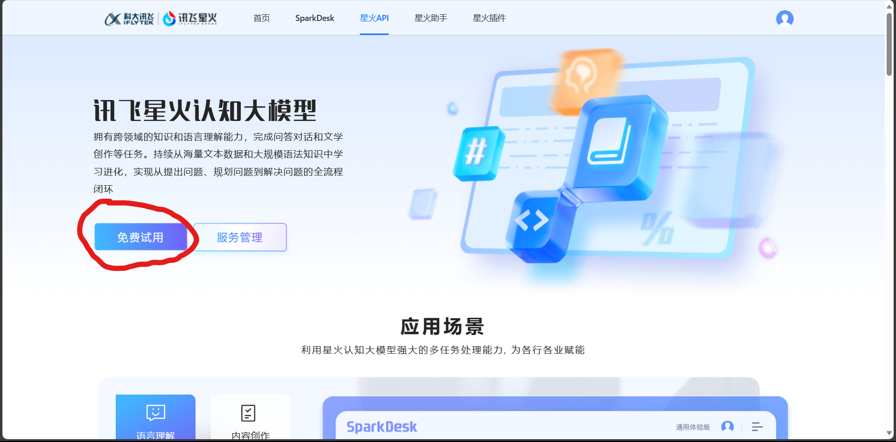

# 四、调用讯飞星火

## 1. 讯飞星火认知大模型

讯飞星火认知大模型，由科大讯飞于2023年5月推出的中文大模型，也是国内大模型的代表产品之一。同样，受限于中文语境与算力资源，星火在使用体验上与 ChatGPT 还存在差异，但是，作为与文心不分伯仲的国内中文大模型，仍然值得期待与尝试。相较于存在显著资源、技术优势的百度，科大讯飞想要杀出重围，成为国内大模型的佼佼者，需要充分利用相对优势，至少目前来看，星火并未掉队。同时，不知道是否因为讯飞 API 还没有全面开放，讯飞 API 的测试使用效果比文心更好，值得期待。

目前，讯飞星火大模型 API 已进入 $\beta$ 测试阶段，每一个讯飞账户都可以申请若干 token 的试用。但是，相对于文心与 GPT 几乎完全一致的 API 调用方式，星火 API 需要使用 WebSocket 来进行调用，对企业友好，但对初学者、新手开发者来说调用难度较大。本章节将指导开发者如何将星火 API 封装为可直接通过 request 调用的 API 接口从而和其他大模型保持一致，也将介绍如何将其封装成个性化 LLM 嵌入 LangChain 使用。

## 2. 申请调用权限

相对于文心复杂的申请流程，讯飞的权限申请显得简单易操作得多：

我们可以使用 [Datawhale 提供的专属链接](https://xinghuo.xfyun.cn/sparkapi?ch=dwKeloHY)，通过该链接进入可以获得更多的免费额度，点击“免费试用”：



如果是没有领取过免费试用包的用户，可以领取到 100000 token 的试用量；如果已领取过，就会自动跳转到下方购买产品的页面。完成领取后，点击上文中的“服务管理”即可进入控制台：


在该界面，我们就可以看到我们获取到的 `APPID`、`APISecret` 和 `APIKey` 了。

## 3. 调用原生星火 API

星火 API 需要通过 WebSocket 进行连接，相对来说配置较为复杂，讯飞给出了配置示例 SparkApi.py 和连接示例 test.py，此处我们仅讲解 test.py 里的调用逻辑，配置示例代码直接使用即可。

注意，需要在环境中安装配置示例中的所需第三方库。

首先我们需要配置秘钥信息：


```python
import SparkApi
#以下密钥信息从控制台获取
appid = ""     #填写控制台中获取的 APPID 信息
api_secret = ""   #填写控制台中获取的 APISecret 信息
api_key =""    #填写控制台中获取的 APIKey 信息

#用于配置大模型版本，默认“general/generalv2”
domain = "general"   # v1.5版本
# domain = "generalv2"    # v2.0版本

#云端环境的服务地址
Spark_url = "ws://spark-api.xf-yun.com/v1.1/chat"  # v1.5环境的地址
# Spark_url = "ws://spark-api.xf-yun.com/v2.1/chat"  # v2.0环境的地址
```

星火的调用传参和文心类似，也需要传入一个列表，列表中包括 role 和 prompt，我们首先定义一个从用户输入 prompt 生成传入参数的函数：


```python
def getText(role, content, text = []):
    # role 是指定角色，content 是 prompt 内容
    jsoncon = {}
    jsoncon["role"] = role
    jsoncon["content"] = content
    text.append(jsoncon)
    return text
```

接着，我们将一个用户输入 prompt 封装为这样一个传入参数列表：


```python
question = getText("user", "你好")
question
```


    [{'role': 'user', 'content': '你好'}]


然后再调用 SparkApi.py 中封装的 main 函数即可：


```python
response = SparkApi.main(appid,api_key,api_secret,Spark_url,domain,question)
response
```

    你好！很高兴为您提供帮助。请问有什么问题我可以帮您解答吗？

## 4. 统一 API 调用方式

由于星火使用了 WebSocket 连接，不能直接使用 request 来进行访问，同其他大模型 API 访问方式具有一定差异。我们可以通过 FastAPI 将星火 API 封装成本地 API，从而实现统一的模型调用方式。我们在《附2 将大模型 API 封装成本地 API》中讲解了如何实现本地 API 的封装，此处仅讲解如何启动并调用本地 API。

在我们完成本地 API 的封装后（spark_api.py），我们可以通过 uvicorn 命令启动：


```python
! uvicorn spark_api:app
```

启动之后，默认会在本地 8000 端口开启 API 服务。

启动 API 之后，我们可以向本地 8000 端口发起 Request 请求来访问 API：


```python
import requests

api_url = "http://127.0.0.1:8000/spark"
headers = {"Content-Type": "application/json"}
data = {
    "prompt" : "你好",
    "temperature" : 0.2,
    "max_tokens" : 3096}

response = requests.post(api_url, headers=headers, json=data)
response.text
```


    '"你好！有什么我可以帮助你的吗？"'


同样，我们可以用一个函数来封装 requests 访问的细节：


```python
def get_completion_spark(prompt, temperature = 0.1, max_tokens = 4096):

    api_url = "http://127.0.0.1:8000/spark"
    headers = {"Content-Type": "application/json"}
    data = {
        "prompt" : prompt,
        "temperature" : temperature,
        "max_tokens" : max_tokens}

    response = requests.post(api_url, headers=headers, json=data)
    return response.text
```


```python
get_completion_spark("你好")
```


    '"你好！有什么我可以帮助你的吗？"'


星火 API 同样可以制作成自定义 LLM 并接入 LangChain，制作方式同文心大模型，此处就不再赘述，如有需要可查看项目代码[/project/llm/spark_llm](/project/llm/spark_llm.py)。
