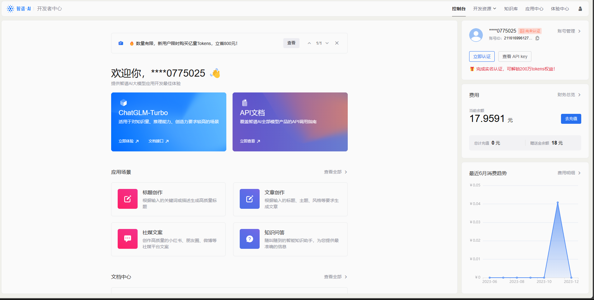
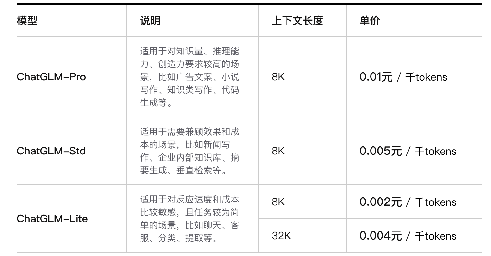

# 五、调用智谱 AI


## 1. ChatGLM 大模型

智谱 AI 是由清华大学计算机系技术成果转化而来的公司，致力于打造新一代认知智能通用模型。公司合作研发了双语千亿级超大规模预训练模型 GLM-130B，并构建了高精度通用知识图谱，形成数据与知识双轮驱动的认知引擎，基于此模型打造了 ChatGLM（chatglm.cn）。

ChatGLM 系列模型，包括 ChatGLM-130B 和 ChatGLM-6B 模型，支持相对复杂的自然语言指令，并且能够解决困难的推理类问题。其中，ChatGLM-6B 模型吸引了全球超过 160 万人下载安装，该模型在 Hugging Face (HF) 全球大模型下载榜中连续 12 天位居第一名，在国内外的开源社区中产生了较大的影响。


本章节将指导开发者如何将智谱 AI API 的使用方式，也将介绍如何将其封装成个性化 LLM 嵌入 LangChain 使用。

## 2. 申请调用权限

首先进入到[智谱AI开放平台](https://open.bigmodel.cn/overview)，点击“开始使用”或者“开发者工具台”进行注册：


如果是没有领取过免费试用包的用户，可以领取到 18 元的 token 的试用量；如下图右边绿色框所示。智谱 AI 提供了三种不同的模型 API，ChatGLM-Pro, ChatGLM-Std, ChatGLM-Lite 三种不同的模型分别适用于不同的场景，可以点击蓝色框中的立即体验直接体验。对于需要使用 API key 来搭建应用的话，需要点击右边红框中的查看 API key，就会进入到我们个人的 API 管理列表中。





在该界面，我们就可以看到我们获取到的 API 所对应的应用名字和 `API key` 了。


我们可以点击 `添加新的 API key` 并输入对应的名字即可生成新的 API key。


## 3. 调用智谱 AI API

智谱 AI 提供了 SDK 和原生 HTTP 来实现模型 API 的调用，建议使用 SDK 进行调用以获得更好的编程体验。

注意，需要在环境中安装配置示例中的所需第三方库。

首先我们需要配置秘钥信息：


```python
!pip install zhipuai
```


```python
import zhipuai
zhipuai.api_key = "your api key" #填写控制台中获取的 APIKey 信息

model = "chatglm_std" #用于配置大模型版本
```

智谱的调用传参和其他类似，也需要传入一个列表，列表中包括 role 和 prompt，我们首先定义一个从用户输入 prompt 生成传入参数的函数：


```python
def getText(role, content, text = []):
    # role 是指定角色，content 是 prompt 内容
    jsoncon = {}
    jsoncon["role"] = role
    jsoncon["content"] = content
    text.append(jsoncon)
    return text
```

接着，我们将一个用户输入 prompt 封装为这样一个传入参数列表：


```python
question = getText("user", "你好")
question
```


    [{'role': 'user', 'content': '你好'}]


然后再调用 zhipuai SDK 中封装的 invoke 函数即可：


```python
# 请求模型
response = zhipuai.model_api.invoke(
    model=model,
    prompt=question
)
print(response)
```

    {'code': 200, 'msg': '操作成功', 'data': {'request_id': '8023318729410566227', 'task_id': '8023318729410566227', 'task_status': 'SUCCESS', 'choices': [{'role': 'assistant', 'content': '" 你好👋！我是人工智能助手 智谱清言，可以叫我小智🤖，很高兴见到你，欢迎问我任何问题。"'}], 'usage': {'prompt_tokens': 2, 'completion_tokens': 28, 'total_tokens': 30}}, 'success': True}


这里对传入 zhipuai 的参数进行简单介绍：

- `prompt (list)`: 调用对话模型时，将当前对话信息列表作为提示输入给模型; 按照 {"role": "user", "content": "你好"} 的键值对形式进行传参; 总长度超过模型最长输入限制后会自动截断，需按时间由旧到新排序。

- `temperature (float)`: 采样温度，控制输出的随机性，必须为正数。取值范围是：(0.0,1.0]，不能等于 0，默认值为 0.95。值越大，会使输出更随机，更具创造性；值越小，输出会更加稳定或确定。
  
- `top_p (float)`: 用温度取样的另一种方法，称为核取样。取值范围是：(0.0, 1.0) ，开区间，不能等于 0 或 1，默认值为 0.7。模型考虑具有 top_p 概率质量 tokens 的结果。例如：0.1 意味着模型解码器只考虑从前 10% 的概率的候选集中取 tokens。

- `request_id (string)`: 由用户端传参，需保证唯一性；用于区分每次请求的唯一标识，用户端不传时平台会默认生成

- `return_type (string)`: 用于控制每次返回内容的类型，空或者没有此字段时默认按照 json_string 返回。`json_string` 返回标准的 JSON 字符串。`text` 返回原始的文本内容

- **建议您根据应用场景调整 top_p 或 temperature 参数，但不要同时调整两个参数**


## 4. 使用 LangChain 调用智谱 AI

我们同样可以通过 LangChain 框架来调用智谱 AI 大模型，以将其接入到我们的应用框架中。

同文心大模型类似，原生的 LangChain 是不支持智谱 AI 调用的，我们需要自定义一个 LLM。

此处，我们可以直接调用已自定义好的 ZhipuAILLM


```python
from zhipuai_llm import ZhipuAILLM
```


```python
zhipuai_model = ZhipuAILLM(model="chatglm_std", temperature=0, zhipuai_api_key=zhipuai.api_key)
```


```python
zhipuai_model.generate(['你好'])
```


    LLMResult(generations=[[Generation(text='" 你好👋！我是人工智能助手 智谱清言，可以叫我小智🤖，很高兴见到你，欢迎问我任何问题。"', generation_info=None)]], llm_output=None, run=[RunInfo(run_id=UUID('36840571-ce83-4bcb-8095-a222d59f32a4'))])
