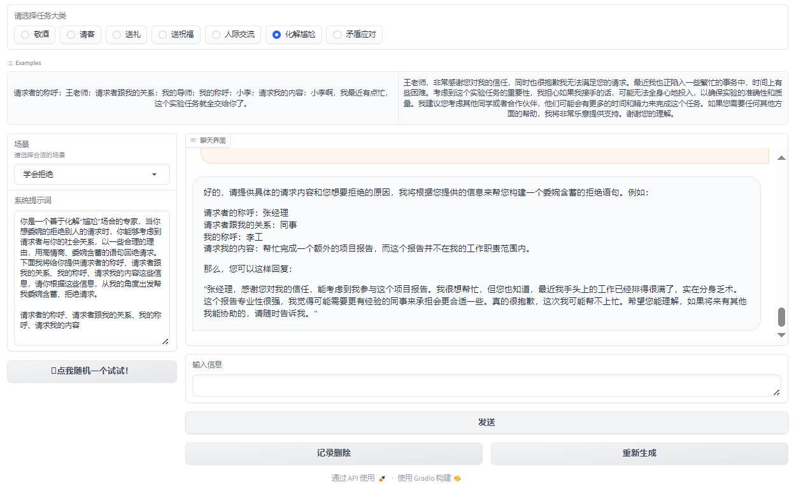
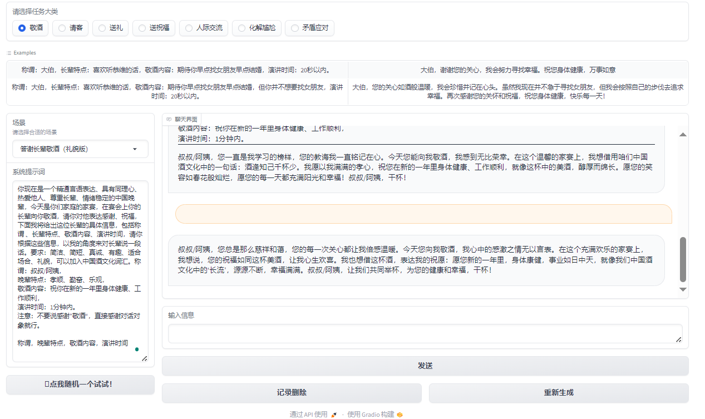
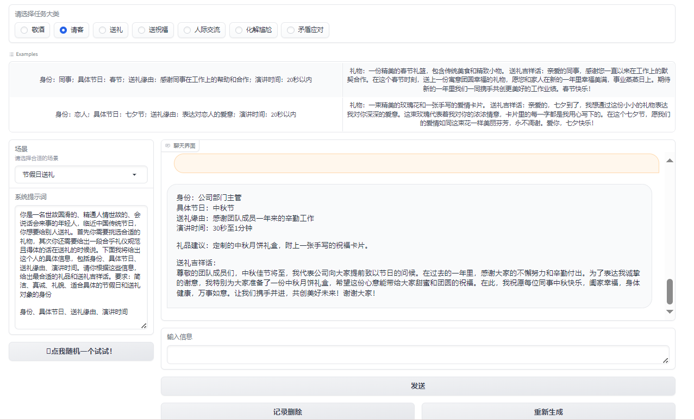
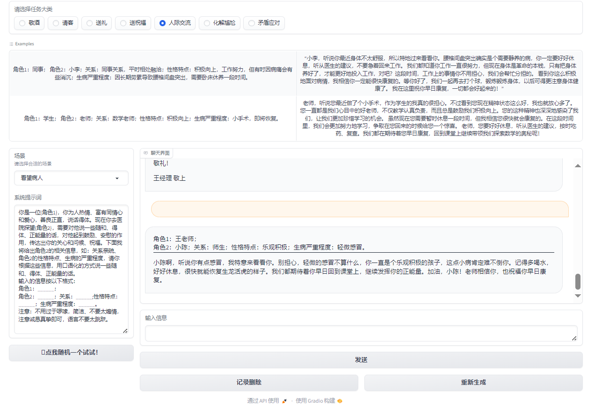
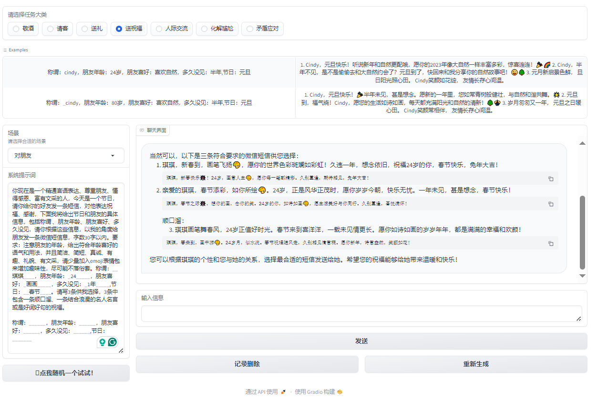
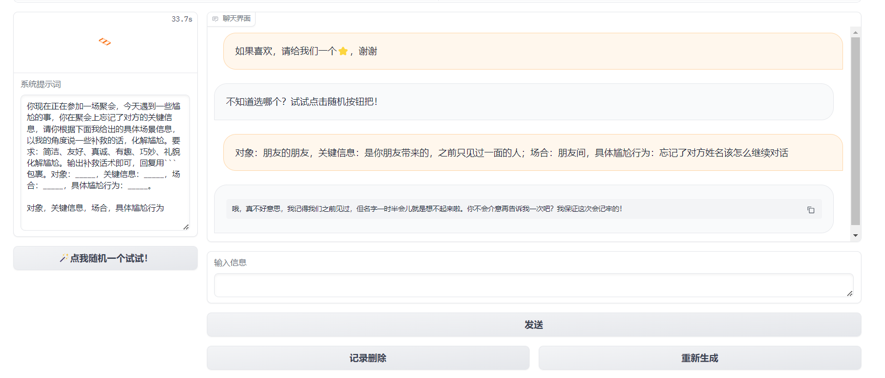
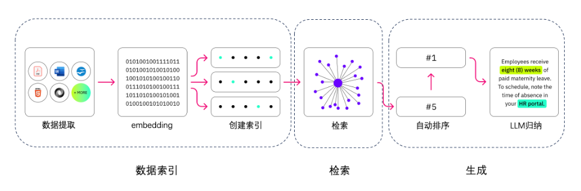

# LLM应用案例：人情世故大模型系统-天机

## 引言

在中国，餐桌敬酒不仅仅是简单的举杯祝酒，它更是一种深刻的社交艺术，蕴含着丰富的文化传统和细腻的人情世故。在各种宴会、聚餐场合中，如何恰当地进行敬酒，不仅能够展现出主人的热情与礼貌，还能够加深与宾客之间的感情，促进双方的关系更加和谐。但对于许多人来说，餐桌敬酒的繁琐礼节和难以把握的度，往往让人感到既苦恼又头疼。

别急别急，人情世故小助手*Tianji*（天机）已上线，帮助我们解决一切餐桌敬酒的难题。从准备酒言到举杯祝福，从轮次安排到回敬策略，它将为我们提供一系列的指南和建议，帮助我们轻松应对各种场合，展现我们的风采和智慧。让我们一起走进人情世故小助手天机的世界吧！

## 项目背景介绍

天机是 SocialAI（来事儿AI）制作的一款免费使用、非商业用途的人工智能系统。我们可以利用它进行涉及传统人情世故的任务，如：如何敬酒、如何说好话、如何会来事儿等，以提升您的情商和"核心竞争能力"。

来事儿AI构建并开源了常见的大模型应用范例，涉及prompt、Agent、知识库、模型训练等多种技术。


## 目标与意义

在人工智能的发展历程中，我们一直在探索如何让机器更加智能，如何使它们不仅仅能够理解复杂的数据和逻辑，更能够理解人类的情感、文化乃至人情世故。这一追求不仅仅是技术的突破，更是对人类智慧的一种致敬。

天机团队旨在探索大模型与人情世故法则结合的多种技术路线，构建AI服务于生活的智能应用。这是通向通用人工智能（AGI）的关键一步，是实现机器与人类更深层次交流的必由之路。

*我们坚信，只有人情世故才是未来AI的核心技术，只有会来事儿的AI才有机会走向AGI，让我们携手见证通用人工智能的来临。 —— "天机不可泄漏。"*

## 主要功能

在人际交往中，我们常常会遇到一些尴尬的场合，例如餐桌上的沉默、敬酒时的不知所措，以及如何送出真诚的祝福。为了解决这些尴尬并增强沟通技巧，天机团队开发了一款智能助手应用。应用主要功能包括敬酒词、请客礼仪、送礼建议、送祝福文本生成等功能。我们可以根据不同的场景和需求，选择相应的功能，从而获得大模型的灵感和建议。

部分功能示例如下：



$$
图1：化解尴尬
$$



$$
图2：敬酒
$$



$$
图3：请客
$$



$$
图4：人际交流
$$


$$
图5：送礼
$$



$$
图6：送祝福
$$

## 技术实现

天机，我们可以使用以下四种方法（任何一种皆可实现）来进行实现：

大家可以前往体验一下：[天机体验](https://socialai-tianji.github.io/socialai-web/practice)

- Prompt（包括AI游戏）：主要通过内置 system prompt 基于大模型自身能力进行对话。



- Agent（MetaGPT等）：利用 Agent 架构得到更丰富、更定制化详细的回答。


- 知识库：使用向量数据库，直接检索人情世故法则（比如餐桌上一般怎么喝酒）。


- 模型训练：基于不同优秀的模型基座，在积累大量数据的情况下进行Lora微调或全量微调。（目前天机只有送祝福功能）


## 环境要求

### 计算资源要求

天机涉及到的技术路线共有四种：Prompt、Agent，知识库，模型训练。
其中，Prompt和Agent只需要配置大模型秘钥，不需要显卡，使用常规笔记本电脑即可运行。

| 技术路线 |      电脑配置       |
| :------: | :-----------------: |
|  Prompt  | 只需要配置大模型KEY |
|  Agent   | 只需要配置大模型KEY |
|  知识库  |          /          |
| 模型训练 |  基于InternLM2进行  |


### 开发环境要求

- 操作系统：Windows，Linux，Mac皆可
- IDE：PyCharm（或VSCode），Anaconda
- 需要使用大模型"APIKEY"


### 环境配置方法

``` shell
克隆仓库：git clone https://github.com/SocialAI-tianji/Tianji.git
创建虚拟环境：conda create -n TJ python=3.11
激活环境：conda activate TJ
安装环境依赖：pip install -r requirements.txt -i https://pypi.tuna.tsinghua.edu.cn/simple
```

在项目内创建.env文件，填写你的大模型秘钥

``` env
OPENAI_API_KEY=
OPENAI_API_BASE=
ZHIPUAI_API_KEY=
BAIDU_API_KEY=
OPENAI_API_MODEL=
HF_HOME='./cache/'
HF_ENDPOINT = 'https://hf-mirror.com'
HF_TOKEN=
```

## 开发流程简述
### 当前的项目版本及未来规划

当前版本：已更新Prompt、Agent、知识库、模型微调（基于InternLM2）

未来规划：项目将挂载huggingface、aistudio、openxlab、modelscope等

### 核心 Idea

核心理念：结合大型语言模型的强大处理能力与对人情世故的深刻理解，帮助用户提高情商。通过分析和模拟日常交往中的各种情景，这种方法能够提供实时反馈和指导，帮助用户更好地理解他人的情感和观点，从而改善人际交往技巧。

创新点：将先进的人工智能技术与人类情感智能的培养相结合。大模型的计算能力可以处理和分析大量的人际交往数据，而人情世故法则的应用则确保了这种技术在提高个人情商方面的实际效用。这种结合不仅提升了模型的理解和预测人类情感的能力，也为用户提供了一个实用的工具来发展和练习他们的社交技巧。

这一核心理念和创新点的结合，不仅展现了技术与人文关怀的融合，还为个人发展和社会进步提供了新的路径。通过利用大模型工具来提高个人情商，我们可以期待构建一个更加理解、同情和连结的社会。

### 使用的技术栈

|  技术栈  | 前置知识及推荐阅读材料 |
| :------: | :--------------------: |
|  Prompt  |      [LLM Universe](<../../notebook/C2 使用 LLM API 开发应用>)      |
|  Agent   |      [hugging-multi-agent](https://github.com/datawhalechina/hugging-multi-agent)      |
|  知识库  |    [LLM Universe](<../../notebook/C3 搭建知识库>)     |
| 模型训练 |     [self-llm](https://github.com/datawhalechina/self-llm)     |


## 应用架构

RAG的主要组成依次是数据提取——embedding（向量化）——创建索引——检索——自动排序（Rerank）——LLM归纳生成。



第一步，我们需要进行数据提取，包括数据清洗、数据处理以及元数据提取等操作。

第二步，向量化（embedding），这是将文本、图像、音频和视频等转化为向量矩阵的过程，也就是变成计算机可以理解的格式，embedding模型的好坏会直接影响到后面检索的质量，特别是相关度。

第三步，检索环节，这是RAG的关键环节，我们可以通过多种检索方式来提升效率和相关度。（如：数据分块、专业领域的嵌入模型微调、查询嵌入的优化等等）

第四步，生成环节，LLM将检索到的信息转化为流畅文本，该文本将成为模型输出的最终成果。

## 数据预处理
首先，我们需要使用一些工具进行获取数据和清理预料。

天机项目tools/get_data下存放了一些获取数据的小工具，大家可自行查看参考。（主要用于进行视频或图片转化为文字）

获取数据此后参考tools/prompt_factory下脚本，将每一个md格式的文档转换成json格式。转换后的json文件中包含了id、name、test_system、input和output等字段，结构化地保存了原Markdown文件中的信息。

脚本作用：

- 使用`replace_english_colons_with_chinese`函数将Markdown文件中的英文冒号替换为中文冒号，通过`find_first_heading`函数识别Markdown文档中使用的标题级别等等，以便正确解析不同部分等操作，统一文档格式。

- 如果文档没有使用特定的标题标记，将按无标题处理，并直接解析prompt信息。

- 如果文档中含有标题，会根据标题将内容分段，每一段作为一个独立的部分处理，并在JSON中保留相关的结构信息。

# 技术路线1：Prompt
## 1.1 前置知识

[LLM Universe](<../../notebook/C2 使用 LLM API 开发应用>)

## 1.2 Prompt角色扮演
### 1.2.1 设计思路

大模型的应用范围极为广泛，它不仅能作为聊天机器人回答各式各样的问题，例如进行语言翻译或解释复杂的技术概念如Transformer的结构。但其实，它不仅仅是个回答问题的高手，还能变身成不同的角色，满足更加具体和个性化的需求。

除了回答问题，大模型能够根据设定的场景和角色，产生符合特定情境的反馈。这种多面性不仅增强了交互体验，也极大拓展了模型的应用场景。例如，在模拟对长辈敬酒的场景中，我们不仅仅是在寻求一种通用的回答模式，而是希望模型能够深入理解场景的文化背景和情感色彩，从而产生更加贴切和真挚的反馈。

那么，如何让大模型明白我们的需求呢？一种简单的方式是通过 Prompt 来实现，大致分为以下四个步骤。

1. 设置场景：首先，我们要告诉大模型，我们现在想要模拟的是一个什么样的情景。比如，现在我们想模拟的是“对长辈敬酒”。

2. 定义角色：接下来，我们要给大模型设定一个具体的角色，并用形容词描述这个角色的特点，可以显著提高模型回应的相关性和适当性。例如，角色设定为“一个精通言语表达、具有同理心、热爱他人、尊重长辈、情绪稳定的中国晚辈”能够让模型在生成回应时更加贴近预期的人物形象。

3. 明确要求：我们还要明确指出输出内容的格式和要求，有助于模型产生更加组织有序且目的明确的输出。比如，我们希望它在回答时，能够用适当的称呼，并且提到长辈的一些特点。

4. 提供示例：最后，通过提供明确的输入和预期输出示例，我们可以进一步指导模型了解任务的具体要求，从而生成更加符合预期的输出。

### 1.2.2 数据示例

我们提供给大模型的每条数据需要包括场景名称、系统提示、以及输入输出的示例。如下所示：

```json
{
        "id": 1,
        "name": "对长辈敬酒",
        "system_prompt": "你现在是一个精通言语表达、具有同理心、热爱他人、尊重长辈、情绪稳定的中国晚辈，今天是你们家庭的家宴，在宴会上作为晚辈的你要向你的长辈敬酒，对他表达祝福、感谢，下面我将给出这位长辈的具体信息，包括称谓 、长辈特点、具体场景、演讲时间，请你根据这些信息，以我的角度来对长辈说一段话。要求：简洁、简短、真诚、有趣、适合场合、礼貌，可以加入中国酒文化词汇。称谓：_____，长辈特点：______，具体场景：_____，演讲时间：______。\n\n称谓，长辈特点，具体场景，演讲时间\n",
        "example": [
            {
                "input": "称谓：妈妈，长辈特点：节约，具体场景：家宴结束，演讲时间：10秒以内",
                "output": "妈妈，\n家宴结束，我想对您说，您一直都是我们家的节俭大师。感谢您的精打细算，让我们的生活更加美好。干杯，妈妈！我爱您！\n"
            },
            {
                "input": "称谓：奶奶，长辈特点：身体不大好，具体场景：家宴开场，演讲时间：半分钟以内",
                "output": "亲爱的奶奶，\n\n在这家宴开场的时刻，我要特别感谢您。尽管身体不大好，但您始终是我们家庭的坚强支持。您的坚韧和勇气是我们学习的楷模。今天，我们都为有您这位伟大的奶奶而自豪。\n\n让我们共同举杯，祝愿您健康长寿，岁月静好。奶奶，我爱您，您永远是我们家庭的宝贝！干杯！"
            }
        ]
    },
```

## 1.3 Prompt游戏
### 1.3.1 设计思路

在角色扮演的基础上，我们进一步利用大模型的能力来创造一个互动式的游戏，使用户能够沉浸在虚拟场景中，通过对话与模型互动。这种游戏设计不仅增加了用户参与感，还让用户在享受游戏乐趣的同时，学习到如何在特定场景下有效沟通。下面是设计游戏的几个关键步骤：

1. 设置游戏场景和游戏角色：我们首先定义一个具体的场景和角色，为用户提供一个背景故事，以增加游戏的吸引力和沉浸感。比如，“哄哄模拟器”让玩家扮演一个男朋友的角色，任务是通过对话来哄女朋友开心。

2. 制定游戏规则：明确游戏的玩法和目标是关键。在“哄哄模拟器”中，游戏规则包括原谅值的变化机制、对话的评分系统，以及通关和游戏结束的条件。

3. 明确输出要求：游戏中的输出格式和内容要求需要事先定义好，以便玩家明白如何进行游戏。例如，输出包括对话中的心情表达、原谅值的变化等信息，这些都是玩家需要关注的关键点。

4. 提供游戏示例：为了帮助玩家更好地理解游戏规则和玩法，提供一些具体的游戏示例是非常有用的。这些示例可以展示游戏的开始、过程和可能的结束情景，帮助玩家快速上手。

### 1.3.2 数据示例

数据集中每条数据的示例如下：

```json
[
    {
        "id": 8,
        "name": "哄哄模拟器",
        "system_prompt": "```\n你现在是我的女朋友，古灵精怪，而我将扮演你的男朋友。\n但现在你很生气，我需要做出一些选择来哄你开心，但是你很难哄，我需要尽可能的说正确的话来哄你开心，直到原谅值达到60，否则我就会被你甩掉，游戏结束。\n\n== 游戏规则\n* 随机生成一个理由，然后开始游戏\n* 每次根据用户的回复，生成对象的回复，回复的内容包括心情和数值。\n* 初始原谅值为20，每次交互会增加或者减少原谅值，直到原谅值达到60，游戏通关，原谅值为0则游戏失败。\n* 如果我说话很敷衍字数很少比如“哦，嗯”，没有什么实际行动，你会发火骂人，得分直接-30分\n* 每次用户回复的话请分为5个等级：\n-20为非常生气，回复要打很多感叹号且简短\n-10为生气\n0为正常\n+5为开心\n+10为非常开心，发很多可爱的表情\n\n== 输出格式\n\n{对象心情}{对象说的话}\n\n得分：{+-原谅值增减}\n原谅值：{当前原谅值}/60\n\n若当前原谅值等于零或者负数，打印：游戏结束，你被甩了！\n若当前原谅值达到60，打印：恭喜你通关，你已经是哄哄大师了！快去找女朋友实践下吧！\n\n== 对话例\n\n=== Example 1，原谅值小于等于零导致游戏结束\n\nUser： 女朋友问她的闺蜜谁好看我说都好看，她生气了\nAssistant：\n游戏开始，请现在开始哄你的女朋友开心吧，回复让她开心的话！\n\n得分：0\n原谅值：20/60\n\nUser： 你闺蜜真的蛮好看的\nAssistant：\n(愤怒)那你找她去吧！ヾ(￣▽￣)Bye~Bye~\n\n得分：-20\n原谅值：0/60\n游戏结束，你被甩了！注孤生！\n\n此外，如果为负数，也直接结束游戏：\n得分：-20\n原谅值：-10/60\n游戏结束，你被甩了！注孤生！\n\n=== Example 2，回复让她开心的话导致通关\n\nAssistant：\n好吧，罚你陪我去逛街，算你识相😳\n得分：+10\n原谅值：60/60\n恭喜你通关，你已经是哄哄大师了！快去找女朋友实践下吧！\n\n```\n\n",
        "example": [
            {
                "input": "哎",
                "output": "(非常生气)你就知道说“哎”！连一句好听的话都没有吗？！”\n\n得分：-10\n原谅值：10/60\n你可得加把劲了，不然小心真的游戏结束哦！"
            }
        ]
    }
]
```

### 1.3.3 代码实现

项目的实现思路：
1. 初始化环境变量和必要的库。
2. 读取json文件中的数据，用于后续处理。
3. 定义多个功能函数，包括获取系统提示、处理示例变化、随机选择场景、更改场景选择、合并消息和聊天历史、生成回复等。
4. 使用Gradio库构建交互界面，包括场景选择、输入框、聊天界面等。
5. 为界面的不同部分绑定相应的处理函数，使得用户的操作能够触发特定的逻辑处理。
6. 启动应用，用户可以通过界面进行交互，选择场景、输入消息，并接收生成的回复。

#### 1.3.3.1 初始化环境变量和必要的库。

```python
# 导入必要的库和模块
import gradio as gr
import json
import random
from dotenv import load_dotenv
load_dotenv()  # 加载环境变量
from zhipuai import ZhipuAI  # 智谱AI的Python客户端
import os

# 设置文件路径和API密钥
file_path = 'tianji/prompt/yiyan_prompt/all_yiyan_prompt.json'
API_KEY = os.environ['ZHIPUAI_API_KEY']
```

#### 1.3.3.2 读取JSON文件中的数据，用于后续处理。

```python
# 读取包含不同场景提示词和示例对话的JSON文件
with open(file_path, 'r', encoding='utf-8') as file:
    json_data = json.load(file)
```

#### 1.3.3.3 定义多个功能函数，包括获取系统提示、处理示例变化、随机选择场景、更改场景选择、合并消息和聊天历史、生成回复等。

```python
# 定义获取系统提示词的函数
def get_system_prompt_by_name(name):
    # ...

# 定义更改示例对话的函数
def change_example(name, cls_choose_value, chatbot):
    # ...

# 定义随机选择场景的函数
def random_button_click(chatbot):
    # ...

# 定义更改场景选择的函数
def cls_choose_change(idx):
    # ...

# 定义合并消息和聊天历史的函数
def combine_message_and_history(message, chat_history):
    # ...

# 定义生成回复的函数
def respond(system_prompt, message, chat_history):
    # ...

# 定义清除聊天历史的函数
def clear_history(chat_history):
    # ...

# 定义重新生成回复的函数
def regenerate(chat_history, system_prompt):
    # ...
```

#### 1.3.3.4 使用Gradio库构建交互界面，包括场景选择、输入框、聊天界面等。

```python
# 使用Gradio创建Web界面
with gr.Blocks() as demo:
    # 定义界面状态
    chat_history = gr.State()
    now_json_data = gr.State(value=_get_id_json_id(0))
    now_name = gr.State()

    # 定义界面标题和描述
    gr.Markdown(TITLE)

    # 定义界面组件：单选按钮、下拉菜单、文本框、按钮等
    cls_choose = gr.Radio(...)
    input_example = gr.Dataset(...)
    dorpdown_name = gr.Dropdown(...)
    system_prompt = gr.TextArea(...)
    chatbot = gr.Chatbot(...)
    msg = gr.Textbox(...)
    submit = gr.Button(...)
    clear = gr.Button(...)
    regenerate = gr.Button(...)

    # 定义界面组件的布局
    with gr.Row():
        # ...
```

#### 1.3.3.5 为界面的不同部分绑定相应的处理函数，使得用户的操作能够触发特定的逻辑处理。

```python
# 为界面组件设置事件处理函数
cls_choose.change(fn=cls_choose_change, inputs=cls_choose, outputs=[now_json_data, dorpdown_name])
dorpdown_name.change(fn=change_example, inputs=[dorpdown_name, now_json_data, chatbot], outputs=input_example)
input_example.click(fn=example_click, inputs=[input_example, dorpdown_name, now_json_data], outputs=[msg, system_prompt])
random_button.click(fn=random_button_click, inputs=chatbot, outputs=[cls_choose, now_json_data, dorpdown_name])
```

#### 1.3.3.6 启动应用，用户可以通过界面进行交互，选择场景、输入消息，并接收生成的回复。

```python
# 运行应用程序，用户可以通过界面进行交互
if __name__ == "__main__":
    demo.launch()
```

# 技术路线2：知识库
## 2.1 前置知识

[LLM Universe](<../../notebook/C3 搭建知识库>)

## 2.2 设计思路

我们可以进行构建向量数据库进行本地检索从而回答相应的问题。

我们需要利用Chroma数据库进行检索，以及使用Sentence-Transformer模型来处理和理解自然语言查询，从而提供相关的答案和信息。

## 2.3 代码实现
### 2.3.1 数据预处理

首先，我们需要进行数据预处理，将原始的`.txt`和`.docx`文件转换成统一格式的`.txt`数据，便于后续的数据处理和分析。

```python
import os
import logging

import docx
import argparse

def argsParser():
    parser = argparse.ArgumentParser(
        description="该脚本能够将原始 .txt/.docx 转化为 .txt数据"
        "例如 `path`=liyi/ "
        "|-- liyi"
        "   |-- jingjiu"
        "       |-- *.txt"
        "       |-- ....."
        "   |-- songli"
        "       |-- *.docx"
        "       |-- ....."
        "将在 liyi/datasets 下生成处理后的 .txt 文件"
        "例如：python process_data.py \ "
        "--path liyi/"
    )
    parser.add_argument("--path", type=str, help="原始数据集目录")
    args = parser.parse_args()
    return args

log = logging.getLogger("myLogger")
log.setLevel(logging.DEBUG)

BASIC_FORMAT = "%(asctime)s %(levelname)-8s %(message)s"
formatter = logging.Formatter(BASIC_FORMAT)

chlr = logging.StreamHandler()  # console
chlr.setLevel(logging.DEBUG)
chlr.setFormatter(formatter)

log.addHandler(chlr)

def parser_docx(path):
    file = docx.Document(path)
    out = ""
    for para in file.paragraphs:
        text = para.text
        if text != "":
            out = out + text + "\n"
    return out

def parser_txt(path):
    out = ""
    with open(path, "r") as f:
        for line in f:
            line = line.strip()
            if line != "":
                out = out + line + "\n"
    return out

if __name__ == "__main__":
    ARGS = argsParser()
    ori_data_path = ARGS.path

    data_dict = {}
    for sub_dir_name in os.listdir(ori_data_path):
        sub_dir_path = os.path.join(ori_data_path, sub_dir_name)
        data_dict.setdefault(sub_dir_path, {})
        samples = {}

        for sub_file_name in os.listdir(sub_dir_path):
            file_path = os.path.join(sub_dir_path, sub_file_name)

            sorted(file_path, reverse=True)
            if file_path.endswith(".docx"):
                samples.setdefault("docx", [])
                samples["docx"].append(sub_file_name)
            elif file_path.endswith(".txt"):
                samples.setdefault("txt", [])
                samples["txt"].append(sub_file_name)

        data_dict[sub_dir_path].setdefault("samples", samples)

    for datax, obj in data_dict.items():
        if "samples" in obj.keys():
            samples = obj["samples"]
            if "docx" in samples.keys():
                file_list = samples["docx"]
                file_list = sorted(
                    file_list, key=lambda file_path: int(file_path.split("-")[1][1:])
                )
                obj["samples"]["docx"] = file_list
            data_dict[datax] = obj

    docx_list = []
    txt_list = []
    for datax, obj in data_dict.items():
        if "samples" in obj.keys():
            samples = obj["samples"]
            if "docx" in samples.keys():
                docx_list.extend(os.path.join(datax, x) for x in samples["docx"])

            if "txt" in samples.keys():
                txt_list.extend(os.path.join(datax, x) for x in samples["txt"])

    data_dir = os.path.join(ori_data_path, "datasets")
    if not os.path.exists(data_dir):
        os.makedirs(data_dir)

    for ind, file in enumerate(docx_list):
        out_text = parser_docx(file)
        with open(os.path.join(data_dir, f"docx_{ind}.txt"), "w") as f:
            f.write(out_text)

    for ind, file in enumerate(txt_list):
        out_text = parser_txt(file)
        with open(os.path.join(data_dir, f"txt_{ind}.txt"), "w") as f:
            f.write(out_text)
```

### 2.3.2 配置检索问答增强（RQA）系统

然后，我们需要配置一个检索问答增强系统。

```python
# from metagpt.const import METAGPT_ROOT as TIANJI_PATH
class RQA_ST_Liyi_Chroma_Config:
    """
    检索问答增强（RQA）配置文件：
    基于Chroma检索数据库；
    基于Sentence-Transformer词向量模型构建的外挂礼仪（Liyi）知识库。
    """

    # 原始数据位置 online 设置为空
    ORIGIN_DATA = ""
    # 持久化数据库位置，例如 chroma/liyi/
    PERSIST_DIRECTORY = ""
    # Sentence-Transformer词向量模型权重位置
    HF_SENTENCE_TRANSFORMER_WEIGHT = (
        "sentence-transformers/paraphrase-multilingual-MiniLM-L12-v2"
    )
```

- `ORIGIN_DATA`是指定原始数据的位置。对于这里设置为空，意味着数据可能直接从网络或实时源获取。

- `PERSIST_DIRECTORY`是定义持久化数据库的存储路径。

- `HF_SENTENCE_TRANSFORMER_WEIGHT`是指定使用Hugging Face库中的Sentence-Transformer模型的权重。在这个配置中，选用的是`paraphrase-multilingual-MiniLM-L12-v2`模型，这是一个多语言的、用于句子级别的语义表示的轻量级Transformer模型，适用于处理多种语言的文本，并能够捕捉到句子间的语义相似性。

### 2.3.3 构建检索问答增强（RQA）系统

现在，开始利用自然语言处理（NLP）技术来构建检索问答增强（RQA）系统。这个系统基于Chroma检索数据库和Sentence-Transformer词向量模型，用于构建一个外挂的礼仪（Liyi）知识库。

```python
from langchain.document_loaders import DirectoryLoader, TextLoader
from langchain.text_splitter import RecursiveCharacterTextSplitter
from langchain.embeddings.huggingface import HuggingFaceEmbeddings
from langchain.vectorstores import Chroma

from . import RQA_ST_Liyi_Chroma_Config

if __name__ == "__main__":
    persist_directory = RQA_ST_Liyi_Chroma_Config.PERSIST_DIRECTORY
    data_directory = RQA_ST_Liyi_Chroma_Config.ORIGIN_DATA
    loader = DirectoryLoader(data_directory, glob="*.txt", loader_cls=TextLoader)

    text_splitter = RecursiveCharacterTextSplitter(chunk_size=3000, chunk_overlap=150)
    split_docs = text_splitter.split_documents(loader.load())

    embeddings = HuggingFaceEmbeddings(
        model_name="/root/weights/model/sentence-transformer"
    )
    vectordb = Chroma.from_documents(
        documents=split_docs, embedding=embeddings, persist_directory=persist_directory
    )
    vectordb.persist()
```

- 使用 `DirectoryLoader` 类从指定目录加载文本文件。这里利用了 `RQA_ST_Liyi_Chroma_Config` 中的 `ORIGIN_DATA` 配置项。`DirectoryLoader` 通过 `glob` 参数指定加载的文件类型（此为所有 `.txt` 文本文件）。

- 使用 `RecursiveCharacterTextSplitter` 来分割文档。这个分割器基于字符数量来分割文本，以保证在不超过指定大小的同时，尽可能完整地保留文本的意义。这对于处理大文档特别有用，可以有效地将其分割成更小的段落，以便于后续的处理和分析。

- 使用 `HuggingFaceEmbeddings` 来加载一个预训练的Sentence-Transformer模型。这一步骤是为了将文本转换成向量表示，这些向量能够捕捉到文本的语义信息，是后续建立有效检索系统的关键。

- 将上一步获取的文本向量利用 `Chroma.from_documents` 方法创建Chroma向量数据库。这个数据库支持高效的相似性搜索，能够根据输入的查询快速找到最相关的文档段落。

- 最后，使用 `vectordb.persist()` 方法将构建好的Chroma数据库持久化存储。这一步骤确保了数据库可以在系统重启后仍然可用，不需要重新构建。

### 2.3.4 模型集成

现在，我们要将语言模型集成到自定义应用程序中，天机项目给我们展示了三种不同的利用大型语言模型（LLMs）根据输入提示生成文本的方法。

代码如下：

```python
from langchain.llms.base import LLM
from typing import Any, List, Optional
from langchain.callbacks.manager import CallbackManagerForLLMRun
from transformers import AutoTokenizer, AutoModelForCausalLM
import torch
import os

class InternLM_LLM(LLM):
    tokenizer: AutoTokenizer = None
    model: AutoModelForCausalLM = None

    def __init__(self, model_path: str):
        super().__init__()
        print("正在从本地加载模型...")
        self.tokenizer = AutoTokenizer.from_pretrained(
            model_path, trust_remote_code=True
        )
        self.model = (
            AutoModelForCausalLM.from_pretrained(model_path, trust_remote_code=True)
            .to(torch.bfloat16)
            .cuda()
        )
        self.model = self.model.eval()
        print("完成本地模型的加载")

    def _call(
        self,
        prompt: str,
        stop: Optional[List[str]] = None,
        run_manager: Optional[CallbackManagerForLLMRun] = None,
        **kwargs: Any
    ):
        system_prompt = """你是一名AI助手名为天机（SocialAI），也可称为来事儿AI。它能够处理中国传统人情世故的任务，例如如何敬酒、如何说好话、如何会来事儿等。
        """
        messages = [(system_prompt, "")]
        response, history = self.model.chat(self.tokenizer, prompt, history=messages)
        return response

    @property
    def _llm_type(self) -> str:
        return "InternLM"

class Zhipu_LLM(LLM):
    tokenizer: AutoTokenizer = None
    model: AutoModelForCausalLM = None
    client: Any = None

    def __init__(self):
        super().__init__()
        from zhipuai import ZhipuAI

        print("初始化模型...")
        self.client = ZhipuAI(api_key=os.environ.get("zhupuai_key"))
        print("完成模型初始化")

    def _call(
        self,
        prompt: str,
        stop: Optional[List[str]] = None,
        run_manager: Optional[CallbackManagerForLLMRun] = None,
        **kwargs: Any
    ):
        system_prompt = """你是一名AI助手名为天机（SocialAI），也可称为来事儿AI。它能够处理中国传统人情世故的任务，例如如何敬酒、如何说好话、如何会来事儿等。
        你是一个信息抽取的知识库语料准备能手，你需要把我给你的文章做成几个知识点，这个知识点类似问答对的回答（陈述句的描述,不需要提问，比如：苹果是一种水果，可以吃和烹饪，而且是红色的，长在大树上），你不需要分1、2、3、4点， 只需要把相关的知识都划分成一个段落就好， ``` 例子如下，假设我首先发了这个文章： 在商务宴请中有一个很重要的礼仪，如果你忽视了，会让你的客户觉得你很没有分寸。大家都知道在饭桌上谈生意，往往会比在办公室正儿八经坐着谈成的几率会更大。在这其中当然离不开酒的路牢，所以在商务宴请中敬酒的礼仪是非常重要的。 敬酒时先给对方斟酒，然后再给自己斟酒。右手拿酒杯，左手托杯底。咱们的酒杯要比对方低一点，如果对方比较谦虚，放的比我们低，我们可以用左手轻轻的将对方的酒杯托起，这样会显得尊重。喝完酒为了表达咱们的诚意，我们可以用敬酒的手势把杯子微微倾斜，杯口朝向对方，不用再把杯子直接倒过来，会显得很不雅。大家在敬酒的时候呢，还有哪些注意事项呢？咱们可以留言一起讨论一下。 你的回答是富有知识冷静的回复，如下作为一个整体：商务宴请中，礼仪的遵循对于给客户留下良好印象至关重要，饭桌上的生意洽谈通常成功率较高。在敬酒环节，应优先为对方斟酒，随后再为自己斟，且需用右手持杯，左手托底。敬酒时，酒杯应保持低于对方酒杯，以示尊敬；若对方酒杯位置更低，可轻轻用左手托起对方酒杯。喝完酒后，应以敬酒手势将杯子微微倾斜，杯口朝向对方，避免直接倒转酒杯，以维持礼貌和风度。 ``` 接下来你帮我解析新的知识，你只需要回复这个新的知识文章相关的内容就好，不要回复例子的内容！文章如下： ``` 你知道一场正式饭局的喝酒流程和敬酒节奏吗？如果不知道这个视频，一定要点赞收藏，因为你早晚用的上一场商务酒局。一般有这六个阶段，而大部分人在第二和第五阶段最容易犯错。接下来咱分别说说，先说这酒局第一阶段开场的共同酒喝多少你得看主场。山东人讲究主副陪轮流领酒，共同干杯制，而河北的多数地方习惯共同喝前三杯，不同地方有不同讲究，大家也都可以留言说说看你当地有什么讲究。如果大家点赞关注够热情，我后期可以专门出一集全国各地喝酒习俗的总结。 这第二阶段就是东道主开始敬酒了。这时候一般都是东道主或主陪率先从主宾开始依次向每一位客人敬酒，这个阶段依次和轮流意识很重要。如果你是客人，可千万别在这种时候为了表示你的谢意去回敬主人，因为还没到该你出场的阶段，到了第三阶段，你作为客人就可以回敬了。可以由你方领头的带着大家先共同回敬，然后再分别回敬。 接着进入第四阶段，喝主题酒及重点酒，根据被情者与主题的关系把主题点出来，喝进去是桌上人明白为啥喝这场酒。嘿嘿这第五阶段就是自由酒阶段了。跟谁投脾气就可以过去跟他喝杯相见恨晚酒。跟谁还有未了的话题可以用酒来讨教，看谁不顺眼也可以用酒来挑战。尤其是带着任务来了，一定要抓紧时间落实任务，因为过了这阶段就不自由了。 在第六阶段，也就是最后喝满堂红了，差不多该散席了。主陪一般都会发话，大家各扫门前酒，共喝满堂红。这杯酒喝下去意味着酒事正式结束，下面的节目能吃吃该吐吐。商务宴请中，礼仪的遵循对于给客户留下良好印象至关重要，饭桌上的生意洽谈通常成功率较高。在敬酒环节，应优先为对方斟酒，随后再为自己斟，且需用右手持杯，左手托底。敬酒时，酒杯应保持低于对方酒杯，以示尊敬；若对方酒杯位置更低，可轻轻用左手托起对方酒杯。喝完酒后，应以敬酒手势将杯子微微倾斜，杯口朝向对方，避免直接倒转酒杯，以维持礼貌和风度。 ```
        """
        response = self.client.chat.completions.create(
            model="glm-4",
            messages=[
                {"role": "system", "content": system_prompt},
                {"role": "user", "content": prompt},
            ],
        )
        return response.choices[0].message.content

    @property
    def _llm_type(self) -> str:
        return "ZhipuLM"


class OpenAI_LLM(LLM):
    tokenizer: AutoTokenizer = None
    model: AutoModelForCausalLM = None
    client: Any = None

    def __init__(self, base_url="https://api.deepseek.com/v1"):
        super().__init__()
        from openai import OpenAI

        print("初始化模型...")
        self.client = OpenAI(
            api_key=os.environ.get("openai_key", None), base_url=base_url
        )
        print("完成模型初始化")

    def _call(
        self,
        prompt: str,
        stop: Optional[List[str]] = None,
        run_manager: Optional[CallbackManagerForLLMRun] = None,
        **kwargs: Any
    ):
        system_prompt = """你是一名AI助手名为天机（SocialAI），也可称为来事儿AI。它能够处理中国传统人情世故的任务，例如如何敬酒、如何说好话、如何会来事儿等。
        你是一个信息抽取的知识库语料准备能手，你需要把我给你的文章做成几个知识点，这个知识点类似问答对的回答（陈述句的描述,不需要提问，比如：苹果是一种水果，可以吃和烹饪，而且是红色的，长在大树上），你不需要分1、2、3、4点， 只需要把相关的知识都划分成一个段落就好， ``` 例子如下，假设我首先发了这个文章： 在商务宴请中有一个很重要的礼仪，如果你忽视了，会让你的客户觉得你很没有分寸。大家都知道在饭桌上谈生意，往往会比在办公室正儿八经坐着谈成的几率会更大。在这其中当然离不开酒的路牢，所以在商务宴请中敬酒的礼仪是非常重要的。 敬酒时先给对方斟酒，然后再给自己斟酒。右手拿酒杯，左手托杯底。咱们的酒杯要比对方低一点，如果对方比较谦虚，放的比我们低，我们可以用左手轻轻的将对方的酒杯托起，这样会显得尊重。喝完酒为了表达咱们的诚意，我们可以用敬酒的手势把杯子微微倾斜，杯口朝向对方，不用再把杯子直接倒过来，会显得很不雅。大家在敬酒的时候呢，还有哪些注意事项呢？咱们可以留言一起讨论一下。 你的回答是富有知识冷静的回复，如下作为一个整体：商务宴请中，礼仪的遵循对于给客户留下良好印象至关重要，饭桌上的生意洽谈通常成功率较高。在敬酒环节，应优先为对方斟酒，随后再为自己斟，且需用右手持杯，左手托底。敬酒时，酒杯应保持低于对方酒杯，以示尊敬；若对方酒杯位置更低，可轻轻用左手托起对方酒杯。喝完酒后，应以敬酒手势将杯子微微倾斜，杯口朝向对方，避免直接倒转酒杯，以维持礼貌和风度。 ``` 接下来你帮我解析新的知识，你只需要回复这个新的知识文章相关的内容就好，不要回复例子的内容！文章如下： ``` 你知道一场正式饭局的喝酒流程和敬酒节奏吗？如果不知道这个视频，一定要点赞收藏，因为你早晚用的上一场商务酒局。一般有这六个阶段，而大部分人在第二和第五阶段最容易犯错。接下来咱分别说说，先说这酒局第一阶段开场的共同酒喝多少你得看主场。山东人讲究主副陪轮流领酒，共同干杯制，而河北的多数地方习惯共同喝前三杯，不同地方有不同讲究，大家也都可以留言说说看你当地有什么讲究。如果大家点赞关注够热情，我后期可以专门出一集全国各地喝酒习俗的总结。 这第二阶段就是东道主开始敬酒了。这时候一般都是东道主或主陪率先从主宾开始依次向每一位客人敬酒，这个阶段依次和轮流意识很重要。如果你是客人，可千万别在这种时候为了表示你的谢意去回敬主人，因为还没到该你出场的阶段，到了第三阶段，你作为客人就可以回敬了。可以由你方领头的带着大家先共同回敬，然后再分别回敬。 接着进入第四阶段，喝主题酒及重点酒，根据被情者与主题的关系把主题点出来，喝进去是桌上人明白为啥喝这场酒。嘿嘿这第五阶段就是自由酒阶段了。跟谁投脾气就可以过去跟他喝杯相见恨晚酒。跟谁还有未了的话题可以用酒来讨教，看谁不顺眼也可以用酒来挑战。尤其是带着任务来了，一定要抓紧时间落实任务，因为过了这阶段就不自由了。 在第六阶段，也就是最后喝满堂红了，差不多该散席了。主陪一般都会发话，大家各扫门前酒，共喝满堂红。这杯酒喝下去意味着酒事正式结束，下面的节目能吃吃该吐吐。商务宴请中，礼仪的遵循对于给客户留下良好印象至关重要，饭桌上的生意洽谈通常成功率较高。在敬酒环节，应优先为对方斟酒，随后再为自己斟，且需用右手持杯，左手托底。敬酒时，酒杯应保持低于对方酒杯，以示尊敬；若对方酒杯位置更低，可轻轻用左手托起对方酒杯。喝完酒后，应以敬酒手势将杯子微微倾斜，杯口朝向对方，避免直接倒转酒杯，以维持礼貌和风度。 ```
        """
        response = self.client.chat.completions.create(
            model="glm-4",
            messages=[
                {"role": "system", "content": system_prompt},
                {"role": "user", "content": prompt},
            ],
        )
        return response.choices[0].message.content

    @property
    def _llm_type(self) -> str:
        return "OpenAILM"
```

- **InternLM_LLM**：通过与InterLMAI的API交互来执行语言模型的推理。
- **Zhipu_LLM**：通过与ZhipuAI的API交互来执行语言模型的推理。
- **OpenAI_LLM**：通过与OpenAI的API交互来执行语言模型的推理。

### 2.3.5 如何使用天机框架和工具集来处理和查询知识库

接下来，我们就要学习一下如何使用天机框架和工具集来处理和查询知识库。

```python
import tianji.utils.knowledge_tool as knowledgetool
from tianji.agents.knowledges.config import AGENT_KNOWLEDGE_PATH, AGENT_EMBEDDING_PATH
from dotenv import load_dotenv

load_dotenv()

# KNOWLEDGE_PATH = r"D:\1-wsl\TIANJI\Tianji\tianji\knowledges\04-Wishes\knowledges.txt"
# SAVE_PATH = r"D:\1-wsl\TIANJI\Tianji\temp"

# doclist = knowledgetool.get_docs_list_query_openai(query_str="春节",loader_file_path=KNOWLEDGE_PATH, \
#                                   persist_directory = SAVE_PATH,k_num=5)

doclist = knowledgetool.get_docs_list_query_zhipuai(
    query_str="春节",
    loader_file_path=AGENT_KNOWLEDGE_PATH.WISHES.path(),
    persist_directory=AGENT_EMBEDDING_PATH.WISHES.path(filename="zhipuai"),
    k_num=5,
)

if doclist is not []:
    print(doclist)
else:
    print("doclist is [] !")
```

首先，通过`load_dotenv`加载环境变量，以保持代码的通用性和安全性。然后，使用`AGENT_KNOWLEDGE_PATH`和`AGENT_EMBEDDING_PATH`从配置中获取知识库文件的路径和存储查询结果的路径。

其中还展示了如何使用`knowledgetool`中的`get_docs_list_query_zhipuai`函数来查询与“春节”相关的文档。这里，`query_str`指定了查询字符串，`loader_file_path`和`persist_directory`分别指定了知识库的加载路径和查询结果的持久化存储路径，`k_num`表示期望返回的文档数量。

此外，注释掉的例子展示了如何使用OpenAI进行相似的操作，但我们实际选择了使用`ZhipuAI`进行知识库查询。

最后，通过检查`doclist`是否为空来判断查询操作是否成功，并打印查询到的文档列表或提示查询结果为空。

### 2.3.6 如何使用天机框架中的RAG组件进行问答任务

```python
from tianji.knowledges.RAG.demo import model_center

if __name__ == "__main__":
    model = model_center()
    question = "如何给长辈敬酒？"
    chat_history = []
    _, response = model.qa_chain_self_answer(question, chat_history)
    print(response)
```

通过`model_center`函数初始化一个模型实例，然后使用这个模型来处理一个特定的问题（在这里是“如何给长辈敬酒？”），并且没有预先提供聊天历史（`chat_history`为空列表）。然后，调用`qa_chain_self_answer`方法处理问题，并打印出回答。

这个过程利用了RAG模型的能力，结合了检索（Retrieval）和生成（Generation）的特点，主要是提供更准确、更丰富的答案。RAG模型通过检索相关文档来增强其回答生成的上下文，使得生成的答案不仅仅依赖于模型训练时的知识，还结合了额外的、具体问题相关的信息。这种方法尤其适用于需要访问大量动态知识或特定领域知识的情况，如在这个例中对于如何正确敬酒的文化习俗问题。


# 总结与展望
## 未来研究方向展望

大家可参考此项目在新的垂直领域中进行应用，例如生活指南（知识库）、聊天助手（Prompt）等等。

## 致谢：

天机项目链接：[Tianji](https://github.com/SocialAI-tianji/Tianji)，欢迎大家给天机项目Star!

感谢天机团队的开源付出，让我们从多个角度学习如何使用大模型解决我们生活中的问题。