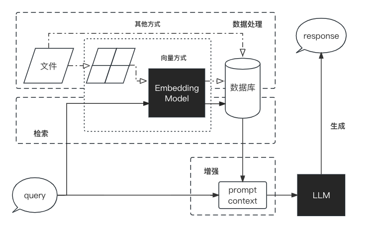

# 检索增强生成 RAG 简介

## 一、什么是 RAG

大型语言模型（LLM）相较于传统的语言模型具有更强大的能力，然而在某些情况下，它们仍可能无法提供准确的答案。为了解决大型语言模型在生成文本时面临的一系列挑战，提高模型的性能和输出质量，研究人员提出了一种新的模型架构，名为检索增强生成`RAG, Retrieval-Augmented Generation`。该架构巧妙地**整合了从庞大知识库中检索到的相关信息，并以此为基础，指导大型语言模型生成更为精准的答案**，从而显著提升了回答的准确性与深度。LLM 面临的主要问题有：

- **信息偏差/幻觉：** LLM 有时会产生与客观事实不符的信息，导致用户接收到不准确的信息。RAG 通过检索数据源，辅助模型生成过程，确保输出内容的精确性和可信度，减少信息偏差。

- **知识更新滞后性：** LLM 基于静态的数据集训练，这可能导致模型的知识更新滞后，无法及时反映最新的信息动态。RAG 通过实时检索最新数据，保持内容的时效性，确保信息的持续更新和准确性。

- **内容不可追溯：** LLM 生成的内容往往缺乏明确的信息来源，影响内容的可信度。RAG技术通过将生成内容与检索到的原始资料建立链接，增强了内容的可追溯性，从而提升了用户对生成内容的信任度。
- **领域专业知识能力欠缺：** LLM 在处理特定领域的专业知识时，可能会遇到一些挑战，这可能会影响到其在相关领域的回答质量。RAG 通过检索特定领域的相关文档，为模型提供丰富的上下文信息，从而提升了在专业领域内的问题回答质量和深度。

- **推理能力限制：** 面对复杂问题时，LLM 可能缺乏必要的推理能力，这影响了其对问题的理解和回答。RAG 结合检索到的信息和模型的生成能力，通过提供额外的背景知识和数据支持，增强了模型的推理和理解能力。

- **应用场景适应性受限：** LLM 需在多样化的应用场景中保持高效和准确，但单一模型可能难以全面适应所有场景。RAG 使得 LLM 能够通过检索对应应用场景数据的方式，灵活适应问答系统、推荐系统等多种应用场景。

- **长文本处理能力较弱：** LLM 在理解和生成长篇内容时受限于有限的上下文窗口，且必须按顺序处理内容，输入越长，速度越慢。RAG 通过检索和整合长文本信息，强化了模型对长上下文的理解和生成，有效突破了输入长度的限制，同时降低了调用成本，并提升了整体的处理效率。

## 二、RAG 的工作流程

RAG 是一个完整的系统，其工作流程可以简单地分为数据处理、检索、增强和生成四个阶段：

1. **数据处理阶段**
    1. 对原始数据进行清洗和处理。
    2. 将处理后的数据转化为检索模型可以使用的格式。
    3. 将处理后的数据存储在对应的数据库中。
2. **检索阶段**
    1. 将用户的问题输入到检索系统中，从数据库中检索相关信息。
3. **增强阶段**
    1. 对检索到的信息进行处理和增强，以便生成模型可以更好地理解和使用。
4. **生成阶段**
    1. 将增强后的信息输入到生成模型中，生成模型根据这些信息生成答案。
   
## 三、RAG VS Finetune

在提升大语言模型效果中，RAG 和 微调（Finetune）是两种主流的方法。 

Finetune 是在大语言模型的基础上，通过在特定数据集上进一步训练，来提升模型在特定任务上的表现。

| 特征比较 | RAG | 微调 (Fine-tuning) |
| --- | --- | --- |
| 知识更新 | 直接更新检索知识库，确保信息持续更新，无需频繁重新训练，非常适合动态变化的数据环境。 | 存储静态数据，需要重新训练用于知识和数据的更新。 |
| 外部知识 | 擅长利用外部资源，特别适合处理文档或其他结构化/非结构化数据库。 | 可用于将预训练中外部学习到的知识与大语言模型保持一致，但对于频繁变化的数据源可能不太实用。 |
| 数据处理 | 对数据的处理和操作要求极低。 | 依赖于构建高质量的数据集，有限的数据集可能无法显著提高性能。 |
| 模型定制 | 侧重于信息检索和融合外部知识，但可能无法充分定制模型行为或写作风格。 | 允许根据特定风格或术语调整 LLM 行为、写作风格或特定领域知识。 |
| 可解释性 | 答案能够追溯到具体的数据来源，提供更高的可解释性和可追踪性。 | 就像一个黑盒子，并不总是清楚模型为什么会做出某种反应，可解释性相对较低。 |
| 计算资源 | 需要计算资源来支持检索策略和数据库相关技术。外部数据源的整合和更新需保持维护。 | 有必要准备和整理高质量的训练数据集，确定微调目标，并提供相应的计算资源。 |
| 延迟要求 | 因涉及数据检索，可能带来较高的延迟。 | 经过微调的大语言模型 (LLM) 可以不通过检索直接回应，降低延迟。 |
| 降低幻觉 | 由于每个回答都基于检索到的实际证据，因此本质上更不容易产生错误或虚构的回答。 | 根据特定领域的数据训练模型，有助于减少幻觉，但面对未训练过的输入时仍可能出现幻觉。 |
| 伦理和隐私问题 | 从外部数据库存储和检索文本可能引起伦理和隐私方面的担忧。 | 训练数据中的敏感内容可能会引起伦理和隐私方面的问题。 |

## 四、RAG 的成功案例

RAG 已经在多个领域取得了成功，包括问答系统、对话系统、文档摘要、文档生成等。

我们将在第三部分对 RAG 的应用进行详细介绍。

1. [Datawhale 知识库助手](https://github.com/logan-zou/Chat_with_Datawhale_langchain) 是结合本课程内容、在由[散步](https://github.com/sanbuphy)打造的 [ChatWithDatawhale](https://github.com/sanbuphy/ChatWithDatawhale)——Datawhale内容学习助手的基础上，将架构调整为初学者容易学习的 LangChain 架构，并参考第二章内容对不同源大模型 API 进行封装的 LLM 应用，能够帮助用户与DataWhale 现有仓库和学习内容流畅对话,从而帮助用户快速找到想学习的内容和可以贡献的内容。
2. [天机](https://github.com/SocialAI-tianji/Tianji)是 SocialAI（来事儿AI）制作的一款免费使用、非商业用途的人工智能系统。您可以利用它进行涉及传统人情世故的任务，如如何敬酒、如何说好话、如何会来事儿等，以提升您的情商和核心竞争能力。我们坚信，只有人情世故才是未来AI的核心技术，只有会来事儿的AI才有机会走向AGI，让我们携手见证通用人工智能的来临。 —— "天机不可泄漏。"

【**参考内容**】：
1. [Retrieval-Augmented Generation for Large Language Models: A Survey](https://arxiv.org/abs/2312.10997)
2. [面向大语言模型的检索增强生成技术：综述 [译]](https://baoyu.io/translations/ai-paper/2312.10997-retrieval-augmented-generation-for-large-language-models-a-survey)