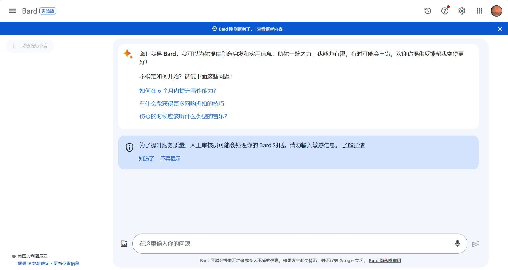
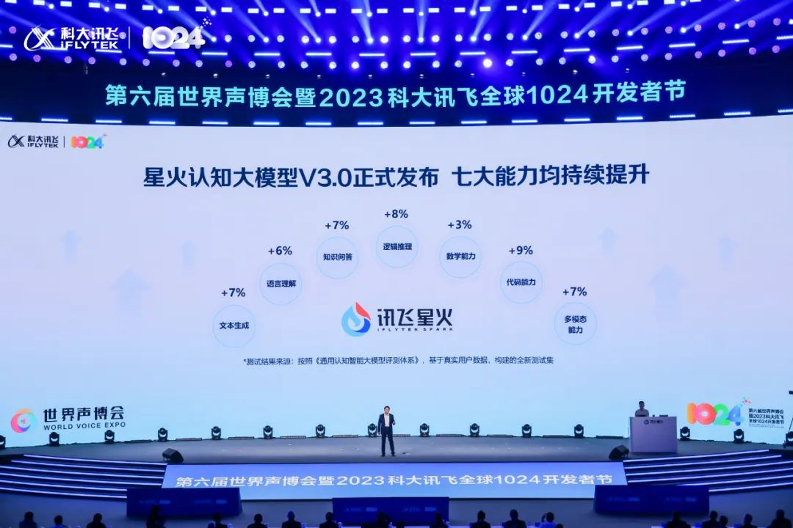
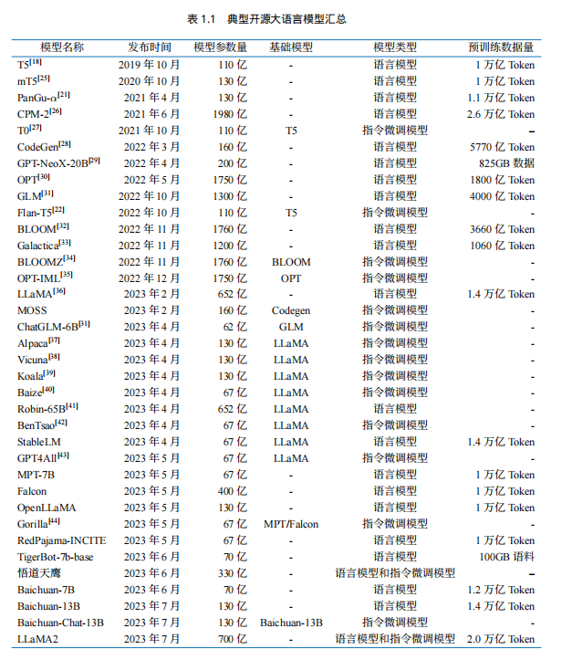

# 大型语言模型（LLM）理论简介

## 一、什么是大型语言模型（LLM）

### 1.1 大型语言模型（LLM）的概念
**大语言模型（LLM，Large Language Model），也称大型语言模型，是一种旨在理解和生成人类语言的人工智能模型**。

LLM 通常指包含**数百亿（或更多）参数的语言模型**，它们在海量的文本数据上进行训练，从而获得对语言深层次的理解。目前，国外的知名 LLM 有 GPT-3.5、GPT-4、PaLM、Claude 和 LLaMA 等，国内的有文心一言、讯飞星火、通义千问、ChatGLM、百川等。

为了探索性能的极限，许多研究人员开始训练越来越庞大的语言模型，例如拥有 `1750 亿`参数的 `GPT-3` 和 `5400 亿`参数的 `PaLM` 。尽管这些大型语言模型与小型语言模型（例如 `3.3 亿`参数的 `BERT` 和 `15 亿`参数的 `GPT-2`）使用相似的架构和预训练任务，但它们展现出截然不同的能力，尤其在解决复杂任务时表现出了惊人的潜力，这被称为“**涌现能力**”。以 GPT-3 和 GPT-2 为例，GPT-3 可以通过学习上下文来解决少样本任务，而 GPT-2 在这方面表现较差。因此，科研界给这些庞大的语言模型起了个名字，称之为“大语言模型（LLM）”。LLM 的一个杰出应用就是 **ChatGPT** ，它是 GPT 系列 LLM 用于与人类对话式应用的大胆尝试，展现出了非常流畅和自然的表现。

### 1.2 LLM 的发展历程

语言建模的研究可以追溯到`20 世纪 90 年代`，当时的研究主要集中在采用**统计学习方法**来预测词汇，通过分析前面的词汇来预测下一个词汇。但在理解复杂语言规则方面存在一定局限性。

随后，研究人员不断尝试改进，`2003 年`深度学习先驱 **Bengio** 在他的经典论文 `《A Neural Probabilistic Language Model》`中，首次将深度学习的思想融入到语言模型中。强大的**神经网络模型**，相当于为计算机提供了强大的"大脑"来理解语言，让模型可以更好地捕捉和理解语言中的复杂关系。

`2018 年`左右，**Transformer 架构的神经网络模型**开始崭露头角。通过大量文本数据训练这些模型，使它们能够通过阅读大量文本来深入理解语言规则和模式，就像让计算机阅读整个互联网一样，对语言有了更深刻的理解，极大地提升了模型在各种自然语言处理任务上的表现。

与此同时，研究人员发现，随着**语言模型规模的扩大（增加模型大小或使用更多数据）**，模型展现出了一些惊人的能力，在各种任务中的表现均显著提升。这一发现标志着大型语言模型（LLM）时代的开启。

### 1.3 常见的 LLM 模型

大语言模型的发展历程虽然只有短短不到五年的时间，但是发展速度相当惊人，截止 2023 年 6 月，国内外有超过百种大模型相继发布。下图按照时间线给出了 2019 年至 2023 年 6 月比较有影响力并且模型参数量超过 100 亿的大语言模型：

（该图来源于参考内容 [[1](https://arxiv.org/abs/2303.18223)]）

接下来我们主要介绍几个国内外常见的大模型（包括开源和闭源）

#### 1.3.1 闭源 LLM (未公开源代码)

<!--  -->

##### 1.3.1.1 GPT 系列

**OpenAI** 公司在 `2018 年`提出的 **GPT（Generative Pre-Training）** 模型是典型的 `生成式预训练语言模型` 之一。

GPT 模型的基本原则是**通过语言建模将世界知识压缩到仅解码器 (decoder-only) 的 Transformer 模型中**，这样它就可以恢复(或记忆)世界知识的语义，并充当通用任务求解器。它能够成功的两个关键点：

- 训练能够准确预测下一个单词的 decoder-only 的 Transformer 语言模型
- 扩展语言模型的大小
  
OpenAI 在 LLM 上的研究大致可以分为以下几个阶段：

接下来，我们将从模型规模、特点等方面，介绍大家熟知的  ChatGPT 与 GPT4：

##### 1.3.1.1.1 ChatGPT

> [ChatGPT使用地址](https://chat.openai.com)

`2022 年 11 月`，**OpenAI** 发布了基于 GPT模型（GPT-3.5 和 GPT-4） 的**会话应用 ChatGPT**。由于与人类交流的出色能力，ChatGPT 自发布以来就引发了人工智能社区的兴奋。ChatGPT 是基于强大的 GPT 模型开发的，具有特别优化的会话能力。

ChatGPT 从本质上来说是一个 LLM 应用，是基于基座模型开发出来的，与基座模型有本质的区别。其支持 GPT-3.5 和 GPT-4 两个版本。

现在的 ChatGPT 支持最长达 32,000 个字符，知识截止日期是 2021 年 9 月，它可以执行各种任务，包括**代码编写、数学问题求解、写作建议**等。ChatGPT 在与人类交流方面表现出了卓越的能力：拥有丰富的知识储备，对数学问题进行推理的技能，在多回合对话中准确追踪上下文，并且与人类安全使用的价值观非常一致。后来，ChatGPT 支持插件机制，这进一步扩展了 ChatGPT 与现有工具或应用程序的能力。到目前为止，它似乎是人工智能历史上最强大的聊天机器人。ChatGPT 的推出对未来的人工智能研究具有重大影响，它为探索类人人工智能系统提供了启示。

##### 1.3.1.1.2 GPT-4

`2023 年 3 月`发布的 GPT-4，它将**文本输入扩展到多模态信号**。GPT3.5 拥有 1750亿 个参数，而 GPT4 的参数量官方并没有公布，但有相关人员猜测，GPT-4 在 120 层中总共包含了 1.8 万亿参数，也就是说，GPT-4 的规模是 GPT-3 的 10 倍以上。因此，GPT-4 比 GPT-3.5 **解决复杂任务的能力更强，在许多评估任务上表现出较大的性能提升**。

最近的一项研究通过对人为生成的问题进行定性测试来研究 GPT-4 的能力，这些问题包含了各种各样的困难任务，并表明 GPT-4 可以比之前的 GPT 模型(如 GPT3.5 )实现更优越的性能。此外，由于六个月的迭代校准(在 RLHF 训练中有额外的安全奖励信号)，GPT-4 对恶意或挑衅性查询的响应更安全，并应用了一些干预策略来缓解 LLM 可能出现的问题，如幻觉、隐私和过度依赖。

> 注意：2023 年 11 月 7 日， OpenAI 召开了首个开发者大会，会上推出了最新的大语言模型 GPT-4 Turbo，Turbo 相当于进阶版。它将上下文长度扩展到 128k，相当于 300 页文本，并且训练知识更新到 2023 年 4 月

##### 1.3.1.2 Claude 系列

Claude 系列模型是由 OpenAI 离职人员创建的 **Anthropic** 公司开发的闭源语言大模型。

> [Claude 使用地址](https://claude.ai/chats)

最早的 **Claude** 于 `2023 年 3 月 15 日`发布，在 2023 年 7 月 11 日，更新至 **Claude-2**， 并在 `2024 年 3 月 4 日`更新至 **Claude-3**。

1. **全面超越 GPT-4**：Claude 3 系列在推理、数学、编码、多语言理解和视觉方面全面超越了 GPT-4 等现有的大模型。

2. **多模态能力**：Claude 3 模型能够处理包括文本、语音、图像、音乐等多种模态交织的指令，并能熟练地选择合适的多模态组合进行响应。

3. **增强的智能和速度**：与前代模型相比，Claude 3 系列在智能水平和响应速度上都有显著提升，特别是在处理长文本和多模态数据方面。

4. **安全性和可解释性**：Anthropic 在开发 Claude 3 时特别注重模型的可解释性和安全性，以减少 AI 偏见和错误决策的风险，并提高用户对 AI 系统的信任。

5. **实时响应**：Claude 3 模型支持实时客户聊天、自动完成和数据提取任务，能够快速且实时地提供响应。

6. **减少拒绝**：与之前的模型相比，Claude 3 系列减少了对用户请求的不必要拒绝，提高了用户体验。

7. **长上下文处理**：所有三个模型默认支持 200k token的上下文窗口，并具有强大的记忆能力。对于有特定需求的用户，可以定制到1百万 token的上下文窗口

Claude 3 系列包括三个不同的模型，分别是 Claude 3 Haiku、Claude 3 Sonnet 和 Claude 3 Opus，它们的能力依次递增，旨在满足不同用户和应用场景的需求。

##### 1.3.1.1.3 PaLM/Gemini 系列

**PaLM 系列**语言大模型由 **Google** 开发。其初始版本于 `2022 年 4 月`发布，并在 2023 年 3 月公开了 API。2023 年 5 月，Google 发布了 **PaLM 2**，`2024 年 2 月 1 日`，Google 将 Bard(之前发布的对话应用) 的底层大模型驱动由 PaLM2 更改为 **Gemini**，同时也将原先的 Bard 更名为 **Gemini**。

> [PaLM 官方地址](https://ai.google/discover/palm2/)
> [Gemini 使用地址](https://gemini.google.com/)

目前的 Gemini 是第一个版本，即 Gemini 1.0，根据参数量不同分为 Ultra, Pro 和 Nano三个版本。

根据 Google 发布的 benchmark 测试，Gemini Ultra 在绝大多数任务中超越了 GPT-4，达到了最先进的性能。

以下窗口是 Google 基于 PaLM2 开发的对话应用 Bard:

##### 1.3.1.1.4 文心一言
> [文心一言使用地址](https://yiyan.baidu.com)

**文心一言是基于百度文心大模型的知识增强语言大模型**，于 `2023 年 3 月`在国内率先开启邀测。文心一言的基础模型文心大模型于 2019 年发布 1.0 版，现已更新到 **4.0** 版本。更进一步划分，文心大模型包括 NLP 大模型、CV 大模型、跨模态大模型、生物计算大模型、行业大模型，其中 NLP 大模型主要为 ERNIE 系列模型，是打造文心一言的关键。文心大模型参数量非常大，达到了 2600 亿。

2023 年 8 月 31 日，文心一言率先向全社会全面开放，提供 APP、网页版、API 接口等多种形式的开放服务。文心一言一方面采用有监督精调、人类反馈的强化学习、提示等技术，还具备知识增强、检索增强和对话增强等关键技术。文心一言基于飞桨深度学习框架进行训练，算法与框架的协同优化后效果和效率都得到提升，模型训练速度达到优化前的 3 倍，推理速度达到优化前的 30 多倍。文心一言还建设了插件机制，通过外部工具、服务的调用，拓展大模型的能力的边界。

##### 1.3.1.1.5 星火大模型
> [星火大模型使用地址](https://xinghuo.xfyun.cn)

**讯飞星火认知大模型**是**科大讯飞**发布的语言大模型，支持多种自然语言处理任务。该模型于 `2023 年 5 月`首次发布，后续经过多次升级，增强了开放式知识问答、多轮对话、逻辑和数学能力，以及代码和多模态能力。星火大模型包含超过 1700 亿个参数，主要基于大量的语言数据集训练，特别擅长处理中文。基于这个模型，科大讯飞发布了智能编程助手 iFlyCode1.0 和讯飞智作 2.0 两款应用产品。此外，讯飞和华为还联合发布了支持大模型训练私有化的产品“星火一体机”。`2023 年 10 月`，讯飞发布了**讯飞星火认知大模型 V3.0** ，全面提升了七大能力，特别在中文处理、医疗、法律、教育等专业领域表现突出，同时在代码项目级理解能力、小样本学习、多模态指令跟随与细节表达等能力也有所提升。

以下是讯飞星火的使用界面：

#### 1.3.2. 开源 LLM
<!--  -->
##### 1.3.2.1 LLaMA 系列
> [LLaMA 官方地址](https://llama.meta.com)

> [LLaMA 开源地址](https://github.com/facebookresearch/llama)

**LLaMA 系列模型**是 **Meta** 开源的一组参数规模 **从 7B 到 70B** 的基础语言模型。LlaMa 于`2023 年 2 月`发布，并于 `2023 年 7 月`发布了 **LlaMa2** 模型。它们都是在数万亿个字符上训练的，展示了如何**仅使用公开可用的数据集来训练最先进的模型**，而不需要依赖专有或不可访问的数据集。这些数据集包括 Common Crawl、Wikipedia、OpenWebText2、RealNews、Books 等。LLaMA 模型使用了**大规模的数据过滤和清洗技术**，以提高数据质量和多样性，减少噪声和偏见。LLaMA 模型还使用了高效的**数据并行**和**流水线并行**技术，以加速模型的训练和扩展。特别地，LLaMA 13B 在 CommonsenseQA 等 9 个基准测试中超过了 GPT-3 (175B)，而 **LLaMA 65B 与最优秀的模型 Chinchilla-70B 和 PaLM-540B 相媲美**。LLaMA 通过使用更少的字符来达到最佳性能，从而在各种推理预算下具有优势。

与 GPT 系列相同，LLaMA 模型也采用了 **decoder-only** 架构，同时结合了一些前人工作的改进：
- `Pre-normalization 正则化`：为了提高训练稳定性，LLaMA 对每个 Transformer子层的输入进行了 RMSNorm 归一化，这种归一化方法可以避免梯度爆炸和消失的问题，提高模型的收敛速度和性能；
- `SwiGLU 激活函数`：将 ReLU 非线性替换为 SwiGLU 激活函数，增加网络的表达能力和非线性，同时减少参数量和计算量；
- `旋转位置编码（RoPE，Rotary Position Embedding）`：模型的输入不再使用位置编码，而是在网络的每一层添加了位置编码，RoPE 位置编码可以有效地捕捉输入序列中的相对位置信息，并且具有更好的泛化能力。

这些改进使得 LLaMA 模型在自然语言理解、生成、对话等任务上都取得了较好的结果。

**LLaMA2** 在 LLaMA 系列模型的基础上进行了改进，提高了模型的性能和效率：
- `更多的训练数据量`：LLaMA2 在 2 万亿个 token 的数据上进行预训练，相比LLaMA1 的训练数据量增加了40%。LLaMA2 能够接触到更多的文本信息，从而提高了其理解和生成文本的能力。

- `更长的上下文长度`：LLaMA2 的上下文长度增加了一倍，从 LLaMA1 的 2048个 token 增加到了 4096。这使得 LLaMA2 能够处理更长的文本序列，改善了对长文本的理解和生成能力。

- `分组查询注意力（GQA，Grouped-Query Attention）`：通过将查询（query）分组并在组内共享键（key）和值（value），减少了计算量，同时保持了模型性能，提高了大型模型的推理效率。

##### 1.3.2.2 通义千问
> [通义千问使用地址](https://tongyi.aliyun.com)

> [通义千问开源地址](https://github.com/QwenLM/Qwen/tree/main)

**通义千问由阿里巴巴基于“通义”大模型研发**，于 `2023 年 4 月`正式发布。2023 年 8 月，阿里云开源了 Qwen（通义千问）系列工作。并于 `2024 年 2 月 5 日`，开源了 **Qwen1.5**（Qwen2 的测试版）是一个 **decoder-Only** 的模型，采用 `SwiGLU 激活`、`RoPE`、`multi-head attention`的架构。目前，已经开源了 6 种模型大小：**0.5B、1.8B、4B、7B、14B 和 72B**；

对比 Qwen1 进行了全方位的提升：
- 聊天模型质量显著提高；
- 加强了基础模型和聊天模型的多语言功能；
- 所有模型均支持长度为 **32768 个 token** 的上下文；
- 所有模式都启用了系统提示

以下是通义千问的使用界面：

##### 1.3.2.3 GLM 系列

> [ChatGLM 使用地址](https://chatglm.cn/)

> [ChatGLM 开源地址](https://github.com/THUDM)

**GLM 系列模型**是**清华大学和智谱 AI 等**合作研发的。`ChatGLM` 是基于 GLM 结构开发的具有 **62 亿参数量**的语言大模型，**支持 2048 的上下文长度**。其使用了包含 1 万亿字符的中英文语料进行训练。

2023 年 6 月发布了 **ChatGLM 2**。2023 年 10 月推出了 **ChatGLM3**，**ChatGLM3-6B** 是 ChatGLM3 系列中的开源模型，在保留了前两代模型对话流畅、部署门槛低等众多优秀特性的基础上，引入了如下特性：

- **更强大的基础模型**： ChatGLM3-6B 的基础模型 **ChatGLM3-6B-Base** 采用了更多样的训练数据、更充分的训练步数和更合理的训练策略。在语义、数学、推理、代码、知识等不同角度的数据集上测评显示，ChatGLM3-6B-Base 具有在 10B 以下的基础模型中最强的性能。
- **更完整的功能支持**： ChatGLM3-6B 采用了全新设计的 Prompt 格式，除正常的多轮对话外。同时原生支持工具调用（Function Call）、代码执行（Code Interpreter）和 Agent 任务等复杂场景。
- **更全面的开源序列**： 除了`对话模型 ChatGLM3-6B` 外，还开源了`基础模型 ChatGLM3-6B-Base`、`长文本对话模型 ChatGLM3-6B-32K`。

此外，还开源了 `多模态 CogVLM-17B` 、以及 `智能体 AgentLM` 等全面对标 OpenAI：

- 在对话模型上，对标 ChatGPT 的是 ChatGLM
- 在文生图方面，对标 DALL.E 的是 CogView
- 代码生成上，与 Codex 相对的是 CodeGeeX
- 搜索增强上，与 WebGPT 相对的是 WebGLM
- 在多模态、图文理解领域，与 GPT-4V 对标的有 ChatGLM3
  
`2024 年 1 月 16 日` 发布了 **ChatGLM4**，但**目前还没有开源**。

以下是智谱清言的使用界面：

##### 1.3.2.4 Baichuan 系列

**Baichuan** 是由**百川智能**开发的**开源可商用**的语言大模型，在权威的中文和英文 benchmark 上均取得同尺寸最好的效果，其基于**Transformer 解码器架构（decoder-only）**。

> [百川使用地址](https://www.baichuan-ai.com/chat)

> [百川开源地址](https://github.com/baichuan-inc)

2023 年 6 月 15 日发布了 `Baichuan-7B` 和 `Baichuan-13B`。`Baichuan-7B` 是在大约 1.2 万亿字符上训练的 **70 亿参数**模型，支持**中英双语，最大 4096 的上下文窗口长度**。

`Baichuan-13B` 进一步扩大参数量到 **130 亿**，并且在高质量的语料上训练了 1.4 万亿 字符。使用 `ALiBi 位置编码`，最大 4096 的上下文窗口长度。百川同时开源了`预训练`和`对齐`模型，**预训练模型是面向开发者的“基座”，而对齐模型则面向广大需要对话功能的普通用户**。

**Baichuan2** 于 `2023年 9 月 6 日`推出。`Baichuan2-7B` 和 `Baichuan2-13B`，均基于 2.6 万亿 Tokens 的高质量语料训练，在保留了上一代开源模型良好的生成与创作能力，流畅的多轮对话能力以及部署门槛较低等众多特性的基础上，两个模型在数学、代码、安全、逻辑推理、语义理解等能力有显著提升。Baichuan 2 在多个权威的中文、英文和多语言的通用、领域 benchmark 上取得同尺寸最佳的效果。发布了 7B、13B 的 Base 和 Chat 版本，并提供了 Chat 版本的 4bits 量化。 

`2023 年 1 月 29 日` 发布了 **Baichuan 3**。Baichuan 3 在多个通用能力评测中展现了卓越的性能，特别是在中文任务上，其评测结果超过了 GPT-4。在数学和代码专项评测中同样表现出色，且是目前中文医疗任务表现最佳的大模型。

为了解决超千亿参数模型在训练过程中遇到的挑战，百川智能提出了多种创新技术手段及方案，包括 **“动态数据选择”、“重要度保持”以及“异步 Checkpoint 存储”等**，有效提升了其各项能力。

但是**目前还没有开源**。

以下是百川大模型的使用界面：

## 二、LLM 的能力与特点

### 2.1 LLM 的能力

#### 2.1.1 涌现能力（emergent abilities）

区分大语言模型（LLM）与以前的预训练语言模型（PLM）最显著的特征之一是它们的 `涌现能力` 。涌现能力是一种令人惊讶的能力，它在小型模型中不明显，但在大型模型中特别突出。可以类比到物理学中的相变现象，涌现能力的显现就像是模型性能随着规模增大而迅速提升，超过了随机水平，也就是我们常说的**量变引起质变**。

具体来说，涌现能力可以定义为与某些复杂任务相关的能力，但我们更关注的是它们具备的通用能力，也就是能够应用于解决各种任务的能力。接下来，让我们简要介绍三个典型的 LLM 涌现能力：

1. **上下文学习**：上下文学习能力是由 GPT-3 首次引入的。这种能力允许语言模型在提供自然语言指令或多个任务示例的情况下，通过理解上下文并生成相应输出的方式来执行任务，而无需额外的训练或参数更新。

2. **指令遵循**：通过使用自然语言描述的多任务数据进行微调，也就是所谓的 `指令微调` ，LLM 被证明在同样使用指令形式化描述的未见过的任务上表现良好。这意味着 LLM 能够根据任务指令执行任务，而无需事先见过具体示例，这展示了其强大的泛化能力。

3. **逐步推理**：小型语言模型通常难以解决涉及多个推理步骤的复杂任务，例如数学问题。然而，LLM 通过采用 `思维链（CoT, Chain of Thought）` 推理策略，利用包含中间推理步骤的提示机制来解决这些任务，从而得出最终答案。据推测，这种能力可能是通过对代码的训练获得的。

这些涌现能力让 LLM 在处理各种任务时表现出色，使它们成为了解决复杂问题和应用于多领域的强大工具。
#### 2.1.2 作为基座模型支持多元应用的能力

在 2021 年，斯坦福大学等多所高校的研究人员提出了基座模型（foundation model）的概念，这更清晰地描述了之前学界所称的预训练模型的作用。这是一种全新的 AI 技术范式，借助于海量无标注数据的训练，获得可以适用于大量下游任务的大模型（单模态或者多模态）。这样，多个应用可以只依赖于一个或少数几个大模型进行统一建设。

大语言模型是这个新模式的典型例子，使用统一的大模型可以极大地提高研发效率，相比于分散的模型开发方式，这是一项本质上的进步。大型模型不仅可以缩短每个具体应用的开发周期，减少所需人力投入，也可以基于大模型的推理、常识和写作能力，获得更好的应用效果。因此，大模型可以成为 AI 应用开发的大一统基座模型，这是一个一举多得、全新的范式，值得大力推广。

#### 2.1.3 支持对话作为统一入口的能力

让大语言模型真正火爆的契机，是基于对话聊天的 ChatGPT。事实上，业界很早就发现了用户对于对话交互的特殊偏好，陆奇在微软期间，2016 年就推进过“对话即平台（conversation as a platform）” 的战略。此外，苹果 Siri 、亚马逊 Echo 等基于语音对话的产品也非常受欢迎，反映出互联网用户对于聊天和对话这种交互模式的偏好。虽然之前的聊天机器人存在各种问题，但大型语言模型的出现再次让聊天机器人这种交互模式可以重新想像。用户愈发期待像钢铁侠中“贾维斯”一样的人工智能，无所不能、无所不知。这引发我们对于`智能体（Agent）`类型应用前景的思考，Auto-GPT、微软 Jarvis 等项目已经出现并受到关注，相信未来会涌现出很多类似的以对话形态让助手完成各种具体工作的项目。

### 2.2 LLM 的特点

大语言模型具有多种显著特点，这些特点使它们在自然语言处理和其他领域中引起了广泛的兴趣和研究。以下是大语言模型的一些主要特点：

1. **巨大的规模：** LLM 通常具有巨大的参数规模，可以达到数十亿甚至数千亿个参数。这使得它们能够捕捉更多的语言知识和复杂的语法结构。

2. **预训练和微调：** LLM 采用了预训练和微调的学习方法。它们首先在大规模文本数据上进行预训练（无标签数据），学会了通用的语言表示和知识，然后通过微调（有标签数据）适应特定任务，从而在各种 NLP 任务中表现出色。

3. **上下文感知：** LLM 在处理文本时具有强大的上下文感知能力，能够理解和生成依赖于前文的文本内容。这使得它们在对话、文章生成和情境理解方面表现出色。

4. **多语言支持：** LLM 可以用于多种语言，不仅限于英语。它们的多语言能力使得跨文化和跨语言的应用变得更加容易。

5. **多模态支持：** 一些 LLM 已经扩展到支持多模态数据，包括文本、图像和声音。这意味着它们可以理解和生成不同媒体类型的内容，实现更多样化的应用。

6. **涌现能力：** LLM 表现出令人惊讶的涌现能力，即在大规模模型中出现但在小型模型中不明显的性能提升。这使得它们能够处理更复杂的任务和问题。

7. **多领域应用：** LLM 已经被广泛应用于文本生成、自动翻译、信息检索、摘要生成、聊天机器人、虚拟助手等多个领域，对人们的日常生活和工作产生了深远的影响。

8. **伦理和风险问题：** 尽管 LLM 具有出色的能力，但它们也引发了伦理和风险问题，包括生成有害内容、隐私问题、认知偏差等。因此，研究和应用 LLM 需要谨慎。

总之，大语言模型是一种具有强大语言处理能力的技术，已经在多个领域展示了潜力。它们为自然语言理解和生成任务提供了强大的工具，同时也引发了对其伦理和风险问题的关注。这些特点使LLM成为了当今计算机科学和人工智能领域的重要研究和应用方向

## 三、LLM 的应用与影响

LLM 已经在许多领域产生了深远的影响。在**自然语言处理**领域，它可以帮助计算机更好地理解和生成文本，包括写文章、回答问题、翻译语言等。在**信息检索**领域，它可以改进搜索引擎，让我们更轻松地找到所需的信息。在**计算机视觉**领域，研究人员还在努力让计算机理解图像和文字，以改善多媒体交互。

最重要的是，LLM 的出现让人们重新思考了 **通用人工智能（AGI）** 的可能性。AGI 是一种像人类一样思考和学习的人工智能。LLM 被认为是 AGI 的一种早期形式，这引发了对未来人工智能发展的许多思考和计划。

总之，LLM 是一种令人兴奋的技术，它让计算机更好地理解和使用语言，正在改变着我们与技术互动的方式，同时也引发了对未来人工智能的无限探索。希望这篇文章让你对 LLM 有了更清晰的认识！

>在下一章我们将介绍 LLM 时期一个重要的技术 RAG。

【**参考内容**】：
1. [A Survey of Large Language Models
](https://arxiv.org/abs/2303.18223)
1. [周枫：当我们谈论大模型时，应该关注哪些新能力？](https://xueqiu.com/1389978604/248392718)