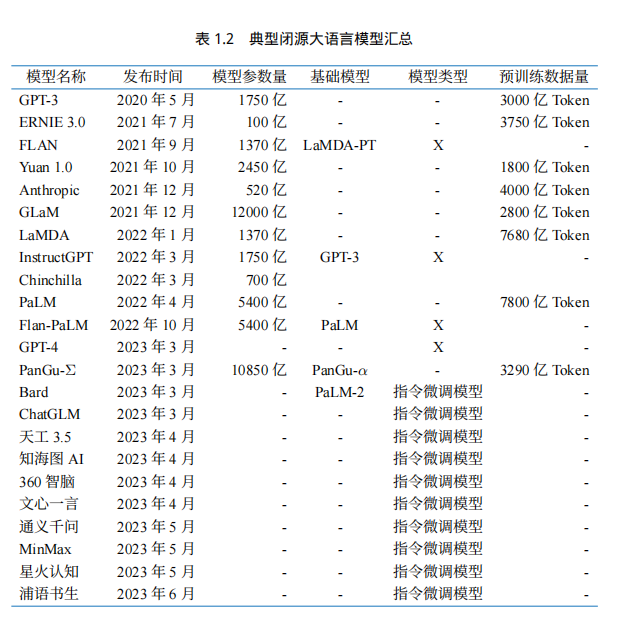

# 大型语言模型（LLM）理论简介

- [大型语言模型（LLM）理论简介](#大型语言模型llm理论简介)
  - [一、什么是大型语言模型（LLM）](#一什么是大型语言模型llm)
    - [1.1 大型语言模型（LLM）的概念](#11-大型语言模型llm的概念)
    - [1.2 LLM 的发展历程](#12-llm-的发展历程)
    - [1.3 常见的 LLM 模型](#13-常见的-llm-模型)
      - [1.3.1 闭源 LLM (未公开源代码)](#131-闭源-llm-未公开源代码)
        - [1.3.1.1 GPT 系列](#1311-gpt-系列)
          - [1.3.1.1.1 ChatGPT](#13111-chatgpt)
          - [1.3.1.1.2 知识型模型 GPT-4.5, GPT-4o, GPT-4o mini](#13112-知识型模型-gpt-45-gpt-4o-gpt-4o-mini)
          - [1.3.1.1.3 推理型模型 o1, o1 mini 和 o3 mini](#13113-推理型模型-o1-o1-mini-和-o3-mini)
        - [1.3.1.2 Claude 系列](#1312-claude-系列)
        - [1.3.1.3 Gemini 系列](#1313-gemini-系列)
        - [1.3.1.4 文心一言](#1314-文心一言)
        - [1.3.1.5 星火大模型](#1315-星火大模型)
      - [1.3.2 开源 LLM](#132-开源-llm)
        - [1.3.2.1 LLaMA 系列](#1321-llama-系列)
        - [1.3.2.2 DeepSeek 系列](#1322-deepseek-系列)
        - [1.3.2.3 通义千问](#1323-通义千问)
        - [1.3.2.4 GLM 系列](#1324-glm-系列)
        - [1.3.2.5 Baichuan 系列](#1325-baichuan-系列)
  - [二、LLM 的能力与特点](#二llm-的能力与特点)
    - [2.1 LLM 的能力](#21-llm-的能力)
      - [2.1.1 涌现能力（emergent abilities）](#211-涌现能力emergent-abilities)
      - [2.1.2 作为基座模型支持多元应用的能力](#212-作为基座模型支持多元应用的能力)
      - [2.1.3 支持对话作为统一入口的能力](#213-支持对话作为统一入口的能力)
    - [2.2 LLM 的特点](#22-llm-的特点)
  - [三、LLM 的应用与影响](#三llm-的应用与影响)

## 一、什么是大型语言模型（LLM）

### 1.1 大型语言模型（LLM）的概念

**大语言模型（LLM，Large Language Model），也称大型语言模型，是一种旨在理解和生成人类语言的人工智能模型**。

LLM 通常指包含**数百亿（或更多）参数的语言模型**，它们在海量的文本数据上进行训练，从而获得对语言深层次的理解。目前，国外的知名 LLM 有 GPT、LLaMA、Gemini、Claude 和 Grok 等，国内的有 DeepSeek、通义千问、豆包、Kimi、文心一言、GLM 等。

为了探索性能的极限，许多研究人员开始训练越来越庞大的语言模型，例如拥有 `175B (1750 亿)`参数的 `GPT-3` 和 `540B（5400 亿）`参数的 `PaLM` 。尽管这些大型语言模型与小型语言模型（例如 `3.3 亿`参数的 `BERT` 和 `15 亿`参数的 `GPT-2`）使用相似的架构和预训练任务，但它们展现出截然不同的能力，尤其在解决复杂任务时表现出了惊人的潜力，这被称为“**涌现能力**”。以 GPT-3 和 GPT-2 为例，GPT-3 可以通过学习上下文来解决少样本任务，而 GPT-2 在这方面表现较差。因此，科研界给这些庞大的语言模型起了个名字，称之为“大语言模型（LLM）”。LLM 的一个杰出应用就是 **ChatGPT** ，它是 GPT 系列 LLM 用于与人类对话式应用的大胆尝试，展现出了非常流畅和自然的表现。

### 1.2 LLM 的发展历程

语言建模的研究可以追溯到`20 世纪 90 年代`，当时的研究主要集中在采用**统计学习方法**来预测词汇，通过分析前面的词汇来预测下一个词汇。但在理解复杂语言规则方面存在一定局限性。

随后，研究人员不断尝试改进，`2003 年`深度学习先驱 **Bengio** 在他的经典论文 `《A Neural Probabilistic Language Model》`中，首次将深度学习的思想融入到语言模型中。强大的**神经网络模型**，相当于为计算机提供了强大的"大脑"来理解语言，让模型可以更好地捕捉和理解语言中的复杂关系。

`2018 年`左右，**Transformer 架构的神经网络模型**开始崭露头角。通过大量文本数据训练这些模型，使它们能够通过阅读大量文本来深入理解语言规则和模式，就像让计算机阅读整个互联网一样，对语言有了更深刻的理解，极大地提升了模型在各种自然语言处理任务上的表现。

与此同时，研究人员发现，随着**语言模型规模的扩大（增加模型大小或使用更多数据）**，模型展现出了一些惊人的能力，在各种任务中的表现均显著提升（Scaling Law）。这一发现标志着大型语言模型（LLM）时代的开启。

通常大模型由三个阶段构成：预训练、后训练和在线推理。在 2024 年 9 月之前，大模型领域仅存在预训练阶段的 Scaling Law。然而，随着 OpenAI o1 的推出，后训练和在线推理阶段也各自拥有了 Scaling Law，即后训练阶段的强化学习 Scaling Law（RL Scaling Law）和在线推理阶段的 Inference Scaling Law（Test Time Scaling Law）。  随着各阶段计算量的增加，大模型的性能不断增长。

### 1.3 常见的 LLM 模型

大语言模型的发展历程虽然只有短短不到五年的时间，但是发展速度相当惊人，截止 2024 年 6 月，国内外有超过百种大模型相继发布。下图按照时间线给出了 2019 年至 2024 年 6 月比较有影响力并且模型参数量超过 100 亿的大语言模型：

（该图来源于参考内容 [[1](https://arxiv.org/abs/2303.18223)]）

接下来我们主要介绍几个国内外常见的大模型（包括开源和闭源）

#### 1.3.1 闭源 LLM (未公开源代码)

<!--  -->

##### 1.3.1.1 GPT 系列

> [OpenAI 模型介绍](https://platform.openai.com/docs/models)

**OpenAI** 公司在 `2018 年` 提出的 **GPT（Generative Pre-Training）** 模型是典型的 `生成式预训练语言模型` 之一。

GPT 模型的基本原则是**通过语言建模将世界知识压缩到仅解码器 (decoder-only) 的 Transformer 模型中**，这样它就可以恢复(或记忆)世界知识的语义，并充当通用任务求解器。它能够成功的两个关键点：

- 训练能够准确预测下一个单词的 decoder-only 的 Transformer 语言模型
- 扩展语言模型的大小

OpenAI 在 LLM 上的研究大致可以分为以下几个阶段：

目前，GPT 系列已形成 **知识型** 与 **推理型** 两大技术分支。

###### 1.3.1.1.1 ChatGPT

> [ChatGPT 使用地址](https://chat.openai.com)

`2022 年 11 月`，**OpenAI** 发布了基于 GPT 模型（GPT-3.5 和 GPT-4）的**会话应用 ChatGPT**。由于与人类交流的出色能力，ChatGPT 自发布以来就引发了人工智能社区的兴奋。ChatGPT 本质上是一个 LLM 应用，是基于基座模型开发出来的，与基座模型有本质的区别。ChatGPT 上线后用户增长迅速，5 天注册人数突破 100 万，两个月后月活用户破亿，成为当时史上用户增长最快的消费级应用程序。

随着不断迭代，ChatGPT 逐渐丰富了其功能：

- 插件系统：允许开发者创建工具扩展 ChatGPT 的能力，实现网页浏览、数据分析和第三方服务调用
- 实时语音和视频对话：用户可与 AI 进行自然的语音和视频交流，支持手势识别和情感表达
- 多模态能力：能够分析和理解用户提供的图片、音频和视频，实现全面的多模态交互
- 自定义指令与记忆功能：记住用户之前的交互习惯和偏好，提供个性化体验
- GPT 构建器平台：允许用户无需编程创建专用的 AI 助手，支持自定义知识库和行为模式
- 数据分析与可视化：直接处理和分析上传的数据文件，生成图表和可视化报告
- 知识型与推理型双模式：可在 GPT-4.5 (知识型) 和 o1/o3 (推理型) 之间切换，满足不同场景需求
- 思维链展示：在推理型模型中可选择性展示思考过程，帮助用户理解推理步骤

###### 1.3.1.1.2 知识型模型 GPT-4.5, GPT-4o, GPT-4o mini

- `2023 年 3 月` 发布的 **GPT-4** 引入了多模态能力，相比 GPT-3.5 的 1750 亿参数，GPT-4 规模显著扩大（推测约 1.8 万亿参数），在解决复杂任务和评估任务上展现出较大的性能提升。
- `2024 年 5 月` 发布的 **GPT-4o**（"o"代表"omni"全能）具备对文本、语音、图像三种模态的深度理解能力，主要特点包括：
  - **多模态融合**：无缝理解和生成多种形式内容
  - **实时对话**：响应速度比 GPT-4 快约 2 倍
  - **情感表达**：在语音互动中传递更丰富的情感变化
  - **成本效益**：API 定价降低约 50%
- `2024 年 7 月` 发布的 **GPT-4o mini** 是一款面向消费级应用的轻量级模型，价格更加亲民，适合日常对话和基础任务场景。
- `2025 年 2 月` 发布的 **GPT-4.5** 在知识广度、推理深度和创意表达方面有显著提升，特别强化了对客观事实的准确性，尤其是情商方面异常优秀。上下文长度扩展至 **512K**。是 OpenAI 的最后一个非思维链模型。

主流知识型模型对比：

|  模型名称   | 上下文长度 |         特点         | 知识截止日期  |
| :---------: | :--------: | :------------------: | :-----------: |
|    GPT-4    |    16k     |    经济，专门对话    | 2021 年 9 月  |
|   GPT-4o    |    128k    |    多模态，速度快    | 2023 年 10 月 |
|   GPT-4.5   |    128k    | 最强知识型，精准度高 | 2023 年 10 月 |
| GPT-4o mini |    128k    | 轻量知识型，性价比高 | 2023 年 10 月 |

###### 1.3.1.1.3 推理型模型 o1, o1 mini 和 o3 mini

- `2024 年 9 月` 发布的 **o1-mini**、**o1-preview** 是专为复杂推理设计的模型，在回答前会先生成一段思维链（不公开），优先考虑精确性和推理步骤的正确性。
  - **超强推理能力**：在数学、编程和逻辑推理等任务中表现卓越
  - **解题过程可靠**：注重解题中间步骤的正确性
  - **问题分解能力**：将复杂问题分解为可管理的子问题
  - **自纠错机制**：识别错误并主动纠正
- `2024 年 12 月` 发布的 **o1** 比 o1-preview 可以在更快的时间内响应，思考的时间更短。
- `2025 年 1 月` 发布的 **o3-mini** 可以显示部分思维链，与 o1 相比，可以保持效果的情况下，响应速度更快。

| 模型名称 | 上下文长度 |       特点       | 知识截止日期  |
| :------: | :--------: | :--------------: | :-----------: |
|    o1    |    128k    |  强推理能力，慢  | 2023 年 10 月 |
| o1 mini  |    200k    |  轻量推理，中速  | 2023 年 10 月 |
| o3 mini  |    200k    | 超轻量推理，最快 | 2023 年 10 月 |

OpenAI 的模型战略形成了"知识型"和"推理型"两条互补产品线：知识型模型专注于广泛知识覆盖和流畅对话体验，推理型模型专注于精确推理和复杂问题求解，让用户可根据具体需求选择最适合的模型类型。

##### 1.3.1.2 Claude 系列

Claude 系列模型是由 OpenAI 离职人员创建的 **Anthropic** 公司开发的闭源语言大模型。

> [Claude 使用地址](https://claude.ai/chats)

- 最早的 **Claude** 于 `2023 年 3 月 15 日` 发布。
- `2024 年 3 月 4 日`，更新至 **Claude-3**，包括 Claude 3 Haiku、Claude 3 Sonnet 和 Claude 3 Opus，它们的能力依次递增，旨在满足不同用户和应用场景的需求。
- `2024 年 10 月`，Anthropic 发布了 **Claude 3.5 Sonnet**，这是一款在推理和通用任务上有显著提升的模型。
- `2025 年 2 月`，Anthropic 又进一步发布了 **Claude 3.7 Sonnet (Preview)**，这是目前是**首款混合推理模型**，支持标准模式与推理思考模式，**编码能力异常强大**。

|     模型名称      | 上下文长度 |         特点         |
| :---------------: | :--------: | :------------------: |
| Claude 3.5 Haiku  |    200k    |       速度最快       |
| Claude 3.5 Sonnet |    200k    |     推理能力增强     |
| Claude 3.7 Sonnet |    200k    | 最强性能，领先推理力 |
|   Claude 3 Opus   |    200k    |  性能强大，费用最高  |

##### 1.3.1.3 Gemini 系列

**PaLM 系列**语言大模型由 **Google** 开发。

- `2022 年 4 月`，发布了初始版本（PaLM 后更名为 Gemini）。
- `2025 年 2 月`，Google 发布了 **Gemini 2.0** 系列模型，在性能和效率上有显著提升。包括 Gemini 2.0 Pro、Gemini 2.0 Flash、Gemini 2.0 Flash-Lite 是 Gemini 2.0 系列的三个版本，分别适用于不同的场景。同样，推出了其推理模型 **Gemini 2.0 Flash Thinking**。

|         模型名称          | 上下文长度 |      特点      |
| :-----------------------: | :--------: | :------------: |
|      Gemini 2.0 Pro       |     2M     |    性能最强    |
|     Gemini 2.0 Flash      |     1M     | 低延迟，性能强 |
|   Gemini 2.0 Flash-Lite   |     1M     |   性价比最高   |
| Gemini 2.0 Flash Thinking |     1M     |   思维链展示   |

**PaLM 系列**语言大模型由 **Google** 开发。

> [Gemini 使用地址](https://gemini.google.com/)

以下窗口是 Gemini 的界面:

##### 1.3.1.4 文心一言

> [文心一言使用地址](https://yiyan.baidu.com)

**文心一言是基于百度文心大模型的知识增强语言大模型**，于 `2023 年 3 月` 在国内率先开启邀测。文心一言的基础模型文心大模型于 2019 年发布 1.0 版，现已更新到 **4.0** 版本。更进一步划分，文心大模型包括 NLP 大模型、CV 大模型、跨模态大模型、生物计算大模型、行业大模型。文心一言的中文能力相对来说非常不错。

文心一言网页版分为**免费版**和**专业版**。

- 免费版使用文心 3.5 版本，已经能够满足个人用户或小型企业的大部分需求。
- 专业版使用文心 4.0 版本，定价为 59.9 元/月，连续包月优惠价为 49.9 元/月。

同时也可以使用 API 进行调用（[计费详情](https://console.bce.baidu.com/qianfan/chargemanage/list)）。

以下是文心一言的使用界面：

##### 1.3.1.5 星火大模型

> [星火大模型使用地址](https://xinghuo.xfyun.cn)

**讯飞星火认知大模型**是**科大讯飞**发布的语言大模型，支持多种自然语言处理任务。

- `2023 年 5 月`，首次发布。
- `2024年 10 月`，讯飞星火发布模型 **星火 4.0 Turbo**。

- `2025 年 1 月`，讯飞发布了推理思考模型**讯飞星火 X1** 和 **星火语音同传模型**。

以下是讯飞星火的使用界面：

#### 1.3.2 开源 LLM

##### 1.3.2.1 LLaMA 系列

> [LLaMA 官方地址](https://llama.meta.com)

> [LLaMA 开源地址](https://github.com/facebookresearch/llama)

**LLaMA 系列模型**是 **Meta** 开源的一组参数规模 **从 8B 到 405B** 的基础语言模型。

- `2023 年 2 月`，发布 LLaMA。
- `2023 年 7 月`，发布了 LLaMA2 模型。
- `2024 年 4 月`，发布了 LLaMA3 模型。
- `2024 年 7 月`，发布了 **LLaMA 3.1** 模型。
- `2024 年 12 月`，发布了 **LLaMA 3.3** 模型(只开源了 70B 的指令模型)。

它们都是在数万亿个字符上训练的，展示了如何**仅使用公开可用的数据集来训练最先进的模型**，而不需要依赖专有或不可访问的数据集。这些数据集包括 Common Crawl、Wikipedia、OpenWebText2、RealNews、Books 等。LLaMA 模型使用了**大规模的数据过滤和清洗技术**，以提高数据质量和多样性，减少噪声和偏见。LLaMA 模型还使用了高效的**数据并行**和**流水线并行**技术，以加速模型的训练和扩展其中 405B 参数模型是首个公开的千亿级开源模型，性能对标 GPT-4o 等商业闭源模型。

与 GPT 系列相同，LLaMA 模型也采用了 **decoder-only** 架构，同时结合了一些前人工作的改进。LLaMA 系列基本上是后续大模型的标杆：

- `Pre-normalization 正则化`：为了提高训练稳定性，LLaMA 对每个 Transformer 子层的输入进行了 RMSNorm 归一化，这种归一化方法可以避免梯度爆炸和消失的问题，提高模型的收敛速度和性能；
- `SwiGLU 激活函数`：将 ReLU 非线性替换为 SwiGLU 激活函数，增加网络的表达能力和非线性，同时减少参数量和计算量；
- `旋转位置编码（RoPE，Rotary Position Embedding）`：模型的输入不再使用位置编码，而是在网络的每一层添加了位置编码，RoPE 位置编码可以有效地捕捉输入序列中的相对位置信息，并且具有更好的泛化能力。
- `分组查询注意力（GQA，Grouped-Query Attention）`：通过将查询（query）分组并在组内共享键（key）和值（value），减少了计算量，同时保持了模型性能，提高了大型模型的推理效率。

**LLaMA 3.1** 于 `2024 年 7 月` 发布，提高了模型的性能和效率：

- `更多的训练数据量`：LLaMA3.1 在 15 万亿个 token 的数据上进行预训练，采用了更科学的数据配比。LLaMA3.1 接触到更多的文本信息，从而提高了其理解和生成文本的能力。
- `更长的上下文长度`：LLaMA 3.1 将上下文长度大幅提升至 128K token，支持处理极长的文档和对话历史，改善了对长文本的理解和生成能力，适用于更复杂的应用场景。
- `更多的训练数据量`：LLaMA3.1 在 15 万亿个 token 的数据上进行预训练，采用了更科学的数据配比。LLaMA3.1 接触到更多的文本信息，从而提高了其理解和生成文本的能力。
- `更长的上下文长度`：LLaMA 3.1 将上下文长度大幅提升至 128K token，支持处理极长的文档和对话历史，改善了对长文本的理解和生成能力，适用于更复杂的应用场景。
- `分组查询注意力（GQA，Grouped-Query Attention）`：通过将查询（query）分组并在组内共享键（key）和值（value），减少了计算量，同时保持了模型性能，提高了大型模型的推理效率（LLaMA2 只有 70B 采用）。
- `更大的词表`：LLaMA3.1 采用了 128K 的 tokenizer，是前两代 32K 的 4 倍，这使得其语义编码能力得到了极大的增强，从而显著提升了模型的性能。
- `精细的指令遵循`：通过改进的对齐技术，LLaMA 3.1 在遵循复杂指令、理解微妙提示方面表现更出色，使模型行为更可预测和可控。
- `完善的工具使用`：增强了 Function Calling 能力，使模型能够更准确地识别何时以及如何调用外部工具，提高了与外部系统集成的能力。

LLaMA 3.1 发布了 8B、70B 和 405B 三个规模的模型，分别提供基础版（Base）和指令微调版（Instruct），进一步扩展了 LLaMA 系列在开源社区的影响力和应用前景。

##### 1.3.2.2 DeepSeek 系列

> [DeepSeek 使用地址](https://www.deepseek.com/)

> [DeepSeek 开源地址](https://github.com/deepseek-ai)

**DeepSeek** 是由 **深度求索 (DeepSeek) 团队** 开发的开源大语言模型系列。首个版本于 `2023 年 11 月` 发布。DeepSeek 采用 **decoder-only** 架构，融合了 FlashAttention-2、RoPE 位置编码、SwiGLU 等先进技术，在多语言理解和代码生成等方面表现出色。

模型发展历程：

- `2023 年 11 月 12 日`：发布 DeepSeek 系列基础模型，包括 **7B 和 67B** 两种规模的 **Base** 和 **Chat** 版本。模型在 1.2 万亿 token 上进行训练，同时发布了 **DeepSeek-Coder** 专用代码生成模型。
- `2024 年 3 月 15 日`：发布 **DeepSeek-V2** 系列，提升了多语言能力、长文本理解和推理能力，同时发布了 **DeepSeek-MoE** 混合专家模型。
- `2024 年 5 月 31 日`：发布 **DeepSeek-V2.5**，性能得到进一步提升，上下文长度扩展至 **128K tokens**，并改进了工具调用和多模态能力。
- `2024 年 10 月`：发布 **[DeepSeek-V3](https://github.com/deepseek-ai/DeepSeek-V3)**，在推理能力、多语言理解和创意生成方面有显著提升，支持更复杂的系统提示词控制，并进一步提升了代码质量和多轮对话一致性。
- `2025 年 2 月`：
  - **[DeepSeekR1](https://github.com/deepseek-ai)** **推理型大模型**，专注于复杂问题求解和精确推理能力，在数学、逻辑推理和结构化知识方面展现出卓越性能，类似于 OpenAI 的 o1 系列。并且是**首个开源的推理型大模型**，在多项基准测试中超越了 o1 系列。
  - **DeepSeek-R1-Zero** 直接在大规模强化学习 (RL) 训练的模型，无需 SFT，在推理方面就十分出色。
  - 同时开源了用 Llama 和 Qwen 从 DeepSeek-R1 中蒸馏出的六个 dense 模型。 其中 DeepSeek-R1-Distill-Qwen-32B 在各种基准测试中均优于 OpenAI-o1-mini。

deepseek 目前采用的主要改进如下：

- 多头潜在注意力 (MLA，Multi-head Latent Attention) ：通过将键值 (KV) 缓存显著压缩为潜在向量来保证高效推理的同时不降低效果。
- DeepSeekMoE，通过稀疏计算以经济的成本训练强大的模型。
- 一系列推理加速技术

借助着 DeepSeekR1 的卓越能力，DeekSeep 成为了现象级爆火应用。7 天 完成了 1 亿用户的增长，打破了 ChatGPT 的 2 个月的最快记录，成为**史上增长最快**的 AI 应用。

以下是 DeepSeek 的界面:

目前各大主流平台基本上都接入了 DeepSeek。

##### 1.3.2.3 通义千问

> [通义千问使用地址](https://tongyi.aliyun.com)

> [通义千问开源地址](https://github.com/QwenLM)

**通义千问由阿里巴巴基于 "通义" 大模型研发**，于 `2023 年 4 月` 正式发布。

- `2023 年 9 月`，阿里云开源了 Qwen（通义千问）系列工作。
- `2024 年 6 月 6 日`，正式开源了 **Qwen2**。
- `2025 年 3 月 1 日`，发布了全新升级的 **Qwen2.5** 系列模型。

Qwen 系列均采用 **decoder-Only** 架构，并结合 `SwiGLU 激活`、`RoPE`、`GQA` 等技术。中文能力相对来说非常不错的开源模型。

目前，已经开源了 7 种模型大小：**0.5B、1.5B、3B、7B、14B、72B** 的 Dense 模型；所有模型均支持长度为 **128K token** 的上下文。Qwen2.5 进一步增强了模型性能，改进了推理能力和指令遵循能力，同时保持了低资源部署的高效性，使其在长文本理解和复杂任务处理方面具有更强的优势。

同时还开源了代码模型和数学模型：

- Qwen2.5-Coder: 1.5B, 7B, 以及即将推出的 32B;
- Qwen2.5-Math: 1.5B, 7B, 以及 72B。

在推理大模型方面：于 2024 年 11 月 发布并开源了 QwQ-32B-Preview 模型， 仅用 32B 参数便在部分达到了 o1-mini 的推理水平。

并于 `2025 年 3 月`发布并开源了 **QwQ-32B**，其性能可与具备 671B 参数（37B 激活参数）的 DeepSeek-R1 媲美。

以下是通义千问的使用界面：

##### 1.3.2.4 GLM 系列

> [ChatGLM 使用地址](https://chatglm.cn/)

> [ChatGLM 开源地址](https://github.com/THUDM/GLM-4)

**GLM 系列模型**是 **清华大学和智谱 AI 等** 合作研发的语言大模型。

- `2023 年 3 月`，发布了 **ChatGLM**。
- `2024 年 1 月`，发布了 **GLM4**，并于 `2024 年 6 月` 正式开源。

**GLM-4-9B-Chat** 支持多轮对话的同时，还具备网页浏览、代码执行、自定义工具调用（Function Call）和长文本推理（支持最大 **128K** 上下文）等功能。

开源了 `对话模型` **GLM-4-9B-Chat**、`基础模型` **GLM-4-9B**、`长文本对话模型` **GLM-4-9B-Chat-1M**（支持 1M 上下文长度）、`多模态模型` **GLM-4V-9B** 等全面对标 OpenAI：

以下是智谱清言的使用界面：

##### 1.3.2.5 Baichuan 系列

> [百川使用地址](https://www.baichuan-ai.com/chat)

> [百川开源地址](https://github.com/baichuan-inc)

**Baichuan** 是由 **百川智能** 开发的 **开源可商用** 的语言大模型，其基于 **Transformer 解码器架构（decoder-only）**。

- `2023 年 6 月 15 日`，发布了 **Baichuan-7B** 和 **Baichuan-13B**。百川同时开源了 **预训练** 和 **对齐** 模型，`预训练模型是面向开发者的“基座”`，而 `对齐模型则面向广大需要对话功能的普通用户`。
- **Baichuan2** 于 `2023 年 9 月 6 日` 推出，发布了 **7B、13B** 的 **Base** 和 **Chat** 版本，并提供了 Chat 版本的 **4bits 量化**。
- `2024 年 1 月 29 日`，发布了 **Baichuan 3**，但是 **目前还没有开源**。

以下是百川大模型的使用界面：

## 二、LLM 的能力与特点

### 2.1 LLM 的能力

#### 2.1.1 涌现能力（emergent abilities）

区分大语言模型（LLM）与以前的预训练语言模型（PLM）最显著的特征之一是它们的 `涌现能力`。涌现能力是一种令人惊讶的能力，它在小型模型中不明显，但在大型模型中特别突出。类似物理学中的相变现象，涌现能力就像是模型性能随着规模增大而迅速提升，超过了随机水平，也就是我们常说的 **量变引起质变**。

涌现能力可以与某些复杂任务有关，但我们更关注的是其通用能力。接下来，我们简要介绍三个 LLM 典型的涌现能力：

1. **上下文学习**：上下文学习能力是由 GPT-3 首次引入的。这种能力允许语言模型在提供自然语言指令或多个任务示例的情况下，通过理解上下文并生成相应输出的方式来执行任务，而无需额外的训练或参数更新。

2. **指令遵循**：通过使用自然语言描述的多任务数据进行微调，也就是所谓的 `指令微调`。LLM 被证明在使用指令形式化描述的未见过的任务上表现良好。这意味着 LLM 能够根据任务指令执行任务，而无需事先见过具体示例，展示了其强大的泛化能力。

3. **逐步推理**：小型语言模型通常难以解决涉及多个推理步骤的复杂任务，例如数学问题。然而，LLM 通过采用 `思维链（CoT, Chain of Thought）` 推理策略，利用包含中间推理步骤的提示机制来解决这些任务，从而得出最终答案。据推测，这种能力可能是通过对代码的训练获得的。

这些涌现能力让 LLM 在处理各种任务时表现出色，使它们成为了解决复杂问题和应用于多领域的强大工具。

#### 2.1.2 作为基座模型支持多元应用的能力

在 2021 年，斯坦福大学等多所高校的研究人员提出了基座模型（foundation model）的概念，清晰了预训练模型的作用。这是一种全新的 AI 技术范式，借助于海量无标注数据的训练，获得可以适用于大量下游任务的大模型（单模态或者多模态）。这样，**多个应用可以只依赖于一个或少数几个大模型进行统一建设**。

大语言模型是这个新模式的典型例子，使用统一的大模型可以极大地提高研发效率。相比于每次开发单个模型的方式，这是一项本质上的进步。大型模型不仅可以缩短每个具体应用的开发周期，减少所需人力投入，也可以基于大模型的推理、常识和写作能力，获得更好的应用效果。因此，大模型可以成为 AI 应用开发的大一统基座模型，这是一个一举多得、全新的范式，值得大力推广。

#### 2.1.3 支持对话作为统一入口的能力

让大语言模型真正火爆的契机，是基于对话聊天的 **ChatGPT**。业界很早就发现了用户对于对话交互的特殊偏好，陆奇在微软期间，就于 2016 年推进过“对话即平台（conversation as a platform）” 的战略。此外，苹果 Siri 、亚马逊 Echo 等基于语音对话的产品也非常受欢迎，反映出互联网用户对于聊天和对话这种交互模式的偏好。虽然之前的聊天机器人存在各种问题，但大型语言模型的出现再次让聊天机器人这种交互模式可以重新涌现。用户愈发期待像钢铁侠中“贾维斯”一样的人工智能，无所不能、无所不知。这引发我们对于 `智能体（Agent）` 类型应用前景的思考，Auto-GPT、微软 Jarvis 等项目已经出现并受到关注，相信未来会涌现出很多类似的以对话形态让助手完成各种具体工作的项目。

### 2.2 LLM 的特点

大语言模型具有多种显著特点，这些特点使它们在自然语言处理和其他领域中引起了广泛的兴趣和研究。以下是大语言模型的一些主要特点：

1. **巨大的规模：** LLM 通常具有巨大的参数规模，可以达到数十亿甚至数千亿个参数。这使得它们能够捕捉更多的语言知识和复杂的语法结构。

2. **预训练和微调：** LLM 采用了预训练和微调的学习方法。首先在大规模文本数据上进行预训练（无标签数据），学习通用的语言表示和知识。然后通过微调（有标签数据）适应特定任务，从而在各种 NLP 任务中表现出色。

3. **上下文感知：** LLM 在处理文本时具有强大的上下文感知能力，能够理解和生成依赖于前文的文本内容。这使得它们在对话、文章生成和情境理解方面表现出色。

4. **多语言支持：** LLM 可以用于多种语言，不仅限于英语。它们的多语言能力使得跨文化和跨语言的应用变得更加容易。

5. **多模态支持：** 一些 LLM 已经扩展到支持多模态数据，包括文本、图像和声音。使得它们可以理解和生成不同媒体类型的内容，实现更多样化的应用。

6. **伦理和风险问题：** 尽管 LLM 具有出色的能力，但它们也引发了伦理和风险问题，包括生成有害内容、隐私问题、认知偏差等。因此，研究和应用 LLM 需要谨慎。

7. **高计算资源需求：** LLM 参数规模庞大，需要大量的计算资源进行训练和推理。通常需要使用高性能的 GPU 或 TPU 集群来实现。

大语言模型是一种具有强大语言处理能力的技术，已经在多个领域展示了潜力。它们为自然语言理解和生成任务提供了强大的工具，同时也引发了对其伦理和风险问题的关注。这些特点使 LLM 成为了当今计算机科学和人工智能领域的重要研究和应用方向。

## 三、LLM 的应用与影响

LLM 已经在许多领域产生了深远的影响。在**自然语言处理**领域，它可以帮助计算机更好地理解和生成文本，包括写文章、回答问题、翻译语言等。在**信息检索**领域，它可以改进搜索引擎，让我们更轻松地找到所需的信息。在**计算机视觉**领域，研究人员还在努力让计算机理解图像和文字，以改善多媒体交互。

最重要的是，LLM 的出现让人们重新思考了 **通用人工智能（AGI）** 的可能性。AGI 是一种像人类一样思考和学习的人工智能。LLM 被认为是 AGI 的一种早期形式，这引发了对未来人工智能发展的许多思考和计划。

总之，LLM 是一种令人兴奋的技术，它让计算机更好地理解和使用语言，正在改变着我们与技术互动的方式，同时也引发了对未来人工智能的无限探索。

> 在下一章我们将介绍 LLM 时期一个重要的技术 RAG。

【**参考内容**】：

1. [A Survey of Large Language Models](https://arxiv.org/abs/2303.18223)
1. [A Survey of Large Language Models](https://arxiv.org/abs/2303.18223)
1. [周枫：当我们谈论大模型时，应该关注哪些新能力？](https://xueqiu.com/1389978604/248392718)
1. [S 型智能增长曲线：从 Deepseek R1 看 Scaling Law 的未来](https://zhuanlan.zhihu.com/p/22658624635)
1. [一文详尽之 Scaling Law！](https://mp.weixin.qq.com/s?__biz=MzIyNjM2MzQyNg==&mid=2247700024&idx=1&sn=7933ecfaa8d0e127d70d671aff418545&chksm=e9ec360d1ae201b6f875055fe0f83d808076dcadc38144be050297213ff6d8085b241fdb4319&scene=0&xtrack=1)
1. [QwQ: 思忖未知之界](https://qwenlm.github.io/zh/blog/qwq-32b-preview/)
1. [QwQ-32B: 领略强化学习之力](https://qwenlm.github.io/zh/blog/qwq-32b/)
