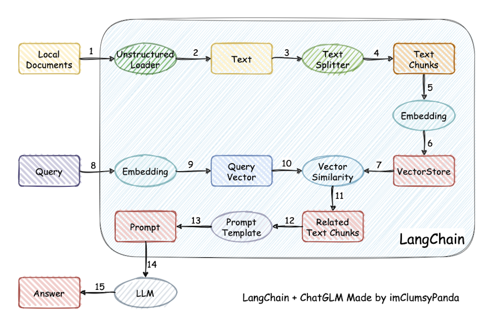

# LangChain

[toc]

## 一、什么是 LangChain

ChatGPT 的巨大成功激发了越来越多的开发者兴趣，他们希望利用 OpenAI 提供的 API 或者私有化模型，来开发基于大型语言模型的应用程序。尽管大型语言模型的调用相对简单，但要创建完整的应用程序，仍然需要大量的定制开发工作，包括 API 集成、互动逻辑、数据存储等等。

为了解决这个问题，从 2022 年开始，许多机构和个人相继推出了多个开源项目，旨在**帮助开发者们快速构建基于大型语言模型的端到端应用程序或工作流程**。其中一个备受关注的项目就是 LangChain 框架。

**LangChain 框架是一个开源工具，充分利用了大型语言模型的强大能力，以便开发各种下游应用。它的目标是为各种大型语言模型应用提供通用接口，从而简化应用程序的开发流程**。具体来说，LangChain 框架可以实现数据感知和环境互动，也就是说，它能够让语言模型与其他数据来源连接，并且允许语言模型与其所处的环境进行互动。

利用 LangChain 框架，我们可以轻松地构建如下所示的 RAG 应用（[图片来源](https://github.com/chatchat-space/Langchain-Chatchat/blob/master/img/langchain+chatglm.png)）。在下图中，`每个椭圆形代表了 LangChain 的一个模块`，例如数据收集模块或预处理模块。`每个矩形代表了一个数据状态`，例如原始数据或预处理后的数据。箭头表示数据流的方向，从一个模块流向另一个模块。在每一步中，LangChain 都可以提供对应的解决方案，帮助我们处理各种任务。

## 二、LangChain 的核心组件

LangChian 作为一个大语言模型开发框架，可以将 LLM 模型（对话模型、embedding 模型等）、向量数据库、交互层 Prompt、外部知识、外部代理工具整合到一起，进而可以自由构建 LLM 应用。 LangChain 主要由以下 6 个核心组件组成:

- **模型输入/输出（Model I/O）**：与语言模型交互的接口
- **数据连接（Data connection）**：与特定应用程序的数据进行交互的接口
- **链（Chains）**：将组件组合实现端到端应用。比如后续我们会将搭建`检索问答链`来完成检索问答。
- **记忆（Memory）**：用于链的多次运行之间持久化应用程序状态；
- **代理（Agents）**：扩展模型的推理能力。用于复杂的应用的调用序列；
- **回调（Callbacks）**：扩展模型的推理能力。用于复杂的应用的调用序列；

在开发过程中，我们可以根据自身需求灵活地进行组合。

## 三、LangChain 的稳定版本

在 LLM 技术领域的迅猛发展浪潮中，LangChain 作为一个不断进化的创新平台，持续推动着技术边界的拓展。`2024 年 1 月 9 日`，LangChain 正式发布了其稳定版本 **v0.1.0**，这一里程碑式的更新，为开发者带来了全面而强大的功能支持。其涵盖了模型的输入与输出处理、数据连接、链式操作、记忆机制、代理服务以及回调处理等关键组件，为 LLM 应用的开发和部署提供了坚实的基础。
同时，LangChain 的持续优化和功能迭代，未来将带来更多创新特性和性能提升。

- **兼容性与支持**：LangChain v0.1.0 版本兼顾了对 `Python 和 JavaScript` 的支持，同时保持了向后兼容性，确保开发者能够在升级过程中无缝过渡，享受到更加安全稳定的开发体验。

- **架构改进**：通过将核心组件 langchain-core 与合作伙伴包进行有效分离，LangChain 的架构设计变得更加条理清晰和稳固，为未来的系统化扩展和安全性提升奠定了坚实基础。

- **可观察性**：LangChain 通过与 LangSmith 的深度集成，提供了业界领先的调试和观测功能。这使得开发者能够对 LLM 应用中的每一步操作及其输入输出有一个清晰的认识，极大地简化了调试和问题排查的流程。

- **广泛的集成**：LangChain 拥有近 **700** 个集成，覆盖了从 LLM 到向量存储、工具和智能体（Agent）等多个技术领域，极大地降低了在各种技术栈上构建 LLM 应用的复杂度。

- **可组合性**：借助 `LangChain 表达式语言（LCEL）`，开发者可以轻松地构建和定制 chain，充分利用数据编排框架的优势，包括批量处理、并行化操作和备选方案等高级功能。

- **流式处理**：LangChain 对流式处理进行了深度优化，确保所有利用 LCEL 创建的 chain 均能支持流式处理，包括中间步骤的数据流传输，从而为用户提供更加流畅的体验。

- **输出解析**：LangChain 提供了一系列强大的输出解析工具，确保 LLM 能够以结构化的格式返回信息，这对于 LLM 执行具体行动计划至关重要。

- **检索能力**：LangChain 引入了先进的检索技术，适用于生产环境，包括文本分割、检索机制和索引管道等，使得开发者能够轻松地将私有数据与 LLM 的能力相结合。

- **工具使用与智能体**：LangChain 提供了丰富的智能体和工具集合，并提供了定义工具的简便方法，支持智能体工作负载，包括让 LLM 调用函数或工具，以及如何高效地进行多次调用和推理，极大地提升了开发效率和应用性能。

## 四、LangChain 的生态

- **LangChain Community**: 专注于第三方集成，极大地丰富了 LangChain 的生态系统，使得开发者可以更容易地构建复杂和强大的应用程序，同时也促进了社区的合作和共享。

- **LangChain Core**: LangChain 框架的核心库、核心组件，提供了基础抽象和 LangChain 表达式语言（LCEL），提供基础架构和工具，用于构建、运行和与 LLM 交互的应用程序，为 LangChain 应用程序的开发提供了坚实的基础。我们后续会用到的处理文档、格式化 prompt、输出解析等都来自这个库。

- **LangChain CLI**: 命令行工具，使开发者能够通过终端与 LangChain 框架交互，执行项目初始化、测试、部署等任务。提高开发效率，让开发者能够通过简单的命令来管理整个应用程序的生命周期。

- **LangServe**: 部署服务，用于将 LangChain 应用程序部署到云端，提供可扩展、高可用的托管解决方案，并带有监控和日志功能。简化部署流程，让开发者可以专注于应用程序的开发，而不必担心底层的基础设施和运维工作。

- **LangSmith**: 开发者平台，专注于 LangChain 应用程序的开发、调试和测试，提供可视化界面和性能分析工具，旨在帮助开发者提高应用程序的质量，确保它们在部署前达到预期的性能和稳定性标准。

---

> 本章我们简单介绍了开发框架 LangChain，下一章我们将介绍开发 LLM 应用的整体流程。
