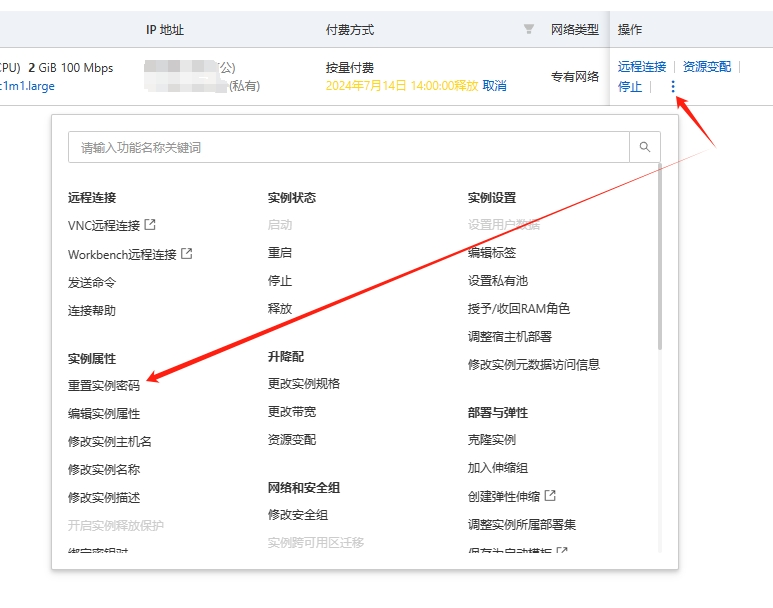
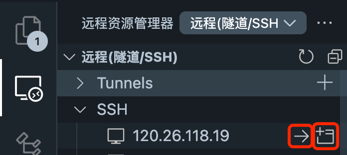

# 阿里云服务器的基本使用

[toc]

## 一、为什么选择阿里云服务器

阿里云是全球领先的云计算服务提供商，为全球 200 多个国家和地区的数百万客户提供云计算、大数据、人工智能、安全、企业应用、数字娱乐等服务。阿里云的服务器性能稳定，价格低廉，是很多初学者的首选。尤其是阿里云的高校计划，可以免费领取云服务器，非常适合学生使用。对于新用户，阿里云也提供了免费试用的机会，可以免费使用云服务器一年。

## 二、领取阿里云高校计划

### 2.1. 高校计划介绍

高校学生通用权益面向所有中国高校学生开放，具体包括中国大陆及港澳台地区专科、本科、硕士、博士、在职研究生等高等教育学籍在内的在校学生人群，在此基础上，阿里云合作高校学生可再享受 3 折专属权益。

### 2.2. 高校学生计划申请

申请链接：https://university.aliyun.com/mobile?clubTaskBiz=subTask..11337012..10212..&userCode=1h9ofupt

1.权益一：通过学生认证的中国高校学生，可领取 300 元无门槛优惠券。

2.权益二：通过学生认证的中国高校学生，且所在高校为阿里云合作高校，可在领取 300 元无门槛优惠券的基础上，再领取阿里云公共云产品（特殊商品除外）三折优惠，订单原价不超过 5000 元。

目前合作高校有：清华大学、北京大学、浙江大学、上海交通大学、中国科学技术大学、华南理工大学和香港科技大学（广州）。更多高校洽谈中，敬请期待！

点击图片中的立即领取，用自己实名认证的支付宝扫码登录校验即可。

### 2.3. 高校学生老师权益

用户是合作高校的教师（含博士后），且按照活动要求完成身份认证。

目前合作高校有：清华大学、北京大学、浙江大学、上海交通大学、中国科学技术大学、华南理工大学和香港科技大学（广州）。更多高校洽谈中，敬请期待！

- 阿里云全量公共云产品（特殊商品除外）5 折专属优惠，设置专属服务通道，为科研及教学加速。

注：最好在确认优惠券到账的情况下再去购买产品；优惠券信息在`用户中心-卡券管理-优惠券管理`查看。

https://developer.aliyun.com/plan/student

## 三、新用户领取云服务器试用

申请链接：https://free.aliyun.com/?crowd=personal
这里推荐大家申请`云服务器 ECS`，每月免费额度 280 元，3 个月有效期。大概配置如下：

- e 系列 2 核 2GB 或者 2 核 4GB（每月 200 元免费额度）；
- 公网流量每月 80 元免费额度（可用于抵扣 100GB 国内地域流量）
  

## 四、创建云服务器指引

这里以选择`云服务器 ECS`为例进行配置，选择最小配置就系统选择`Ubuntu`，

试用时，到期释放设置填写『自动释放实例』，这样到期后就不会产生费用。

创建完成后点击已试用或者[链接](https://ecs.console.aliyun.com/home#)就可以看到我们刚刚创建的实例。

点击远程连接，点击立即登录。

默认密码是 root；

如果不允许登录请按照[链接](https://help.aliyun.com/zh/ecs/user-guide/use-the-password-can-t-login-the-linux-cloud-server-ecs-what-should-i-do)修改服务器配置。  
【简单处理方式：在云服务器管理控制台页面，点击‘远程连接’附近三点，选择重置实例密码。再次登录就可以啦。】

之后就可以进入环境进行学习啦！！！

## 五、VSCode 连接远程服务器

`Visual Studio Code（VSCode）`是一款由微软开发的免费、开源的现代化代码编辑器。它以其轻量级、高性能和广泛的编程语言支持而受到开发者的青睐。VSCode 的核心特点包括：

1. **跨平台**：支持 Windows、macOS 和 Linux 操作系统。
2. **扩展市场**：提供丰富的扩展插件，以适应不同开发需求。
3. **内置 Git 支持**：方便进行版本控制操作。
4. **调试工具**：内置强大的调试功能，支持多种编程语言。
5. **智能感知**：提供代码补全、参数信息等智能提示功能。
6. **集成终端**：内置终端，无需切换即可执行命令行操作。
7. **自定义**：支持主题、键位绑定等个性化设置。

VSCode 的灵活性和易用性使其成为开发者首选的代码编辑工具之一。

这里我们选择 VSCode 连接远程服务器，方便我们在本地编辑器中直接操作远程服务器。

1. 安装 SSH 插件
   打开 VSCODE 的插件市场，搜索 SSH，找到`Remote - SSH` 插件并安装
   

2. 获取服务器 IP
   打开阿里云服务器的[实例列表](https://ecs.console.aliyun.com/server/region/)
   找到我们需要连接的服务器的公网 IP 地址，并复制。
   
   打开可以连接的远程服务器的编辑器，这里以 VSCODE 为例。
3. 配置 SSH
   打开刚刚下好的`远程资源管理器`插件，添加服务器的 SSH，
   `ssh -p port username@ip`
   port 一般配置为 22,
   username 可以用 root 或者自定义的用户名
   IP 替换成服务器的 IP
   选择本地的 SSH 配置文件
   
   点击右下角的链接，就可进入服务器
   
4. 连接
   之后我们连接时，可以继续点击左侧的`远程资源管理器`找到我们的服务器，右边有两个选项。

- 箭头是本窗口打开
- 左上角有加号的是新窗口打开
    

        
    

5. 打开目录
   之后点击打开文件夹，输入需要的目录即可打开

之后就可以进行愉快的编程啦！！！

## 六、Jupyter Notebook 使用

**Jupyter Notebook** 是一个开源的`交互式计算环境`，它允许用户创建和共享包含实时代码、方程、可视化和文本的文档。它的名字来源于它支持的三种核心编程语言：Julia、Python 和 R，这也是 "Ju-pyt-er" 的名称由来。Jupyter Notebook 编写的文件后缀为 `.ipynb`

Jupyter Notebook 的主要特点包括：

1. **交互式编程**：用户可以在单独的单元格中编写代码并执行，`立即看到代码运行结果`，这对于数据分析、机器学习、科学计算等领域非常有用。

2. **多语言支持**：虽然最初是为 Julia、Python 和 R 设计的，但 Jupyter 现在支持超过 40 种编程语言，通过使用相应的内核。

3. **丰富的展示功能**：Jupyter Notebook 支持 Markdown，允许用户添加格式化文本、图像、视频、HTML、LaTeX 等丰富的媒体内容，使得文档更加生动和信息丰富。

4. **数据可视化**：Jupyter Notebook 与众多数据可视化库（如 Matplotlib、Plotly、Bokeh 等）无缝集成，可以直接在 Notebook 中生成图表和可视化数据。

5. **易于共享**：Notebook 文件可以通过电子邮件、云服务或 Jupyter Notebook Viewer 等方式轻松共享，他人可以查看内容和运行代码，甚至可以留下评论。

6. **扩展性**：Jupyter 有大量的扩展插件，可以增强其功能，如交互式小部件、代码自动完成、主题更换等。

7. **科学计算工具集成**：Jupyter Notebook 可以与许多科学计算和数据分析工具集成，如 NumPy、Pandas、SciPy 等 Python 库，使得数据处理和分析变得更加方便。

Jupyter Notebook 是数据科学家、研究人员、教育工作者和学生等广泛使用的工具，它促进了开放科学和教育的发展，使得人们可以更容易地分享和复现研究结果。

本教程使用 Jupyter Notebook 来进行代码编写和运行，方便我们进行代码的编写和调试。

`VSCODE` 目前不用安装任何插件就以直接打开 Jupyter Notebook 文件。（也可以按照下一章进行插件安装配置）

Notebook 文档由一系列的单元格组成，主要由以下两种形式。

- **代码单元格**：在代码单元格中输入代码并按 `Shift + Enter` 可以运行该单元格中的代码，并在下方显示输出结果。
- **Markdown 单元格**：使用 `Markdown` 语法在单元格中编写文本。可以创建标题、列表、链接、格式化文本等，并使用 `Ctrl + Enter` 来渲染当前 Markdown 单元格。

通常我们使用代码单元格来进行代码编写，并及时运行查看结果。并使用以下是用的快捷键来提升效率：

### 单元格编辑

- `Enter`: 进入编辑模式。
- `Esc`: 退出编辑模式。

### 单元格操作

- `A`: 在当前单元格上方插入一个新的单元格。
- `B`: 在当前单元格下方插入一个新的单元格。
- `D` (两次按下): 删除当前单元格。
- `Z`: 撤销删除操作。
- `C`: 复制当前单元格。
- `V`: 粘贴之前复制的单元格。
- `X`: 剪切当前单元格。
- `Y`: 将当前单元格转换为代码单元格。
- `M`: 将当前单元格转换为 Markdown 单元格。
- `Shift + M`: 切换单元格的 Markdown 渲染状态。

### 代码执行和调试

- `Shift + Enter`: 运行当前单元格，并跳转到下一个单元格。
- `Ctrl + Enter`: 运行当前单元格，但不跳转到下一个单元格。
- `Alt + Enter`: 运行当前单元格，并在下方插入一个新的单元格。
- `Esc`: 进入命令模式。
- `Enter`: 进入编辑模式。
- `Ctrl + Shift + -`: 分割当前单元格为两个单元格。
- `Ctrl + Shift + P`: 打开命令面板，可以搜索和执行各种命令。

### 导航和窗口管理

- `Up` / `Down` 或 `K` / `J`: 在单元格之间上下移动。
- `Home` / `End`: 跳转到 Notebook 的开始或结束。
- `Ctrl + Home` / `Ctrl + End`: 跳转到当前 Notebook 的第一个或最后一个单元格。
- `Tab`: 在 Notebook 视图中切换到下一个面板（例如，从编辑器到输出或元数据面板）。
- `Shift + Tab`: 在 Notebook 视图中切换到上一个面板。

### 其他有用的快捷键

- `H`: 显示或隐藏 Notebook 的侧边栏。
- `M`: 将当前单元格转换为 Markdown 单元格。
- `Y`: 将当前单元格转换为代码单元格。

---

> 目前我们已经拥有了开发的必备基础，接下来可以直接去`7.环境配置`进行环境配置。
