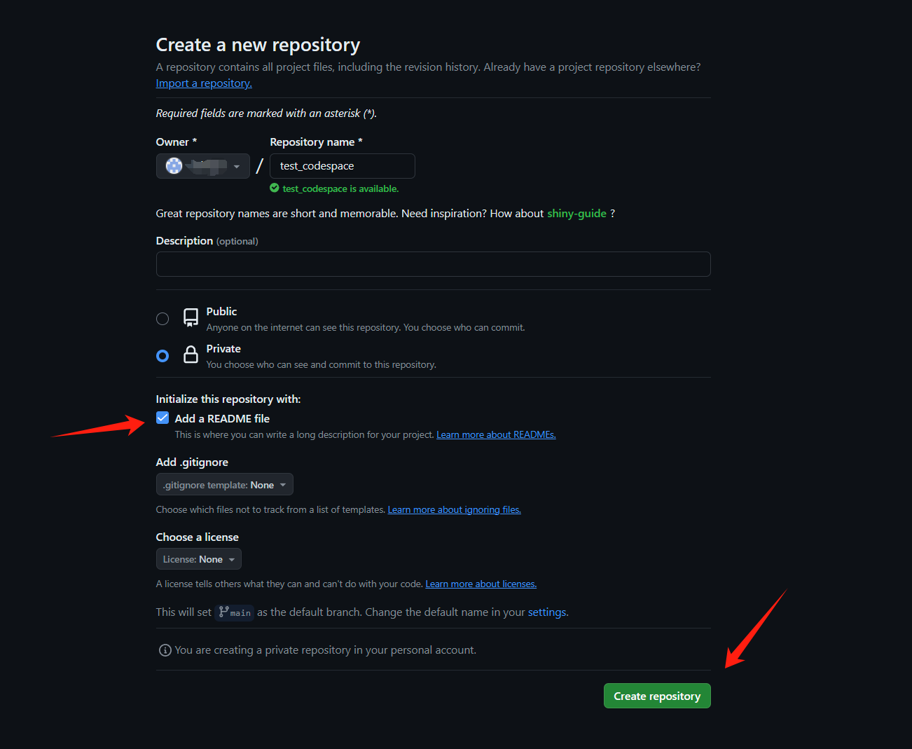
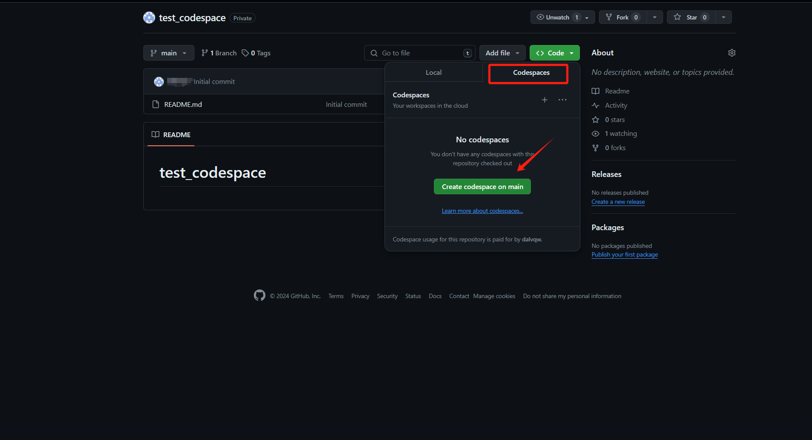
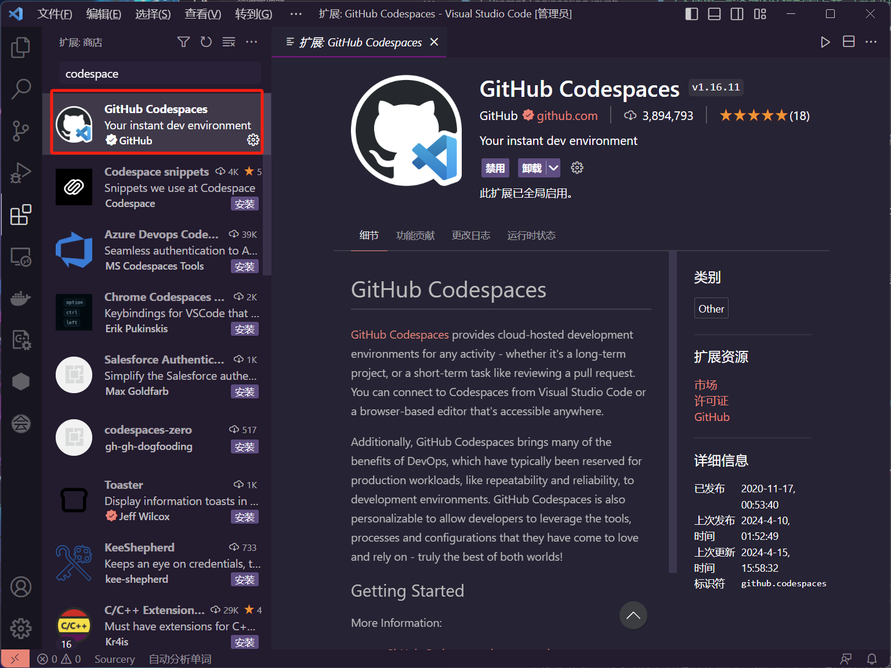
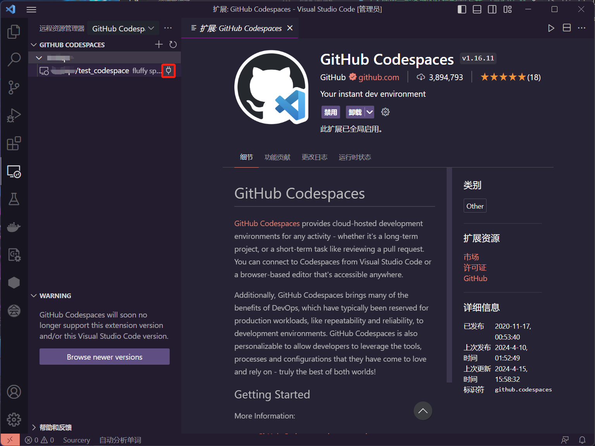
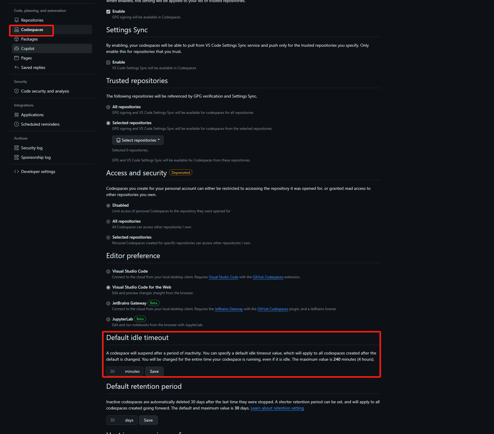

# GitHub Codespaces 概述&环境配置（选修）

[toc]

> **首先确定是否具有可以流畅访问 GitHub 的网络环境**
> **否则仍建议使用阿里云**

## 一、什么是代码空间？

代码空间是托管在云中的开发环境。 可通过将配置文件提交到存储库（通常称为“配置即代码”）来为 GitHub Codespaces 自定义项目，这将为项目的所有用户创建可重复的 codespace 配置。 有关详细信息，请参阅“[开发容器简介](https://docs.github.com/zh/codespaces/setting-up-your-project-for-codespaces/adding-a-dev-container-configuration/introduction-to-dev-containers)”。

[官方文档](https://docs.github.com/en/codespaces/overview)

## 二、创建第一个 codespace

1. 打开网址链接：https://github.com/features/codespaces
2. 登录你的 GitHub 账户
3. 点击图示 **Your repositories**
   
4. 进入自己的存储库列表后，点击图示 **New**，新建一个存储库
   
5. 这里根据自己需要设置即可，为方便和安全起见 **Add a README file** 建议勾上，同时选择 **Private**（因为课程中用到 API key，注意保护隐私），设置完成后点击 **Create repository**
   
6. 创建好存储库后，点击 **code** 选择 **Codespaces**, 点击图示 **Create codespace on main**
   
7. 等待一段时间后会出现如下界面，接下来操作与 VSCode 相同，可根据需要安装插件调整设置
   

## 三、环境配置

参照`7.环境配置`中`1.2 通用环境配置`配置环境即可，可以跳过前两步。

> 由于每个存储库都可以设置一个独立的 codespace，所以这里我们不需要安装 conda 环境。且因为 GitHub 服务器在国外，无需配置国内镜像源。

## 四、VSCode 配置 Python 环境

参照`7.环境配置`中`二、VSCode 配置 Python 环境
`配置环境即可

> 注意：第一次安装完所有配置后，需要重启一下 codespace

## 五、本地 VSCode 连接 Codespace（非必需）

1. 打开 VSCode，搜索 codespace 安装插件
   
2. 在 VSCode 的活动栏中，单击**远程资源管理器**图标
   
3. 登录 GitHub，根据提示登录即可
   
4. 可以看到这里有我们刚才创建的 codespace，单击红框连接图标
   
5. 成功连接到了 codespace
   
6. [VSCode 官方配置文档](https://docs.github.com/en/codespaces/developing-in-a-codespace/using-github-codespaces-in-visual-studio-code)

## 六、其他

1. 网页关闭后，找到刚才新建的存储库，点击红框框选内容即可重新进入 codespace
   
2. 免费额度
   找到 GitHub 的账户设置后，可以在**Plans and usage**中看到剩余的免费额度
   
3. codespace 设置，挂起时间建议调整（时间过长会浪费额度）
   
4. 因为 codespace 可以通过网页访问，所以最关键的当然是可以**随身携带平板访问网页进行编程学习**

---

> 目前我们已经拥有了开发的必备基础，下一章我们将对所需要进行环境配置进行详细介绍。
