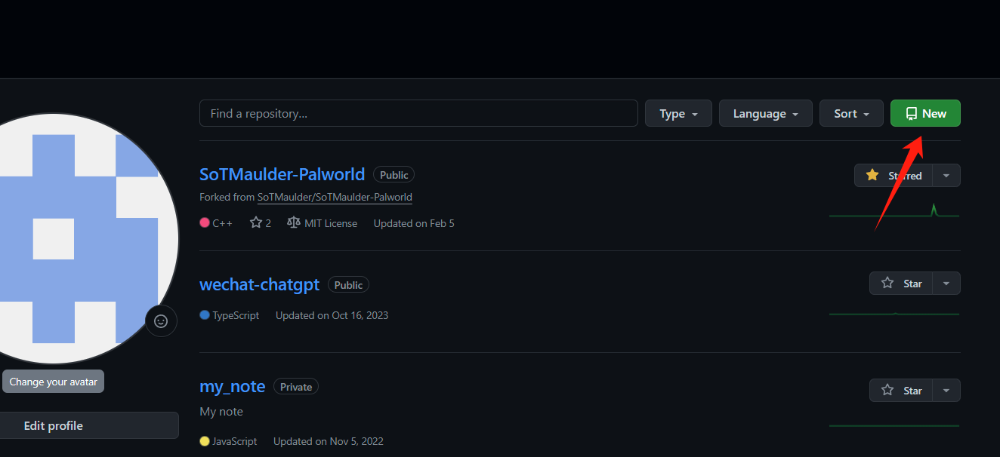
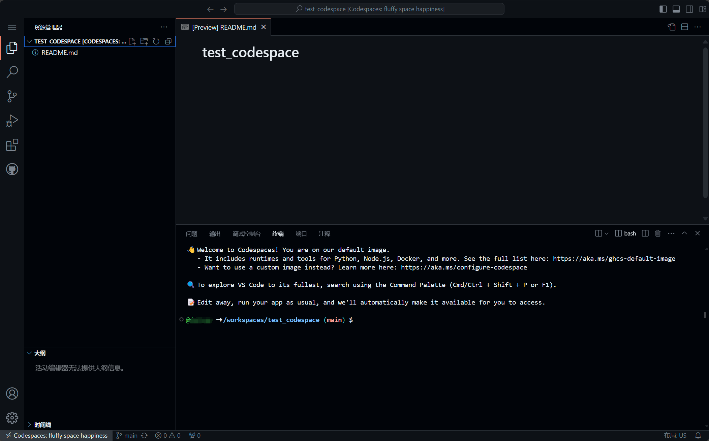
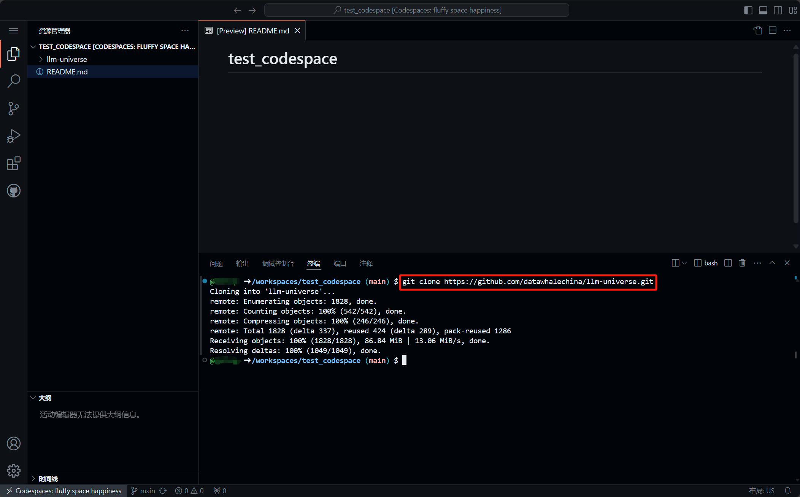
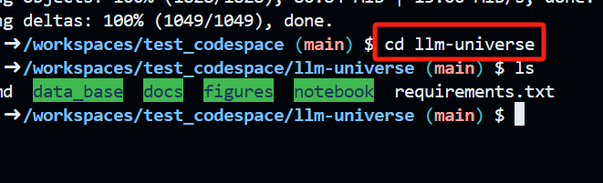
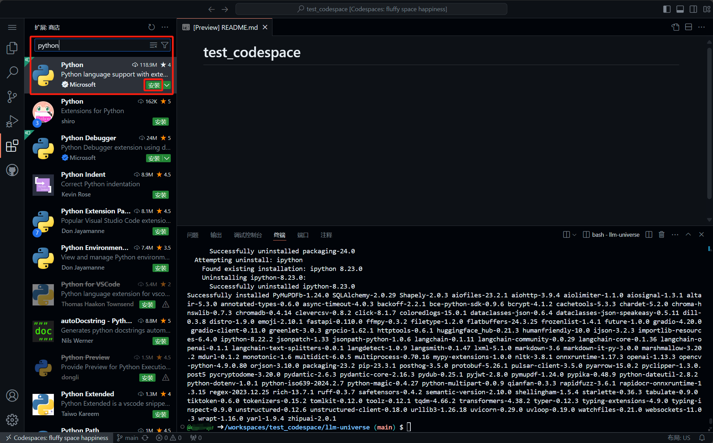
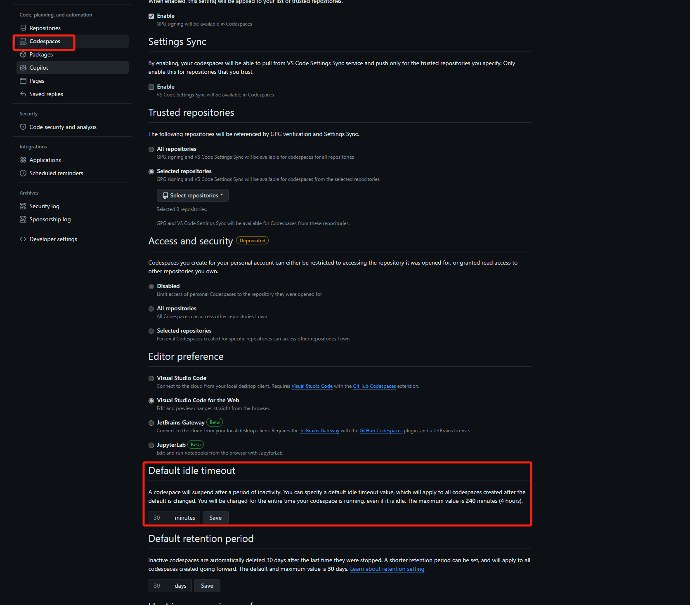

# GitHub Codespaces 概述&环境配置

> **首先确定是否具有可以流畅访问GitHub的网络环境**
> **否则仍建议使用阿里云**
>
## 一、什么是代码空间？

代码空间是托管在云中的开发环境。 可通过将配置文件提交到存储库（通常称为“配置即代码”）来为 GitHub Codespaces 自定义项目，这将为项目的所有用户创建可重复的 codespace 配置。 有关详细信息，请参阅“[开发容器简介](https://docs.github.com/zh/codespaces/setting-up-your-project-for-codespaces/adding-a-dev-container-configuration/introduction-to-dev-containers)”。

[官方文档](https://docs.github.com/en/codespaces/overview)

## 二、创建第一个codespace
1. 打开网址链接：https://github.com/features/codespaces
2. 登录你的 GitHub 账户
3. 点击图示 **Your repositories**

4. 进入自己的存储库列表后，点击图示 **New**，新建一个存储库

5. 这里根据自己需要设置即可，为方便和安全起见 **Add a README file** 建议勾上，同时选择 **Private**（因为课程中用到 API key，注意保护隐私），设置完成后点击 **Create repository**

6. 创建好存储库后，点击 **code** 选择 **Codespaces**, 点击图示 **Create codespace on main**

7. 等待一段时间后会出现如下界面，接下来操作与 VSCode 相同，可根据需要安装插件调整设置

## 三、环境配置
>由于每个存储库都可以设置一个独立的 codespace，所以这里我们不需要安装 conda 环境

1. 克隆课程仓库
`git clone https://github.com/datawhalechina/llm-universe.git`

2. 进入项目根目录
`cd llm-universe`

3. 安装所需的包（无需配置国内镜像源），等待安装成功即可
`pip install -r requirements.txt`

## 四、VSCode 配置 Python 环境
1. 安装 Python 插件

   本教程基于 Python 语言开发， 为了更好的开发体验，我们需要安装 Python 插件。

   在插件市场中搜索`Python`，找到`Python`插件并安装。
   
   这时当我们执行 Python 代码时，就会自动识别我们的 Python 环境，并提供代码补全等功能，方便我们进行开发。

2. 安装 Jupyter 插件
   本教程中，我们使用 Jupyter Notebook 进行开发，所以需要安装 Jupyter 插件。
   在插件市场中搜索`Jupyter`，找到`Jupyter`插件并安装。
   

3. 为 Jupyter Notebook 配置 Python 环境
   1. 打开一个 Jupyter Notebook
   2. 点击右上角的 **选择内核**后选择**Python Environment**，进行当前 Jupyter Notebook 的 Python 环境的选择。
   
   3. 这里只有一个 Python 环境，选择即可
   
   之后我们就可以在 Jupyter Notebook 中使用我们的 Python 环境进行开发了。
   
   
4. 第一次安装完所有配置后，需要重启一下codespace

## 五、本地 VSCode 连接 Codespace（非必需）
1. 打开 VSCode，搜索 codespace 安装插件

2. 在 VSCode 的活动栏中，单击**远程资源管理器**图标

3. 登录 GitHub，根据提示登录即可

4. 可以看到这里有我们刚才创建的 codespace，单击红框连接图标

5. 成功连接到了 codespace

6. [VSCode 官方配置文档](https://docs.github.com/en/codespaces/developing-in-a-codespace/using-github-codespaces-in-visual-studio-code)

## 六、其他
1. 网页关闭后，找到刚才新建的存储库，点击红框框选内容即可重新进入 codespace

2. 免费额度
找到 GitHub 的账户设置后，可以在**Plans and usage**中看到剩余的免费额度

3. codespace 设置，挂起时间建议调整（时间过长会浪费额度）

4. 因为 codespace 可以通过网页访问，所以最关键的当然是可以**随身携带平板访问网页进行编程学习**
