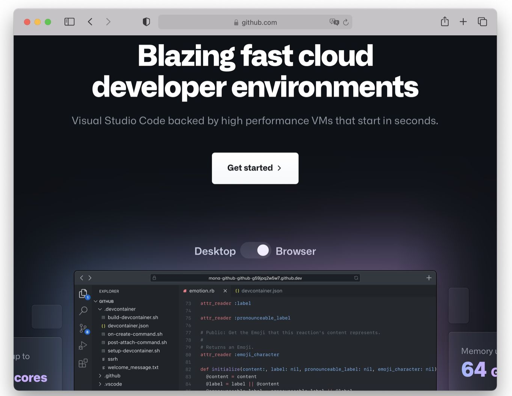
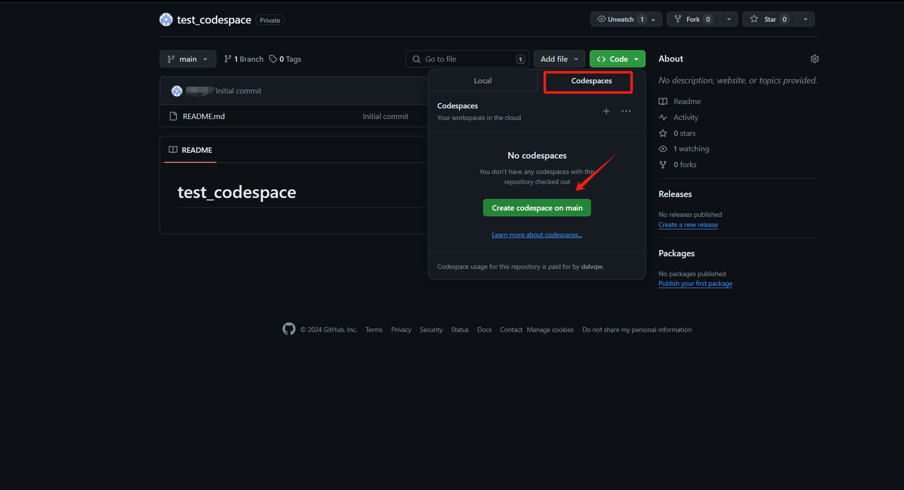
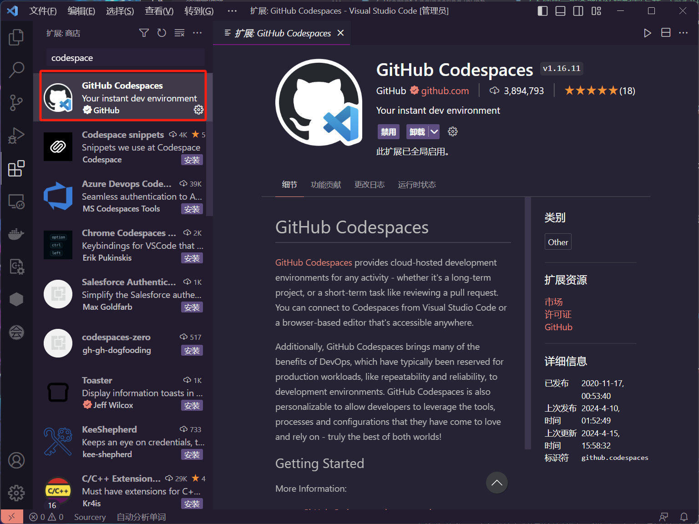
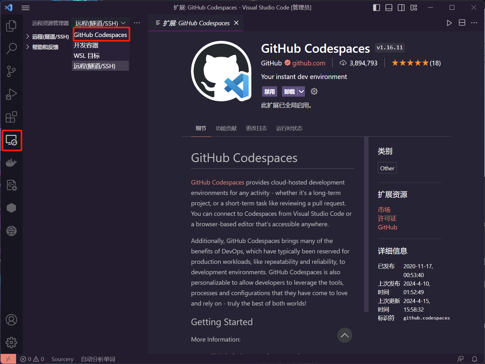
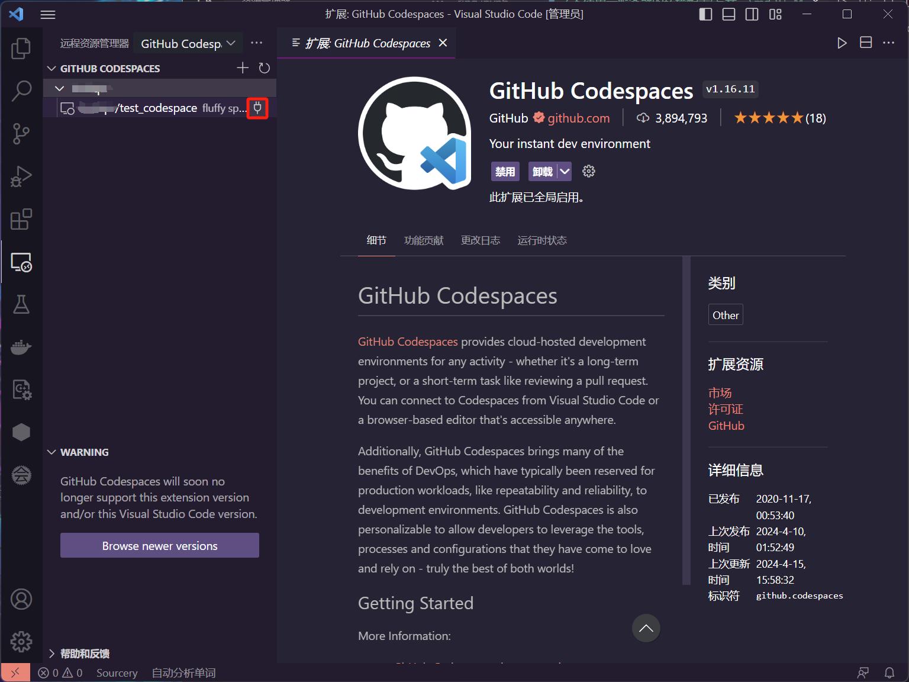
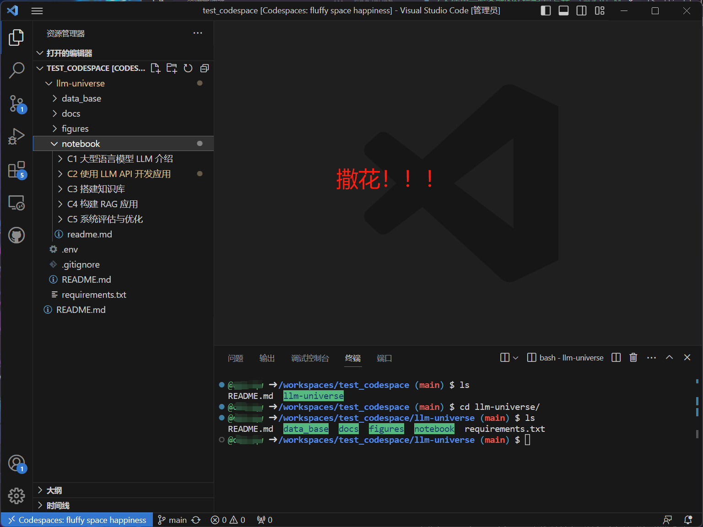
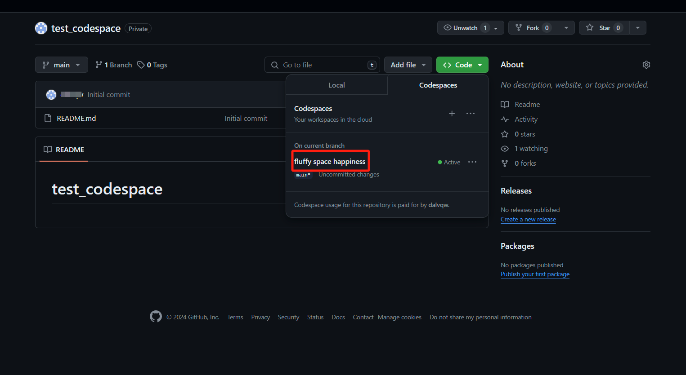
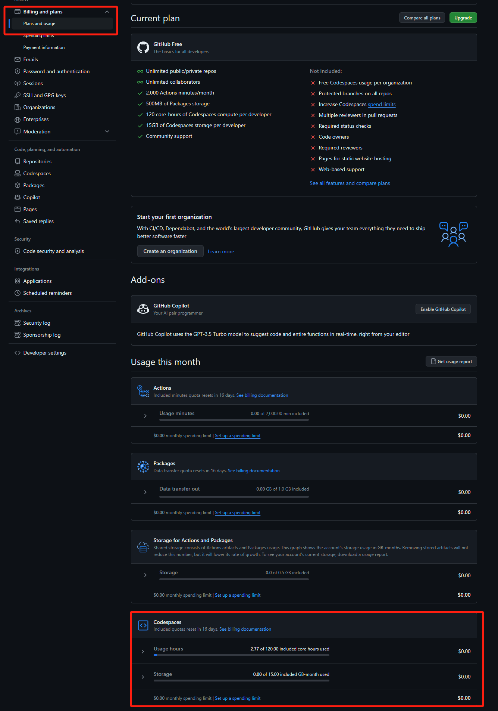
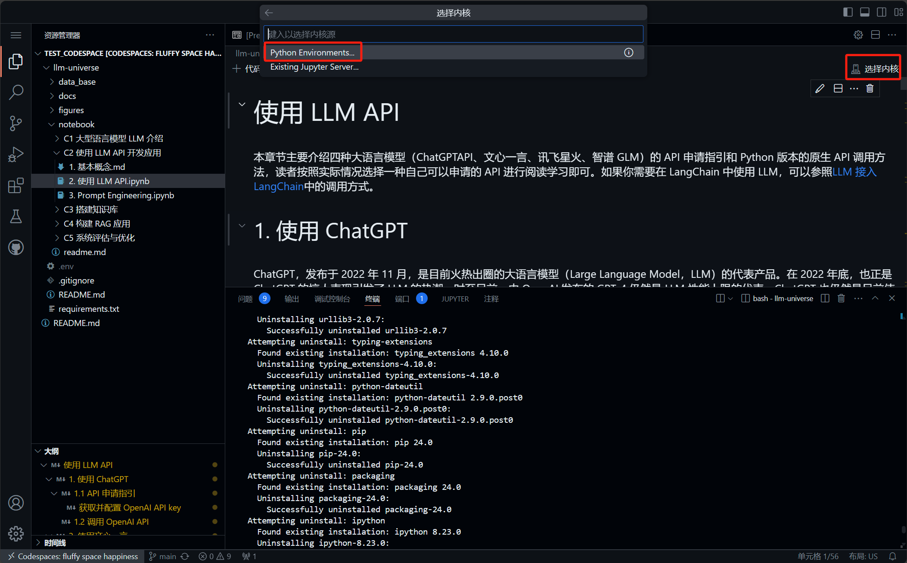

# 第一章 大型语言模型 LLM 介绍

## 1.1 大型语言模型（LLM）简介

**大语言模型（LLM，Large Language Model），也称大型语言模型，是一种旨在理解和生成人类语言的人工智能模型**。

LLM 通常指包含**数百亿（或更多）参数的语言模型**，它们在海量的文本数据上进行训练，从而获得对语言深层次的理解。目前，国外的知名 LLM 有 GPT、LLaMA、Gemini、Claude 和 Grok 等，国内的有 DeepSeek、通义千问、豆包、Kimi、文心一言、GLM 等。

为了探索性能的极限，许多研究人员开始训练越来越庞大的语言模型，例如拥有 `175B (1750 亿)`参数的 `GPT-3` 和 `540B（5400 亿）`参数的 `PaLM` 。尽管这些大型语言模型与小型语言模型（例如 `3.3 亿`参数的 `BERT` 和 `15 亿`参数的 `GPT-2`）使用相似的架构和预训练任务，但它们展现出截然不同的能力，尤其在解决复杂任务时表现出了惊人的潜力，这被称为“**涌现能力**”。以 GPT-3 和 GPT-2 为例，GPT-3 可以通过学习上下文来解决少样本任务，而 GPT-2 在这方面表现较差。因此，科研界给这些庞大的语言模型起了个名字，称之为“大语言模型（LLM）”。LLM 的一个杰出应用就是 **ChatGPT** ，它是 GPT 系列 LLM 用于与人类对话式应用的大胆尝试，展现出了非常流畅和自然的表现。

语言建模的研究可以追溯到`20 世纪 90 年代`，当时的研究主要集中在采用**统计学习方法**来预测词汇，通过分析前面的词汇来预测下一个词汇。但在理解复杂语言规则方面存在一定局限性。

随后，研究人员不断尝试改进，`2003 年`深度学习先驱 **Bengio** 在他的经典论文 `《A Neural Probabilistic Language Model》`中，首次将深度学习的思想融入到语言模型中。强大的**神经网络模型**，相当于为计算机提供了强大的"大脑"来理解语言，让模型可以更好地捕捉和理解语言中的复杂关系。

`2018 年`左右，**Transformer 架构的神经网络模型**开始崭露头角。通过大量文本数据训练这些模型，使它们能够通过阅读大量文本来深入理解语言规则和模式，就像让计算机阅读整个互联网一样，对语言有了更深刻的理解，极大地提升了模型在各种自然语言处理任务上的表现。

与此同时，研究人员发现，随着**语言模型规模的扩大（增加模型大小或使用更多数据）**，模型展现出了一些惊人的能力，在各种任务中的表现均显著提升（Scaling Law）。这一发现标志着大型语言模型（LLM）时代的开启。

通常大模型由三个阶段构成：预训练、后训练和在线推理。在 2024 年 9 月之前，大模型领域仅存在预训练阶段的 Scaling Law。然而，随着 OpenAI o1 的推出，后训练和在线推理阶段也各自拥有了 Scaling Law，即后训练阶段的强化学习 Scaling Law（RL Scaling Law）和在线推理阶段的 Inference Scaling Law（Test Time Scaling Law）。  随着各阶段计算量的增加，大模型的性能不断增长。


### 1.1.1 常见的 LLM 模型

大语言模型的发展历程虽然只有短短不到五年的时间，但是发展速度相当惊人，截止 2024 年 6 月，国内外有超过百种大模型相继发布。下图按照时间线给出了 2019 年至 2024 年 6 月比较有影响力并且模型参数量超过 100 亿的大语言模型：

<div align=center>

</div>

（该图来源于参考内容 [[1](https://arxiv.org/abs/2303.18223)]）

接下来我们主要介绍几个国内外常见的大模型（包括开源和闭源）

> [OpenAI 模型介绍](https://platform.openai.com/docs/models)

**OpenAI** 公司在 `2018 年` 提出的 **GPT（Generative Pre-Training）** 模型是典型的 `生成式预训练语言模型` 之一。

GPT 模型的基本原则是**通过语言建模将世界知识压缩到仅解码器 (decoder-only) 的 Transformer 模型中**，这样它就可以恢复(或记忆)世界知识的语义，并充当通用任务求解器。它能够成功的两个关键点：

- 训练能够准确预测下一个单词的 decoder-only 的 Transformer 语言模型
- 扩展语言模型的大小

OpenAI 在 LLM 上的研究大致可以分为以下几个阶段：


目前，GPT 系列已形成 **知识型** 与 **推理型** 两大技术分支。

> [ChatGPT 使用地址](https://chat.openai.com)

`2022 年 11 月`，**OpenAI** 发布了基于 GPT 模型（GPT-3.5 和 GPT-4）的**会话应用 ChatGPT**。由于与人类交流的出色能力，ChatGPT 自发布以来就引发了人工智能社区的兴奋。ChatGPT 本质上是一个 LLM 应用，是基于基座模型开发出来的，与基座模型有本质的区别。ChatGPT 上线后用户增长迅速，5 天注册人数突破 100 万，两个月后月活用户破亿，成为当时史上用户增长最快的消费级应用程序。


随着不断迭代，ChatGPT 逐渐丰富了其功能：

- 智能模式切换：GPT-5 一体化系统自动在知识型、推理型、多模态模式间智能切换，无需手动选择
- 思维链：系统自动判断何时需要深度思考，可选择性展示推理过程，帮助用户理解复杂问题的解决步骤
- 跨领域能力：集成编码、推理、代理任务于一体，一个模型解决所有问题
- 多模态能力：能够分析和理解用户提供的图片、音频和视频，实现全面的多模态交互
- 实时语音和视频对话：用户可与 AI 进行自然的语音和视频交流，支持手势识别和情感表达
- 自定义指令与记忆功能：记住用户之前的交互习惯和偏好，提供个性化体验
- GPT 构建器平台：允许用户无需编程创建专用的 AI 助手，支持自定义知识库和行为模式
- 数据分析与可视化：直接处理和分析上传的数据文件，生成图表和可视化报告
- 插件系统：允许开发者创建工具扩展 ChatGPT 的能力，实现网页浏览、数据分析和第三方服务调用

**OpenAI 模型发展历程：**
- `2023 年 3 月` 发布 **GPT-4**，引入多模态能力，参数规模显著扩大
- `2024 年 5 月` 发布 **GPT-4o**，实现文本、语音、图像多模态融合，响应速度提升 2 倍
- `2024 年 7 月` 发布 **GPT-4o mini**，轻量级消费级应用模型
- `2024 年 9 月` 发布 **o1 系列**，专为复杂推理设计，支持思维链推理
- `2025 年 2 月` 发布 **GPT-4.5**，知识广度和推理深度显著提升，上下文扩展至 512K
- `2025 年 8 月` 发布 **GPT-5** 系列，集成多模态和推理能力，实现 GPT 系列和 o 系列大一统。GPT-5 是一个一体化系统，包含智能高效的基础模型、深度推理模型、实时路由模块，系统会基于对话类型、问题复杂度、工具需求及用户显式指令智能调度模型，自动判断何时需要开启深度思考


OpenAI 当前推荐模型：

|  模型名称   | 上下文长度 |         特点         | 知识截止日期  |     类型     |
| :---------: | :--------: | :------------------: | :-----------: | :----------: |
|    GPT-5    |    400k    | 一体化系统，智能路由 | 2024 年 9 月  |   一体化     |
|  GPT-5 mini |    400k    | 快速经济，精准任务  | 2024 年 5 月  |   一体化     |
|  GPT-5 nano |    400k    | 最快最便宜，摘要分类 | 2024 年 5 月  |   一体化     |

OpenAI 的模型战略经历了从"知识型"和"推理型"两条互补产品线到一体化系统的演进：传统上，知识型模型专注于广泛知识覆盖和流畅对话体验，推理型模型专注于精确推理和复杂问题求解。GPT-5 通过一体化系统实现了知识型与推理型能力的有机融合，用户无需再手动切换模型，系统会根据任务复杂度自动选择最适合的处理方式。

> [Claude 使用地址](https://claude.ai/chats)

Claude 系列模型是由 OpenAI 离职人员创建的 **Anthropic** 公司开发的闭源语言大模型。

- 最早的 **Claude** 于 `2023 年 3 月 15 日` 发布。
- `2024 年 3 月 4 日`，更新至 **Claude-3**，包括 Claude 3 Haiku、Claude 3 Sonnet 和 Claude 3 Opus，它们的能力依次递增，旨在满足不同用户和应用场景的需求。
- `2024 年 10 月`，Anthropic 发布了 **Claude 3.5 Sonnet**，这是一款在推理和通用任务上有显著提升的模型。
- `2025 年 5 月`，Anthropic 又进一步发布了 **Claude 4.0**，包括了 Claude 4 Sonnet 和 Claude 4 Opus，均是**混合推理模型**，支持标准模式与推理思考模式，**编码能力异常强大**。支持多工具并行调用与精准指令解析，本地文件访问时内存管理升级，可规避捷径行为，强化复杂任务处理能力。
- `2025 年 8 月`，Anthropic 更新至 **Claude Opus 4.1**，在推理能力、代码能力和agent 支持上有进一步提升。

|     模型名称     | 上下文长度 |         特点         |
| :--------------: | :--------: | :------------------: |
| Claude 3.5 Haiku |    200k    |       速度最快       |
| Claude 4 Sonnet  |    200k    | 最强性能，领先推理力 |
|  Claude 4.1 Opus   |    200k    |  性能强大，费用最高  |


> [Gemini 使用地址](https://gemini.google.com/)

**Gemini 系列**语言大模型由 **Google** 开发。

- `2022 年 4 月`，发布了初始版本（PaLM 后更名为 Gemini）。
- `2025 年 2 月`，Google 发布了 **Gemini 2.0** 系列模型，在性能和效率上有显著提升。包括 Gemini 2.0 Pro、Gemini 2.0 Flash、Gemini 2.0 Flash-Lite 是 Gemini 2.0 系列的三个版本，分别适用于不同的场景。同样，推出了其推理模型 **Gemini 2.0 Flash Thinking**。
- `2025 年 3 月`，Google 发布了 **Gemini 2.5 Pro**，性能有了进一步提升，推理能力和代码能力提升非常显著。

|         模型名称          | 上下文长度 |      特点      |
| :-----------------------: | :--------: | :------------: |
|      Gemini 2.5 Pro       |     2M     |    性能最强    |
|     Gemini 2.0 Flash      |     1M     | 低延迟，性能强 |
|   Gemini 2.0 Flash-Lite   |     1M     |   性价比最高   |
| Gemini 2.0 Flash Thinking |     1M     |   思维链展示   |

以下窗口是 Gemini 的界面:


> [文心一言使用地址](https://yiyan.baidu.com)

**文心一言是基于百度文心大模型的知识增强语言大模型**，于 `2023 年 3 月` 在国内率先开启邀测。文心一言的基础模型文心大模型于 2019 年发布 1.0 版。于 `2025 年 3 月`更新到 **4.5** 版本。同时发布了其推理模型`X1`。更进一步划分，文心大模型包括 NLP 大模型、CV 大模型、跨模态大模型、生物计算大模型、行业大模型。文心一言的中文能力相对来说非常不错。

同时也可以使用 API 进行调用（[计费详情](https://console.bce.baidu.com/qianfan/chargemanage/list)）。

以下是文心一言的使用界面：


> [星火大模型使用地址](https://xinghuo.xfyun.cn)

**讯飞星火认知大模型**是**科大讯飞**发布的语言大模型，支持多种自然语言处理任务。

- `2023 年 5 月`，首次发布。
- `2024年 10 月`，讯飞星火发布模型 **星火 4.0 Turbo**。

- `2025 年 1 月`，讯飞发布了推理思考模型**讯飞星火 X1** 和 **星火语音同传模型**。

以下是讯飞星火的使用界面：


> [LLaMA 官方地址](https://llama.meta.com)

> [LLaMA 开源地址](https://github.com/facebookresearch/llama)

**LLaMA 系列模型**是 **Meta** 开源的一组参数规模 **从 8B 到 405B** 的基础语言模型。

- `2023 年 2 月`，发布 LLaMA。
- `2023 年 7 月`，发布了 LLaMA2 模型。
- `2024 年 4 月`，发布了 LLaMA3 模型。
- `2024 年 7 月`，发布了 **LLaMA 3.1** 模型。
- `2024 年 12 月`，发布了 **LLaMA 3.3** 模型(只开源了 70B 的指令模型)。

它们都是在数万亿个字符上训练的，展示了如何**仅使用公开可用的数据集来训练最先进的模型**，而不需要依赖专有或不可访问的数据集。这些数据集包括 Common Crawl、Wikipedia、OpenWebText2、RealNews、Books 等。LLaMA 模型使用了**大规模的数据过滤和清洗技术**，以提高数据质量和多样性，减少噪声和偏见。LLaMA 模型还使用了高效的**数据并行**和**流水线并行**技术，以加速模型的训练和扩展其中 405B 参数模型是首个公开的千亿级开源模型，性能对标 GPT-4o 等商业闭源模型。

与 GPT 系列相同，LLaMA 模型也采用了 **decoder-only** 架构，同时结合了一些前人工作的改进。LLaMA 系列基本上是后续大模型的标杆：

- `Pre-normalization 正则化`：为了提高训练稳定性，LLaMA 对每个 Transformer 子层的输入进行了 RMSNorm 归一化，这种归一化方法可以避免梯度爆炸和消失的问题，提高模型的收敛速度和性能；
- `SwiGLU 激活函数`：将 ReLU 非线性替换为 SwiGLU 激活函数，增加网络的表达能力和非线性，同时减少参数量和计算量；
- `旋转位置编码（RoPE，Rotary Position Embedding）`：模型的输入不再使用位置编码，而是在网络的每一层添加了位置编码，RoPE 位置编码可以有效地捕捉输入序列中的相对位置信息，并且具有更好的泛化能力。
- `分组查询注意力（GQA，Grouped-Query Attention）`：通过将查询（query）分组并在组内共享键（key）和值（value），减少了计算量，同时保持了模型性能，提高了大型模型的推理效率。

**LLaMA 3.1** 于 `2024 年 7 月` 发布，提高了模型的性能和效率：

- `更多的训练数据量`：LLaMA3.1 在 15 万亿个 token 的数据上进行预训练，采用了更科学的数据配比。LLaMA3.1 接触到更多的文本信息，从而提高了其理解和生成文本的能力。
- `更长的上下文长度`：LLaMA 3.1 将上下文长度大幅提升至 128K token，支持处理极长的文档和对话历史，改善了对长文本的理解和生成能力，适用于更复杂的应用场景。
- `更多的训练数据量`：LLaMA3.1 在 15 万亿个 token 的数据上进行预训练，采用了更科学的数据配比。LLaMA3.1 接触到更多的文本信息，从而提高了其理解和生成文本的能力。
- `更长的上下文长度`：LLaMA 3.1 将上下文长度大幅提升至 128K token，支持处理极长的文档和对话历史，改善了对长文本的理解和生成能力，适用于更复杂的应用场景。
- `分组查询注意力（GQA，Grouped-Query Attention）`：通过将查询（query）分组并在组内共享键（key）和值（value），减少了计算量，同时保持了模型性能，提高了大型模型的推理效率（LLaMA2 只有 70B 采用）。
- `更大的词表`：LLaMA3.1 采用了 128K 的 tokenizer，是前两代 32K 的 4 倍，这使得其语义编码能力得到了极大的增强，从而显著提升了模型的性能。
- `精细的指令遵循`：通过改进的对齐技术，LLaMA 3.1 在遵循复杂指令、理解微妙提示方面表现更出色，使模型行为更可预测和可控。
- `完善的工具使用`：增强了 Function Calling 能力，使模型能够更准确地识别何时以及如何调用外部工具，提高了与外部系统集成的能力。

LLaMA 3.1 发布了 8B、70B 和 405B 三个规模的模型，分别提供基础版（Base）和指令微调版（Instruct），进一步扩展了 LLaMA 系列在开源社区的影响力和应用前景。

> [DeepSeek 使用地址](https://www.deepseek.com/)

> [DeepSeek 开源地址](https://github.com/deepseek-ai)

**DeepSeek** 是由 **深度求索 (DeepSeek) 团队** 开发的开源大语言模型系列。首个版本于 `2023 年 11 月` 发布。DeepSeek 采用 **decoder-only** 架构，融合了 FlashAttention-2、RoPE 位置编码、SwiGLU 等先进技术，在多语言理解和代码生成等方面表现出色。

模型发展历程：

- `2023 年 11 月 12 日`：发布 DeepSeek 系列基础模型，包括 **7B 和 67B** 两种规模的 **Base** 和 **Chat** 版本。模型在 1.2 万亿 token 上进行训练，同时发布了 **DeepSeek-Coder** 专用代码生成模型。
- `2024 年 3 月 15 日`：发布 **DeepSeek-V2** 系列，提升了多语言能力、长文本理解和推理能力，同时发布了 **DeepSeek-MoE** 混合专家模型。
- `2024 年 5 月 31 日`：发布 **DeepSeek-V2.5**，性能得到进一步提升，上下文长度扩展至 **128K tokens**，并改进了工具调用和多模态能力。
- `2024 年 10 月`：发布 **[DeepSeek-V3](https://github.com/deepseek-ai/DeepSeek-V3)**，在推理能力、多语言理解和创意生成方面有显著提升，支持更复杂的系统提示词控制，并进一步提升了代码质量和多轮对话一致性。
- `2025 年 2 月`：
  - **[DeepSeekR1](https://github.com/deepseek-ai)** **推理型大模型**，专注于复杂问题求解和精确推理能力，在数学、逻辑推理和结构化知识方面展现出卓越性能，类似于 OpenAI 的 o1 系列。并且是**首个开源的推理型大模型**，在多项基准测试中超越了 o1 系列。
  - **DeepSeek-R1-Zero** 直接在大规模强化学习 (RL) 训练的模型，无需 SFT，在推理方面就十分出色。
  - 同时开源了用 Llama 和 Qwen 从 DeepSeek-R1 中蒸馏出的六个 dense 模型。 其中 DeepSeek-R1-Distill-Qwen-32B 在各种基准测试中均优于 OpenAI-o1-mini。
- `2025 年 8 月`： 发布了混合推理模型**DeepSeek-V3.1**，在提升推理效率的同时降低token消耗，优化工具调用与智能体协作能力，并通过专用搜索token增强了信息检索性能。

deepseek 目前采用的主要改进如下：

- 多头潜在注意力 (MLA，Multi-head Latent Attention) ：通过将键值 (KV) 缓存显著压缩为潜在向量来保证高效推理的同时不降低效果。
- DeepSeekMoE，通过稀疏计算以经济的成本训练强大的模型。
- 一系列推理加速技术

借助着 DeepSeekR1 的卓越能力，DeekSeep 成为了现象级爆火应用。7 天 完成了 1 亿用户的增长，打破了 ChatGPT 的 2 个月的最快记录，成为**史上增长最快**的 AI 应用。


以下是 DeepSeek 的界面:


目前各大主流平台基本上都接入了 DeepSeek。

> [通义千问使用地址](https://tongyi.aliyun.com)

> [通义千问开源地址](https://github.com/QwenLM)

**通义千问由阿里巴巴基于 "通义" 大模型研发**，于 `2023 年 4 月` 正式发布。
   
Qwen 系列均采用 **decoder-Only** 架构，并结合 `SwiGLU 激活`、`RoPE`、`GQA` 等技术。中文能力相对来说非常不错的开源模型。

- `2023 年 9 月`，阿里云开源了 Qwen（通义千问）系列工作。
- `2024 年 6 月 6 日`，正式开源了 **Qwen2**。
- `2025 年 4 月 29 日`，发布了全新升级的 **Qwen3** 系列模型。
   - 开源了 7 种模型大小：**0.6B, 1.7B, 4B, 8B, 14B, 32B** 的 Dense 模型和 **30B-A3B, 235B-A22B** 的 MoE 模型；8B 以下模型的上下文长度为 32k，8B 以上模型的上下文长度为 128k。**采用混合推理架构**，**支持思考模式和非思考模式之间无缝切换**。

- `2025年7月` 更新为版本 **Qwen3-2507**，**不再采用混合推理架构**，提供三种参数规模：**235B-A22B、30B-A3B、4B**。指令遵循、逻辑推理、文本理解、数学、科学、编码、工具使用能力显著提升，支持256K上下文，可扩展至1M。

  - Qwen3-Instruct-2507（非思考模型）：
  在多语言和长尾知识覆盖范围有实质性增长，在主观和开放式任务中与用户偏好的一致性显著更好，文本生成质量更高。
  - Qwen3-Thinking-2507（思考模型）：
  在推理任务（逻辑/数学/科学/编码/需人类专业知识的学术基准）上性能显著提升，达开源思考模型 SOTA。


同时其还发布了代码模型(Qwen3-Coder)，数学模型(Qwen2.5-Math)，语音模型(Qwen3-ASR-Flash)，图片理解模型(Qwen3-VL)，多模态模型(Qwen2.5-Omini)等一系列强大模型。

以下是通义千问的使用界面：


> [ChatGLM 使用地址](https://chatglm.cn/)

> [ChatGLM 开源地址](https://github.com/THUDM/GLM-4)

**GLM 系列模型**是 **清华大学和智谱 AI 等** 合作研发的语言大模型。

- `2023 年 3 月`，发布了 **ChatGLM**。
- `2025 年 7 月`，发布了 **GLM4.5**。
**GLM-4.5** 系列模型是专为智能体应用而设计的模型。该系列采用混合推理架构，提供两种工作模式：**思考模式**用于处理复杂推理任务和工具调用，**非思考模式**则专注于快速响应。目前推出两个版本：**GLM-4.5** 和 **GLM-4.5-Air**。

在技术规格方面，GLM-4.5 拥有 355B 总参数量和 32B 激活参数，而 GLM-4.5-Air 则采用更轻量化的设计，包含 106B 总参数量和 12B 激活参数。GLM-4.5 系列模型将推理、编码和智能体能力有机统一，为智能体应用提供强大的技术支撑。

以下是智谱清言的使用界面：


> [百川使用地址](https://www.baichuan-ai.com/chat)

> [百川开源地址](https://github.com/baichuan-inc)

**Baichuan** 是由 **百川智能** 开发的 **开源可商用** 的语言大模型，其基于 **Transformer 解码器架构（decoder-only）**。

- `2023 年 6 月 15 日`，发布了 **Baichuan-7B** 和 **Baichuan-13B**。百川同时开源了 **预训练** 和 **对齐** 模型，`预训练模型是面向开发者的“基座”`，而 `对齐模型则面向广大需要对话功能的普通用户`。
- **Baichuan2** 于 `2023 年 9 月 6 日` 推出，发布了 **7B、13B** 的 **Base** 和 **Chat** 版本，并提供了 Chat 版本的 **4bits 量化**。
- `2024 年 1 月 29 日`，发布了 **Baichuan 3**，但是 **目前还没有开源**。

以下是百川大模型的使用界面：


## 1.1.2 LLM 的特点与能力

大语言模型具有多种显著特点，这些特点使它们在自然语言处理和其他领域中引起了广泛的兴趣和研究。以下是大语言模型的一些主要特点：

1. **巨大的规模：** LLM 通常具有巨大的参数规模，可以达到数十亿甚至数千亿个参数。这使得它们能够捕捉更多的语言知识和复杂的语法结构。

2. **预训练和微调：** LLM 采用了预训练和微调的学习方法。首先在大规模文本数据上进行预训练（无标签数据），学习通用的语言表示和知识。然后通过微调（有标签数据）适应特定任务，从而在各种 NLP 任务中表现出色。

3. **上下文感知：** LLM 在处理文本时具有强大的上下文感知能力，能够理解和生成依赖于前文的文本内容。这使得它们在对话、文章生成和情境理解方面表现出色。

4. **多语言支持：** LLM 可以用于多种语言，不仅限于英语。它们的多语言能力使得跨文化和跨语言的应用变得更加容易。

5. **多模态支持：** 一些 LLM 已经扩展到支持多模态数据，包括文本、图像和声音。使得它们可以理解和生成不同媒体类型的内容，实现更多样化的应用。

6. **伦理和风险问题：** 尽管 LLM 具有出色的能力，但它们也引发了伦理和风险问题，包括生成有害内容、隐私问题、认知偏差等。因此，研究和应用 LLM 需要谨慎。

7. **高计算资源需求：** LLM 参数规模庞大，需要大量的计算资源进行训练和推理。通常需要使用高性能的 GPU 或 TPU 集群来实现。

大语言模型是一种具有强大语言处理能力的技术，已经在多个领域展示了潜力。它们为自然语言理解和生成任务提供了强大的工具，同时也引发了对其伦理和风险问题的关注。这些特点使 LLM 成为了当今计算机科学和人工智能领域的重要研究和应用方向。

#### 1.1.2.1 涌现能力（emergent abilities）

区分大语言模型（LLM）与以前的预训练语言模型（PLM）最显著的特征之一是它们的 `涌现能力`。涌现能力是一种令人惊讶的能力，它在小型模型中不明显，但在大型模型中特别突出。类似物理学中的相变现象，涌现能力就像是模型性能随着规模增大而迅速提升，超过了随机水平，也就是我们常说的 **量变引起质变**。

涌现能力可以与某些复杂任务有关，但我们更关注的是其通用能力。接下来，我们简要介绍三个 LLM 典型的涌现能力：

1. **上下文学习**：上下文学习能力是由 GPT-3 首次引入的。这种能力允许语言模型在提供自然语言指令或多个任务示例的情况下，通过理解上下文并生成相应输出的方式来执行任务，而无需额外的训练或参数更新。

2. **指令遵循**：通过使用自然语言描述的多任务数据进行微调，也就是所谓的 `指令微调`。LLM 被证明在使用指令形式化描述的未见过的任务上表现良好。这意味着 LLM 能够根据任务指令执行任务，而无需事先见过具体示例，展示了其强大的泛化能力。

3. **逐步推理**：小型语言模型通常难以解决涉及多个推理步骤的复杂任务，例如数学问题。然而，LLM 通过采用 `思维链（CoT, Chain of Thought）` 推理策略，利用包含中间推理步骤的提示机制来解决这些任务，从而得出最终答案。据推测，这种能力可能是通过对代码的训练获得的。

这些涌现能力让 LLM 在处理各种任务时表现出色，使它们成为了解决复杂问题和应用于多领域的强大工具。

#### 1.1.2.2 作为基座模型支持多元应用的能力

在 2021 年，斯坦福大学等多所高校的研究人员提出了基座模型（foundation model）的概念，清晰了预训练模型的作用。这是一种全新的 AI 技术范式，借助于海量无标注数据的训练，获得可以适用于大量下游任务的大模型（单模态或者多模态）。这样，**多个应用可以只依赖于一个或少数几个大模型进行统一建设**。

大语言模型是这个新模式的典型例子，使用统一的大模型可以极大地提高研发效率。相比于每次开发单个模型的方式，这是一项本质上的进步。大型模型不仅可以缩短每个具体应用的开发周期，减少所需人力投入，也可以基于大模型的推理、常识和写作能力，获得更好的应用效果。因此，大模型可以成为 AI 应用开发的大一统基座模型，这是一个一举多得、全新的范式，值得大力推广。

#### 1.1.2.3 支持对话作为统一入口的能力

让大语言模型真正火爆的契机，是基于对话聊天的 **ChatGPT**。业界很早就发现了用户对于对话交互的特殊偏好，陆奇在微软期间，就于 2016 年推进过“对话即平台（conversation as a platform）” 的战略。此外，苹果 Siri 、亚马逊 Echo 等基于语音对话的产品也非常受欢迎，反映出互联网用户对于聊天和对话这种交互模式的偏好。虽然之前的聊天机器人存在各种问题，但大型语言模型的出现再次让聊天机器人这种交互模式可以重新涌现。用户愈发期待像钢铁侠中“贾维斯”一样的人工智能，无所不能、无所不知。这引发我们对于 `智能体（Agent）` 类型应用前景的思考，Auto-GPT、微软 Jarvis 等项目已经出现并受到关注，相信未来会涌现出很多类似的以对话形态让助手完成各种具体工作的项目。

LLM 已经在许多领域产生了深远的影响。在**自然语言处理**领域，它可以帮助计算机更好地理解和生成文本，包括写文章、回答问题、翻译语言等。在**信息检索**领域，它可以改进搜索引擎，让我们更轻松地找到所需的信息。在**计算机视觉**领域，研究人员还在努力让计算机理解图像和文字，以改善多媒体交互。

最重要的是，LLM 的出现让人们重新思考了 **通用人工智能（AGI）** 的可能性。AGI 是一种像人类一样思考和学习的人工智能。LLM 被认为是 AGI 的一种早期形式，这引发了对未来人工智能发展的许多思考和计划。

总之，LLM 是一种令人兴奋的技术，它让计算机更好地理解和使用语言，正在改变着我们与技术互动的方式，同时也引发了对未来人工智能的无限探索。

> 在下一章我们将介绍 LLM 时期一个重要的技术 RAG。

【**参考内容**】：

1. [A Survey of Large Language Models](https://arxiv.org/abs/2303.18223)
2. [A Survey of Large Language Models](https://arxiv.org/abs/2303.18223)
3. [周枫：当我们谈论大模型时，应该关注哪些新能力？](https://xueqiu.com/1389978604/248392718)
4. [S 型智能增长曲线：从 Deepseek R1 看 Scaling Law 的未来](https://zhuanlan.zhihu.com/p/22658624635)
5. [一文详尽之 Scaling Law！](https://mp.weixin.qq.com/s?__biz=MzIyNjM2MzQyNg==&mid=2247700024&idx=1&sn=7933ecfaa8d0e127d70d671aff418545&chksm=e9ec360d1ae201b6f875055fe0f83d808076dcadc38144be050297213ff6d8085b241fdb4319&scene=0&xtrack=1)
6. [QwQ: 思忖未知之界](https://qwenlm.github.io/zh/blog/qwq-32b-preview/)
7. [QwQ-32B: 领略强化学习之力](https://qwenlm.github.io/zh/blog/qwq-32b/)

## 1.2 什么是 RAG

大型语言模型（LLM）相较于传统的语言模型具有更强大的能力，然而在某些情况下，它们仍可能无法提供准确的答案。为了解决大型语言模型在生成文本时面临的一系列挑战，提高模型的性能和输出质量，研究人员提出了一种新的模型架构：**检索增强生成（RAG, Retrieval-Augmented Generation）**。该架构巧妙地**整合了从庞大知识库中检索到的相关信息，并以此为基础，指导大型语言模型生成更为精准的答案**，从而显著提升了回答的准确性与深度。

目前 LLM 面临的主要问题有：

- **信息偏差/幻觉：** LLM 有时会产生与客观事实不符的信息，导致用户接收到的信息不准确。RAG 通过检索数据源，辅助模型生成过程，确保输出内容的精确性和可信度，减少信息偏差。

- **知识更新滞后性：** LLM 基于静态的数据集训练，这可能导致模型的知识更新滞后，无法及时反映最新的信息动态。RAG 通过实时检索最新数据，保持内容的时效性，确保信息的持续更新和准确性。

- **内容不可追溯：** LLM 生成的内容往往缺乏明确的信息来源，影响内容的可信度。RAG 将生成内容与检索到的原始资料建立链接，增强了内容的可追溯性，从而提升了用户对生成内容的信任度。

- **领域专业知识能力欠缺：** LLM 在处理特定领域的专业知识时，效果可能不太理想，这可能会影响到其在相关领域的回答质量。RAG 通过检索特定领域的相关文档，为模型提供丰富的上下文信息，从而提升了在专业领域内的问题回答质量和深度。

- **推理能力限制：** 面对复杂问题时，LLM 可能缺乏必要的推理能力，这影响了其对问题的理解和回答。RAG 结合检索到的信息和模型的生成能力，通过提供额外的背景知识和数据支持，增强了模型的推理和理解能力。

- **应用场景适应性受限：** LLM 需在多样化的应用场景中保持高效和准确，但单一模型可能难以全面适应所有场景。RAG 使得 LLM 能够通过检索对应应用场景数据的方式，灵活适应问答系统、推荐系统等多种应用场景。

- **长文本处理能力较弱：** LLM 在理解和生成长篇内容时受限于有限的上下文窗口，且必须按顺序处理内容，输入越长，速度越慢。RAG 通过检索和整合长文本信息，强化了模型对长上下文的理解和生成，有效突破了输入长度的限制，同时降低了调用成本，并提升了整体的处理效率。

### 1.2.1 RAG 的工作流程

RAG 是一个完整的系统，其工作流程可以简单地分为数据处理、检索、增强和生成四个阶段：

<div align=center>

</div>

1. **数据处理阶段**
   1. 对原始数据进行清洗和处理。
   2. 将处理后的数据转化为检索模型可以使用的格式。
   3. 将处理后的数据存储在对应的数据库中。
2. **检索阶段**
   1. 将用户的问题输入到检索系统中，从数据库中检索相关信息。
3. **增强阶段**
   1. 对检索到的信息进行处理和增强，以便生成模型可以更好地理解和使用。
4. **生成阶段**
   1. 将增强后的信息输入到生成模型中，生成模型根据这些信息生成答案。

### 1.2.2 RAG VS Finetune

在提升大语言模型效果中，RAG 和 微调（Finetune）是两种主流的方法。

**微调**: 通过在特定数据集上进一步训练大语言模型，来提升模型在特定任务上的表现。

RAG 和 微调的对比可以参考下表（表格来源[[1](https://arxiv.org/abs/2312.10997)][[2](https://baoyu.io/translations/ai-paper/2312.10997-retrieval-augmented-generation-for-large-language-models-a-survey)]）

| 特征比较 | RAG                                                                    | 微调                                                                       |
| -------- | ---------------------------------------------------------------------- | -------------------------------------------------------------------------- |
| 知识更新 | 直接更新检索知识库，无需重新训练。信息更新成本低，适合动态变化的数据。 | 通常需要重新训练来保持知识和数据的更新。更新成本高，适合静态数据。         |
| 外部知识 | 擅长利用外部资源，特别适合处理文档或其他结构化/非结构化数据库。        | 将外部知识学习到 LLM 内部。                                                |
| 数据处理 | 对数据的处理和操作要求极低。                                           | 依赖于构建高质量的数据集，有限的数据集可能无法显著提高性能。               |
| 模型定制 | 侧重于信息检索和融合外部知识，但可能无法充分定制模型行为或写作风格。   | 可以根据特定风格或术语调整 LLM 行为、写作风格或特定领域知识。              |
| 可解释性 | 可以追溯到具体的数据来源，有较好的可解释性和可追踪性。                 | 黑盒子，可解释性相对较低。                                                 |
| 计算资源 | 需要额外的资源来支持检索机制和数据库的维护。                           | 依赖高质量的训练数据集和微调目标，对计算资源的要求较高。                   |
| 推理延迟 | 增加了检索步骤的耗时                                                   | 单纯 LLM 生成的耗时                                                        |
| 降低幻觉 | 通过检索到的真实信息生成回答，降低了产生幻觉的概率。                   | 模型学习特定领域的数据有助于减少幻觉，但面对未见过的输入时仍可能出现幻觉。 |
| 伦理隐私 | 检索和使用外部数据可能引发伦理和隐私方面的问题。                       | 训练数据中的敏感信息需要妥善处理，以防泄露。                               |

### 1.2.3 RAG 的成功案例

RAG 已经在多个领域取得了成功，包括问答系统、对话系统、文档摘要、文档生成等。

我们将在第三部分对 RAG 的应用进行详细介绍。将现有成熟的 RAG 案例进行拆解，和大家一起深入了解 RAG。

1. [Datawhale 知识库助手](https://github.com/logan-zou/Chat_with_Datawhale_langchain) 是结合本课程内容、在由[散步](https://github.com/sanbuphy)打造的 [ChatWithDatawhale](https://github.com/sanbuphy/ChatWithDatawhale)—— Datawhale 内容学习助手的基础上，将架构调整为初学者容易学习的 LangChain 架构，并参考第二章内容对不同源大模型 API 进行封装的 LLM 应用，能够帮助用户与 DataWhale 现有仓库和学习内容流畅对话，从而帮助用户快速找到想学习的内容和可以贡献的内容。
2. [天机](https://github.com/SocialAI-tianji/Tianji)是 **SocialAI**（来事儿 AI）制作的一款免费使用、非商业用途的人工智能系统。您可以利用它进行涉及传统人情世故的任务，如如何敬酒、如何说好话、如何会来事儿等，以提升您的情商和核心竞争能力。我们坚信，只有人情世故才是未来 AI 的核心技术，只有会来事儿的 AI 才有机会走向 AGI，让我们携手见证通用人工智能的来临。 —— "天机不可泄漏。"

---

> 本章我们对 RAG 有了简单了解，在下一章我们将介绍一个常用的 RAG 开发框架 LangChain。

【**参考内容**】：

1. [Retrieval-Augmented Generation for Large Language Models: A Survey](https://arxiv.org/abs/2312.10997)
2. [面向大语言模型的检索增强生成技术：综述 [译]](https://baoyu.io/translations/ai-paper/2312.10997-retrieval-augmented-generation-for-large-language-models-a-survey)

## 1.3 LangChain

ChatGPT 的巨大成功激发了越来越多的开发者兴趣，他们希望利用 OpenAI 提供的 API 或者私有化模型，来开发基于大型语言模型的应用程序。尽管大型语言模型的调用相对简单，但要创建完整的应用程序，仍然需要大量的定制开发工作，包括 API 集成、互动逻辑、数据存储等等。

为了解决这个问题，从 2022 年开始，许多机构和个人相继推出了多个开源项目，旨在**帮助开发者们快速构建基于大型语言模型的端到端应用程序或工作流程**。其中一个备受关注的项目就是 LangChain 框架。


**LangChain 框架是一个开源工具，充分利用了大型语言模型的强大能力，以便开发各种下游应用。它的目标是为各种大型语言模型应用提供通用接口，从而简化应用程序的开发流程**。具体来说，LangChain 框架可以实现数据感知和环境互动，也就是说，它能够让语言模型与其他数据来源连接，并且允许语言模型与其所处的环境进行互动。

利用 LangChain 框架，我们可以轻松地构建如下所示的 RAG 应用（[图片来源](https://github.com/chatchat-space/Langchain-Chatchat/blob/master/img/langchain+chatglm.png)）。在下图中，`每个椭圆形代表了 LangChain 的一个模块`，例如数据收集模块或预处理模块。`每个矩形代表了一个数据状态`，例如原始数据或预处理后的数据。箭头表示数据流的方向，从一个模块流向另一个模块。在每一步中，LangChain 都可以提供对应的解决方案，帮助我们处理各种任务。


### 1.3.1 LangChain 的核心组件

LangChian 作为一个大语言模型开发框架，可以将 LLM 模型（对话模型、embedding 模型等）、向量数据库、交互层 Prompt、外部知识、外部代理工具整合到一起，进而可以自由构建 LLM 应用。 LangChain 主要由以下 6 个核心组件组成:

- **模型输入/输出（Model I/O）**：与语言模型交互的接口
- **数据连接（Data connection）**：与特定应用程序的数据进行交互的接口
- **链（Chains）**：将组件组合实现端到端应用。比如后续我们会将搭建`检索问答链`来完成检索问答。
- **记忆（Memory）**：用于链的多次运行之间持久化应用程序状态；
- **代理（Agents）**：扩展模型的推理能力。用于复杂的应用的调用序列；
- **回调（Callbacks）**：扩展模型的推理能力。用于复杂的应用的调用序列；

在开发过程中，我们可以根据自身需求灵活地进行组合。

### 1.3.2 LangChain 的稳定版本

在 LLM 技术领域的迅猛发展浪潮中，LangChain 作为一个不断进化的创新平台，持续推动着技术边界的拓展。`2024 年 9 月 16 日`，LangChain 正式发布了其稳定版本 **v0.3**，这一里程碑式的更新，为开发者带来了全面而强大的功能支持。其涵盖了模型的输入与输出处理、数据连接、链式操作、记忆机制、代理服务以及回调处理等关键组件，为 LLM 应用的开发和部署提供了坚实的基础。
同时，LangChain 的持续优化和功能迭代，未来将带来更多创新特性和性能提升。

- **兼容性与支持**：LangChain 兼顾了对 `Python 和 JavaScript` 的支持，同时保持了向后兼容性，确保开发者能够在升级过程中无缝过渡，享受到更加安全稳定的开发体验。

- **架构改进**：通过将核心组件 langchain-core 与合作伙伴包进行有效分离，LangChain 的架构设计变得更加条理清晰和稳固，为未来的系统化扩展和安全性提升奠定了坚实基础。

- **可观察性**：LangChain 通过与 LangSmith 的深度集成，提供了业界领先的调试和观测功能。这使得开发者能够对 LLM 应用中的每一步操作及其输入输出有一个清晰的认识，极大地简化了调试和问题排查的流程。

- **广泛的集成**：LangChain 拥有近 **700** 个集成，覆盖了从 LLM 到向量存储、工具和智能体（Agent）等多个技术领域，极大地降低了在各种技术栈上构建 LLM 应用的复杂度。

- **可组合性**：借助 `LangChain 表达式语言（LCEL）`，开发者可以轻松地构建和定制 chain，充分利用数据编排框架的优势，包括批量处理、并行化操作和备选方案等高级功能。

- **流式处理**：LangChain 对流式处理进行了深度优化，确保所有利用 LCEL 创建的 chain 均能支持流式处理，包括中间步骤的数据流传输，从而为用户提供更加流畅的体验。

- **输出解析**：LangChain 提供了一系列强大的输出解析工具，确保 LLM 能够以结构化的格式返回信息，这对于 LLM 执行具体行动计划至关重要。

- **检索能力**：LangChain 引入了先进的检索技术，适用于生产环境，包括文本分割、检索机制和索引管道等，使得开发者能够轻松地将私有数据与 LLM 的能力相结合。

- **工具使用与智能体**：LangChain 提供了丰富的智能体和工具集合，并提供了定义工具的简便方法，支持智能体工作负载，包括让 LLM 调用函数或工具，以及如何高效地进行多次调用和推理，极大地提升了开发效率和应用性能。

### 1.3.3 LangChain 的生态

- **LangChain Community**: 专注于第三方集成，极大地丰富了 LangChain 的生态系统，使得开发者可以更容易地构建复杂和强大的应用程序，同时也促进了社区的合作和共享。

- **LangChain Core**: LangChain 框架的核心库、核心组件，提供了基础抽象和 LangChain 表达式语言（LCEL），提供基础架构和工具，用于构建、运行和与 LLM 交互的应用程序，为 LangChain 应用程序的开发提供了坚实的基础。我们后续会用到的处理文档、格式化 prompt、输出解析等都来自这个库。

- **LangChain CLI**: 命令行工具，使开发者能够通过终端与 LangChain 框架交互，执行项目初始化、测试、部署等任务。提高开发效率，让开发者能够通过简单的命令来管理整个应用程序的生命周期。

- **LangServe**: 部署服务，用于将 LangChain 应用程序部署到云端，提供可扩展、高可用的托管解决方案，并带有监控和日志功能。简化部署流程，让开发者可以专注于应用程序的开发，而不必担心底层的基础设施和运维工作。

- **LangSmith**: 开发者平台，专注于 LangChain 应用程序的开发、调试和测试，提供可视化界面和性能分析工具，旨在帮助开发者提高应用程序的质量，确保它们在部署前达到预期的性能和稳定性标准。

---

> 本章我们简单介绍了开发框架 LangChain，下一章我们将介绍开发 LLM 应用的整体流程。

## 1.4 大模型开发

我们将开发**以大语言模型为功能核心、通过大语言模型的强大理解能力和生成能力、结合特殊的数据或业务逻辑来提供独特功能的应用**称为**大模型开发**。开发大模型相关应用，其技术核心点虽然在大语言模型上，但一般通过调用 API 或开源模型来实现核心的理解与生成，通过 Prompt Enginnering 来实现大语言模型的控制，因此，虽然大模型是深度学习领域的集大成之作，大模型开发却更多是一个**工程问题**。

在大模型开发中，我们一般不会去大幅度改动模型，而是**将大模型作为一个调用工具，通过 Prompt Engineering、数据工程、业务逻辑分解等手段来充分发挥大模型能力，适配应用任务**，而不会将精力聚焦在优化模型本身上。因此，作为大模型开发的初学者，我们并不需要深研大模型内部原理，而更需要掌握使用大模型的实践技巧。


<div align='center'>大模型开发要素</div>

同时，以调用、发挥大模型为核心的大模型开发与传统的 AI 开发在**整体思路**上有着较大的不同。大语言模型的两个核心能力：`指令遵循`与`文本生成`提供了复杂业务逻辑的简单平替方案。

- `传统的 AI 开发`：首先需要将非常复杂的业务逻辑依次拆解，对于每一个子业务构造训练数据与验证数据，对于每一个子业务训练优化模型，最后形成完整的模型链路来解决整个业务逻辑。
- `大模型开发`：用 Prompt Engineering 来替代子模型的训练调优，通过 Prompt 链路组合来实现业务逻辑，用一个通用大模型 + 若干业务 Prompt 来解决任务，从而将传统的模型训练调优转变成了更简单、轻松、低成本的 Prompt 设计调优。

同时，在**评估思路**上，大模型开发与传统 AI 开发也有质的差异。

- `传统 AI 开发`：需要首先构造训练集、测试集、验证集，通过在训练集上训练模型、在测试集上调优模型、在验证集上最终验证模型效果来实现性能的评估。
- `大模型开发`：流程更为灵活和敏捷。从实际业务需求出发构造小批量验证集，设计合理 Prompt 来满足验证集效果。然后，将不断从业务逻辑中收集当下 Prompt 的 Bad Case，并将 Bad Case 加入到验证集中，针对性优化 Prompt，最后实现较好的泛化效果。


<div align = 'center'>传统 AI 评估</div>
<p>


<div align = 'center'>LLM 评估</div>
<p>

在本章中，我们将简述大模型开发的一般流程，并结合项目实际需求，逐步分析完成项目开发的工作和步骤。

### 1.4.1 大模型开发的一般流程

结合上述分析，我们一般可以将大模型开发分解为以下几个流程：


1. **确定目标**。在进行开发前，我们首先需要确定开发的目标，即要开发的应用的应用场景、目标人群、核心价值。对于个体开发者或小型开发团队而言，一般应先设定最小化目标，从构建一个 MVP（最小可行性产品）开始，逐步进行完善和优化。

2. **设计功能**。在确定开发目标后，需要设计本应用所要提供的功能，以及每一个功能的大体实现逻辑。虽然我们通过使用大模型来简化了业务逻辑的拆解，但是越清晰、深入的业务逻辑理解往往也能带来更好的 Prompt 效果。同样，对于个体开发者或小型开发团队来说，首先要确定应用的核心功能，然后延展设计核心功能的上下游功能；例如，我们想打造一款个人知识库助手，那么核心功能就是结合个人知识库内容进行问题的回答，那么其上游功能的用户上传知识库、下游功能的用户手动纠正模型回答就是我们也必须要设计实现的子功能。

3. **搭建整体架构**。目前，绝大部分大模型应用都是采用的特定数据库 + Prompt + 通用大模型的架构。我们需要针对我们所设计的功能，搭建项目的整体架构，实现从用户输入到应用输出的全流程贯通。一般来说，我们推荐基于 LangChain 框架进行开发。LangChain 提供了 Chain、Tool 等架构的实现，我们可以基于 LangChain 进行个性化定制，实现从用户输入到数据库再到大模型最后输出的整体架构连接。

4. **搭建数据库**。个性化大模型应用需要有个性化数据库进行支撑。由于大模型应用需要进行向量语义检索，一般使用诸如 Chroma 的向量数据库。在该步骤中，我们需要收集数据并进行预处理，再向量化存储到数据库中。数据预处理一般包括从多种格式向纯文本的转化，例如 PDF、MarkDown、HTML、音视频等，以及对错误数据、异常数据、脏数据进行清洗。完成预处理后，需要进行切片、向量化构建出个性化数据库。

5. **Prompt Engineering**。优质的 Prompt 对大模型能力具有极大影响，我们需要逐步迭代构建优质的 Prompt Engineering 来提升应用性能。在该步中，我们首先应该明确 Prompt 设计的一般原则及技巧，构建出一个来源于实际业务的小型验证集，基于小型验证集设计满足基本要求、具备基本能力的 Prompt。

6. **验证迭代**。验证迭代在大模型开发中是极其重要的一步，一般指通过不断发现 Bad Case 并针对性改进 Prompt Engineering 来提升系统效果、应对边界情况。在完成上一步的初始化 Prompt 设计后，我们应该进行实际业务测试，探讨边界情况，找到 Bad Case，并针对性分析 Prompt 存在的问题，从而不断迭代优化，直到达到一个较为稳定、可以基本实现目标的 Prompt 版本。

7. **前后端搭建**。完成 Prompt Engineering 及其迭代优化之后，我们就完成了应用的核心功能，可以充分发挥大语言模型的强大能力。接下来我们需要搭建前后端，设计产品页面，让我们的应用能够上线成为产品。前后端开发是非常经典且成熟的领域，此处就不再赘述，我们采用 Gradio 和 Streamlit，可以帮助个体开发者迅速搭建可视化页面实现 Demo 上线。

8. **体验优化**。在完成前后端搭建之后，应用就可以上线体验了。接下来就需要进行长期的用户体验跟踪，记录 Bad Case 与用户负反馈，再针对性进行优化即可。

### 1.4.2 搭建 LLM 项目的流程简析（以知识库助手为例）

以下我们将结合本实践项目与上文的整体流程介绍，简要分析[知识库助手项目](https://github.com/logan-zou/Chat_with_Datawhale_langchain)开发流程：

#### 1.4.2.1 项目规划与需求分析

1. **项目目标**：基于个人知识库的问答助手

2. **核心功能**

   1. 将爬取并总结的 MarkDown 文件及用户上传文档向量化，并创建知识库；
   2. 选择知识库，检索用户提问的知识片段；
   3. 提供知识片段与提问，获取大模型回答；
   4. 流式回复；
   5. 历史对话记录

3. **确定技术架构和工具**

   1. **框架**：LangChain
   2. **Embedding 模型**：GPT、智谱、[M3E](https://huggingface.co/moka-ai/m3e-base)
   3. **数据库**：Chroma
   4. **大模型**：GPT、讯飞星火、文心一言、GLM 等
   5. **前端**：Gradio 和 Streamlit

4. **数据准备与向量知识库构建**

本项目实现原理如下图所示（[图片来源](https://github.com/chatchat-space/Langchain-Chatchat/blob/master/img/langchain+chatglm.png)）：加载本地文档 -> 读取文本 -> 文本分割 -> 文本向量化 -> question 向量化 -> 在文本向量中匹配出与问句向量最相似的 top k 个 -> 匹配出的文本作为上下文和问题一起添加到 Prompt 中 -> 提交给 LLM 生成回答。


1.  收集和整理用户提供的文档

    用户常用文档格式有 PDF、TXT、MD 等，首先，我们可以使用 LangChain 的文档加载器模块方便地加载用户提供的文档，或者使用一些成熟的 Python 包进行读取。

    由于目前大模型使用 token 的限制，我们需要对读取的文本进行切分，将较长的文本切分为较小的文本，这时一段文本就是一个单位的知识。

2.  将文档词向量化

    使用`文本嵌入(Embeddings)技术`对分割后的文档进行向量化，使语义相似的文本片段具有接近的向量表示。然后，存入向量数据库，完成 `索引(index)` 的创建。

    利用向量数据库对各文档片段进行索引，可以实现快速检索。

3.  将向量化后的文档导入 Chroma 知识库，建立知识库索引

    Langchain 集成了超过 30 个不同的向量数据库。Chroma 数据库轻量级且数据存储在内存中，这使得它非常容易启动和开始使用。

    将用户知识库内容经过 Embedding 存入向量数据库，然后用户每一次提问也会经过 Embedding，利用向量相关性算法（例如余弦算法）找到最匹配的几个知识库片段，将这些知识库片段作为上下文，与用户问题一起作为 Prompt 提交给 LLM 回答。

4.  大模型集成与 API 连接

    1.  集成 GPT、星火、文心、GLM 等大模型，配置 API 连接。
    2.  编写代码，实现与大模型 API 的交互，以便获取问题回答。

5.  核心功能实现

    1.  构建 Prompt Engineering，实现大模型回答功能，根据用户提问和知识库内容生成回答。
    2.  实现流式回复，允许用户进行多轮对话。
    3.  添加历史对话记录功能，保存用户与助手的交互历史。

6.  核心功能迭代优化

    1.  进行验证评估，收集 Bad Case。
    2.  根据 Bad Case 迭代优化核心功能实现。

7.  前端与用户交互界面开发

    1. 使用 Gradio 和 Streamlit 搭建前端界面。
    2. 实现用户上传文档、创建知识库的功能。
    3. 设计用户界面，包括问题输入、知识库选择、历史记录展示等。

8.  部署测试与上线

    1.  部署问答助手到服务器或云平台，确保可在互联网上访问。
    2.  进行生产环境测试，确保系统稳定。
    3.  上线并向用户发布。

9.  维护与持续改进

    1.  监测系统性能和用户反馈，及时处理问题。
    2.  定期更新知识库，添加新的文档和信息。
    3.  收集用户需求，进行系统改进和功能扩展。

整个流程将确保项目从规划、开发、测试到上线和维护都能够顺利进行，为用户提供高质量的基于个人知识库的问答助手。

---

> 现在我们已经对大模型开发的一般流程有了初步了解，接下来我们将针对整个开发环境进行介绍，确保大家可以顺利的进行项目开发。
>
> - 如果大家是老手可以直接跳过本章后续内容，直接进入第二部分学习。
> - 后续两章主要针对没有合适开发环境的同学介绍两种开发环境的搭建，大家可以按需阅读。
>   - 第五章主要介绍`阿里云服务器的基本使用`、`通过 SSH 远程连接服务器`、`jupyter notebook 的使用`。
>   - 第六章节主要介绍了`GitHub CodeSpace`的使用，以及如何在`GitHub CodeSpace`中搭建开发环境。（首先确定是否具有可以流畅访问 GitHub 的网络环境，否则建议使用阿里云）
> - 如果大家手中已经有合适的开发机，可以直接跳到`7.环境配置`章节，开始配置开发环境。

## 1.5 阿里云服务器的基本使用

阿里云是全球领先的云计算服务提供商，为全球 200 多个国家和地区的数百万客户提供云计算、大数据、人工智能、安全、企业应用、数字娱乐等服务。阿里云的服务器性能稳定，价格低廉，是很多初学者的首选。尤其是阿里云的高校计划，可以免费领取云服务器，非常适合学生使用。对于新用户，阿里云也提供了免费试用的机会，可以免费使用云服务器一年。

### 1.5.1 高校计划

高校学生通用权益面向所有中国高校学生开放，具体包括中国大陆及港澳台地区专科、本科、硕士、博士、在职研究生等高等教育学籍在内的在校学生人群，在此基础上，阿里云合作高校学生可再享受 3 折专属权益。

申请链接：https://university.aliyun.com/mobile?clubTaskBiz=subTask..11337012..10212..&userCode=1h9ofupt

1.权益一：通过学生认证的中国高校学生，可领取 300 元无门槛优惠券。

2.权益二：通过学生认证的中国高校学生，且所在高校为阿里云合作高校，可在领取 300 元无门槛优惠券的基础上，再领取阿里云公共云产品（特殊商品除外）三折优惠，订单原价不超过 5000 元。

目前合作高校有：清华大学、北京大学、浙江大学、上海交通大学、中国科学技术大学、华南理工大学和香港科技大学（广州）。更多高校洽谈中，敬请期待！


点击图片中的立即领取，用自己实名认证的支付宝扫码登录校验即可。


用户是合作高校的教师（含博士后），且按照活动要求完成身份认证。

目前合作高校有：清华大学、北京大学、浙江大学、上海交通大学、中国科学技术大学、华南理工大学和香港科技大学（广州）。更多高校洽谈中，敬请期待！

- 阿里云全量公共云产品（特殊商品除外）5 折专属优惠，设置专属服务通道，为科研及教学加速。


注：最好在确认优惠券到账的情况下再去购买产品；优惠券信息在`用户中心-卡券管理-优惠券管理`查看。

https://developer.aliyun.com/plan/student

申请链接：https://free.aliyun.com/?crowd=personal
这里推荐大家申请`云服务器 ECS`，每月免费额度 280 元，3 个月有效期。大概配置如下：

- e 系列 2 核 2GB 或者 2 核 4GB（每月 200 元免费额度）；
- 公网流量每月 80 元免费额度（可用于抵扣 100GB 国内地域流量）
  

### 1.5.2 创建云服务器指引

这里以选择`云服务器 ECS`为例进行配置，选择最小配置就系统选择`Ubuntu`，

试用时，到期释放设置填写『自动释放实例』，这样到期后就不会产生费用。


创建完成后点击已试用或者[链接](https://ecs.console.aliyun.com/home#)就可以看到我们刚刚创建的实例。

点击远程连接，点击立即登录。

默认密码是 root；

如果不允许登录请按照[链接](https://help.aliyun.com/zh/ecs/user-guide/use-the-password-can-t-login-the-linux-cloud-server-ecs-what-should-i-do)修改服务器配置。  
【简单处理方式：在云服务器管理控制台页面，点击‘远程连接’附近三点，选择重置实例密码。再次登录就可以啦。】


之后就可以进入环境进行学习啦！！！

### 1.5.3 VSCode 连接远程服务器

`Visual Studio Code（VSCode）`是一款由微软开发的免费、开源的现代化代码编辑器。它以其轻量级、高性能和广泛的编程语言支持而受到开发者的青睐。VSCode 的核心特点包括：

1. **跨平台**：支持 Windows、macOS 和 Linux 操作系统。
2. **扩展市场**：提供丰富的扩展插件，以适应不同开发需求。
3. **内置 Git 支持**：方便进行版本控制操作。
4. **调试工具**：内置强大的调试功能，支持多种编程语言。
5. **智能感知**：提供代码补全、参数信息等智能提示功能。
6. **集成终端**：内置终端，无需切换即可执行命令行操作。
7. **自定义**：支持主题、键位绑定等个性化设置。

VSCode 的灵活性和易用性使其成为开发者首选的代码编辑工具之一。

这里我们选择 VSCode 连接远程服务器，方便我们在本地编辑器中直接操作远程服务器。

1. 安装 SSH 插件
   打开 VSCODE 的插件市场，搜索 SSH，找到`Remote - SSH` 插件并安装
   

2. 获取服务器 IP
   打开阿里云服务器的[实例列表](https://ecs.console.aliyun.com/server/region/)
   找到我们需要连接的服务器的公网 IP 地址，并复制。
   
   打开可以连接的远程服务器的编辑器，这里以 VSCODE 为例。
3. 配置 SSH
   打开刚刚下好的`远程资源管理器`插件，添加服务器的 SSH，
   `ssh -p port username@ip`
   port 一般配置为 22,
   username 可以用 root 或者自定义的用户名
   IP 替换成服务器的 IP
   选择本地的 SSH 配置文件
   
   点击右下角的链接，就可进入服务器
   
4. 连接
   之后我们连接时，可以继续点击左侧的`远程资源管理器`找到我们的服务器，右边有两个选项。

- 箭头是本窗口打开
- 左上角有加号的是新窗口打开
    <p align="center">
        
    </p>

5. 打开目录
   之后点击打开文件夹，输入需要的目录即可打开


之后就可以进行愉快的编程啦！！！

### 1.5.4 Jupyter Notebook 使用

**Jupyter Notebook** 是一个开源的`交互式计算环境`，它允许用户创建和共享包含实时代码、方程、可视化和文本的文档。它的名字来源于它支持的三种核心编程语言：Julia、Python 和 R，这也是 "Ju-pyt-er" 的名称由来。Jupyter Notebook 编写的文件后缀为 `.ipynb`

Jupyter Notebook 的主要特点包括：

1. **交互式编程**：用户可以在单独的单元格中编写代码并执行，`立即看到代码运行结果`，这对于数据分析、机器学习、科学计算等领域非常有用。

2. **多语言支持**：虽然最初是为 Julia、Python 和 R 设计的，但 Jupyter 现在支持超过 40 种编程语言，通过使用相应的内核。

3. **丰富的展示功能**：Jupyter Notebook 支持 Markdown，允许用户添加格式化文本、图像、视频、HTML、LaTeX 等丰富的媒体内容，使得文档更加生动和信息丰富。

4. **数据可视化**：Jupyter Notebook 与众多数据可视化库（如 Matplotlib、Plotly、Bokeh 等）无缝集成，可以直接在 Notebook 中生成图表和可视化数据。

5. **易于共享**：Notebook 文件可以通过电子邮件、云服务或 Jupyter Notebook Viewer 等方式轻松共享，他人可以查看内容和运行代码，甚至可以留下评论。

6. **扩展性**：Jupyter 有大量的扩展插件，可以增强其功能，如交互式小部件、代码自动完成、主题更换等。

7. **科学计算工具集成**：Jupyter Notebook 可以与许多科学计算和数据分析工具集成，如 NumPy、Pandas、SciPy 等 Python 库，使得数据处理和分析变得更加方便。

Jupyter Notebook 是数据科学家、研究人员、教育工作者和学生等广泛使用的工具，它促进了开放科学和教育的发展，使得人们可以更容易地分享和复现研究结果。

本教程使用 Jupyter Notebook 来进行代码编写和运行，方便我们进行代码的编写和调试。

`VSCODE` 目前不用安装任何插件就以直接打开 Jupyter Notebook 文件。（也可以按照下一章进行插件安装配置）

Notebook 文档由一系列的单元格组成，主要由以下两种形式。

- **代码单元格**：在代码单元格中输入代码并按 `Shift + Enter` 可以运行该单元格中的代码，并在下方显示输出结果。
- **Markdown 单元格**：使用 `Markdown` 语法在单元格中编写文本。可以创建标题、列表、链接、格式化文本等，并使用 `Ctrl + Enter` 来渲染当前 Markdown 单元格。

通常我们使用代码单元格来进行代码编写，并及时运行查看结果。并使用以下是用的快捷键来提升效率：

**单元格编辑**

- `Enter`: 进入编辑模式。
- `Esc`: 退出编辑模式。

**单元格操作**

- `A`: 在当前单元格上方插入一个新的单元格。
- `B`: 在当前单元格下方插入一个新的单元格。
- `D` (两次按下): 删除当前单元格。
- `Z`: 撤销删除操作。
- `C`: 复制当前单元格。
- `V`: 粘贴之前复制的单元格。
- `X`: 剪切当前单元格。
- `Y`: 将当前单元格转换为代码单元格。
- `M`: 将当前单元格转换为 Markdown 单元格。
- `Shift + M`: 切换单元格的 Markdown 渲染状态。

**代码执行和调试**

- `Shift + Enter`: 运行当前单元格，并跳转到下一个单元格。
- `Ctrl + Enter`: 运行当前单元格，但不跳转到下一个单元格。
- `Alt + Enter`: 运行当前单元格，并在下方插入一个新的单元格。
- `Esc`: 进入命令模式。
- `Enter`: 进入编辑模式。
- `Ctrl + Shift + -`: 分割当前单元格为两个单元格。
- `Ctrl + Shift + P`: 打开命令面板，可以搜索和执行各种命令。

**导航和窗口管理**

- `Up` / `Down` 或 `K` / `J`: 在单元格之间上下移动。
- `Home` / `End`: 跳转到 Notebook 的开始或结束。
- `Ctrl + Home` / `Ctrl + End`: 跳转到当前 Notebook 的第一个或最后一个单元格。
- `Tab`: 在 Notebook 视图中切换到下一个面板（例如，从编辑器到输出或元数据面板）。
- `Shift + Tab`: 在 Notebook 视图中切换到上一个面板。

**其他有用的快捷键**

- `H`: 显示或隐藏 Notebook 的侧边栏。
- `M`: 将当前单元格转换为 Markdown 单元格。
- `Y`: 将当前单元格转换为代码单元格。

---

> 目前我们已经拥有了开发的必备基础，接下来可以直接去`7.环境配置`进行环境配置。

## 1.6 GitHub Codespaces 概述&环境配置（选修）

> **首先确定是否具有可以流畅访问 GitHub 的网络环境** > **否则仍建议使用阿里云**

### 1.6.1 创建第一个 codespace

代码空间是托管在云中的开发环境。 可通过将配置文件提交到存储库（通常称为“配置即代码”）来为 GitHub Codespaces 自定义项目，这将为项目的所有用户创建可重复的 codespace 配置。 有关详细信息，请参阅“[开发容器简介](https://docs.github.com/zh/codespaces/setting-up-your-project-for-codespaces/adding-a-dev-container-configuration/introduction-to-dev-containers)”。


[官方文档](https://docs.github.com/en/codespaces/overview)

1. 打开网址链接：https://github.com/features/codespaces
2. 登录你的 GitHub 账户
3. 点击图示 **Your repositories**
   
4. 进入自己的存储库列表后，点击图示 **New**，新建一个存储库
   
5. 这里根据自己需要设置即可，为方便和安全起见 **Add a README file** 建议勾上，同时选择 **Private**（因为课程中用到 API key，注意保护隐私），设置完成后点击 **Create repository**
   
6. 创建好存储库后，点击 **code** 选择 **Codespaces**, 点击图示 **Create codespace on main**
   
7. 等待一段时间后会出现如下界面，接下来操作与 VSCode 相同，可根据需要安装插件调整设置
   

参照`7.环境配置`中`1.2 通用环境配置`配置环境即可，可以跳过前两步。

> 由于每个存储库都可以设置一个独立的 codespace，所以这里我们不需要安装 conda 环境。且因为 GitHub 服务器在国外，无需配置国内镜像源。

参照`7.环境配置`中`二、VSCode 配置 Python 环境
`配置环境即可

> 注意：第一次安装完所有配置后，需要重启一下 codespace

### 1.6.2 本地 VSCode 连接 Codespace（非必需）

1. 打开 VSCode，搜索 codespace 安装插件
   
2. 在 VSCode 的活动栏中，单击**远程资源管理器**图标
   
3. 登录 GitHub，根据提示登录即可
   
4. 可以看到这里有我们刚才创建的 codespace，单击红框连接图标
   
5. 成功连接到了 codespace
   
6. [VSCode 官方配置文档](https://docs.github.com/en/codespaces/developing-in-a-codespace/using-github-codespaces-in-visual-studio-code)

> 注意

1. 网页关闭后，找到刚才新建的存储库，点击红框框选内容即可重新进入 codespace
   
2. 免费额度
   找到 GitHub 的账户设置后，可以在**Plans and usage**中看到剩余的免费额度
   
3. codespace 设置，挂起时间建议调整（时间过长会浪费额度）
   
4. 因为 codespace 可以通过网页访问，所以最关键的当然是可以**随身携带平板访问网页进行编程学习**

---

> 目前我们已经拥有了开发的必备基础，下一章我们将对所需要进行环境配置进行详细介绍。

## 1.7 环境配置

本章主要提供一些必要的环境配置指南，包括代码环境配置、VSCODE 代码编辑器的 Python 环境配置，以及一些使用到的其他资源配置。

这里我们详细介绍了代码环境配置的每一步骤，分为基础环境配置和通用环境配置两部分，以满足不同用户和环境的需求。

- **基础环境配置**部分：适用于环境配置**初学者**或**新的服务器环境（如阿里云）**。这部分介绍了如何生成 SSH key 并添加到 GitHub，以及在安装和初始化 conda 环境。

- **通用环境配置**部分：适用于**有一定经验的用户**、**已有环境基础**的本地安装或**完全独立的环境（如 GitHub Codespace）**。这部分介绍了如何新建和激活 conda 虚拟环境，克隆项目仓库，切换到项目目录，以及安装所需的 Python 包。为了加速 Python 包的安装，我们还提供了一些国内镜像源。_对于完全独立的环境，可以跳过前两步关于虚拟环境（conda）配置的步骤_。

### 1.7.1 基础环境配置(配置 git 和 conda)

1. 生成 ssh key
   `ssh-keygen -t rsa -C "youremail@example.com"`
2. 将公钥添加到 github
   `cat ~/.ssh/id_rsa.pub`
   复制输出内容，打开 github，点击右上角头像，选择 `settings` -> `SSH and GPG keys` -> `New SSH key`，将复制的内容粘贴到 key 中，点击 `Add SSH key`。
   

3. 安装 conda 环境

   1. linux 环境（通常采用 linux 环境）

      1. 安装：

         ```shell
         mkdir -p ~/miniconda3
         wget https://repo.anaconda.com/miniconda/Miniconda3-latest-Linux-x86_64.sh -O ~/miniconda3/miniconda.sh
         bash ~/miniconda3/miniconda.sh -b -u -p ~/miniconda3
         rm -rf ~/miniconda3/miniconda.sh
         ```

      2. 初始化：

         ```shell
         ~/miniconda3/bin/conda init bash
         ~/miniconda3/bin/conda init zsh
         ```

      3. 新建终端，检查 conda 是否安装成功 `conda --version`

   2. macOS 环境

      1. 安装

         ```shell
         mkdir -p ~/miniconda3
         curl https://repo.anaconda.com/miniconda/Miniconda3-latest-MacOSX-arm64.sh -o ~/miniconda3/miniconda.sh
         # intel 芯片
         # curl https://repo.anaconda.com/miniconda/Miniconda3-latest-MacOSX-x86_64.sh -o ~/miniconda3/miniconda.sh
         bash ~/miniconda3/miniconda.sh -b -u -p ~/miniconda3
         rm -rf ~/miniconda3/miniconda.sh
         ```

      2. 初始化：

         ```shell
         ~/miniconda3/bin/conda init bash
         ~/miniconda3/bin/conda init zsh
         ```

      3. 新建终端，检查 conda 是否安装成功 `conda --version`

   3. windows 环境
      1. 下载：`curl https://repo.anaconda.com/miniconda/Miniconda3-latest-Windows-x86_64.exe -o miniconda.exe`
      2. 安装：点击下载好的`miniconda.exe`，安装指引进行安装
      3. 打开菜单中的 Anaconda Prompt，检查 conda 是否安装成功`conda --version`
      4. 删除安装包：`del miniconda.exe`
   4. 之后请参照下面的`通用环境配置`部分进行后续配置

### 1.7.2 通用环境配置

1. 新建虚拟环境
   `conda create -n llm-universe python=3.10`
2. 激活虚拟环境
   `conda activate llm-universe`
3. 在希望存储项目的路径下克隆当前仓库
   `git clone git@github.com:datawhalechina/llm-universe.git`
   
4. 将目录切换到 llm-universe
   `cd llm-universe`
   
5. 安装所需的包
   `pip install -r requirements.txt`
   
   通常可以通过清华源加速安装
   `pip install -r requirements.txt -i https://pypi.tuna.tsinghua.edu.cn/simple`

> 这里列出了常用的国内镜像源，镜像源不太稳定时，大家可以按需切换：
> 清华：https://pypi.tuna.tsinghua.edu.cn/simple/
> 阿里云：http://mirrors.aliyun.com/pypi/simple/
> 中国科技大学：https://pypi.mirrors.ustc.edu.cn/simple/
> 华中科技大学：http://pypi.hustunique.com/simple/
> 上海交通大学：https://mirror.sjtu.edu.cn/pypi/web/simple/
> 豆瓣：http://pypi.douban.com/simple

### 1.7.3 VSCode 配置 Python 环境

1. 安装 Python 插件

   本教程基于 Python 语言开发， 为了更好的开发体验，我们需要安装 Python 插件。

   在插件市场中搜索`Python`，找到`Python`插件并安装。
   
   这时当我们执行 Python 代码时，就会自动识别我们的 Python 环境，并提供代码补全等功能，方便我们进行开发。

2. 安装 Jupyter 插件
   本教程中，我们使用 Jupyter Notebook 进行开发，所以需要安装 Jupyter 插件。
   在插件市场中搜索`Jupyter`，找到`Jupyter`插件并安装。
   

3. 为 Jupyter Notebook 配置 Python 环境

   1. 打开一个 Jupyter Notebook
   2. 点击右上角的 `选择 Python 解释器（显示内容会根据选择环境的名称变化）`，进行当前 Jupyter Notebook 的 Python 环境的选择。
      
   3. 点击`选择 Python` 后进入环境列表，并选择我们配置好的环境 `llm-universe`。
      

   之后我们就可以在 Jupyter Notebook 中使用我们的 Python 环境进行开发了。
