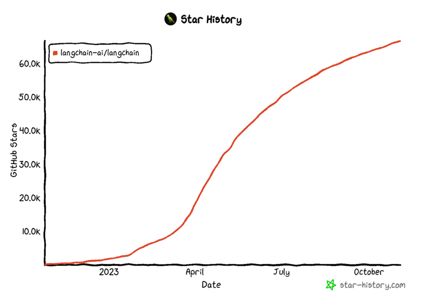

# 什么是 LangChain

## 1. langchain 简介

ChatGPT 的巨大成功激发了越来越多的开发者兴趣，他们希望利用 OpenAI 提供的 API 或者私有化模型，来开发基于大型语言模型的应用程序。尽管大型语言模型的调用相对简单，但要创建完整的应用程序，仍然需要大量的定制开发工作，包括API集成、互动逻辑、数据存储等等。

为了解决这个问题，从 2022 年开始，许多机构和个人相继推出了多个开源项目，旨在**帮助开发者们快速构建基于大型语言模型的端到端应用程序或工作流程**。其中一个备受关注的项目就是 LangChain 框架。**LangChain 框架是一个开源工具，充分利用了大型语言模型的强大能力，以便开发各种下游应用。它的目标是为各种大型语言模型应用提供通用接口，从而简化应用程序的开发流程**。具体来说，LangChain 框架可以实现数据感知和环境互动，也就是说，它能够让语言模型与其他数据来源连接，并且允许语言模型与其所处的环境进行互动。

## 2. langchain 发展历史

LangChain 的作者是 Harrison Chase，该项目自从 2022 年 10 月在 github 上开源以后，迅速吸引了大量开发者的兴趣和投资者的青睐，也由此转变为一家初创公司。

前段时间，AI初创公司 LangChain 成功完成了 1000 万美元的种子轮融资，投资方为 Benchmark Capital。这笔融资进一步证实了 LangChain 作为 AI 初创企业的领军地位。并且，在本次种子轮融资后，LangChain 不久后再次获得了红杉领投的 2000 万至 2500 万美元融资，估值达到 2 亿美元。

## 3. langchain 核心组件

LangChian 作为一个大语言模型开发框架，可以将 LLM 模型（对话模型、embedding模型等）、向量数据库、交互层 Prompt、外部知识、外部代理工具整合到一起，进而可以自由构建 LLM 应用。 LangChain 主要由以下 6 个核心模块组成:

- **模型输入/输出（Model I/O）**：与语言模型交互的接口
- **数据连接（Data connection）**：与特定应用程序的数据进行交互的接口
- **链（Chains）**：将组件组合实现端到端应用。
- **记忆（Memory）**：用于链的多次运行之间持久化应用程序状态；
- **代理（Agents）**：扩展模型的推理能力。用于复杂的应用的调用序列；
- **回调（Callbacks）**：扩展模型的推理能力。用于复杂的应用的调用序列；

