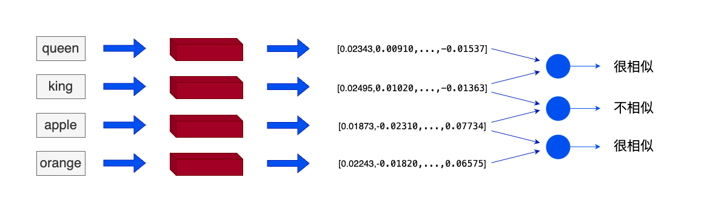

# 向量及向量知识库

## 一、词向量与向量

### 1. 什么是词向量

在机器学习和自然语言处理（NLP）中，词向量（word embedding）是一种以单词为单位将每个单词转化为实数向量的技术。这些实数向量可以被计算机更好地理解和处理。

词向量背后的主要想法是，相似或相关的对象在向量空间中的距离应该很近。

举个例子，我们可以使用词向量来表示文本数据。在词向量中，每个单词被转换为一个向量，这个向量捕获了这个单词的语义信息。例如，"king" 和 "queen" 这两个单词在向量空间中的位置将会非常接近，因为它们的含义相似。而 "apple" 和 "orange" 也会很接近，因为它们都是水果。而 "king" 和 "apple" 这两个单词在向量空间中的距离就会比较远，因为它们的含义不同。
### 2. 通用文本向量
词向量实际上是将单词转化为固定的静态的向量，虽然可以在一定程度上捕捉并表达文本中的语义信息，但忽略了单词在不同语境中的意思会受到影响这一现实。因此在RAG应用中使用的向量技术一般为通用文本向量(Universal text embedding)，该技术可以对一定范围内任意长度的文本进行向量化，与词向量不同的是向量化的单位不再是单词而是输入的文本，输出的向量会捕捉更多的语义信息。
### 3. 向量的优势
在RAG（Retrieval Augmented Generation，检索增强生成）方面向量的优势主要有两点：
* 向量比文字更适合检索。当我们在数据库检索时，如果数据库存储的是文字，主要通过检索关键词（词法搜索）等方法找到相对匹配的数据，匹配的程度是取决于关键词的数量或者是否完全匹配查询句的；但是向量中包含了原文本的语义信息，可以通过计算问题与数据库中数据的点积、余弦距离、欧几里得距离等指标，直接获取问题与数据在语义层面上的相似度；
* 向量比其它媒介的综合信息能力更强，当传统数据库存储文字、声音、图像、视频等多种媒介时，很难去将上述多种媒介构建起关联与跨模态的查询方法；但是向量却可以通过多种向量模型将多种数据映射成统一的向量形式。

### 4. 一般构建向量的方法

在搭建 RAG 系统时，我们往往可以通过使用向量模型来构建向量，我们可以选择：
* 使用各个公司的 Embedding API；
* 在本地使用向量模型将数据构建为向量。

## 二、向量数据库

### 1. 什么是向量数据库
向量数据库是用于高效计算和管理大量向量数据的解决方案。向量数据库是一种专门用于存储和检索向量数据（embedding）的数据库系统。它与传统的基于关系模型的数据库不同，它主要关注的是向量数据的特性和相似性。

在向量数据库中，数据被表示为向量形式，每个向量代表一个数据项。这些向量可以是数字、文本、图像或其他类型的数据。向量数据库使用高效的索引和查询算法来加速向量数据的存储和检索过程。
### 2. 向量数据库的原理及核心优势
向量数据库中的数据以向量作为基本单位，对向量进行存储、处理及检索。向量数据库通过计算与目标向量的余弦距离、点积等获取与目标向量的相似度。当处理大量甚至海量的向量数据时，向量数据库索引和查询算法的效率明显高于传统数据库。
### 3. 主流的向量数据库
* [Chroma](https://www.trychroma.com/)：是一个轻量级向量数据库，拥有丰富的功能和简单的 API，具有简单、易用、轻量的优点，但功能相对简单且不支持GPU加速，适合初学者使用。
* [Weaviate](https://weaviate.io/)：是一个开源向量数据库。除了支持相似度搜索和最大边际相关性（MMR，Maximal Marginal Relevance）搜索外还可以支持结合多种搜索算法（基于词法搜索、向量搜索）的混合搜索，从而搜索提高结果的相关性和准确性。
* [Qdrant](https://qdrant.tech/)：Qdrant使用 Rust 语言开发，有极高的检索效率和RPS（Requests Per Second），支持本地运行、部署在本地服务器及Qdrant云三种部署模式。且可以通过为页面内容和元数据制定不同的键来复用数据。