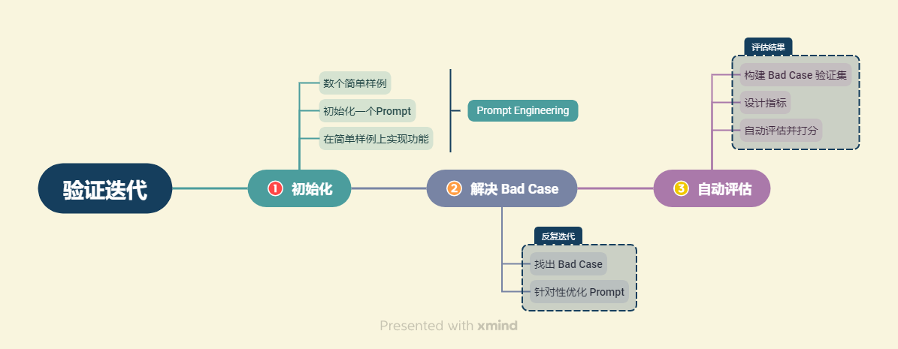

# 评估 LLM 应用

## 1. 验证评估的一般思路

现在，我们已经构建了一个简单的、一般化的大模型应用。回顾整个开发流程，我们可以发现，以调用、发挥大模型为核心的大模型开发相较传统的 AI 开发更注重验证迭代。由于你可以快速构建出基于 LLM 的应用程序，在几分钟内定义一个 Prompt，并在几小时内得到反馈结果，那么停下来收集一千个测试样本就会显得极为繁琐。因为现在，你可以在没有任何训练样本的情况下得到结果。

因此，在使用LLM构建应用程序时，你可能会经历以下流程：首先，你会在一到三个样本的小样本中调整 Prompt ，尝试使其在这些样本上起效。随后，当你对系统进行进一步测试时，可能会遇到一些棘手的例子，这些例子无法通过 Prompt 或者算法解决。这就是使用 LLM 构建应用程序的开发者所面临的挑战。在这种情况下，你可以将这些额外的几个例子添加到你正在测试的集合中，有机地添加其他难以处理的例子。最终，你会将足够多的这些例子添加到你逐步扩大的开发集中，以至于手动运行每一个例子以测试 Prompt 变得有些不便。然后，你开始开发一些用于衡量这些小样本集性能的指标，例如平均准确度。这个过程的有趣之处在于，如果你觉得你的系统已经足够好了，你可以随时停止，不再进行改进。实际上，很多已经部署的应用程序就在第一步或第二步就停下来了，而且它们运行得非常好。

在本章中，我们将逐个介绍大模型应用验证评估的一般方法，并设计本项目验证迭代的过程，从而实现应用功能的优化。但是注意，由于系统评估与优化是一个与业务密切相关的话题，本章我们以理论介绍为主，欢迎读者积极进行自我实践和探索。

我们将首先介绍大模型开发评估的几种方法。对于有简单标准答案的任务来说，评估很容易得到实现；但大模型开发一般是需要实现复杂的生成任务，如何在没有简单答案甚至没有标准答案的情况下实现评估，能够准确地反映应用的效果，我们将简要介绍几种方法。

而随着我们不断寻找到 Bad Case 并做出针对性优化，我们可以将这些 Bad Case 逐步加入到验证集，从而形成一个有一定样例数的验证集。针对这种验证集，一个一个进行评估就是不切实际的了。我们需要一种自动评估方法，实现对该验证集上性能的整体评估。

掌握了一般思路，我们会具体到基于 RAG 范式的大模型应用中来探究如何评估并优化应用性能。由于基于 RAG 范式开发的大模型应用一般包括两个核心部分：检索和生成，所以，我们的评估优化也会分别聚焦到这两个部分，分别以优化系统检索精度和在确定给定材料下的生成质量。

在每一个部分，我们都会首先介绍如何找出 Bad Case 的一些思路提示，以及针对 Bad Case 针对性做出检索优化或 Prompt 优化的一般思路。注意，在这一过程中，你应该时刻谨记我们在之前章节中所讲述的一系列大模型开发原则与技巧，并时刻保证优化后的系统不会在原先表现良好的样例上出现失误。

验证迭代是构建以 LLM 为中心的应用程序所必不能少的重要步骤，通过不断寻找 Bad Case，针对性调整 Prompt 或优化检索性能，来推动应用达到我们目标中的性能与精度。接下来，我们将简要介绍大模型开发评估的几种方法，并概括性介绍从少数 Bad Case 针对性优化到整体自动化评估的一般思路。

## 2. 大模型评估方法