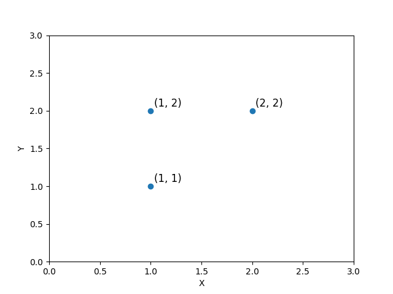
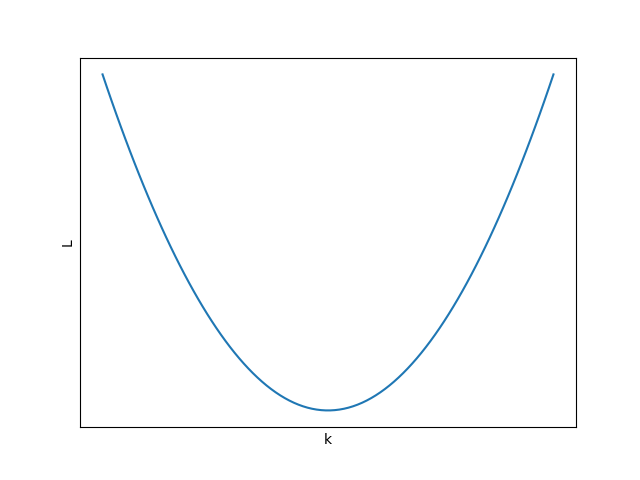
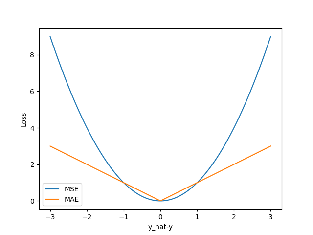

# 损失函数浅析
第四节内容涉及到的损失函数比较多，考虑到本书受众基础，我将举个例子让大家了解损失函数在训练模型时的作用以及不同损失函数在同一任务中的优劣。  
本例中我们取$y=x$函数中的两个点$(1,1)$、$(2,2)$并使用$y=kx$拟合，聪明的你会发现将任意一点带入$y=kx$都可以求出$k$为$1$。此时在原来两个点的基础上再加一个点$(1,2)$（三个点的位置如下图所示）我们可以直观地看到三点并不共线，而$y=kx$是一条经过原点的直线，不可能同时经过上述三点，我们只能去做一个折中，让$y=kx$离各个点都尽可能地近。

  

那我们该如何评估拟合的效果，甚至将效果数值化地表现出来呢？这时我们可以回想下高中学过的方差即$s^2=\dfrac{1}{n}\sum_{i=1}^{n} (x_i-x_{ave})^2$，它可以将数据分布的离散程度以数值化的方式呈现出来，但是方差只对应一组数据，我们除了真实值$\hat{y_i}$外还有预测值$y_{i}$两组数据，所以我们不能将方差直接应用在这个任务上。我们单独看方差公式中的$x_i-x_{ave}$，它的目的是计算数据中单个值与数据整体的接近程度，而我们的目的是计算预测值与真实值的接近程度，因此可以将方差公式推广为$L=\dfrac{1}{n}\sum_{i=1}^{n} (\hat{y_i}-y_{i})^2$，这便是在机器学习中应用广泛的平均平方误差（Mean Squared Error，MSE）损失函数。  
我们可以使用均方误差计算$y=x$在三个点上的损失：
$$L=\dfrac{1}{3}[(1-1)^2+(2-1)^2+(2-2)^2]=\dfrac{1}{3}=0.33$$
还可以使用反向传播对函数进行优化，这里为了方便理解我们只计算有误差的$(1,2)$点：
$$y=kx\tag 1$$
$$L=(\hat{y}-y)^2\tag 2$$
将$(1)$式代入$(2)$得：
$$L=(\hat{y}-kx)^2\tag 3$$
将$(3)$式展开可以得到损失$L$关于$k$的函数：
$$L=\hat{y}^2-2kx\hat{y}+k^2x^2\tag 4$$
$(4)$式是能够被写成$y=(kx+b)^2$形式的二次函数，因此其函数图像是非负且开口向上的，如下图所示。

  

我们可以使用梯度下降法来最小化函数$L$的值，首先计算函数$L$关于参数$k$的梯度，再根据梯度的反方向调整参数$k$。首先对$(4)$式求导得：
$$L'=2kx-2x\hat{y}\tag 5$$
将$k=1$、$x=1$、$\hat{y}=2$代入$(5)$式计算函数$y=kx$在$(1,2)$上的梯度（导数）：
$$g=2*1*1-2*1*2=2-4=-2$$
再根据当前梯度减去学习率$\epsilon$乘以梯度即$g'=g-(\epsilon * g)$来优化参数$k$。我们取$\epsilon$为$0.1$计算新的梯度值：
$$g'=-2-(0.1*-2)=-2+0.2=-1.8$$
再将新的梯度值代入到式$(5)$来更新$k$：
$$-1.8=2*k*1-2*1*2$$
$$-1.8=2k-4$$
$$2k=2.2$$
$$k=1.1$$
最后计算参数$k$调整前后关于点$(1,2)$的损失值，可以发现损失确实比之前有所下降：
$$L_{Before}=(\hat{y}-kx)^2=(2-1*1)^2=1$$
$$L_{After}=(\hat{y}-kx)^2=(2-1.1*1)^2=0.81$$
当然这只是一个简单的例子，比起深度学习模型不仅损失函数有所不同还缺少了激活函数以及相当多的参数。
除了平均平方误差损失函数外平均绝对误差（Mean Absolute Error，MAE）损失函数也可以优化回归任务中的目的函数，公式为$L=\dfrac{1}{n}\sum_{i=1}^{n} |\hat{y_i}-y_{i}|$。我们结合下图可以发现平均平方误差损失函数因为有平方的存在所以模型对于误差较大的样本会受到较大的惩罚，导致优化后的模型整体偏向于异常值，虽然平均绝对误差损失函数因为绝对值函数的特性受异常值的影响较小，但是该损失函数在零点的导数不存在因此当$\hat{y_i}-y_{i}$的结果在零附近时会导致优化算法不稳定。因此我们在选择损失函数时要根据具体的问题及模型等因素综合判断并作出适当的选择。

  

