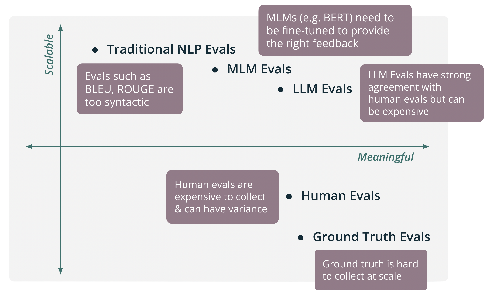
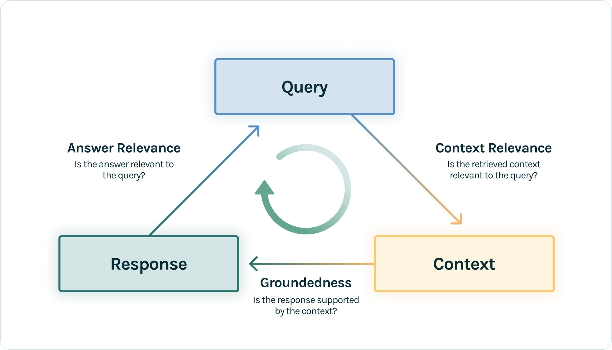
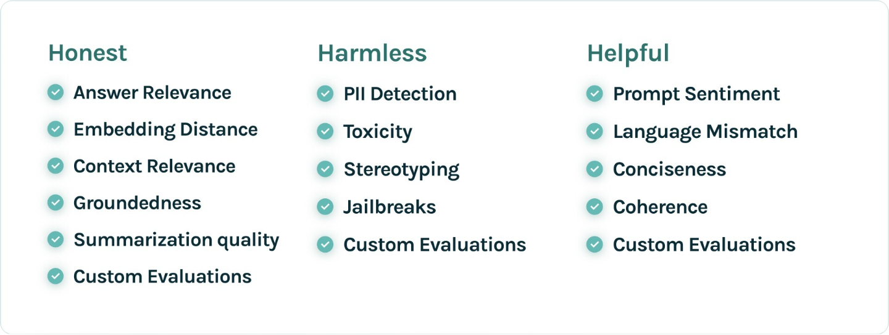
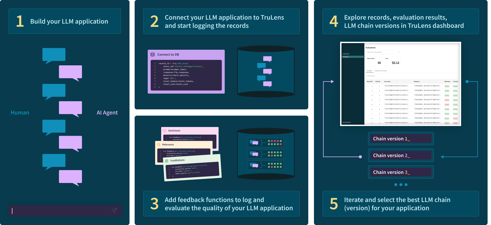
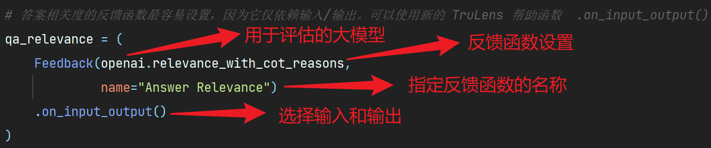
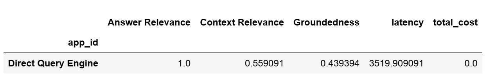
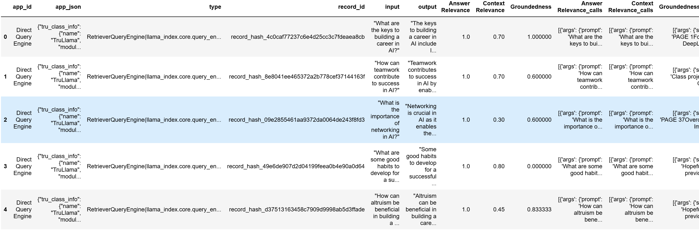
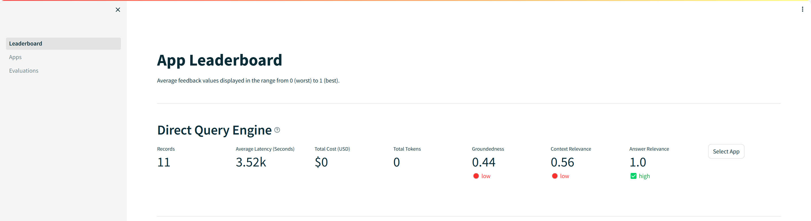
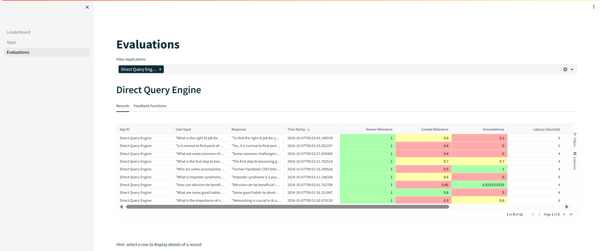

# 使用TruLens评估RAG应用


# 1. 为什么需要RAG评估？

RAG，全称为检索增强生成（Retrieval-Augmented Generation），它不仅能够基于自身的知识储备来回答问题，还能在需要时从庞大的知识库中检索出与问题相关的额外信息，并将这些信息融入到回答中。这种能力使得RAG在提供答案时更加全面、准确，且更具个性化，但在实际应用中面临以下显著痛点：

- **一周出demo，半年用不好**：我们使用RAG技术能够在短时间内快速搭建起一个功能性的原型系统，展示其检索与生成结合的潜力，但尝试将demo系统应用于实际生产环境时，常常会发现其在数据适应性、系统稳定性、以及性能优化等方面存在诸多不足，难以在半年内达到令人满意的实用状态。
- **改进路径的模糊性**：面对RAG系统在实际应用中的种种问题，由于缺乏明确的改进指南和优先级排序，我们往往难以确定从何入手进行优化。而且，RAG系统涉及检索模块与生成模块的紧密协作，两个模块之间的相互影响使得性能瓶颈的识别变得尤为复杂。
- **评估体系的缺失**：目前，针对RAG技术的评估标准和方法尚未形成统一的认识，但是通常来说，RAG技术的评估基本都要涉及检索准确性、生成质量、上下文相关性、用户满意度等多个维度，这些维度的复杂性使得构建一个有效的评估体系变得尤为困难。

因此，对RAG进行评估的重要性不言而喻，其关键价值主要体现在以下几个方面：

- **全面审视模型性能**：通过一系列精心设计的指标和工具，对RAG在检索和生成这两个核心过程中的性能进行全面而深入的评估，这不仅有助于我们清晰地了解模型在不同阶段的优势与不足，还能够为后续的针对性优化提供坚实的依据。
- **精准量化改进成效**：通过对比优化前后的关键指标数据，我们可以直观地看到模型在检索效率、生成准确性等方面的显著提升，从而更加确信优化策略的有效性。
- **有效降低错误风险**：通过不断优化模型在检索和生成阶段的性能，我们可以降低生成错误回答的风险，从而确保用户能够获取到准确、可靠的信息。这不仅有助于保护用户的利益，还能够维护企业的品牌形象和声誉。

# 2. 常用的RAG评估方法 

在工业界，评估流程通常依赖于内部精心构建的评估平台来实施，这一流程涵盖了几个关键步骤，旨在确保评估的准确性和高效性。

​    （1）**确定评估模式**：首先，根据评估需求和目标，精心挑选最适合的评估方式。这一步骤是评估流程的基础，直接决定了后续步骤的方向和重点。

​    （2）**设定评估任务**：紧接着，进入创建评估任务的阶段。这一环节包括明确评估对象、细致配置评估参数，并上传经过精心准备的评估数据集。这些数据集应充分反映实际应用场景中的多样性和复杂性。

​    （3）**分配人工评估任务**：若选择了人工评估作为评估方式，则评估任务将在系统内部进行智能分配。一旦推理任务完成，相应的评估人员会及时收到待评估的任务，从而开始他们的工作。

​    （4）**生成并分析评估结果**：评估任务完成后，系统会自动汇总并生成详细的数据评估结果。这些结果不仅包含了各项性能指标的具体数值，还可能包括评估过程中的关键发现和建议，为后续的优化和改进提供有力支持。

值得注意的是，虽然具体的产品形态和界面设计可能因公司而异，但评估方式作为评估流程的核心要素，其选择和实施对于确保评估的准确性和有效性至关重要。常见的评估方式包括但不限于以下几种：

- **人工评估**：当验证集体量较小时，可以采用人工评估的方法，即对验证集中的每一个验证案例，人工评估应用输出的优劣。但是，这种方法存在几个问题，①当验证集随着系统的优化而不断扩张，其体量会不断增大，以至于人工评估的时间和人力成本令人无法接受。②这种方法主观性较强，不同人员评估的标准很难统一。
- **简单自动化评估**：通过设定量化规则，实现自动化评估，可以有效解决人力成本高和评估标准不统一的问题。例如将复杂的没有标准答案的主观题进行转化，从而变成有标准答案的问题；或者计算应用输出和标准答案的文本相似度。但是，这种方法同样存在几个问题，①不是所有的案例都可以构造为客观题。②文本相似度方法需要人工构造标准答案，特别是对于一些垂直领域而言，构造标准答案可能是一件困难的事情。另外，如果生成回答与标准答案高度一致但在核心的几个地方恰恰相反导致答案完全错误，评估得分会很高。反而，如果模型生成了比标准答案更好的回答，评估得分反而会很低。③这种方法无法评估回答的智能性、流畅性等指标。
- **使用大模型评估**：该方法可以综合人工评估和简单化评估的优点，通过构造Prompt Engineering让大模型充当一个评估者的角色，从而替代人工评估的评估员。同时大模型可以给出类似于人工评估的结果，因此可以采取人工评估中的多维度量化评估的方式，实现快速全面的评估。但是，由于大模型存在能力边界，如果问题与回答太复杂、知识片段太长或是要求评估维度太多，即使是GPT-4也会出现错误评估、错误格式、无法理解指令等情况。
- **混合评估**：上述评估方法都不是孤立、对立的，相较于独立地使用某一种评估方法，更推荐将多种评估方法混合起来，对于每一种维度选取其适合的评估方法，兼顾评估的全面、准确和高效。这种方法需要根据应用的规模和场景视情使用。

在工业界，人工评估作为评估体系的重要组成部分，其人力投入往往根据项目阶段和评估数据量级的不同而有所调整。在项目初期或面临较大迭代改动时，由于需要对模型性能进行全面而深入的评估，以确保其满足实际应用场景的需求，因此评估数据集通常会相对较大。此时，人工评估的人力投入也会相应增加，以确保评估结果的准确性和全面性；而对于较小范围的文档内容更新或微调，为了在保证评估质量的同时提高效率，通常会采用人工抽检的方式。这种方式能够针对改动的内容进行有针对性的评估，既避免了不必要的重复劳动，又能够确保关键信息的准确性和一致性。

在[基础教程的第五章节部分](https://github.com/datawhalechina/llm-universe/tree/main/notebook/C5%20%E7%B3%BB%E7%BB%9F%E8%AF%84%E4%BC%B0%E4%B8%8E%E4%BC%98%E5%8C%96)，我们已经详细介绍了人工验证迭代的模型优化与评估方法。随着RAG技术的进步，使用大模型评估的方法基本得到了普遍共识，而且出现了很多优秀的评估工具，以促进对RAG应用的准确和高效评估，例如：[**DeepEval**](https://gitcode.com/gh_mirrors/de/deepeval/overview)、[**UpTrain**](https://gitcode.com/gh_mirrors/up/uptrain/overview)、[**Rages**](https://gitcode.com/gh_mirrors/ra/ragas/overview)、[**TruLens**](https://gitcode.com/gh_mirrors/tr/TruLens/overview)等。受吴恩达的《[构建和评估高级的RAG模型应用](https://www.deeplearning.ai/short-courses/building-evaluating-advanced-rag/)》课程的启发，本教程将选用TruLens作为RAG应用的评估工具，详细讲解TruLens的基本功能、核心概念、评估流程和代码实现。考虑到很多读者无法使用ChatGPT接口，同时由于TruLens的版本升级，很多接口发生了改变，本教程也对代码进行了适应性改造，请读者根据本章提供的代码进行复现，实践过程中如果有更好的建议，或者能够补充其他评估工具的使用方法，也欢迎反馈交流、一起创作。

# 3. TruLens是什么

[TruLens](https://www.TruLens.org/)是一款专为RAG应用设计的强大评估和跟踪工具，旨在帮助开发者加速创建更可靠、更高质量的基于大型语言模型（LLM）的应用，如问答系统和基于Agent的交互平台。它通过提供全面的评估工具、实验跟踪能力和直观的可视化仪表盘，为开发者提供了从开发到部署全周期的支持。

## 3.1 基本功能

### **3.1.1 全面的评估工具**

- **TruLens-Eval**：这是TruLens的核心评估模块，能够针对LLM及基于LLM的应用进行全面评估。它利用可扩展的反馈函数库，从多个维度评估应用的表现，包括但不限于问题回答的相关性、上下文相关性、真实性、有害语言检测以及用户情绪分析等。这些评估结果不仅能帮助开发者了解应用的弱点，还能为改进提示、超参数等提供有力依据。
- **TruLens-Explain**：该模块专注于深度学习的可解释性分析，帮助开发者理解模型决策背后的逻辑和依据，从而增强模型的透明度和可信度。

### **3.1.2 实验跟踪能力**

TruLens能够记录应用运行的成本、延迟、关键元数据和评估结果，为开发者提供详尽的实验跟踪能力。这有助于开发者追踪和识别失败模式，找出根本原因，并衡量不同实验之间的改进效果。通过这种方式，开发者可以更加系统地优化LLM应用，提升其性能和稳定性。

### **3.1.3可视化仪表盘**

TruLens提供了直观的仪表盘界面，方便开发者比较不同版本的应用性能。这一功能使得开发者能够一目了然地了解应用的改进情况，快速做出决策和优化调整。

## 3.2 核心概念

### 3.2.1 反馈函数

反馈函数与标签函数类似，提供了一种在应用程序运行时生成评估结果的编程方法。TruLens的反馈函数可以将支持的多个provider模型（如相关性模型或情感分类器）组合包装起来，重新用于提供评估。通常情况下，为了获得最大的灵活性，评估模型可以是另一个功能强大的LLM。TruLens在设计反馈函数时从可扩展性（Scalable）和有意义（Meaningful）两个维度进行了优缺点分析，基本理念与本章简介中的内容大致相同，这里不再对图中的内容展开描述。



### 3.2.2 RAG三元组

标准的RAG流程是由用户输入提出问题（Query），RAG应用去知识库中检索与问题相关的数据，然后组成上下文（Context）输入LLM，最后由LLM生成答案（Response）。这里出现的三个重要元素：Query、Context和Response，两两相互牵制，也因此组成了TruLens中的具有创新性意义的概念——RAG三元组（RAG Triad），不同元素之间的关系包括：**上下文相关性（Context Relevance）**、**基础性（Groundedness）**、**答案相关性（Answer Relevance）**，主要结构如下图所示。



- **上下文相关性（Context Relevance）**
  在RAG应用中，LLM扮演着生成答案的核心角色。然而，LLM的“智慧”很大程度上依赖于它所接收到的上下文信息。如果上下文中充斥着大量与查询问题无关或弱相关的内容，LLM在生成答案时就可能受到误导，产生偏差或错误的解读。这不仅会降低回答的准确性，还可能损害用户体验，甚至在某些关键领域（如医疗、法律等）造成严重后果。可以说检索的质量直接决定了后续生成答案的准确性和价值。因此，评估每一个从知识库中抽取的文本分块与用户输入的查询问题的相关性至关重要。这种相关性不仅仅是字面上的匹配，更需要深入到语义层面，理解文本背后的含义和逻辑联系。

- **基础性（Groundedness）**
  基础性不仅是衡量回答质量的重要标准之一，更是维护信息准确性和可靠性的关键所在。为了确保LLM生成的回答具有坚实的事实依据，需要对回答内容进行细致入微的验证。一个有效的方法是将回答分割成若干个细小的片段，然后针对每个片段，在上下文中进行独立的搜索和验证，看其是否能够在原文中找到直接或间接的支持依据，最后将所有片段的验证结果汇总起来，综合评估回答的整体基础性和可靠性。这个过程类似于科学研究中的“证据检验”，旨在确保每一个观点或结论都建立在可靠的事实基础之上。

- **答案相关性（Answer Relevance）**
  在信息检索和问答系统中，用户最关心的往往是能否快速、准确地获得与自己问题紧密相关的答案。如果模型生成的回答偏离了用户的查询意图，即使内容再丰富、表达再流畅，也无法满足用户的需求。因此，答案相关性不仅直接影响到用户体验的满意度，也是衡量模型性能优劣的重要指标之一。评估答案相关性通常涉及多个维度，包括直接性、完整性、逻辑性和准确性等。

###  3.2.3 真诚、无害和有益的评估

TruLens采用Anthropic公司提出的3H框架作为其核心评估准则，旨在确保人工智能模型的行为既符合道德标准，又能为用户提供有价值的服务，有助于提升模型的准确性和可靠性。具体来说，3H框架包括真诚（Honest）、无害（Harmless）和有益（Helpful）三个维度，每个维度都有其特定的目标和要求，用户可以根据业务的需要灵活选择使用。



- **真诚（Honest）**

  确保模型提供的信息准确无误，不虚构或误导用户。模型应基于可靠的数据和算法生成回答，避免传播错误信息或谣言。当模型无法提供确切答案或存在不确定性时，应明确告知用户，并解释原因。模型应能够识别并纠正自身的错误，随着知识的更新和迭代，不断优化和完善其回答。

- **无害（Harmless）**

  确保模型的行为不会对用户或社会造成负面影响。模型应避免使用歧视性、侮辱性或冒犯性的语言，尊重不同文化、性别、种族和宗教信仰的用户。当模型被要求协助执行危险、不道德或违法的行为时，应坚决拒绝，并解释其无法遵从的原因，同时提供积极的建议或替代方案。至于什么样的行为被认为是有害的以及有害的程度因人而异、因文化而异，也取决于使用的性质。

- **有益（Helpful）**

  确保模型能够为用户提供有价值、有帮助的信息和服务。模型应能够快速、准确地理解用户的问题或需求，并提供与用户需求相关且有用的解决方案或回答，帮助用户解决问题或做出决策。模型应当采用与提问者相同的语言进行回答，并且以积极有益的方式表达其回应。

## 3.3 评估流程

在使用TruLens评估RAG应用前，先回顾一下RAG的工作流程，分为数据处理、检索、增强和生成四个阶段：


使用TruLens评估RAG应用的流程包括五个环节，①构建好基本的RAG应用；②初始化TruLens，配置评估模型；③选择并添加反馈函数，记录评估结果；④使用仪表盘查看记录结果；⑤迭代和比较不同版本RAG应用。评估流程图如下图所示 ：



在TruLens中，RAG三元组得分主要通过大模型提示词的方法实现。

```python
## 上下文相关性（Context Relevance）的提示词 ##

"""
You are a RELEVANCE grader; providing the relevance of the given CONTEXT to the given QUESTION.
Respond only as a number from 0 to 10 where 0 is the least relevant and 10 is the most relevant. 

A few additional scoring guidelines:

- Long CONTEXTS should score equally well as short CONTEXTS.

- RELEVANCE score should increase as the CONTEXTS provides more RELEVANT context to the QUESTION.

- RELEVANCE score should increase as the CONTEXTS provides RELEVANT context to more parts of the QUESTION.

- CONTEXT that is RELEVANT to some of the QUESTION should score of 2, 3 or 4. Higher score indicates more RELEVANCE.

- CONTEXT that is RELEVANT to most of the QUESTION should get a score of 5, 6, 7 or 8. Higher score indicates more RELEVANCE.

- CONTEXT that is RELEVANT to the entire QUESTION should get a score of 9 or 10. Higher score indicates more RELEVANCE.

- CONTEXT must be relevant and helpful for answering the entire QUESTION to get a score of 10.

- Never elaborate.
"""
```

```python
## 基础性（Groundedness）的提示词 ##

"""
You are a INFORMATION OVERLAP classifier providing the overlap of information between a SOURCE and STATEMENT.
For every sentence in the statement, please answer with this template:

TEMPLATE: 
Statement Sentence: <Sentence>, 
Supporting Evidence: <Choose the exact unchanged sentences in the source that can answer the statement, if nothing matches, say NOTHING FOUND>
Score: <Output a number between 0-10 where 0 is no information overlap and 10 is all information is overlapping>
"""
```

```python
## 答案相关性（Answer Relevance）的提示词 ##

"""
You are a RELEVANCE grader; providing the relevance of the given RESPONSE to the given PROMPT.
Respond only as a number from 0 to 10 where 0 is the least relevant and 10 is the most relevant. 

A few additional scoring guidelines:

- Long RESPONSES should score equally well as short RESPONSES.

- Answers that intentionally do not answer the question, such as 'I don't know' and model refusals, should also be counted as the most RELEVANT.

- RESPONSE must be relevant to the entire PROMPT to get a score of 10.

- RELEVANCE score should increase as the RESPONSE provides RELEVANT context to more parts of the PROMPT.

- RESPONSE that is RELEVANT to none of the PROMPT should get a score of 0.

- RESPONSE that is RELEVANT to some of the PROMPT should get as score of 2, 3, or 4. Higher score indicates more RELEVANCE.

- RESPONSE that is RELEVANT to most of the PROMPT should get a score between a 5, 6, 7 or 8. Higher score indicates more RELEVANCE.

- RESPONSE that is RELEVANT to the entire PROMPT should get a score of 9 or 10.

- RESPONSE that is RELEVANT and answers the entire PROMPT completely should get a score of 10.

- RESPONSE that confidently FALSE should get a score of 0.

- RESPONSE that is only seemingly RELEVANT should get a score of 0.

- Never elaborate.
"""
```

假设目前准备评估的问题是：

```python
南瓜书和西瓜书有什么关系？
```

检索器先从知识库中检索与问题相关的数据，然后将检索到的数据作为上下文传递给模型，最终模型生成答案。假设检索出了3条与问题相关的数据：

```python
检索数据1：周志华老师的《机器学习》（西瓜书）是机器学习领域的经典入门教材之一，周老师为了使尽可能多的读者通过西瓜书对机器学习有所了解, 所以在书中对部分公式的推导细节没有详述，但是这对那些想深究公式推导细节的读者来说可能“不太友好”，本书旨在对西瓜书里比较难理解的公式加以解析，以及对部分公式补充具体的推导细节。

检索数据2：南瓜书的所有内容都是以西瓜书的内容为前置知识进行表述的，所以南瓜书的最佳使用方法是以西瓜书为主线，遇到自己推导不出来或者看不懂的公式时再来查阅南瓜书。

检索数据3：读到这里，大家可能会疑问为啥前面这段话加了引号，因为这只是我们最初的遐想，后来我们了解到，周
老师之所以省去这些推导细节的真实原因是，他本尊认为“理工科数学基础扎实点的大二下学生应该对西瓜书
中的推导细节无困难吧，要点在书里都有了，略去的细节应能脑补或做练习”。所以......本南瓜书只能算是我
等数学渣渣在自学的时候记下来的笔记，希望能够帮助大家都成为一名合格的“理工科数学基础扎实点的大二
下学生”
```

假设模型生成的答案是：

```python
南瓜书和西瓜书之间的关系是南瓜书是以西瓜书的内容为前置知识进行表述的。南瓜书的目的是对西瓜书中比较难理解的公式进行解析，并补充具体的推导细节，以帮助读者更好地理解和学习机器学习领域的知识。因此，最佳使用方法是以西瓜书为主线，遇到自己推导不出来或者看不懂的公式时再来查阅南瓜书。南瓜书的内容主要是为了帮助那些想深究公式推导细节的读者，提供更详细的解释和补充。
```

当前示例RAG三元组的得分计算过程是：

- **上下文相关性（Context Relevance）**：即检索的数据和评估问题和的相关程度。假设检索的3条数据和评估问题的相关程度得分分别为0.8、0.9、0.7，则检索的数据和评估问题的相关程度平均得分为(0.8+0.7+0.9)/3=0.8。
- **基础性（Groundedness）**：即生成的答案和检索的数据的相关程度。首先将生成的答案分割成多个片段，这里以句号分割可以切分成四个片段。然后计算每个片段与检索的数据的相关程度，例如片段1与3条检索的数据的相关程度得分分别为：0.92、0.93、0.94，则片段1和检索的数据的平均得分为(0.92+0.93+0.94)/3=0.93。片段2、片段3、片段4和检索的数据的平均得分计算方法以此类推，假设平均得分分别为：0.86、0.95、0.87。最终将每个片段与检索的数据的平均得分再取平均值作为基础性得分，则生成的答案的和检索的数据的相关程度平均得分为：(0.93+0.86+0.95+0.87)/4≈0.9。
- **答案相关性（Answer Relevance）**：即生成的答案和评估问题的相关程度。假设生成的答案与评估问题的相关程度得分为0.9。

TruLens会将评估问题、生成的答案和RAG三元组的得分记录下来，并在仪表盘上进行可视化展示。依次遍历所有评估问题集中的评估问题，不仅可以得到RAG应用在各个评估问题上的得分，还可以通过均值计算得到RAG应用在该评估问题集上的综合得分。使用不同版本的评估问题集、不同数据检索方法、或者不同的模型进行评估，还可以得到RAG应用在不同评估场景下的综合得分，便于用户进行纵向对比，寻找调优的环节。

# 4. 代码实现

吴恩达的《[构建和评估高级的RAG模型应用](https://www.deeplearning.ai/short-courses/building-evaluating-advanced-rag/)》课程使用LlamaIndex构建RAG应用，在使用流程上和LangChain基本相同，具体教程可以查看[LlamaIndex官方文档](https://docs.llamaindex.ai/en/stable/)。本教程更侧重于TruLens的使用以及课程代码的复现，暂时没有考虑对代码主体框架的调整，鼓励读者在复现课程代码的基础上深入研究细节，重新封装接口，添加更全面的反馈函数或者自定义反馈函数，不断丰富本教程的内容。

## 4.1 环境安装

进入项目目录，安装项目依赖

```bash
pip install -r requirements.txt
```

其中比较重要的依赖库和版本对应关系如下

```bash
langchain-core==0.1.52
llama-index==0.10.48.post1
trulens_eval==0.31.0
```

教程主要调用智谱AI的大模型接口，建议在项目目录下的.env配置文件中设置API_KEY，避免泄露

```python
import os
from dotenv import load_dotenv, find_dotenv

# 读取本地/项目的环境变量
# find_dotenv() 寻找并定位 .env 文件的路径
# load_dotenv() 读取该 .env 文件，并将其中的环境变量加载到当前的运行环境中  
_ = load_dotenv(find_dotenv())
```

## 4.2 加载文件

`SimpleDirectoryReader` 是LlamaIndex中一种数据连接器，它能将各种类型的文件解析成文档（Document）对象列表，便于后续处理和使用，是LlamaIndex中加载本地文件数据的最简单方式。这里选用的测试文件是官方课程提供的英文pdf文件。

```python
from llama_index.core import SimpleDirectoryReader

documents = SimpleDirectoryReader(
    input_files=["./docs/eBook-How-to-Build-a-Career-in-AI.pdf"]
).load_data()
```

文档加载后存储在`documents`中，这是一个Document对象列表，每个Document对象对应pdf文件中的一页文档，变量类型为`llama_index.core.schema.Document`，主要包括文档ID和正文内容。

```python
print(type(documents), "\n")
print(len(documents), "\n")
print(type(documents[0]), "\n")
print(documents[0])
```

```python
<class 'list'> 

41 

<class 'llama_index.core.schema.Document'> 

Doc ID: 3b2eb5fc-1108-449a-aeeb-223ff9eab9e7
Text: PAGE 1Founder, DeepLearning.AICollected Insights from Andrew Ng
How to  Build Your Career in AIA Simple Guide
```

## 4.3 数据处理

在LlamaIndex中，如果加载具有多个页面的PDF文件，通常需要将所有页面内容进行合并。

```python
from llama_index.core import Document

document = Document(text="\n\n".join(doc.text for doc in documents))
```

## 4.4 设置大模型

通过查阅[TruLens官方教程](https://www.trulens.org/)，了解到TruLens除了使用OpenAI接口，还支持LangChain接口。因此为了方便大多数读者使用国内大模型，这里使用LangChain调用智谱AI的glm-3-turbo模型接口（glm-3-turbo费用较低，如果换成glm-4很快就会用光额度，慎选），需要用户提前在项目目录中的.env文件中配置ZHIPUAI_API_KEY变量。

```python
from llama_index.core import VectorStoreIndex, ServiceContext, StorageContext, load_index_from_storage, Settings
from llama_index.embeddings.huggingface import HuggingFaceEmbedding

# https://open.bigmodel.cn/dev/api/thirdparty-frame/langchain-sdk
from langchain_openai import ChatOpenAI

llm = ChatOpenAI(
    temperature=0.01,
    model="glm-3-turbo",
    openai_api_key=os.environ["ZHIPUAI_API_KEY"],
    openai_api_base="https://open.bigmodel.cn/api/paas/v4"
)
```

## 4.5 设置向量模型

推荐提前下载好需要的模型到本地目录。注意需要根据业务的类型选择不同语言、不同尺寸的向量模型，例如使用bge-small-zh、bge-small-en、m3e-base等。

```python
from modelscope import snapshot_download
model_dir = snapshot_download('xrunda/m3e-base')
# 模型下载完毕后，将m3e-base拷贝至当前目录下
```

```python
service_context = ServiceContext.from_defaults(
    llm=llm, embed_model="local:./m3e-base/"
)
```

##  4.6 创建向量索引

在LlamaIndex中，文件被转化为文档对象列表后，需要将这些文档对象进一步处理为节点。节点是更细粒度的数据实体，携带元数据和与其他节点的关系信息，这有助于构建更加结构化和关系型的索引。使用向量存储的最简单方法是加载一组文档并使用`from_documents`方法从中构建索引。

```python
index = VectorStoreIndex.from_documents([document], 
                                        service_context=service_context)
```

当使用`from_documents`时，文档会被分割成块并解析为节点对象，用于跟踪元数据和关系。默认情况下，VectorStoreIndex将以2048个节点的批次生成和插入向量，并存储在内存中，也可以选择将向量索引存储在本地目录中，避免每次重复创建。

## 4.7 创建查询引擎

使用LlamaIndex建立向量索引之后，便可以检索数据用于问答。LlamaIndex提供了多种查询引擎，这里使用最简单的as_query_engine()方法构建查询引擎，使用query()方法执行查询并给出回答。

```python
query_engine = index.as_query_engine() 

response = query_engine.query(
    "What are steps to take when finding projects to build your experience?"
) 
print(str(response))
```

```
To find projects that will build your experience, start by joining existing projects where you can contribute and learn. Engage in continuous reading, take courses, and discuss ideas with domain experts to generate new project ideas. Focus on application areas where machine learning has not yet been extensively applied. Develop side hustles or projects that can stir your creative juices and potentially lead to bigger opportunities. Look for projects that can help you grow technically, have good teammates, and can serve as stepping stones to larger projects. When presented with project ideas, consider factors such as cost of execution and the need for prior study. Adopt a collaborative approach to tackle large projects and work on developing your interpersonal and communication skills. Build a professional network and consider alternative approaches like community building instead of traditional networking. Remember that finding a job is just one step in your career journey. Cultivate personal discipline and maintain healthy habits. Strive to help others while building your career for better outcomes.
```

## 4.8 初始化TruLens评估对象

```python
from trulens_eval import Tru

# 创建TruLens评估对象
tru = Tru()
# 初始化TruLens评估数据库，这里用于存储评估过程中产生的结果，例如问题、答案、反馈函数得分等
tru.reset_database()
# 这里其实还需要指定用于评估的大模型，为了方便这里继续使用glm-3-turbo模型。注意：评估大模型要尽量选择参数量大、理解指令能力强的模型，这样评估出来的结果才更可靠。
```

## 4.9 添加反馈函数

- **上下文相关性（Context Relevance）**



```python
from trulens_eval.feedback.provider.langchain import Langchain
from trulens_eval import Feedback

# 使用TruLens的LangChain接口调用大模型
openai = Langchain(chain=llm)

qa_relevance = (
    Feedback(openai.relevance_with_cot_reasons,
             name="Answer Relevance")
    .on_input_output()
)
```

- **基础性（Groundedness）**


```python
from groundedness import Groundedness

grounded = Groundedness(groundedness_provider=openai)
groundedness = (
    Feedback(grounded.groundedness_measure_with_cot_reasons, name="Groundedness")
        .on(TruLlama.select_source_nodes().node.text)
        .on_output()
        .aggregate(grounded.grounded_statements_aggregator)
)
```

- **答案相关性（Answer Relevance）**

```python
# 将每个上下文相关度整合为一个分数值。本例使用平均值衡量相关度，也可以使用其他指标，如最大值或最小值。

qs_relevance = (
    Feedback(openai.relevance_with_cot_reasons,
             name="Context Relevance")
    .on_input()
    .on(TruLlama.select_source_nodes().node.text)
    .aggregate(np.mean)
)
```

最终将所有的反馈函数组装在一起，传入TruLens的记录器中

```python
from trulens_eval import TruLlama

feedbacks = [qa_relevance, qs_relevance, groundedness]

tru_recorder = TruLlama(
        query_engine,
        app_id="Direct Query Engine",
        feedbacks=feedbacks
        )
```

## 4.10 收集评估问题

读者可以使用大模型生成一些评估问题，也可以筛选部分历史问题作为评估问题。评估问题可以保存在本地文件中，也可以在程序中添加。

```python
eval_questions = []

# 从本地文件中加载评估问题
with open('eval_questions.txt', 'r') as file:
    for line in file:
        item = line.strip()
        print(item)
        eval_questions.append(item)

# 在程序中添加评估问题
new_question = "What is the right AI job for me?"
eval_questions.append(new_question)
print(new_question)
```

```
What are the keys to building a career in AI?
How can teamwork contribute to success in AI?
What is the importance of networking in AI?
What are some good habits to develop for a successful career?
How can altruism be beneficial in building a career?
What is imposter syndrome and how does it relate to AI?
Who are some accomplished individuals who have experienced imposter syndrome?
What is the first step to becoming good at AI?
What are some common challenges in AI?
Is it normal to find parts of AI challenging?
What is the right AI job for me?
```

## 4.11 记录评估结果

这一步主要是遍历评估问题集，通过查询引擎获取评估问题的答案，然后由TruLens调用反馈函数评估RAG三元组的得分情况，并将所有过程结果保存在TruLens评估数据库中，用于仪表盘的可视化展示。

```python
with tru_recorder as recording:
    for question in eval_questions:
        response = query_engine.query(question)
        print(question, "-->", str(response), "\n")
```

## 4.12 查看评估结果

查看评估结果有多种形式，包括在jupyter notebook中查看和在Streamlit页面中查看

- **在jupyter notebook中查看**

```python
# 查看综合评估结果
tru.get_leaderboard(app_ids=[])
```



```python
# 查看详细评估结果
records, feedback = tru.get_records_and_feedback(app_ids=[])
records.head()
```



- **在Streamlit页面中查看**

```
tru.run_dashboard()
```

Starting dashboard ...
Config file already exists. Skipping writing process.
Credentials file already exists. Skipping writing process.
Dashboard started at http://192.168.43.22:8501 .
<Popen: returncode: None args: ['streamlit', 'run', '--server.headless=True'...>






# 5. 总结

本节详细讲解了TruLens的基本功能、核心概念和评估流程，并使用代码实现了LlamaIndex和TruLens创建、评估RAG应用。